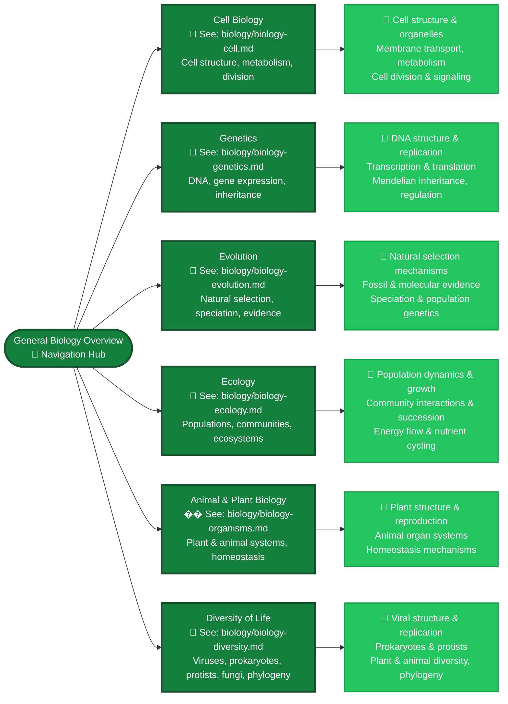

```mermaid
flowchart LR
    Start([General Biology Overview<br/>🧭 Navigation Hub]):::green
    Start --> CellBio["Cell Biology<br/>📂 See: biology/biology-cell.md<br/>Cell structure, metabolism, division"]:::green
    Start --> Genetics["Genetics<br/>📂 See: biology/biology-genetics.md<br/>DNA, gene expression, inheritance"]:::green
    Start --> Evolution["Evolution<br/>📂 See: biology/biology-evolution.md<br/>Natural selection, speciation, evidence"]:::green
    Start --> Ecology["Ecology<br/>📂 See: biology/biology-ecology.md<br/>Populations, communities, ecosystems"]:::green
    Start --> AnimalPlantBio["Animal & Plant Biology<br/>�� See: biology/biology-organisms.md<br/>Plant & animal systems, homeostasis"]:::green
    Start --> DiversityLife["Diversity of Life<br/>📂 See: biology/biology-diversity.md<br/>Viruses, prokaryotes, protists, fungi, phylogeny"]:::green
    
    CellBio --> CellDetails["📄 Cell structure & organelles<br/>Membrane transport, metabolism<br/>Cell division & signaling"]:::lightgreen
    
    Genetics --> GeneticsDetails["📄 DNA structure & replication<br/>Transcription & translation<br/>Mendelian inheritance, regulation"]:::lightgreen
    
    Evolution --> EvolutionDetails["📄 Natural selection mechanisms<br/>Fossil & molecular evidence<br/>Speciation & population genetics"]:::lightgreen
    
    Ecology --> EcologyDetails["📄 Population dynamics & growth<br/>Community interactions & succession<br/>Energy flow & nutrient cycling"]:::lightgreen
    
    AnimalPlantBio --> OrganismDetails["📄 Plant structure & reproduction<br/>Animal organ systems<br/>Homeostasis mechanisms"]:::lightgreen
    
    DiversityLife --> DiversityDetails["📄 Viral structure & replication<br/>Prokaryotes & protists<br/>Plant & animal diversity, phylogeny"]:::lightgreen
    
    classDef green fill:#15803d,stroke:#14532d,stroke-width:3px,color:#fff
    classDef lightgreen fill:#22c55e,stroke:#16a34a,stroke-width:2px,color:#fff
    classDef palegreen fill:#4ade80,stroke:#22c55e,stroke-width:2px,color:#000
    classDef mintgreen fill:#86efac,stroke:#4ade80,stroke-width:1px,color:#000
```