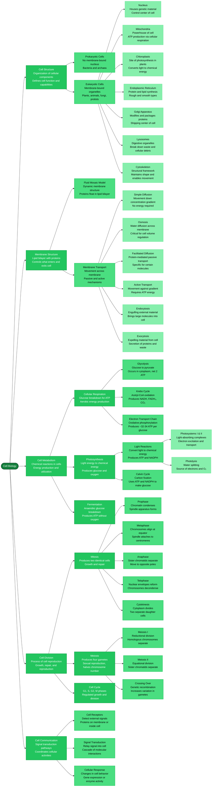

```mermaid
flowchart LR
    Start([Cell Biology]):::green
    Start --> CellStructure[Cell Structure<br/>Organization of cellular components<br/>Defines cell function and capabilities]:::lightgreen
    Start --> Membrane[Membrane Structure<br/>Lipid bilayer with proteins<br/>Controls what enters and exits cell]:::lightgreen
    Start --> CellMetabolism[Cell Metabolism<br/>Chemical reactions in cells<br/>Energy production and utilization]:::lightgreen
    Start --> CellDivision[Cell Division<br/>Process of cell reproduction<br/>Growth, repair, and reproduction]:::lightgreen
    Start --> CellSignaling[Cell Communication<br/>Signal transduction pathways<br/>Coordinates cellular activities]:::lightgreen
    
    CellStructure --> Prokaryote[Prokaryotic Cells<br/>No membrane-bound nucleus<br/>Bacteria and archaea]:::palegreen
    CellStructure --> Eukaryote[Eukaryotic Cells<br/>Membrane-bound organelles<br/>Plants, animals, fungi, protists]:::palegreen
    
    Eukaryote --> Nucleus[Nucleus<br/>Houses genetic material<br/>Control center of cell]:::mintgreen
    Eukaryote --> Mitochondria[Mitochondria<br/>Powerhouse of cell<br/>ATP production via cellular respiration]:::mintgreen
    Eukaryote --> Chloroplast[Chloroplasts<br/>Site of photosynthesis in plants<br/>Converts light to chemical energy]:::mintgreen
    Eukaryote --> ER[Endoplasmic Reticulum<br/>Protein and lipid synthesis<br/>Rough and smooth types]:::mintgreen
    Eukaryote --> Golgi[Golgi Apparatus<br/>Modifies and packages proteins<br/>Shipping center of cell]:::mintgreen
    Eukaryote --> Lysosome[Lysosomes<br/>Digestive organelles<br/>Break down waste and cellular debris]:::mintgreen
    Eukaryote --> Cytoskeleton[Cytoskeleton<br/>Structural framework<br/>Maintains shape and enables movement]:::mintgreen
    
    Membrane --> FluidMosaic[Fluid Mosaic Model<br/>Dynamic membrane structure<br/>Proteins float in lipid bilayer]:::palegreen
    Membrane --> Transport[Membrane Transport<br/>Movement across membrane<br/>Passive and active mechanisms]:::palegreen
    
    Transport --> Diffusion[Simple Diffusion<br/>Movement down concentration gradient<br/>No energy required]:::mintgreen
    Transport --> Osmosis[Osmosis<br/>Water diffusion across membrane<br/>Critical for cell volume regulation]:::mintgreen
    Transport --> FacilitatedDiff[Facilitated Diffusion<br/>Protein-mediated passive transport<br/>Specific for certain molecules]:::mintgreen
    Transport --> ActiveTransport[Active Transport<br/>Movement against gradient<br/>Requires ATP energy]:::mintgreen
    Transport --> Endocytosis[Endocytosis<br/>Engulfing external material<br/>Brings large molecules into cell]:::mintgreen
    Transport --> Exocytosis[Exocytosis<br/>Expelling material from cell<br/>Secretion of proteins and waste]:::mintgreen
    
    CellMetabolism --> CellularResp[Cellular Respiration<br/>Glucose breakdown for ATP<br/>Aerobic energy production]:::lightgreen
    CellMetabolism --> Photosynthesis[Photosynthesis<br/>Light energy to chemical energy<br/>Produces glucose and oxygen]:::lightgreen
    CellMetabolism --> Fermentation[Fermentation<br/>Anaerobic glucose breakdown<br/>Produces ATP without oxygen]:::lightgreen
    
    CellularResp --> Glycolysis[Glycolysis<br/>Glucose to pyruvate<br/>Occurs in cytoplasm, net 2 ATP]:::palegreen
    CellularResp --> KrebsCycle[Krebs Cycle<br/>Acetyl-CoA oxidation<br/>Produces NADH, FADH₂, CO₂]:::palegreen
    CellularResp --> ETC[Electron Transport Chain<br/>Oxidative phosphorylation<br/>Produces ~32-34 ATP per glucose]:::palegreen
    
    Photosynthesis --> LightReactions[Light Reactions<br/>Convert light to chemical energy<br/>Produces ATP and NADPH]:::palegreen
    Photosynthesis --> CalvinCycle[Calvin Cycle<br/>Carbon fixation<br/>Uses ATP and NADPH to make glucose]:::palegreen
    
    LightReactions --> Photosystem[Photosystems I & II<br/>Light-absorbing complexes<br/>Electron excitation and transport]:::mintgreen
    LightReactions --> Photolysis[Photolysis<br/>Water splitting<br/>Source of electrons and O₂]:::mintgreen
    
    CellDivision --> Mitosis[Mitosis<br/>Produces two identical cells<br/>Growth and repair]:::lightgreen
    CellDivision --> Meiosis[Meiosis<br/>Produces four gametes<br/>Sexual reproduction, halves chromosome number]:::lightgreen
    CellDivision --> CellCycle[Cell Cycle<br/>G1, S, G2, M phases<br/>Regulated growth and division]:::lightgreen
    
    Mitosis --> Prophase[Prophase<br/>Chromatin condenses<br/>Spindle apparatus forms]:::palegreen
    Mitosis --> Metaphase[Metaphase<br/>Chromosomes align at equator<br/>Spindle attaches to centromeres]:::palegreen
    Mitosis --> Anaphase[Anaphase<br/>Sister chromatids separate<br/>Move to opposite poles]:::palegreen
    Mitosis --> Telophase[Telophase<br/>Nuclear envelopes reform<br/>Chromosomes decondense]:::palegreen
    Mitosis --> Cytokinesis[Cytokinesis<br/>Cytoplasm divides<br/>Two separate daughter cells]:::palegreen
    
    Meiosis --> MeiosisI[Meiosis I<br/>Reductional division<br/>Homologous chromosomes separate]:::palegreen
    Meiosis --> MeiosisII[Meiosis II<br/>Equational division<br/>Sister chromatids separate]:::palegreen
    Meiosis --> CrossingOver[Crossing Over<br/>Genetic recombination<br/>Increases variation in gametes]:::palegreen
    
    CellSignaling --> Receptors[Cell Receptors<br/>Detect external signals<br/>Proteins on membrane or inside cell]:::palegreen
    CellSignaling --> SignalTransduction[Signal Transduction<br/>Relay signal into cell<br/>Cascade of molecular interactions]:::palegreen
    CellSignaling --> Response[Cellular Response<br/>Changes in cell behavior<br/>Gene expression or enzyme activity]:::palegreen
    
    classDef green fill:#15803d,stroke:#14532d,stroke-width:3px,color:#fff
    classDef lightgreen fill:#22c55e,stroke:#16a34a,stroke-width:2px,color:#fff
    classDef palegreen fill:#4ade80,stroke:#22c55e,stroke-width:2px,color:#000
    classDef mintgreen fill:#86efac,stroke:#4ade80,stroke-width:1px,color:#000
```