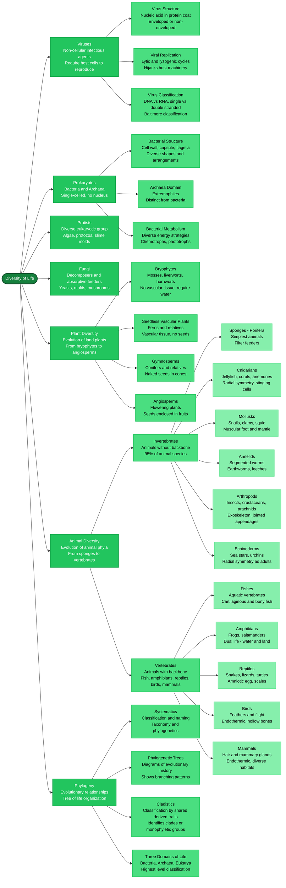

```mermaid
flowchart LR
    Start([Diversity of Life]):::green
    Start --> Viruses[Viruses<br/>Non-cellular infectious agents<br/>Require host cells to reproduce]:::lightgreen
    Start --> Prokaryotes[Prokaryotes<br/>Bacteria and Archaea<br/>Single-celled, no nucleus]:::lightgreen
    Start --> Protists[Protists<br/>Diverse eukaryotic group<br/>Algae, protozoa, slime molds]:::lightgreen
    Start --> Fungi[Fungi<br/>Decomposers and absorptive feeders<br/>Yeasts, molds, mushrooms]:::lightgreen
    Start --> PlantDiversity[Plant Diversity<br/>Evolution of land plants<br/>From bryophytes to angiosperms]:::lightgreen
    Start --> AnimalDiversity[Animal Diversity<br/>Evolution of animal phyla<br/>From sponges to vertebrates]:::lightgreen
    Start --> Phylogeny[Phylogeny<br/>Evolutionary relationships<br/>Tree of life organization]:::lightgreen
    
    Viruses --> VirusStructure[Virus Structure<br/>Nucleic acid in protein coat<br/>Enveloped or non-enveloped]:::palegreen
    Viruses --> ViralReplication[Viral Replication<br/>Lytic and lysogenic cycles<br/>Hijacks host machinery]:::palegreen
    Viruses --> VirusClassification[Virus Classification<br/>DNA vs RNA, single vs double stranded<br/>Baltimore classification]:::palegreen
    
    Prokaryotes --> BacteriaStruct[Bacterial Structure<br/>Cell wall, capsule, flagella<br/>Diverse shapes and arrangements]:::palegreen
    Prokaryotes --> ArchaeaDomain[Archaea Domain<br/>Extremophiles<br/>Distinct from bacteria]:::palegreen
    Prokaryotes --> BacterialMetabolism[Bacterial Metabolism<br/>Diverse energy strategies<br/>Chemotrophs, phototrophs]:::palegreen
    
    PlantDiversity --> Bryophytes[Bryophytes<br/>Mosses, liverworts, hornworts<br/>No vascular tissue, require water]:::palegreen
    PlantDiversity --> SeedlessVascular[Seedless Vascular Plants<br/>Ferns and relatives<br/>Vascular tissue, no seeds]:::palegreen
    PlantDiversity --> Gymnosperms[Gymnosperms<br/>Conifers and relatives<br/>Naked seeds in cones]:::palegreen
    PlantDiversity --> Angiosperms[Angiosperms<br/>Flowering plants<br/>Seeds enclosed in fruits]:::palegreen
    
    AnimalDiversity --> Invertebrates[Invertebrates<br/>Animals without backbone<br/>95% of animal species]:::palegreen
    AnimalDiversity --> Vertebrates[Vertebrates<br/>Animals with backbone<br/>Fish, amphibians, reptiles, birds, mammals]:::palegreen
    
    Invertebrates --> Sponges[Sponges - Porifera<br/>Simplest animals<br/>Filter feeders]:::mintgreen
    Invertebrates --> Cnidarians[Cnidarians<br/>Jellyfish, corals, anemones<br/>Radial symmetry, stinging cells]:::mintgreen
    Invertebrates --> Mollusks[Mollusks<br/>Snails, clams, squid<br/>Muscular foot and mantle]:::mintgreen
    Invertebrates --> Annelids[Annelids<br/>Segmented worms<br/>Earthworms, leeches]:::mintgreen
    Invertebrates --> Arthropods[Arthropods<br/>Insects, crustaceans, arachnids<br/>Exoskeleton, jointed appendages]:::mintgreen
    Invertebrates --> Echinoderms[Echinoderms<br/>Sea stars, urchins<br/>Radial symmetry as adults]:::mintgreen
    
    Vertebrates --> Fishes[Fishes<br/>Aquatic vertebrates<br/>Cartilaginous and bony fish]:::mintgreen
    Vertebrates --> Amphibians[Amphibians<br/>Frogs, salamanders<br/>Dual life - water and land]:::mintgreen
    Vertebrates --> Reptiles[Reptiles<br/>Snakes, lizards, turtles<br/>Amniotic egg, scales]:::mintgreen
    Vertebrates --> Birds[Birds<br/>Feathers and flight<br/>Endothermic, hollow bones]:::mintgreen
    Vertebrates --> Mammals[Mammals<br/>Hair and mammary glands<br/>Endothermic, diverse habitats]:::mintgreen
    
    Phylogeny --> Systematics[Systematics<br/>Classification and naming<br/>Taxonomy and phylogenetics]:::palegreen
    Phylogeny --> PhylogeneticTrees[Phylogenetic Trees<br/>Diagrams of evolutionary history<br/>Shows branching patterns]:::palegreen
    Phylogeny --> Cladistics[Cladistics<br/>Classification by shared derived traits<br/>Identifies clades or monophyletic groups]:::palegreen
    Phylogeny --> ThreeDomains[Three Domains of Life<br/>Bacteria, Archaea, Eukarya<br/>Highest level classification]:::palegreen
    
    classDef green fill:#15803d,stroke:#14532d,stroke-width:3px,color:#fff
    classDef lightgreen fill:#22c55e,stroke:#16a34a,stroke-width:2px,color:#fff
    classDef palegreen fill:#4ade80,stroke:#22c55e,stroke-width:2px,color:#000
    classDef mintgreen fill:#86efac,stroke:#4ade80,stroke-width:1px,color:#000
```