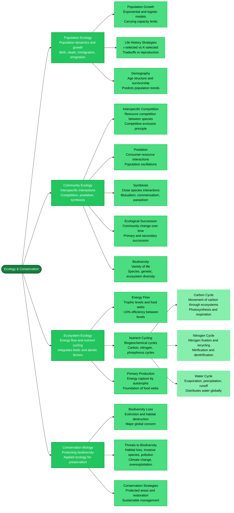

```mermaid
flowchart LR
    Start([Ecology & Conservation]):::green
    Start --> PopulationEcol[Population Ecology<br/>Population dynamics and growth<br/>Birth, death, immigration, emigration]:::lightgreen
    Start --> CommunityEcol[Community Ecology<br/>Interspecific interactions<br/>Competition, predation, symbiosis]:::lightgreen
    Start --> EcosystemEcol[Ecosystem Ecology<br/>Energy flow and nutrient cycling<br/>Integrates biotic and abiotic factors]:::lightgreen
    Start --> Conservation[Conservation Biology<br/>Protecting biodiversity<br/>Applied ecology for preservation]:::lightgreen
    
    PopulationEcol --> PopGrowth[Population Growth<br/>Exponential and logistic models<br/>Carrying capacity limits]:::palegreen
    PopulationEcol --> LifeHistory[Life History Strategies<br/>r-selected vs K-selected<br/>Tradeoffs in reproduction]:::palegreen
    PopulationEcol --> Demography[Demography<br/>Age structure and survivorship<br/>Predicts population trends]:::palegreen
    
    CommunityEcol --> Competition[Interspecific Competition<br/>Resource competition between species<br/>Competitive exclusion principle]:::palegreen
    CommunityEcol --> Predation[Predation<br/>Consumer-resource interactions<br/>Population oscillations]:::palegreen
    CommunityEcol --> Symbiosis[Symbiosis<br/>Close species interactions<br/>Mutualism, commensalism, parasitism]:::palegreen
    CommunityEcol --> Succession[Ecological Succession<br/>Community change over time<br/>Primary and secondary succession]:::palegreen
    CommunityEcol --> Biodiversity[Biodiversity<br/>Variety of life<br/>Species, genetic, ecosystem diversity]:::palegreen
    
    EcosystemEcol --> EnergyFlow[Energy Flow<br/>Trophic levels and food webs<br/>~10% efficiency between levels]:::palegreen
    EcosystemEcol --> NutrientCycling[Nutrient Cycling<br/>Biogeochemical cycles<br/>Carbon, nitrogen, phosphorus cycles]:::palegreen
    EcosystemEcol --> PrimaryProduction[Primary Production<br/>Energy capture by autotrophs<br/>Foundation of food webs]:::palegreen
    
    NutrientCycling --> CarbonCycle[Carbon Cycle<br/>Movement of carbon through ecosystems<br/>Photosynthesis and respiration]:::mintgreen
    NutrientCycling --> NitrogenCycle[Nitrogen Cycle<br/>Nitrogen fixation and recycling<br/>Nitrification and denitrification]:::mintgreen
    NutrientCycling --> WaterCycle[Water Cycle<br/>Evaporation, precipitation, runoff<br/>Distributes water globally]:::mintgreen
    
    Conservation --> BiodiversityLoss[Biodiversity Loss<br/>Extinction and habitat destruction<br/>Major global concern]:::palegreen
    Conservation --> Threats[Threats to Biodiversity<br/>Habitat loss, invasive species, pollution<br/>Climate change, overexploitation]:::palegreen
    Conservation --> ConservationStrategies[Conservation Strategies<br/>Protected areas and restoration<br/>Sustainable management]:::palegreen
    
    classDef green fill:#15803d,stroke:#14532d,stroke-width:3px,color:#fff
    classDef lightgreen fill:#22c55e,stroke:#16a34a,stroke-width:2px,color:#fff
    classDef palegreen fill:#4ade80,stroke:#22c55e,stroke-width:2px,color:#000
    classDef mintgreen fill:#86efac,stroke:#4ade80,stroke-width:1px,color:#000
```