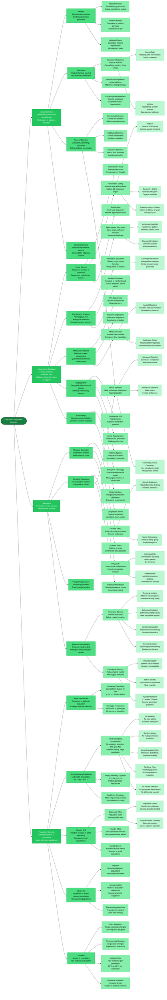

```mermaid
flowchart LR
    Start([Evolution & Population Genetics]):::green
    Start --> NaturalSelection["Natural Selection<br/>Differential survival and reproduction<br/>Mechanism of adaptive evolution"]:::lightgreen
    Start --> Evidence["Evidence for Evolution<br/>Fossils, anatomy, molecular data<br/>Multiple independent lines of support"]:::lightgreen
    Start --> Speciation["Speciation<br/>Formation of new species<br/>Reproductive isolation"]:::lightgreen
    Start --> PopulationGenetics["Population Genetics<br/>Allele frequencies in populations<br/>Hardy-Weinberg equilibrium"]:::lightgreen
    
    NaturalSelection --> Fitness["Fitness<br/>Reproductive success<br/>Contribution to next generation"]:::palegreen
    NaturalSelection --> Adaptation["Adaptation<br/>Traits enhancing survival<br/>Result of natural selection"]:::palegreen
    NaturalSelection --> SelectionTypes["Types of Selection<br/>Directional, stabilizing, disruptive<br/>Different effects on variation"]:::palegreen
    NaturalSelection --> DarwinianFitness["Darwinian Fitness<br/>Relative reproductive success<br/>Measured by offspring survival"]:::palegreen
    
    Fitness --> AbsoluteFitness["Absolute Fitness<br/>Total offspring produced<br/>Actual reproductive output"]:::mintgreen
    Fitness --> RelativeFitness["Relative Fitness<br/>Compared to optimal genotype<br/>Normalized to 1.0"]:::mintgreen
    Fitness --> InclusiveFitness["Inclusive Fitness<br/>Direct plus indirect reproduction<br/>Kin selection basis"]:::mintgreen
    
    Adaptation --> StructuralAdaptations["Structural Adaptations<br/>Physical features<br/>Camouflage, mimicry, body shape"]:::mintgreen
    Adaptation --> BehavioralAdaptations["Behavioral Adaptations<br/>Action patterns<br/>Migration, mating displays"]:::mintgreen
    Adaptation --> PhysiologicalAdaptations["Physiological Adaptations<br/>Internal processes<br/>Enzyme function, homeostasis"]:::mintgreen
    
    StructuralAdaptations --> Camouflage["Camouflage<br/>Blending with environment<br/>Cryptic coloration"]:::lightmint
    StructuralAdaptations --> Mimicry["Mimicry<br/>Resembling another species<br/>Batesian and Müllerian"]:::lightmint
    
    SelectionTypes --> DirectionalSelection["Directional Selection<br/>Favors one extreme<br/>Shifts mean phenotype"]:::mintgreen
    SelectionTypes --> StabilizingSelection["Stabilizing Selection<br/>Favors intermediate<br/>Reduces variation"]:::mintgreen
    SelectionTypes --> DisruptiveSelection["Disruptive Selection<br/>Favors both extremes<br/>Increases variation"]:::mintgreen
    SelectionTypes --> SexualSelection["Sexual Selection<br/>Competition for mates<br/>Intrasexual and intersexual"]:::mintgreen
    
    SexualSelection --> IntrasexualSelection["Intrasexual Selection<br/>Same-sex competition<br/>Male-male combat"]:::lightmint
    SexualSelection --> IntersexualSelection["Intersexual Selection<br/>Mate choice<br/>Female preference"]:::lightmint
    SexualSelection --> SecondaryCharacters["Secondary Sexual Characters<br/>Non-reproductive traits<br/>Peacock tail, antlers"]:::lightmint
    
    Evidence --> FossilRecord["Fossil Record<br/>Preserved remains of organisms<br/>Documents evolutionary history"]:::palegreen
    Evidence --> ComparativeAnatomy["Comparative Anatomy<br/>Homologous and analogous structures<br/>Reveals common ancestry"]:::palegreen
    Evidence --> MolecularEvidence["Molecular Evidence<br/>DNA and protein comparisons<br/>Quantifies evolutionary relationships"]:::palegreen
    Evidence --> Biogeography["Biogeography<br/>Geographic distribution of species<br/>Reflects evolutionary history"]:::palegreen
    Evidence --> Embryology["Embryology<br/>Developmental similarities<br/>Common ancestry evidence"]:::palegreen
    
    FossilRecord --> TransitionalFossils["Transitional Fossils<br/>Intermediate forms<br/>Archaeopteryx, Tiktaalik"]:::mintgreen
    FossilRecord --> RadiometricDating["Radiometric Dating<br/>Absolute age determination<br/>Carbon-14, potassium-argon"]:::mintgreen
    FossilRecord --> Stratification["Stratification<br/>Rock layer sequence<br/>Relative age determination"]:::mintgreen
    
    RadiometricDating --> HalfLife["Half-Life<br/>Time for 50% decay<br/>Isotope-specific constant"]:::lightmint
    RadiometricDating --> CarbonDating["Carbon-14 Dating<br/>Up to 50,000 years<br/>Organic materials"]:::lightmint
    RadiometricDating --> PotassiumArgon["Potassium-Argon Dating<br/>Millions to billions of years<br/>Volcanic rocks"]:::lightmint
    
    ComparativeAnatomy --> HomologousStructures["Homologous Structures<br/>Same origin, different function<br/>Vertebrate forelimbs"]:::mintgreen
    ComparativeAnatomy --> AnalogousStructures["Analogous Structures<br/>Different origin, same function<br/>Wings: birds vs insects"]:::mintgreen
    ComparativeAnatomy --> VestigialStructures["Vestigial Structures<br/>Reduced or non-functional<br/>Human appendix, whale pelvis"]:::mintgreen
    
    HomologousStructures --> VertebrateForelimbs["Vertebrate Forelimbs<br/>Same bone pattern<br/>Humerus, radius, ulna"]:::lightmint
    HomologousStructures --> DivergentEvolution["Divergent Evolution<br/>Common ancestor<br/>Adaptive radiation"]:::lightmint
    
    AnalogousStructures --> ConvergentEvolution["Convergent Evolution<br/>Independent evolution<br/>Similar environmental pressures"]:::lightmint
    
    MolecularEvidence --> DNASequencing["DNA Sequencing<br/>Genome comparisons<br/>Molecular clock"]:::mintgreen
    MolecularEvidence --> ProteinComparisons["Protein Comparisons<br/>Amino acid sequences<br/>Cytochrome c studies"]:::mintgreen
    MolecularEvidence --> MolecularClock["Molecular Clock<br/>Mutation rate estimate<br/>Divergence time calculation"]:::mintgreen
    
    MolecularClock --> NeutralMutations["Neutral Mutations<br/>Constant rate accumulation<br/>No selection pressure"]:::lightmint
    MolecularClock --> CalibrationPoints["Calibration Points<br/>Fossil-dated divergences<br/>Anchors molecular timeline"]:::lightmint
    
    Biogeography --> ContinentalDrift["Continental Drift<br/>Plate tectonics<br/>Explains distribution patterns"]:::mintgreen
    Biogeography --> IslandBiogeography["Island Biogeography<br/>Isolation and speciation<br/>Galápagos finches"]:::mintgreen
    Biogeography --> EndemicSpecies["Endemic Species<br/>Unique to location<br/>Marsupials in Australia"]:::mintgreen
    
    Embryology --> EmbryonicHomology["Embryonic Homology<br/>Similar developmental stages<br/>Pharyngeal pouches in vertebrates"]:::mintgreen
    Embryology --> RecapitulationTheory["Biogenetic Law<br/>Ontogeny recapitulates phylogeny<br/>Embryonic resemblance"]:::mintgreen
    
    Speciation --> AllopatricSpec["Allopatric Speciation<br/>Geographic isolation<br/>Most common mode"]:::palegreen
    Speciation --> SympatricSpec["Sympatric Speciation<br/>No geographic isolation<br/>Polyploidy in plants"]:::palegreen
    Speciation --> ParapatricSpec["Parapatric Speciation<br/>Adjacent populations<br/>Environmental gradient"]:::palegreen
    Speciation --> ReproductiveIsolation["Reproductive Isolation<br/>Prevents interbreeding<br/>Prezygotic and postzygotic barriers"]:::palegreen
    
    AllopatricSpec --> GeographicBarrier["Geographic Barrier<br/>Physical separation<br/>Mountains, rivers, ocean"]:::mintgreen
    AllopatricSpec --> FounderEffect["Founder Effect<br/>Small colonizing population<br/>Genetic bottleneck"]:::mintgreen
    AllopatricSpec --> VicariantEvent["Vicariant Event<br/>Splitting of range<br/>Continental drift, glaciation"]:::mintgreen
    
    FounderEffect --> GeneticBottleneck["Genetic Bottleneck<br/>Reduced genetic diversity<br/>Random allele loss"]:::lightmint
    FounderEffect --> IslandColonization["Island Colonization<br/>Small founding group<br/>Rapid divergence"]:::lightmint
    
    SympatricSpec --> Polyploidy["Polyploidy<br/>Chromosome multiplication<br/>Instant reproductive isolation"]:::mintgreen
    SympatricSpec --> HabitatDifferentiation["Habitat Differentiation<br/>Different ecological niches<br/>Assortative mating"]:::mintgreen
    SympatricSpec --> SexualSelection["Sexual Selection<br/>Mate preference divergence<br/>Rapid speciation"]:::mintgreen
    
    Polyploidy --> Autopolyploidy["Autopolyploidy<br/>Chromosome doubling within species<br/>3n, 4n forms"]:::lightmint
    Polyploidy --> Allopolyploidy["Allopolyploidy<br/>Hybrid chromosome doubling<br/>Combines two species"]:::lightmint
    
    ReproductiveIsolation --> PrezygoticBarriers["Prezygotic Barriers<br/>Prevent fertilization<br/>Before zygote formation"]:::mintgreen
    ReproductiveIsolation --> PostzygoticBarriers["Postzygotic Barriers<br/>Reduce hybrid viability<br/>After zygote formation"]:::mintgreen
    
    PrezygoticBarriers --> TemporalIsolation["Temporal Isolation<br/>Different breeding times<br/>Seasonal or daily timing"]:::lightmint
    PrezygoticBarriers --> BehavioralIsolation["Behavioral Isolation<br/>Different courtship rituals<br/>Mate recognition signals"]:::lightmint
    PrezygoticBarriers --> MechanicalIsolation["Mechanical Isolation<br/>Anatomical incompatibility<br/>Structural mismatch"]:::lightmint
    PrezygoticBarriers --> GameticIsolation["Gametic Isolation<br/>Sperm-egg incompatibility<br/>Biochemical barriers"]:::lightmint
    
    PostzygoticBarriers --> HybridInviability["Hybrid Inviability<br/>Hybrids fail to develop<br/>Genetic incompatibility"]:::lightmint
    PostzygoticBarriers --> HybridSterility["Hybrid Sterility<br/>Hybrids cannot reproduce<br/>Mule example"]:::lightmint
    PostzygoticBarriers --> HybridBreakdown["Hybrid Breakdown<br/>F1 viable, F2 weak<br/>Second-generation problems"]:::lightmint
    
    PopulationGenetics --> AlleleFreq["Allele Frequencies<br/>Proportion of alleles in population<br/>Changes indicate evolution"]:::palegreen
    PopulationGenetics --> HardyWeinberg["Hardy-Weinberg Equilibrium<br/>Null model for evolution<br/>p² + 2pq + q² = 1"]:::palegreen
    PopulationGenetics --> GeneticDrift["Genetic Drift<br/>Random changes in allele frequency<br/>Stronger in small populations"]:::palegreen
    PopulationGenetics --> GeneFlow["Gene Flow<br/>Movement of alleles between populations<br/>Homogenizes populations"]:::palegreen
    PopulationGenetics --> Mutation["Mutation<br/>Source of new alleles<br/>Raw material for evolution"]:::palegreen
    
    AlleleFreq --> AlleleFreqCalc["Frequency Calculation<br/>Count alleles divided by total<br/>p + q = 1 for two alleles"]:::mintgreen
    AlleleFreq --> GenotypeFreq["Genotype Frequencies<br/>Proportion of genotypes<br/>AA, Aa, aa in population"]:::mintgreen
    
    HardyWeinberg --> HWAssumptions["Hardy-Weinberg Assumptions<br/>No mutation, selection, drift, gene flow<br/>Random mating, large population"]:::mintgreen
    HardyWeinberg --> HWEquation["Hardy-Weinberg Equation<br/>p² + 2pq + q² = 1<br/>Predicts genotype frequencies"]:::mintgreen
    HardyWeinberg --> HWEquilibrium["Equilibrium Conditions<br/>Allele frequencies constant<br/>No evolution occurring"]:::mintgreen
    
    HWAssumptions --> NoMutation["No Mutation<br/>No new alleles<br/>Constant allele pool"]:::lightmint
    HWAssumptions --> RandomMating["Random Mating<br/>No mate preference<br/>Panmixia"]:::lightmint
    HWAssumptions --> LargePopulation["Large Population Size<br/>Minimizes drift effects<br/>Statistical stability"]:::lightmint
    HWAssumptions --> NoMigration["No Gene Flow<br/>Isolated population<br/>No immigration or emigration"]:::lightmint
    HWAssumptions --> NoSelection["No Natural Selection<br/>All genotypes equal fitness<br/>No differential survival"]:::lightmint
    
    GeneticDrift --> BottleneckEffect["Bottleneck Effect<br/>Population crash<br/>Random allele loss"]:::mintgreen
    GeneticDrift --> FounderEffectDrift["Founder Effect<br/>New population from few<br/>Non-representative alleles"]:::mintgreen
    GeneticDrift --> SamplingError["Sampling Error<br/>Random chance effects<br/>Stronger in small populations"]:::mintgreen
    
    BottleneckEffect --> PopulationCrash["Population Crash<br/>Drastic size reduction<br/>Disease, disaster, hunting"]:::lightmint
    BottleneckEffect --> GeneticDiversityLoss["Loss of Genetic Diversity<br/>Reduced variation<br/>Lower adaptive potential"]:::lightmint
    
    GeneFlow --> Migration["Migration<br/>Movement between populations<br/>Introduces new alleles"]:::mintgreen
    GeneFlow --> PanmixisIncrease["Homogenization<br/>Reduces population differences<br/>Counteracts local adaptation"]:::mintgreen
    GeneFlow --> EffectiveMigrationRate["Effective Migration Rate<br/>Proportion of migrants<br/>Gene flow intensity"]:::mintgreen
    
    Mutation --> PointMutations["Point Mutations<br/>Single nucleotide changes<br/>Low frequency per gene"]:::mintgreen
    Mutation --> ChromosomalMutations["Chromosomal Mutations<br/>Large-scale changes<br/>Duplications, inversions"]:::mintgreen
    Mutation --> MutationRate["Mutation Rate<br/>New mutations per generation<br/>10^-8 to 10^-9 per nucleotide"]:::mintgreen
    Mutation --> BeneficialMutations["Beneficial Mutations<br/>Increase fitness<br/>Subject to positive selection"]:::mintgreen
    
    classDef green fill:#15803d,stroke:#14532d,stroke-width:3px,color:#fff
    classDef lightgreen fill:#22c55e,stroke:#16a34a,stroke-width:2px,color:#fff
    classDef palegreen fill:#4ade80,stroke:#22c55e,stroke-width:2px,color:#000
    classDef mintgreen fill:#86efac,stroke:#4ade80,stroke-width:1px,color:#000
    classDef lightmint fill:#bbf7d0,stroke:#86efac,stroke-width:1px,color:#000
```