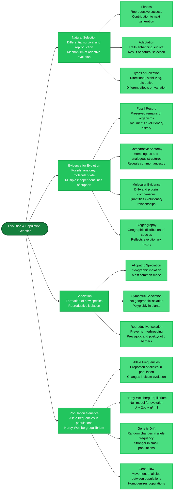

```mermaid
flowchart LR
    Start([Evolution & Population Genetics]):::green
    Start --> NaturalSelection[Natural Selection<br/>Differential survival and reproduction<br/>Mechanism of adaptive evolution]:::lightgreen
    Start --> Evidence[Evidence for Evolution<br/>Fossils, anatomy, molecular data<br/>Multiple independent lines of support]:::lightgreen
    Start --> Speciation[Speciation<br/>Formation of new species<br/>Reproductive isolation]:::lightgreen
    Start --> PopulationGenetics[Population Genetics<br/>Allele frequencies in populations<br/>Hardy-Weinberg equilibrium]:::lightgreen
    
    NaturalSelection --> Fitness[Fitness<br/>Reproductive success<br/>Contribution to next generation]:::palegreen
    NaturalSelection --> Adaptation[Adaptation<br/>Traits enhancing survival<br/>Result of natural selection]:::palegreen
    NaturalSelection --> SelectionTypes[Types of Selection<br/>Directional, stabilizing, disruptive<br/>Different effects on variation]:::palegreen
    
    Evidence --> FossilRecord[Fossil Record<br/>Preserved remains of organisms<br/>Documents evolutionary history]:::palegreen
    Evidence --> ComparativeAnatomy[Comparative Anatomy<br/>Homologous and analogous structures<br/>Reveals common ancestry]:::palegreen
    Evidence --> MolecularEvidence[Molecular Evidence<br/>DNA and protein comparisons<br/>Quantifies evolutionary relationships]:::palegreen
    Evidence --> Biogeography[Biogeography<br/>Geographic distribution of species<br/>Reflects evolutionary history]:::palegreen
    
    Speciation --> AllopatricSpec[Allopatric Speciation<br/>Geographic isolation<br/>Most common mode]:::palegreen
    Speciation --> SympatricSpec[Sympatric Speciation<br/>No geographic isolation<br/>Polyploidy in plants]:::palegreen
    Speciation --> ReproductiveIsolation[Reproductive Isolation<br/>Prevents interbreeding<br/>Prezygotic and postzygotic barriers]:::palegreen
    
    PopulationGenetics --> AlleleFreq[Allele Frequencies<br/>Proportion of alleles in population<br/>Changes indicate evolution]:::palegreen
    PopulationGenetics --> HardyWeinberg[Hardy-Weinberg Equilibrium<br/>Null model for evolution<br/>p² + 2pq + q² = 1]:::palegreen
    PopulationGenetics --> GeneticDrift[Genetic Drift<br/>Random changes in allele frequency<br/>Stronger in small populations]:::palegreen
    PopulationGenetics --> GeneFlow[Gene Flow<br/>Movement of alleles between populations<br/>Homogenizes populations]:::palegreen
    
    classDef green fill:#15803d,stroke:#14532d,stroke-width:3px,color:#fff
    classDef lightgreen fill:#22c55e,stroke:#16a34a,stroke-width:2px,color:#fff
    classDef palegreen fill:#4ade80,stroke:#22c55e,stroke-width:2px,color:#000
    classDef mintgreen fill:#86efac,stroke:#4ade80,stroke-width:1px,color:#000
```