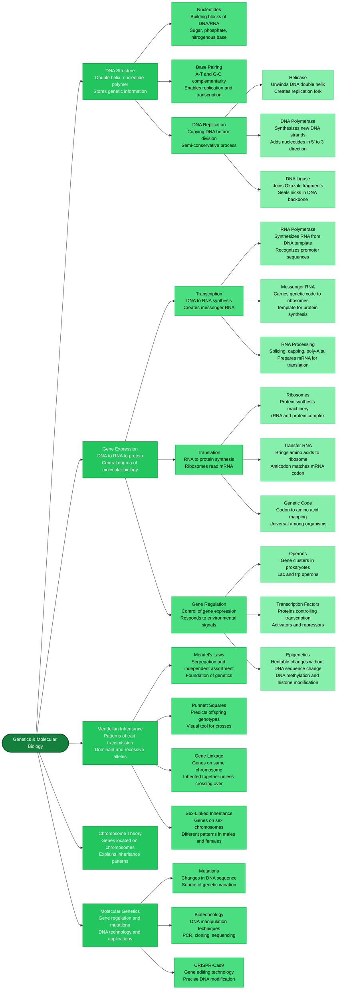

```mermaid
flowchart LR
    Start([Genetics & Molecular Biology]):::green
    Start --> DNA[DNA Structure<br/>Double helix, nucleotide polymer<br/>Stores genetic information]:::lightgreen
    Start --> GeneExpression[Gene Expression<br/>DNA to RNA to protein<br/>Central dogma of molecular biology]:::lightgreen
    Start --> Inheritance[Mendelian Inheritance<br/>Patterns of trait transmission<br/>Dominant and recessive alleles]:::lightgreen
    Start --> ChromosomeTheory[Chromosome Theory<br/>Genes located on chromosomes<br/>Explains inheritance patterns]:::lightgreen
    Start --> MolecularGenetics[Molecular Genetics<br/>Gene regulation and mutations<br/>DNA technology and applications]:::lightgreen
    
    DNA --> Nucleotides[Nucleotides<br/>Building blocks of DNA/RNA<br/>Sugar, phosphate, nitrogenous base]:::palegreen
    DNA --> BasePairing[Base Pairing<br/>A-T and G-C complementarity<br/>Enables replication and transcription]:::palegreen
    DNA --> Replication[DNA Replication<br/>Copying DNA before division<br/>Semi-conservative process]:::palegreen
    
    Replication --> Helicase[Helicase<br/>Unwinds DNA double helix<br/>Creates replication fork]:::mintgreen
    Replication --> Polymerase[DNA Polymerase<br/>Synthesizes new DNA strands<br/>Adds nucleotides in 5' to 3' direction]:::mintgreen
    Replication --> Ligase[DNA Ligase<br/>Joins Okazaki fragments<br/>Seals nicks in DNA backbone]:::mintgreen
    
    GeneExpression --> Transcription[Transcription<br/>DNA to RNA synthesis<br/>Creates messenger RNA]:::palegreen
    GeneExpression --> Translation[Translation<br/>RNA to protein synthesis<br/>Ribosomes read mRNA]:::palegreen
    GeneExpression --> GeneRegulation[Gene Regulation<br/>Control of gene expression<br/>Responds to environmental signals]:::palegreen
    
    Transcription --> RNAPolymerase[RNA Polymerase<br/>Synthesizes RNA from DNA template<br/>Recognizes promoter sequences]:::mintgreen
    Transcription --> mRNA[Messenger RNA<br/>Carries genetic code to ribosomes<br/>Template for protein synthesis]:::mintgreen
    Transcription --> RNAProcessing[RNA Processing<br/>Splicing, capping, poly-A tail<br/>Prepares mRNA for translation]:::mintgreen
    
    Translation --> Ribosome[Ribosomes<br/>Protein synthesis machinery<br/>rRNA and protein complex]:::mintgreen
    Translation --> tRNA[Transfer RNA<br/>Brings amino acids to ribosome<br/>Anticodon matches mRNA codon]:::mintgreen
    Translation --> GeneticCode[Genetic Code<br/>Codon to amino acid mapping<br/>Universal among organisms]:::mintgreen
    
    GeneRegulation --> Operons[Operons<br/>Gene clusters in prokaryotes<br/>Lac and trp operons]:::mintgreen
    GeneRegulation --> TranscriptionFactors[Transcription Factors<br/>Proteins controlling transcription<br/>Activators and repressors]:::mintgreen
    GeneRegulation --> Epigenetics[Epigenetics<br/>Heritable changes without DNA sequence change<br/>DNA methylation and histone modification]:::mintgreen
    
    Inheritance --> MendelLaws[Mendel's Laws<br/>Segregation and independent assortment<br/>Foundation of genetics]:::palegreen
    Inheritance --> Punnett[Punnett Squares<br/>Predicts offspring genotypes<br/>Visual tool for crosses]:::palegreen
    Inheritance --> Linkage[Gene Linkage<br/>Genes on same chromosome<br/>Inherited together unless crossing over]:::palegreen
    Inheritance --> SexLinked[Sex-Linked Inheritance<br/>Genes on sex chromosomes<br/>Different patterns in males and females]:::palegreen
    
    MolecularGenetics --> Mutations[Mutations<br/>Changes in DNA sequence<br/>Source of genetic variation]:::palegreen
    MolecularGenetics --> Biotechnology[Biotechnology<br/>DNA manipulation techniques<br/>PCR, cloning, sequencing]:::palegreen
    MolecularGenetics --> CRISPR[CRISPR-Cas9<br/>Gene editing technology<br/>Precise DNA modification]:::palegreen
    
    classDef green fill:#15803d,stroke:#14532d,stroke-width:3px,color:#fff
    classDef lightgreen fill:#22c55e,stroke:#16a34a,stroke-width:2px,color:#fff
    classDef palegreen fill:#4ade80,stroke:#22c55e,stroke-width:2px,color:#000
    classDef mintgreen fill:#86efac,stroke:#4ade80,stroke-width:1px,color:#000
```