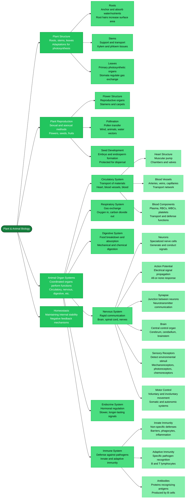

```mermaid
flowchart LR
    Start([Plant & Animal Biology]):::green
    Start --> PlantStructure[Plant Structure<br/>Roots, stems, leaves<br/>Adaptations for photosynthesis]:::lightgreen
    Start --> PlantReproduction[Plant Reproduction<br/>Sexual and asexual methods<br/>Flowers, seeds, fruits]:::lightgreen
    Start --> AnimalSystems[Animal Organ Systems<br/>Coordinated organs perform functions<br/>Circulatory, nervous, digestive, etc.]:::lightgreen
    Start --> Homeostasis[Homeostasis<br/>Maintaining internal stability<br/>Negative feedback mechanisms]:::lightgreen
    
    PlantStructure --> Roots[Roots<br/>Anchor and absorb water/nutrients<br/>Root hairs increase surface area]:::palegreen
    PlantStructure --> Stems[Stems<br/>Support and transport<br/>Xylem and phloem tissues]:::palegreen
    PlantStructure --> Leaves[Leaves<br/>Primary photosynthetic organs<br/>Stomata regulate gas exchange]:::palegreen
    
    PlantReproduction --> FlowerStructure[Flower Structure<br/>Reproductive organs<br/>Stamens and carpels]:::palegreen
    PlantReproduction --> Pollination[Pollination<br/>Pollen transfer<br/>Wind, animals, water vectors]:::palegreen
    PlantReproduction --> SeedDevelopment[Seed Development<br/>Embryo and endosperm formation<br/>Protected for dispersal]:::palegreen
    
    AnimalSystems --> Circulatory[Circulatory System<br/>Transport of materials<br/>Heart, blood vessels, blood]:::palegreen
    AnimalSystems --> Respiratory[Respiratory System<br/>Gas exchange<br/>Oxygen in, carbon dioxide out]:::palegreen
    AnimalSystems --> Digestive[Digestive System<br/>Food breakdown and absorption<br/>Mechanical and chemical digestion]:::palegreen
    AnimalSystems --> Nervous[Nervous System<br/>Rapid communication<br/>Brain, spinal cord, nerves]:::palegreen
    AnimalSystems --> Endocrine[Endocrine System<br/>Hormonal regulation<br/>Slower, longer-lasting signals]:::palegreen
    AnimalSystems --> Immune[Immune System<br/>Defense against pathogens<br/>Innate and adaptive immunity]:::palegreen
    
    Circulatory --> HeartStruct[Heart Structure<br/>Muscular pump<br/>Chambers and valves]:::mintgreen
    Circulatory --> BloodVessels[Blood Vessels<br/>Arteries, veins, capillaries<br/>Transport network]:::mintgreen
    Circulatory --> BloodComponents[Blood Components<br/>Plasma, RBCs, WBCs, platelets<br/>Transport and defense functions]:::mintgreen
    
    Nervous --> Neurons[Neurons<br/>Specialized nerve cells<br/>Generate and conduct signals]:::mintgreen
    Nervous --> ActionPotential[Action Potential<br/>Electrical signal propagation<br/>All-or-none response]:::mintgreen
    Nervous --> Synapse[Synapse<br/>Junction between neurons<br/>Neurotransmitter communication]:::mintgreen
    Nervous --> Brain[Brain<br/>Central control organ<br/>Cerebrum, cerebellum, brainstem]:::mintgreen
    Nervous --> SensoryReceptors[Sensory Receptors<br/>Detect environmental stimuli<br/>Mechanoreceptors, photoreceptors, chemoreceptors]:::mintgreen
    Nervous --> MotorControl[Motor Control<br/>Voluntary and involuntary movement<br/>Somatic and autonomic systems]:::mintgreen
    
    Immune --> InnateImmunity[Innate Immunity<br/>Non-specific defenses<br/>Barriers, phagocytes, inflammation]:::mintgreen
    Immune --> AdaptiveImmunity[Adaptive Immunity<br/>Specific pathogen recognition<br/>B and T lymphocytes]:::mintgreen
    Immune --> Antibodies[Antibodies<br/>Proteins recognizing antigens<br/>Produced by B cells]:::mintgreen
    
    classDef green fill:#15803d,stroke:#14532d,stroke-width:3px,color:#fff
    classDef lightgreen fill:#22c55e,stroke:#16a34a,stroke-width:2px,color:#fff
    classDef palegreen fill:#4ade80,stroke:#22c55e,stroke-width:2px,color:#000
    classDef mintgreen fill:#86efac,stroke:#4ade80,stroke-width:1px,color:#000
```