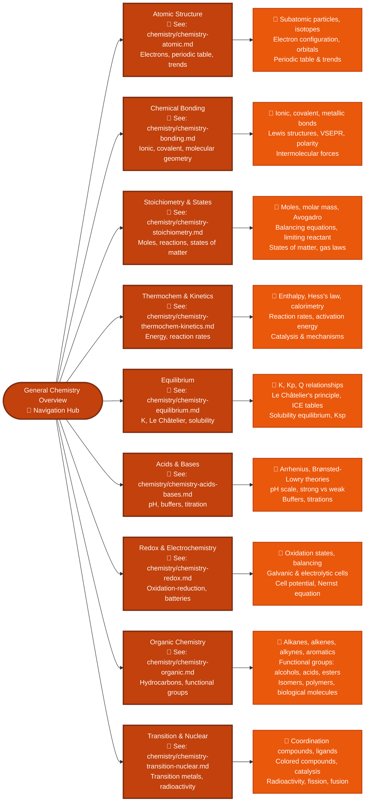

```mermaid
flowchart LR
    Start([General Chemistry Overview<br/>🧭 Navigation Hub]):::orange
    Start --> AtomicStruct["Atomic Structure<br/>📂 See: chemistry/chemistry-atomic.md<br/>Electrons, periodic table, trends"]:::orange
    Start --> ChemBonding["Chemical Bonding<br/>📂 See: chemistry/chemistry-bonding.md<br/>Ionic, covalent, molecular geometry"]:::orange
    Start --> Stoichiometry["Stoichiometry & States<br/>📂 See: chemistry/chemistry-stoichiometry.md<br/>Moles, reactions, states of matter"]:::orange
    Start --> ThermoKinetics["Thermochem & Kinetics<br/>📂 See: chemistry/chemistry-thermochem-kinetics.md<br/>Energy, reaction rates"]:::orange
    Start --> Equilibrium["Equilibrium<br/>📂 See: chemistry/chemistry-equilibrium.md<br/>K, Le Châtelier, solubility"]:::orange
    Start --> AcidsBase["Acids & Bases<br/>📂 See: chemistry/chemistry-acids-bases.md<br/>pH, buffers, titration"]:::orange
    Start --> Redox["Redox & Electrochemistry<br/>📂 See: chemistry/chemistry-redox.md<br/>Oxidation-reduction, batteries"]:::orange
    Start --> OrganicChem["Organic Chemistry<br/>📂 See: chemistry/chemistry-organic.md<br/>Hydrocarbons, functional groups"]:::orange
    Start --> TransitionNuclear["Transition & Nuclear<br/>📂 See: chemistry/chemistry-transition-nuclear.md<br/>Transition metals, radioactivity"]:::orange
    
    AtomicStruct --> AtomicDetails["📄 Subatomic particles, isotopes<br/>Electron configuration, orbitals<br/>Periodic table & trends"]:::lightorange
    
    ChemBonding --> BondingDetails["📄 Ionic, covalent, metallic bonds<br/>Lewis structures, VSEPR, polarity<br/>Intermolecular forces"]:::lightorange
    
    Stoichiometry --> StoichDetails["📄 Moles, molar mass, Avogadro<br/>Balancing equations, limiting reactant<br/>States of matter, gas laws"]:::lightorange
    
    ThermoKinetics --> ThermoDetails["📄 Enthalpy, Hess's law, calorimetry<br/>Reaction rates, activation energy<br/>Catalysis & mechanisms"]:::lightorange
    
    Equilibrium --> EquilDetails["📄 K, Kp, Q relationships<br/>Le Châtelier's principle, ICE tables<br/>Solubility equilibrium, Ksp"]:::lightorange
    
    AcidsBase --> AcidDetails["📄 Arrhenius, Brønsted-Lowry theories<br/>pH scale, strong vs weak<br/>Buffers, titrations"]:::lightorange
    
    Redox --> RedoxDetails["📄 Oxidation states, balancing<br/>Galvanic & electrolytic cells<br/>Cell potential, Nernst equation"]:::lightorange
    
    OrganicChem --> OrganicDetails["📄 Alkanes, alkenes, alkynes, aromatics<br/>Functional groups: alcohols, acids, esters<br/>Isomers, polymers, biological molecules"]:::lightorange
    
    TransitionNuclear --> TransDetails["📄 Coordination compounds, ligands<br/>Colored compounds, catalysis<br/>Radioactivity, fission, fusion"]:::lightorange
    
    classDef orange fill:#c2410c,stroke:#7c2d12,stroke-width:3px,color:#fff
    classDef lightorange fill:#ea580c,stroke:#c2410c,stroke-width:2px,color:#fff
    classDef paleorange fill:#fb923c,stroke:#f97316,stroke-width:2px,color:#000
    classDef peach fill:#fdba74,stroke:#fb923c,stroke-width:1px,color:#000
```