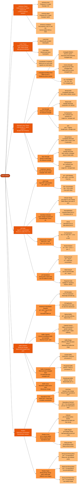

```mermaid
flowchart LR
    Start([Acids & Bases]):::orange
    Start --> ArrheniusTheory["Arrhenius Theory<br/>Acids produce H⁺, bases produce OH⁻<br/>Limited to aqueous solutions"]:::lightorange
    Start --> BronstedLowry["Brønsted-Lowry Theory<br/>Acids donate H⁺, bases accept H⁺<br/>Broader than Arrhenius"]:::lightorange
    Start --> LewisTheory["Lewis Theory<br/>Acids accept electron pairs, bases donate<br/>Most general definition"]:::lightorange
    Start --> pH["pH Scale<br/>-log of H⁺ concentration<br/>Measures acidity from 0-14"]:::lightorange
    Start --> BufferSolutions["Buffer Solutions<br/>Resist pH changes<br/>Weak acid/conjugate base pairs"]:::lightorange
    Start --> Titration["Titration<br/>Determine concentration<br/>Neutralization reaction"]:::lightorange
    
    ArrheniusTheory --> ArrheniusAcid["Arrhenius Acid<br/>Produces H⁺ in water<br/>Example: HCl"]:::peach
    ArrheniusTheory --> ArrheniusBase["Arrhenius Base<br/>Produces OH⁻ in water<br/>Example: NaOH"]:::peach
    ArrheniusTheory --> ArrheniusLimitations["Arrhenius Limitations<br/>Only aqueous, only H+ and OH-<br/>Cannot explain NH3 as base"]:::peach
    
    LewisTheory --> LewisAcid["Lewis Acid<br/>Electron pair acceptor<br/>Electrophile"]:::peach
    LewisTheory --> LewisBase["Lewis Base<br/>Electron pair donor<br/>Nucleophile"]:::peach
    LewisTheory --> Coordination["Coordination Complexes<br/>Metal ions as Lewis acids<br/>Ligands as Lewis bases"]:::peach
    
    BronstedLowry --> ConjugatePairs["Conjugate Acid-Base Pairs<br/>Differ by one H⁺<br/>Related by proton transfer"]:::paleorange
    BronstedLowry --> AcidStrength["Acid Strength<br/>Strong vs weak acids<br/>Ka measures strength"]:::paleorange
    BronstedLowry --> BaseStrength["Base Strength<br/>Strong vs weak bases<br/>Kb measures strength"]:::paleorange
    BronstedLowry --> Amphoteric["Amphoteric Species<br/>Can act as acid or base<br/>Example: H2O, HSO4-"]:::paleorange
    
    ConjugatePairs --> ConjugateRelation["Conjugate Relation<br/>HA to A- and H+<br/>Acid loses proton becomes conjugate base"]:::peach
    ConjugatePairs --> InverseStrength["Inverse Strength<br/>Strong acid has weak conjugate base<br/>Weak acid has strong conjugate base"]:::peach
    ConjugatePairs --> KaKbRelation["Ka × Kb Relation<br/>Ka × Kb = Kw<br/>For conjugate pair"]:::peach
    
    AcidStrength --> StrongAcids["Strong Acids<br/>Completely dissociate<br/>HCl, HNO3, H2SO4, HClO4"]:::peach
    AcidStrength --> WeakAcids["Weak Acids<br/>Partially dissociate<br/>CH3COOH, HF, H2CO3"]:::peach
    AcidStrength --> KaExpression["Ka Expression<br/>Ka = products over reactants HA<br/>Larger Ka = stronger acid"]:::peach
    AcidStrength --> pKa["pKa<br/>pKa = -log(Ka)<br/>Smaller pKa = stronger acid"]:::peach
    
    BaseStrength --> StrongBases["Strong Bases<br/>Completely dissociate<br/>NaOH, KOH, Group 1 and 2 hydroxides"]:::peach
    BaseStrength --> WeakBases["Weak Bases<br/>Partially dissociate<br/>NH3, amines, conjugate bases of weak acids"]:::peach
    BaseStrength --> KbExpression["Kb Expression<br/>Kb = products over reactants B<br/>Larger Kb = stronger base"]:::peach
    
    pH --> pOH["pOH Scale<br/>-log of OH⁻ concentration<br/>pH + pOH = 14"]:::paleorange
    pH --> Indicators["Acid-Base Indicators<br/>Color change at specific pH<br/>Phenolphthalein, litmus, etc."]:::paleorange
    pH --> Autoionization["Autoionization of Water<br/>H2O to H+ + OH-<br/>Kw = 1.0 × 10 to -14"]:::paleorange
    pH --> pHCalculations["pH Calculations<br/>Strong acids, weak acids<br/>Use ICE tables for weak"]:::paleorange
    
    pOH --> pHpOHRelation["pH + pOH Relation<br/>pH + pOH = 14 at 25C<br/>From Kw"]:::peach
    pOH --> OHConcentration["OH- Concentration<br/>OH- = 10 to -pOH<br/>From pOH value"]:::peach
    
    Indicators --> IndicatorRange["Indicator Range<br/>pH range for color change<br/>Within about 2 pH units of pKa"]:::peach
    Indicators --> PhenolphthaleinExample["Phenolphthalein<br/>Colorless below pH 8.2<br/>Pink above pH 10"]:::peach
    Indicators --> LitmusExample["Litmus<br/>Red below pH 4.5<br/>Blue above pH 8.3"]:::peach
    
    Autoionization --> KwExpression["Kw Expression<br/>Kw = H+ times OH- = 10 to -14<br/>At 25C"]:::peach
    Autoionization --> NeutralSolution["Neutral Solution<br/>H+ = OH- = 10 to -7<br/>pH = 7"]:::peach
    
    pHCalculations --> StrongAcidpH["Strong Acid pH<br/>pH = -log H+<br/>H+ = initial acid concentration"]:::peach
    pHCalculations --> WeakAcidpH["Weak Acid pH<br/>Use Ka and ICE table<br/>pH = -log H+"]:::peach
    pHCalculations --> PolyproticAcids["Polyprotic Acids<br/>Multiple H+ donations<br/>H2SO4, H3PO4"]:::peach
    
    BufferSolutions --> HendersonHasselbalch["Henderson-Hasselbalch Equation<br/>pH = pKa + log of A⁻/HA ratio<br/>Calculates buffer pH"]:::paleorange
    BufferSolutions --> BufferCapacity["Buffer Capacity<br/>Amount of acid/base buffer can neutralize<br/>Maximum at pH = pKa"]:::paleorange
    BufferSolutions --> BufferComposition["Buffer Composition<br/>Weak acid plus conjugate base<br/>Or weak base plus conjugate acid"]:::paleorange
    BufferSolutions --> BufferAction["Buffer Action<br/>Neutralizes added acid or base<br/>Minimal pH change"]:::paleorange
    
    HendersonHasselbalch --> HHDerivation["HH Derivation<br/>From Ka expression<br/>Rearrange and take log"]:::peach
    HendersonHasselbalch --> HHApplication["HH Application<br/>Calculate pH from ratio<br/>Or ratio from desired pH"]:::peach
    HendersonHasselbalch --> OptimalBuffer["Optimal Buffer<br/>pH = pKa best buffering<br/>Ratio A-/HA = 1"]:::peach
    
    BufferCapacity --> CapacityFactors["Capacity Factors<br/>Higher concentration = greater capacity<br/>Closer to pKa = better buffering"]:::peach
    BufferCapacity --> BufferRange["Buffer Range<br/>Effective within pKa plus-minus 1<br/>Maintains pH within this range"]:::peach
    
    BufferComposition --> AcetateBuf["Acetate Buffer<br/>CH3COOH / CH3COO-<br/>pH around 4.7"]:::peach
    BufferComposition --> PhosphateBuf["Phosphate Buffer<br/>H2PO4- / HPO4 2-<br/>pH around 7.2"]:::peach
    BufferComposition --> BicarbonateBuf["Bicarbonate Buffer<br/>H2CO3 / HCO3-<br/>Blood buffer pH 7.4"]:::peach
    
    Titration --> EquivalencePoint["Equivalence Point<br/>Moles acid = moles base<br/>Complete neutralization"]:::paleorange
    Titration --> TitrationCurve["Titration Curve<br/>pH vs volume added<br/>Shows buffering and equivalence point"]:::paleorange
    Titration --> TitrationTypes["Titration Types<br/>Strong-strong, strong-weak, weak-weak<br/>Different curve shapes"]:::paleorange
    
    EquivalencePoint --> EndPoint["End Point<br/>Indicator color change<br/>Should match equivalence point"]:::peach
    EquivalencePoint --> EquivpH["Equivalence Point pH<br/>pH = 7 for strong-strong<br/>pH not 7 for weak acid or base"]:::peach
    
    TitrationCurve --> InitialpH["Initial pH<br/>pH of analyte before titration<br/>Weak acid has higher pH than strong"]:::peach
    TitrationCurve --> BufferRegion["Buffer Region<br/>pH changes slowly<br/>Half-equivalence point pH = pKa"]:::peach
    TitrationCurve --> SharpRise["Sharp pH Rise<br/>At equivalence point<br/>Steep vertical section"]:::peach
    
    TitrationTypes --> StrongAcidStrongBase["Strong Acid-Strong Base<br/>pH = 7 at equivalence<br/>Sharp rise, any indicator works"]:::peach
    TitrationTypes --> WeakAcidStrongBase["Weak Acid-Strong Base<br/>pH > 7 at equivalence<br/>Use phenolphthalein"]:::peach
    TitrationTypes --> StrongAcidWeakBase["Strong Acid-Weak Base<br/>pH < 7 at equivalence<br/>Use methyl orange"]:::peach
    
    classDef orange fill:#c2410c,stroke:#7c2d12,stroke-width:3px,color:#fff
    classDef lightorange fill:#ea580c,stroke:#c2410c,stroke-width:2px,color:#fff
    classDef paleorange fill:#fb923c,stroke:#f97316,stroke-width:2px,color:#000
    classDef peach fill:#fdba74,stroke:#fb923c,stroke-width:1px,color:#000
```