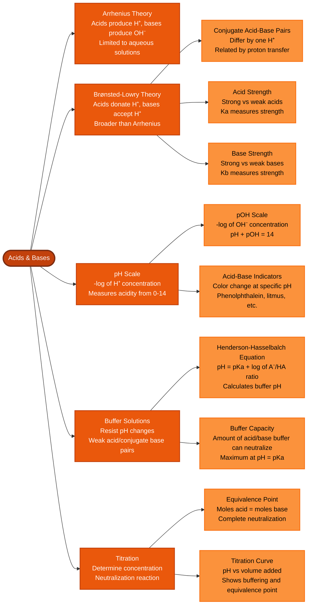

```mermaid
flowchart LR
    Start([Acids & Bases]):::orange
    Start --> ArrheniusTheory[Arrhenius Theory<br/>Acids produce H⁺, bases produce OH⁻<br/>Limited to aqueous solutions]:::lightorange
    Start --> BronstedLowry[Brønsted-Lowry Theory<br/>Acids donate H⁺, bases accept H⁺<br/>Broader than Arrhenius]:::lightorange
    Start --> pH[pH Scale<br/>-log of H⁺ concentration<br/>Measures acidity from 0-14]:::lightorange
    Start --> BufferSolutions[Buffer Solutions<br/>Resist pH changes<br/>Weak acid/conjugate base pairs]:::lightorange
    Start --> Titration[Titration<br/>Determine concentration<br/>Neutralization reaction]:::lightorange
    
    BronstedLowry --> ConjugatePairs[Conjugate Acid-Base Pairs<br/>Differ by one H⁺<br/>Related by proton transfer]:::paleorange
    BronstedLowry --> AcidStrength[Acid Strength<br/>Strong vs weak acids<br/>Ka measures strength]:::paleorange
    BronstedLowry --> BaseStrength[Base Strength<br/>Strong vs weak bases<br/>Kb measures strength]:::paleorange
    
    pH --> pOH[pOH Scale<br/>-log of OH⁻ concentration<br/>pH + pOH = 14]:::paleorange
    pH --> Indicators[Acid-Base Indicators<br/>Color change at specific pH<br/>Phenolphthalein, litmus, etc.]:::paleorange
    
    BufferSolutions --> HendersonHasselbalch[Henderson-Hasselbalch Equation<br/>pH = pKa + log of A⁻/HA ratio<br/>Calculates buffer pH]:::paleorange
    BufferSolutions --> BufferCapacity[Buffer Capacity<br/>Amount of acid/base buffer can neutralize<br/>Maximum at pH = pKa]:::paleorange
    
    Titration --> EquivalencePoint[Equivalence Point<br/>Moles acid = moles base<br/>Complete neutralization]:::paleorange
    Titration --> TitrationCurve[Titration Curve<br/>pH vs volume added<br/>Shows buffering and equivalence point]:::paleorange
    
    classDef orange fill:#c2410c,stroke:#7c2d12,stroke-width:3px,color:#fff
    classDef lightorange fill:#ea580c,stroke:#c2410c,stroke-width:2px,color:#fff
    classDef paleorange fill:#fb923c,stroke:#f97316,stroke-width:2px,color:#000
    classDef peach fill:#fdba74,stroke:#fb923c,stroke-width:1px,color:#000
```