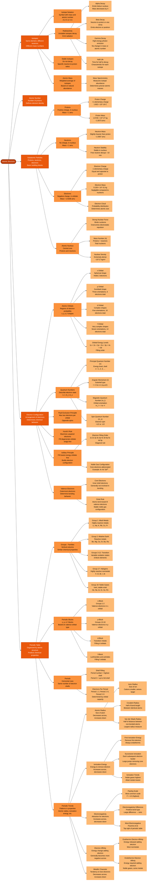

```mermaid
flowchart LR
    Start([Atomic Structure]):::orange
    Start --> SubatomicParticles["Subatomic Particles<br/>Protons, neutrons, electrons<br/>Basic building blocks"]:::lightorange
    Start --> AtomicNumber["Atomic Number<br/>Number of protons<br/>Defines element identity"]:::lightorange
    Start --> Isotopes["Isotopes<br/>Same element, different neutrons<br/>Different mass numbers"]:::lightorange
    
    Isotopes --> IsotopeNotation["Isotope Notation<br/>Symbol with mass and atomic number<br/>A-Z-X or X-A"]:::paleorange
    Isotopes --> Radioactivity["Radioactivity<br/>Unstable isotopes decay<br/>Emit radiation"]:::paleorange
    Isotopes --> StableIsotopes["Stable Isotopes<br/>Do not decay<br/>Specific neutron-to-proton ratios"]:::paleorange
    Isotopes --> AtomicMass["Atomic Mass<br/>Weighted average of isotopes<br/>Based on natural abundance"]:::paleorange
    
    Radioactivity --> AlphaDecay["Alpha Decay<br/>Emits helium nucleus<br/>Mass decreases by 4"]:::peach
    Radioactivity --> BetaDecay["Beta Decay<br/>Neutron to proton or vice versa<br/>Emits electron or positron"]:::peach
    Radioactivity --> GammaDecay["Gamma Decay<br/>High-energy photon emission<br/>No change in mass or atomic number"]:::peach
    Radioactivity --> HalfLife["Half-Life<br/>Time for half to decay<br/>Characteristic for each isotope"]:::peach
    
    AtomicMass --> MassSpectrometry["Mass Spectrometry<br/>Measures isotope abundance<br/>Determines precise atomic masses"]:::peach
    Start --> ElectronConfig["Electron Configuration<br/>Arrangement of electrons<br/>Determines chemical behavior"]:::lightorange
    Start --> PeriodicTable["Periodic Table<br/>Organized by atomic structure<br/>Predicts chemical properties"]:::lightorange
    
    SubatomicParticles --> Protons["Protons<br/>Positive charge, in nucleus<br/>Mass ≈ 1 amu"]:::paleorange
    SubatomicParticles --> Neutrons["Neutrons<br/>No charge, in nucleus<br/>Mass ≈ 1 amu"]:::paleorange
    SubatomicParticles --> Electrons["Electrons<br/>Negative charge, in orbitals<br/>Mass ≈ 1/1836 amu"]:::paleorange
    SubatomicParticles --> Nucleus["Atomic Nucleus<br/>Central core<br/>Protons and neutrons"]:::paleorange
    
    Protons --> ProtonCharge["Proton Charge<br/>+1 elementary charge<br/>1.602 × 10^-19 C"]:::peach
    Protons --> ProtonMass["Proton Mass<br/>1.6726 × 10^-27 kg<br/>~1.0073 amu"]:::peach
    
    Neutrons --> NeutronMass["Neutron Mass<br/>Slightly heavier than proton<br/>~1.0087 amu"]:::peach
    Neutrons --> NeutronStability["Neutron Stability<br/>Stable in nucleus<br/>Free neutron decays ~10 min"]:::peach
    
    Electrons --> ElectronCharge["Electron Charge<br/>-1 elementary charge<br/>Equal and opposite to proton"]:::peach
    Electrons --> ElectronMass["Electron Mass<br/>9.109 × 10^-31 kg<br/>Negligible compared to nucleons"]:::peach
    Electrons --> ElectronCloud["Electron Cloud<br/>Probability distribution<br/>Determines atomic size"]:::peach
    
    Nucleus --> NuclearForce["Strong Nuclear Force<br/>Binds nucleons<br/>Overcomes electrostatic repulsion"]:::peach
    Nucleus --> MassNumber["Mass Number (A)<br/>Protons + neutrons<br/>Total nucleons"]:::peach
    Nucleus --> NuclearDensity["Nuclear Density<br/>Extremely dense<br/>~10^17 kg/m³"]:::peach
    
    ElectronConfig --> Orbitals["Atomic Orbitals<br/>Regions of electron probability<br/>s, p, d, f shapes"]:::paleorange
    ElectronConfig --> AufbauPrinciple["Aufbau Principle<br/>Fill lowest energy orbitals first<br/>Builds electron configuration"]:::paleorange
    ElectronConfig --> PauliExclusion["Pauli Exclusion Principle<br/>Max two electrons per orbital<br/>Opposite spins"]:::paleorange
    ElectronConfig --> HundsRule["Hund's Rule<br/>Maximize unpaired electrons<br/>Fill degenerate orbitals singly first"]:::paleorange
    ElectronConfig --> ValenceElectrons["Valence Electrons<br/>Outermost electrons<br/>Determine bonding behavior"]:::paleorange
    ElectronConfig --> QuantumNumbers["Quantum Numbers<br/>Describe electron state<br/>n, l, m_l, m_s"]:::paleorange
    
    Orbitals --> SOrbital["s Orbital<br/>Spherical shape<br/>Holds 2 electrons"]:::peach
    Orbitals --> POrbital["p Orbital<br/>Dumbbell shape<br/>Three orientations, 6 electrons total"]:::peach
    Orbitals --> DOrbital["d Orbital<br/>Complex shapes<br/>Five orientations, 10 electrons total"]:::peach
    Orbitals --> FOrbital["f Orbital<br/>Very complex shapes<br/>Seven orientations, 14 electrons total"]:::peach
    Orbitals --> OrbitalEnergy["Orbital Energy Levels<br/>1s < 2s < 2p < 3s < 3p < 4s < 3d<br/>Filling order"]:::peach
    
    QuantumNumbers --> PrincipalQuantum["Principal Quantum Number (n)<br/>Energy level, shell<br/>n = 1, 2, 3, ..."]:::peach
    QuantumNumbers --> AngularQuantum["Angular Momentum (l)<br/>Subshell type<br/>l = 0 to n-1 (s,p,d,f)"]:::peach
    QuantumNumbers --> MagneticQuantum["Magnetic Quantum Number (m_l)<br/>Orbital orientation<br/>m_l = -l to +l"]:::peach
    QuantumNumbers --> SpinQuantum["Spin Quantum Number (m_s)<br/>Electron spin<br/>+1/2 or -1/2"]:::peach
    
    AufbauPrinciple --> ElectronFilling["Electron Filling Order<br/>1s 2s 2p 3s 3p 4s 3d 4p 5s 4d 5p<br/>Diagonal rule"]:::peach
    AufbauPrinciple --> NobleGasConfig["Noble Gas Configuration<br/>Core electrons abbreviated<br/>Example: Ar 4s² 3d¹⁰"]:::peach
    
    ValenceElectrons --> CoreElectrons["Core Electrons<br/>Inner shell electrons<br/>Generally not involved in bonding"]:::peach
    ValenceElectrons --> OctetRule["Octet Rule<br/>Atoms tend toward 8 valence electrons<br/>Stable noble gas configuration"]:::peach
    
    PeriodicTable --> Groups["Groups - Families<br/>Vertical columns<br/>Similar chemical properties"]:::paleorange
    PeriodicTable --> Periods["Periods<br/>Horizontal rows<br/>Same number of electron shells"]:::paleorange
    PeriodicTable --> PeriodicTrends["Periodic Trends<br/>Patterns in properties<br/>Atomic radius, ionization energy, etc."]:::paleorange
    PeriodicTable --> PeriodicBlocks["Periodic Blocks<br/>s, p, d, f blocks<br/>Based on valence orbital type"]:::paleorange
    
    Groups --> AlkaliMetals["Group 1: Alkali Metals<br/>Highly reactive metals<br/>Li, Na, K, Rb, Cs, Fr"]:::peach
    Groups --> AlkalineEarth["Group 2: Alkaline Earth<br/>Reactive metals<br/>Be, Mg, Ca, Sr, Ba, Ra"]:::peach
    Groups --> TransitionMetals["Groups 3-12: Transition<br/>Variable oxidation states<br/>d-block elements"]:::peach
    Groups --> Halogens["Group 17: Halogens<br/>Highly reactive nonmetals<br/>F, Cl, Br, I, At"]:::peach
    Groups --> NobleGases["Group 18: Noble Gases<br/>Inert, stable octet<br/>He, Ne, Ar, Kr, Xe, Rn"]:::peach
    
    PeriodicBlocks --> SBlock["s-Block<br/>Groups 1-2<br/>Valence electrons in s orbital"]:::peach
    PeriodicBlocks --> PBlock["p-Block<br/>Groups 13-18<br/>Valence electrons in p orbital"]:::peach
    PeriodicBlocks --> DBlock["d-Block<br/>Transition metals<br/>Filling d orbitals"]:::peach
    PeriodicBlocks --> FBlock["f-Block<br/>Lanthanides and actinides<br/>Filling f orbitals"]:::peach
    
    Periods --> ShellFilling["Shell Filling<br/>Period number = highest shell<br/>Period 3 = up to 3rd shell"]:::peach
    Periods --> ElectronsPerPeriod["Electrons Per Period<br/>Period 1: 2, Period 2: 8, Period 3: 8<br/>Determined by orbital capacity"]:::peach
    
    PeriodicTrends --> AtomicRadius["Atomic Radius<br/>Size of atom<br/>Decreases across, increases down"]:::peach
    PeriodicTrends --> IonizationEnergy["Ionization Energy<br/>Energy to remove electron<br/>Increases across, decreases down"]:::peach
    PeriodicTrends --> Electronegativity["Electronegativity<br/>Attraction for electrons<br/>Increases across, decreases down"]:::peach
    PeriodicTrends --> ElectronAffinity["Electron Affinity<br/>Energy change adding electron<br/>Generally becomes more negative across"]:::peach
    PeriodicTrends --> MetallicCharacter["Metallic Character<br/>Tendency to lose electrons<br/>Decreases across, increases down"]:::peach
    
    AtomicRadius --> IonicRadius["Ionic Radius<br/>Size of ion<br/>Cations smaller, anions larger"]:::peach
    AtomicRadius --> CovalentRadius["Covalent Radius<br/>Half of bond length<br/>Between identical atoms"]:::peach
    AtomicRadius --> VanDerWaalsRadius["Van der Waals Radius<br/>Half of distance between non-bonded atoms<br/>Largest radius measure"]:::peach
    
    IonizationEnergy --> FirstIonization["First Ionization Energy<br/>Remove first electron<br/>Always endothermic"]:::peach
    IonizationEnergy --> SuccessiveIonization["Successive Ionization<br/>Each subsequent electron harder<br/>Large jumps removing core electrons"]:::peach
    IonizationEnergy --> IonizationTrends["Ionization Trends<br/>Noble gases highest<br/>Alkali metals lowest"]:::peach
    
    Electronegativity --> PaulingScale["Pauling Scale<br/>Most common scale<br/>F = 4.0 (highest)"]:::peach
    Electronegativity --> ElectronegativityDifference["Electronegativity Difference<br/>Predicts bond type<br/>Large difference → ionic"]:::peach
    Electronegativity --> MostElectronegative["Most Electronegative<br/>Fluorine (4.0)<br/>Top right of periodic table"]:::peach
    
    ElectronAffinity --> ExothermicEA["Exothermic Electron Affinity<br/>Energy released adding electron<br/>Most nonmetals"]:::peach
    ElectronAffinity --> EndothermicEA["Endothermic Electron Affinity<br/>Energy required adding electron<br/>Noble gases, some metals"]:::peach
    
    classDef orange fill:#c2410c,stroke:#7c2d12,stroke-width:3px,color:#fff
    classDef lightorange fill:#ea580c,stroke:#c2410c,stroke-width:2px,color:#fff
    classDef paleorange fill:#fb923c,stroke:#f97316,stroke-width:2px,color:#000
    classDef peach fill:#fdba74,stroke:#fb923c,stroke-width:1px,color:#000
```