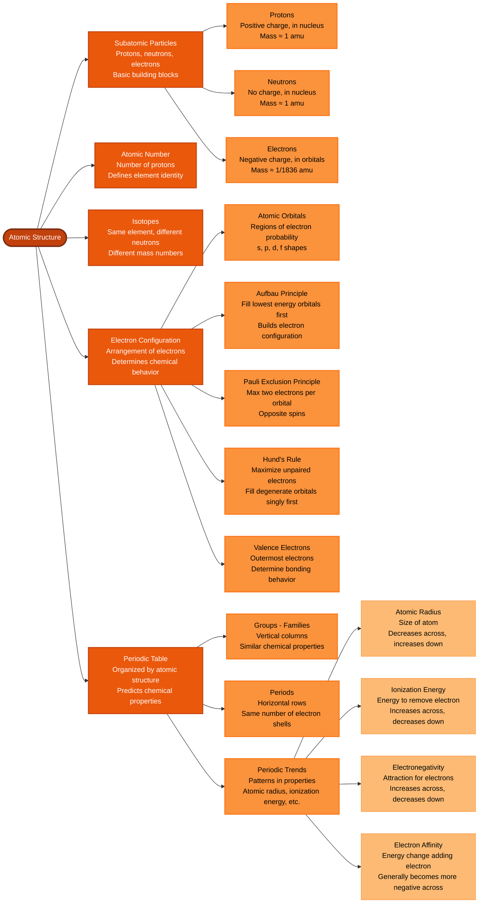

```mermaid
flowchart LR
    Start([Atomic Structure]):::orange
    Start --> SubatomicParticles[Subatomic Particles<br/>Protons, neutrons, electrons<br/>Basic building blocks]:::lightorange
    Start --> AtomicNumber[Atomic Number<br/>Number of protons<br/>Defines element identity]:::lightorange
    Start --> Isotopes[Isotopes<br/>Same element, different neutrons<br/>Different mass numbers]:::lightorange
    Start --> ElectronConfig[Electron Configuration<br/>Arrangement of electrons<br/>Determines chemical behavior]:::lightorange
    Start --> PeriodicTable[Periodic Table<br/>Organized by atomic structure<br/>Predicts chemical properties]:::lightorange
    
    SubatomicParticles --> Protons[Protons<br/>Positive charge, in nucleus<br/>Mass ≈ 1 amu]:::paleorange
    SubatomicParticles --> Neutrons[Neutrons<br/>No charge, in nucleus<br/>Mass ≈ 1 amu]:::paleorange
    SubatomicParticles --> Electrons[Electrons<br/>Negative charge, in orbitals<br/>Mass ≈ 1/1836 amu]:::paleorange
    
    ElectronConfig --> Orbitals[Atomic Orbitals<br/>Regions of electron probability<br/>s, p, d, f shapes]:::paleorange
    ElectronConfig --> AufbauPrinciple[Aufbau Principle<br/>Fill lowest energy orbitals first<br/>Builds electron configuration]:::paleorange
    ElectronConfig --> PauliExclusion[Pauli Exclusion Principle<br/>Max two electrons per orbital<br/>Opposite spins]:::paleorange
    ElectronConfig --> HundsRule[Hund's Rule<br/>Maximize unpaired electrons<br/>Fill degenerate orbitals singly first]:::paleorange
    ElectronConfig --> ValenceElectrons[Valence Electrons<br/>Outermost electrons<br/>Determine bonding behavior]:::paleorange
    
    PeriodicTable --> Groups[Groups - Families<br/>Vertical columns<br/>Similar chemical properties]:::paleorange
    PeriodicTable --> Periods[Periods<br/>Horizontal rows<br/>Same number of electron shells]:::paleorange
    PeriodicTable --> PeriodicTrends[Periodic Trends<br/>Patterns in properties<br/>Atomic radius, ionization energy, etc.]:::paleorange
    
    PeriodicTrends --> AtomicRadius[Atomic Radius<br/>Size of atom<br/>Decreases across, increases down]:::peach
    PeriodicTrends --> IonizationEnergy[Ionization Energy<br/>Energy to remove electron<br/>Increases across, decreases down]:::peach
    PeriodicTrends --> Electronegativity[Electronegativity<br/>Attraction for electrons<br/>Increases across, decreases down]:::peach
    PeriodicTrends --> ElectronAffinity[Electron Affinity<br/>Energy change adding electron<br/>Generally becomes more negative across]:::peach
    
    classDef orange fill:#c2410c,stroke:#7c2d12,stroke-width:3px,color:#fff
    classDef lightorange fill:#ea580c,stroke:#c2410c,stroke-width:2px,color:#fff
    classDef paleorange fill:#fb923c,stroke:#f97316,stroke-width:2px,color:#000
    classDef peach fill:#fdba74,stroke:#fb923c,stroke-width:1px,color:#000
```