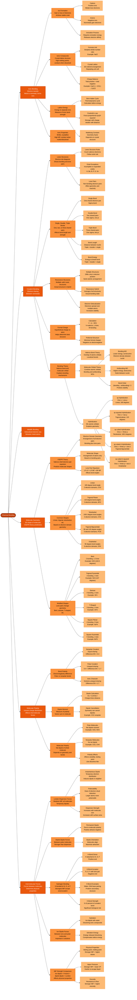

```mermaid
flowchart LR
    Start([Chemical Bonding]):::orange
    Start --> IonicBonding["Ionic Bonding<br/>Electron transfer<br/>Metal to nonmetal, forms ions"]:::lightorange
    Start --> CovalentBonding["Covalent Bonding<br/>Electron sharing<br/>Between nonmetals"]:::lightorange
    Start --> MetallicBonding["Metallic Bonding<br/>Delocalized electron sea<br/>Between metal atoms"]:::lightorange
    Start --> MolecularGeometry["Molecular Geometry<br/>3D shape of molecules<br/>VSEPR theory predictions"]:::lightorange
    Start --> Polarity["Molecular Polarity<br/>Uneven charge distribution<br/>Affects intermolecular forces"]:::lightorange
    Start --> IntermolecularForces["Intermolecular Forces<br/>Forces between molecules<br/>Determine physical properties"]:::lightorange
    
    IonicBonding --> IonFormation["Ion Formation<br/>Gain or loss of electrons<br/>Achieve stable octet"]:::paleorange
    IonicBonding --> IonicCompounds["Ionic Compounds<br/>Crystal lattice structure<br/>High melting points, conduct when dissolved"]:::paleorange
    IonicBonding --> LatticeEnergy["Lattice Energy<br/>Energy to separate ions<br/>Measure of ionic bond strength"]:::paleorange
    IonicBonding --> IonicProperties["Ionic Properties<br/>Brittle, crystalline<br/>High MP, conduct when molten/dissolved"]:::paleorange
    
    IonFormation --> Cations["Cations<br/>Positive ions<br/>Metals lose electrons"]:::peach
    IonFormation --> Anions["Anions<br/>Negative ions<br/>Nonmetals gain electrons"]:::peach
    IonFormation --> IonizationProcess["Ionization Process<br/>Requires ionization energy<br/>Releases electron affinity"]:::peach
    
    IonicCompounds --> FormulaUnit["Formula Unit<br/>Simplest whole-number ratio<br/>Example: NaCl"]:::peach
    IonicCompounds --> CrystalLattice["Crystal Lattice<br/>3D ordered arrangement<br/>Repeating unit cell"]:::peach
    IonicCompounds --> ChargeBalance["Charge Balance<br/>Total positive = total negative<br/>Example: Ca(2+) + 2Cl(-) → CaCl2"]:::peach
    
    LatticeEnergy --> BornHaberCycle["Born-Haber Cycle<br/>Thermodynamic cycle<br/>Calculates lattice energy"]:::peach
    LatticeEnergy --> CoulombsLaw["Coulomb's Law<br/>Force proportional q1q2/r squared<br/>Stronger with charge, weaker with distance"]:::peach
    LatticeEnergy --> MadelungConstant["Madelung Constant<br/>Geometry factor<br/>Depends on crystal structure"]:::peach
    
    CovalentBonding --> LewisStructures["Lewis Structures<br/>Electron dot diagrams<br/>Shows bonding and lone pairs"]:::paleorange
    CovalentBonding --> SingleDouble["Single, Double, Triple Bonds<br/>One, two, or three shared pairs<br/>Affects bond length and strength"]:::paleorange
    CovalentBonding --> Resonance["Resonance Structures<br/>Multiple valid Lewis structures<br/>Actual structure is hybrid"]:::paleorange
    CovalentBonding --> FormalCharge["Formal Charge<br/>Hypothetical charge on atom<br/>Helps determine best structure"]:::paleorange
    CovalentBonding --> BondingTheory["Bonding Theory<br/>Valence bond and molecular orbital<br/>Explains bonding mechanisms"]:::paleorange
    
    LewisStructures --> LewisRules["Lewis Structure Rules<br/>Count valence electrons<br/>Follow octet rule"]:::peach
    LewisStructures --> OctetExceptions["Octet Exceptions<br/>Incomplete or expanded octets<br/>H, Be, B, P, S, Xe"]:::peach
    LewisStructures --> LonePairs["Lone Pairs<br/>Non-bonding electron pairs<br/>Affect geometry and reactivity"]:::peach
    
    SingleDouble --> SingleBond["Single Bond<br/>One shared electron pair<br/>Sigma bond"]:::peach
    SingleDouble --> DoubleBond["Double Bond<br/>Two shared pairs<br/>One sigma, one pi"]:::peach
    SingleDouble --> TripleBond["Triple Bond<br/>Three shared pairs<br/>One sigma, two pi"]:::peach
    SingleDouble --> BondLength["Bond Length<br/>Distance between nuclei<br/>Triple < double < single"]:::peach
    SingleDouble --> BondEnergy["Bond Energy<br/>Energy to break bond<br/>Triple > double > single"]:::peach
    
    Resonance --> ResonanceStructures["Multiple Structures<br/>Differ only in electron position<br/>Same atomic arrangement"]:::peach
    Resonance --> ResonanceHybrid["Resonance Hybrid<br/>Average of all structures<br/>Actual bonding state"]:::peach
    Resonance --> Delocalization["Electron Delocalization<br/>Electrons spread over multiple atoms<br/>Increases stability"]:::peach
    
    FormalCharge --> FormalChargeCalc["Calculation<br/>V - (L + B/2)<br/>V=valence, L=lone, B=bonding"]:::peach
    FormalCharge --> PreferredStructure["Preferred Structure<br/>Minimize formal charges<br/>Negative on electronegative"]:::peach
    
    BondingTheory --> ValenceBondTheory["Valence Bond Theory<br/>Overlap of atomic orbitals<br/>Localized bonds"]:::peach
    BondingTheory --> MolecularOrbitalTheory["Molecular Orbital Theory<br/>Combine atomic orbitals<br/>Bonding and antibonding MOs"]:::peach
    BondingTheory --> Hybridization["Hybridization<br/>Mix atomic orbitals<br/>Explains geometry"]:::peach
    
    Hybridization --> sp["sp Hybridization<br/>One s + one p<br/>Linear, 180 degrees"]:::peach
    Hybridization --> sp2["sp squared Hybridization<br/>One s + two p<br/>Trigonal planar, 120 degrees"]:::peach
    Hybridization --> sp3["sp cubed Hybridization<br/>One s + three p<br/>Tetrahedral, 109.5 degrees"]:::peach
    Hybridization --> sp3d["sp cubed d Hybridization<br/>One s + three p + one d<br/>Trigonal bipyramidal"]:::peach
    Hybridization --> sp3d2["sp cubed d squared Hybridization<br/>One s + three p + two d<br/>Octahedral"]:::peach
    
    MolecularOrbitalTheory --> BondingMO["Bonding MO<br/>Lower energy, constructive<br/>Electron density between nuclei"]:::peach
    MolecularOrbitalTheory --> AntibondingMO["Antibonding MO<br/>Higher energy, destructive<br/>Node between nuclei"]:::peach
    MolecularOrbitalTheory --> BondOrder["Bond Order<br/>(bonding - antibonding) / 2<br/>Predicts stability"]:::peach
    
    MolecularGeometry --> VSEPR["VSEPR Theory<br/>Valence shell electron pair repulsion<br/>Predicts molecular shapes"]:::paleorange
    MolecularGeometry --> Shapes["Common Shapes<br/>Linear, trigonal, tetrahedral, etc.<br/>Based on electron domain geometry"]:::paleorange
    MolecularGeometry --> ModifiedShapes["Modified Shapes<br/>Lone pairs change geometry<br/>Bent, seesaw, T-shaped, etc."]:::paleorange
    
    VSEPR --> ElectronDomain["Electron Domain Geometry<br/>Arrangement of all electron pairs<br/>Bonding plus lone pairs"]:::peach
    VSEPR --> MolecularShape["Molecular Shape<br/>Arrangement of atoms only<br/>Based on bonding pairs"]:::peach
    VSEPR --> LonePairRepulsion["Lone Pair Repulsion<br/>LP-LP > LP-BP > BP-BP<br/>Affects bond angles"]:::peach
    
    Shapes --> Linear["Linear<br/>180 degree bond angle<br/>2 electron domains, CO2"]:::peach
    Shapes --> TrigonalPlanar["Trigonal Planar<br/>120 degree bond angles<br/>3 electron domains, BF3"]:::peach
    Shapes --> Tetrahedral["Tetrahedral<br/>109.5 degree bond angles<br/>4 electron domains, CH4"]:::peach
    Shapes --> TrigonalBipyramidal["Trigonal Bipyramidal<br/>90 and 120 degree angles<br/>5 electron domains, PCl5"]:::peach
    Shapes --> Octahedral["Octahedral<br/>90 degree bond angles<br/>6 electron domains, SF6"]:::peach
    
    ModifiedShapes --> Bent["Bent<br/>2 bonding, 1-2 lone<br/>Example: H2O (104.5 degrees)"]:::peach
    ModifiedShapes --> TrigonalPyramidal["Trigonal Pyramidal<br/>3 bonding, 1 lone<br/>Example: NH3 (107 degrees)"]:::peach
    ModifiedShapes --> Seesaw["Seesaw<br/>4 bonding, 1 lone<br/>Example: SF4"]:::peach
    ModifiedShapes --> TShaped["T-Shaped<br/>3 bonding, 2 lone<br/>Example: ClF3"]:::peach
    ModifiedShapes --> SquarePlanar["Square Planar<br/>4 bonding, 2 lone<br/>Example: XeF4"]:::peach
    ModifiedShapes --> SquarePyramidal["Square Pyramidal<br/>5 bonding, 1 lone<br/>Example: BrF5"]:::peach
    
    Polarity --> BondPolarity["Bond Polarity<br/>Electronegativity difference<br/>Polar vs nonpolar bonds"]:::paleorange
    Polarity --> DipoleMoment["Dipole Moment<br/>Measure of polarity<br/>Vector sum in molecule"]:::paleorange
    Polarity --> MolecularPolarity["Molecular Polarity<br/>Net dipole of whole molecule<br/>Depends on geometry and bonds"]:::paleorange
    
    BondPolarity --> NonpolarCovalent["Nonpolar Covalent<br/>Equal sharing<br/>Difference EN < 0.4"]:::peach
    BondPolarity --> PolarCovalent["Polar Covalent<br/>Unequal sharing<br/>0.4 < Difference EN < 1.7"]:::peach
    BondPolarity --> IonicCharacter["Ionic Character<br/>Extreme unequal sharing<br/>Difference EN > 1.7"]:::peach
    
    DipoleMoment --> DipoleCalculation["Dipole Calculation<br/>mu = Q times r<br/>Charge times distance"]:::peach
    DipoleMoment --> DipoleCancellation["Dipole Cancellation<br/>Symmetry can cancel dipoles<br/>Example: CO2 nonpolar"]:::peach
    
    MolecularPolarity --> PolarMolecules["Polar Molecules<br/>Net dipole moment<br/>Example: H2O, NH3"]:::peach
    MolecularPolarity --> NonpolarMolecules["Nonpolar Molecules<br/>No net dipole<br/>Example: CO2, CH4"]:::peach
    MolecularPolarity --> PolarityEffects["Polarity Effects<br/>Affects solubility, boiling point<br/>Like dissolves like"]:::peach
    
    IntermolecularForces --> LondonDispersion["London Dispersion Forces<br/>Weakest IMF, all molecules<br/>Temporary dipoles"]:::paleorange
    IntermolecularForces --> DipoleDipole["Dipole-Dipole Forces<br/>Between polar molecules<br/>Stronger than dispersion"]:::paleorange
    IntermolecularForces --> HydrogenBonding["Hydrogen Bonding<br/>H bonded to N, O, or F<br/>Strongest IMF except ionic/covalent"]:::paleorange
    IntermolecularForces --> IonDipole["Ion-Dipole Forces<br/>Between ions and polar molecules<br/>Important in solutions"]:::paleorange
    IntermolecularForces --> IMFStrength["IMF Strength Comparison<br/>Ion-dipole > H-bond > dipole-dipole > London<br/>Affects physical properties"]:::paleorange
    
    LondonDispersion --> InstantaneousDipole["Instantaneous Dipole<br/>Temporary electron distribution<br/>Induces dipole in neighbor"]:::peach
    LondonDispersion --> Polarizability["Polarizability<br/>Ease of electron cloud distortion<br/>Larger atoms more polarizable"]:::peach
    LondonDispersion --> DispersionStrength["Dispersion Strength<br/>Increases with molecular size<br/>Increases with surface area"]:::peach
    
    DipoleDipole --> PermanentDipole["Permanent Dipole<br/>Due to molecular polarity<br/>Positive attracts negative"]:::peach
    DipoleDipole --> DipoleOrientation["Dipole Orientation<br/>Molecules align<br/>Maximize attraction"]:::peach
    
    HydrogenBonding --> HBondDonor["H-Bond Donor<br/>H attached to N, O, F<br/>Positive end"]:::peach
    HydrogenBonding --> HBondAcceptor["H-Bond Acceptor<br/>N, O, F with lone pair<br/>Negative end"]:::peach
    HydrogenBonding --> HBondExamples["H-Bond Examples<br/>Water, DNA base pairing<br/>Proteins secondary structure"]:::peach
    HydrogenBonding --> HBondStrength["H-Bond Strength<br/>5-10 percent of covalent bond<br/>Significant biological role"]:::peach
    
    IonDipole --> Hydration["Hydration<br/>Ion-dipole with water<br/>Dissolving ionic compounds"]:::peach
    IonDipole --> SolvationEnergy["Solvation Energy<br/>Energy released dissolving<br/>Compensates lattice energy"]:::peach
    
    IMFStrength --> PhysicalProperties["Physical Properties<br/>Boiling point, melting point<br/>Stronger IMF = higher values"]:::peach
    IMFStrength --> VaporPressure["Vapor Pressure<br/>Stronger IMF = lower VP<br/>Harder to escape liquid"]:::peach
    IMFStrength --> Viscosity["Viscosity<br/>Resistance to flow<br/>Stronger IMF = higher viscosity"]:::peach
    
    classDef orange fill:#c2410c,stroke:#7c2d12,stroke-width:3px,color:#fff
    classDef lightorange fill:#ea580c,stroke:#c2410c,stroke-width:2px,color:#fff
    classDef paleorange fill:#fb923c,stroke:#f97316,stroke-width:2px,color:#000
    classDef peach fill:#fdba74,stroke:#fb923c,stroke-width:1px,color:#000
```