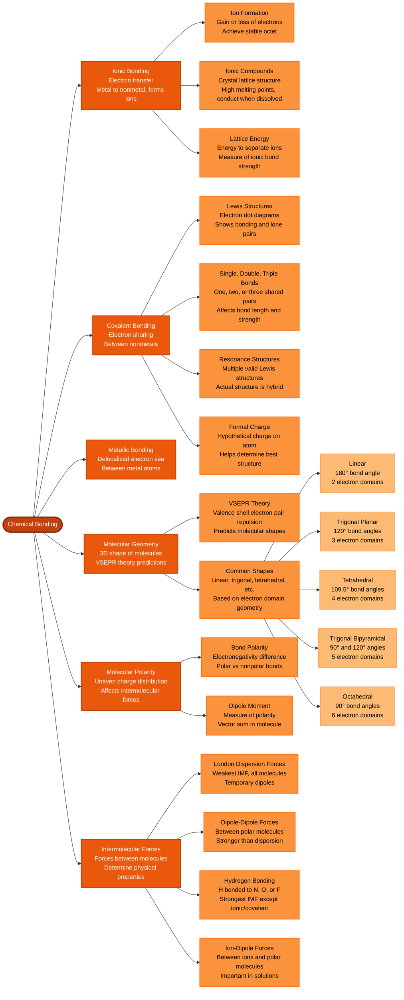

```mermaid
flowchart LR
    Start([Chemical Bonding]):::orange
    Start --> IonicBonding[Ionic Bonding<br/>Electron transfer<br/>Metal to nonmetal, forms ions]:::lightorange
    Start --> CovalentBonding[Covalent Bonding<br/>Electron sharing<br/>Between nonmetals]:::lightorange
    Start --> MetallicBonding[Metallic Bonding<br/>Delocalized electron sea<br/>Between metal atoms]:::lightorange
    Start --> MolecularGeometry[Molecular Geometry<br/>3D shape of molecules<br/>VSEPR theory predictions]:::lightorange
    Start --> Polarity[Molecular Polarity<br/>Uneven charge distribution<br/>Affects intermolecular forces]:::lightorange
    Start --> IntermolecularForces[Intermolecular Forces<br/>Forces between molecules<br/>Determine physical properties]:::lightorange
    
    IonicBonding --> IonFormation[Ion Formation<br/>Gain or loss of electrons<br/>Achieve stable octet]:::paleorange
    IonicBonding --> IonicCompounds[Ionic Compounds<br/>Crystal lattice structure<br/>High melting points, conduct when dissolved]:::paleorange
    IonicBonding --> LatticeEnergy[Lattice Energy<br/>Energy to separate ions<br/>Measure of ionic bond strength]:::paleorange
    
    CovalentBonding --> LewisStructures[Lewis Structures<br/>Electron dot diagrams<br/>Shows bonding and lone pairs]:::paleorange
    CovalentBonding --> SingleDouble[Single, Double, Triple Bonds<br/>One, two, or three shared pairs<br/>Affects bond length and strength]:::paleorange
    CovalentBonding --> Resonance[Resonance Structures<br/>Multiple valid Lewis structures<br/>Actual structure is hybrid]:::paleorange
    CovalentBonding --> FormalCharge[Formal Charge<br/>Hypothetical charge on atom<br/>Helps determine best structure]:::paleorange
    
    MolecularGeometry --> VSEPR[VSEPR Theory<br/>Valence shell electron pair repulsion<br/>Predicts molecular shapes]:::paleorange
    MolecularGeometry --> Shapes[Common Shapes<br/>Linear, trigonal, tetrahedral, etc.<br/>Based on electron domain geometry]:::paleorange
    
    Shapes --> Linear[Linear<br/>180° bond angle<br/>2 electron domains]:::peach
    Shapes --> TrigonalPlanar[Trigonal Planar<br/>120° bond angles<br/>3 electron domains]:::peach
    Shapes --> Tetrahedral[Tetrahedral<br/>109.5° bond angles<br/>4 electron domains]:::peach
    Shapes --> TrigonalBipyramidal[Trigonal Bipyramidal<br/>90° and 120° angles<br/>5 electron domains]:::peach
    Shapes --> Octahedral[Octahedral<br/>90° bond angles<br/>6 electron domains]:::peach
    
    Polarity --> BondPolarity[Bond Polarity<br/>Electronegativity difference<br/>Polar vs nonpolar bonds]:::paleorange
    Polarity --> DipoleMoment[Dipole Moment<br/>Measure of polarity<br/>Vector sum in molecule]:::paleorange
    
    IntermolecularForces --> LondonDispersion[London Dispersion Forces<br/>Weakest IMF, all molecules<br/>Temporary dipoles]:::paleorange
    IntermolecularForces --> DipoleDipole[Dipole-Dipole Forces<br/>Between polar molecules<br/>Stronger than dispersion]:::paleorange
    IntermolecularForces --> HydrogenBonding[Hydrogen Bonding<br/>H bonded to N, O, or F<br/>Strongest IMF except ionic/covalent]:::paleorange
    IntermolecularForces --> IonDipole[Ion-Dipole Forces<br/>Between ions and polar molecules<br/>Important in solutions]:::paleorange
    
    classDef orange fill:#c2410c,stroke:#7c2d12,stroke-width:3px,color:#fff
    classDef lightorange fill:#ea580c,stroke:#c2410c,stroke-width:2px,color:#fff
    classDef paleorange fill:#fb923c,stroke:#f97316,stroke-width:2px,color:#000
    classDef peach fill:#fdba74,stroke:#fb923c,stroke-width:1px,color:#000
```