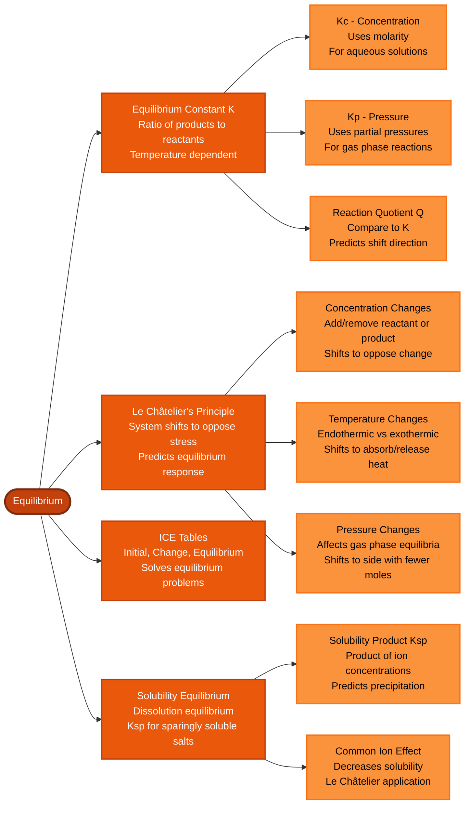

```mermaid
flowchart LR
    Start([Equilibrium]):::orange
    Start --> EquilibriumConstant[Equilibrium Constant K<br/>Ratio of products to reactants<br/>Temperature dependent]:::lightorange
    Start --> LeChatelierPrinciple[Le Châtelier's Principle<br/>System shifts to oppose stress<br/>Predicts equilibrium response]:::lightorange
    Start --> ICE[ICE Tables<br/>Initial, Change, Equilibrium<br/>Solves equilibrium problems]:::lightorange
    Start --> SolubilityEquilibrium[Solubility Equilibrium<br/>Dissolution equilibrium<br/>Ksp for sparingly soluble salts]:::lightorange
    
    EquilibriumConstant --> Kc[Kc - Concentration<br/>Uses molarity<br/>For aqueous solutions]:::paleorange
    EquilibriumConstant --> Kp[Kp - Pressure<br/>Uses partial pressures<br/>For gas phase reactions]:::paleorange
    EquilibriumConstant --> QvsK[Reaction Quotient Q<br/>Compare to K<br/>Predicts shift direction]:::paleorange
    
    LeChatelierPrinciple --> ConcChange[Concentration Changes<br/>Add/remove reactant or product<br/>Shifts to oppose change]:::paleorange
    LeChatelierPrinciple --> TempChange[Temperature Changes<br/>Endothermic vs exothermic<br/>Shifts to absorb/release heat]:::paleorange
    LeChatelierPrinciple --> PressureChange[Pressure Changes<br/>Affects gas phase equilibria<br/>Shifts to side with fewer moles]:::paleorange
    
    SolubilityEquilibrium --> Ksp[Solubility Product Ksp<br/>Product of ion concentrations<br/>Predicts precipitation]:::paleorange
    SolubilityEquilibrium --> CommonIonEffect[Common Ion Effect<br/>Decreases solubility<br/>Le Châtelier application]:::paleorange
    
    classDef orange fill:#c2410c,stroke:#7c2d12,stroke-width:3px,color:#fff
    classDef lightorange fill:#ea580c,stroke:#c2410c,stroke-width:2px,color:#fff
    classDef paleorange fill:#fb923c,stroke:#f97316,stroke-width:2px,color:#000
    classDef peach fill:#fdba74,stroke:#fb923c,stroke-width:1px,color:#000
```