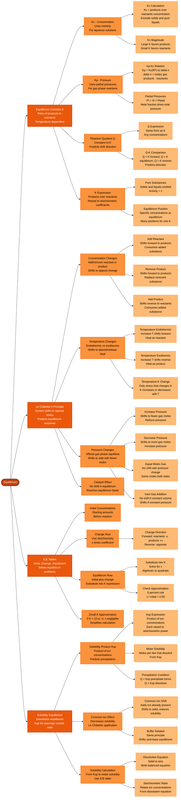

```mermaid
flowchart LR
    Start([Equilibrium]):::orange
    Start --> EquilibriumConstant["Equilibrium Constant K<br/>Ratio of products to reactants<br/>Temperature dependent"]:::lightorange
    Start --> LeChatelierPrinciple["Le Châtelier's Principle<br/>System shifts to oppose stress<br/>Predicts equilibrium response"]:::lightorange
    Start --> ICE["ICE Tables<br/>Initial, Change, Equilibrium<br/>Solves equilibrium problems"]:::lightorange
    Start --> SolubilityEquilibrium["Solubility Equilibrium<br/>Dissolution equilibrium<br/>Ksp for sparingly soluble salts"]:::lightorange
    
    ICE --> InitialConcentrations["Initial Concentrations<br/>Starting amounts<br/>Before reaction"]:::paleorange
    ICE --> ChangeRow["Change Row<br/>Use stoichiometry<br/>x times coefficient"]:::paleorange
    ICE --> EquilibriumRow["Equilibrium Row<br/>Initial plus change<br/>Substitute into K expression"]:::paleorange
    ICE --> SmallKApproximation["Small K Approximation<br/>If K < 10 to -4, x negligible<br/>Simplifies calculation"]:::paleorange
    
    ChangeRow --> ChangeDirection["Change Direction<br/>Forward: reactants -x, products +x<br/>Reverse: opposite"]:::peach
    
    EquilibriumRow --> SubstituteK["Substitute into K<br/>Solve for x<br/>Algebraic or quadratic"]:::peach
    EquilibriumRow --> CheckApproximation["Check Approximation<br/>5 percent rule<br/>x / initial < 0.05"]:::peach
    
    EquilibriumConstant --> Kc["Kc - Concentration<br/>Uses molarity<br/>For aqueous solutions"]:::paleorange
    EquilibriumConstant --> Kp["Kp - Pressure<br/>Uses partial pressures<br/>For gas phase reactions"]:::paleorange
    EquilibriumConstant --> QvsK["Reaction Quotient Q<br/>Compare to K<br/>Predicts shift direction"]:::paleorange
    EquilibriumConstant --> KExpression["K Expression<br/>Products over reactants<br/>Raised to stoichiometric coefficients"]:::paleorange
    
    Kc --> KcCalculation["Kc Calculation<br/>Kc = products over reactants concentration<br/>Exclude solids and pure liquids"]:::peach
    Kc --> KcMagnitude["Kc Magnitude<br/>Large K favors products<br/>Small K favors reactants"]:::peach
    
    Kp --> KpKcRelation["Kp-Kc Relation<br/>Kp = Kc(RT) to delta n<br/>delta n = moles gas products - reactants"]:::peach
    Kp --> PartialPressures["Partial Pressures<br/>Pi = Xi × Ptotal<br/>Mole fraction times total pressure"]:::peach
    
    QvsK --> QExpression["Q Expression<br/>Same form as K<br/>Any concentrations"]:::peach
    QvsK --> QKComparison["Q-K Comparison<br/>Q < K forward, Q = K equilibrium, Q > K reverse<br/>Predicts direction"]:::peach
    
    KExpression --> PureSubstances["Pure Substances<br/>Solids and liquids omitted<br/>Activity = 1"]:::peach
    KExpression --> EquilibriumPosition["Equilibrium Position<br/>Specific concentrations at equilibrium<br/>Many positions for one K"]:::peach
    
    LeChatelierPrinciple --> ConcChange["Concentration Changes<br/>Add/remove reactant or product<br/>Shifts to oppose change"]:::paleorange
    LeChatelierPrinciple --> TempChange["Temperature Changes<br/>Endothermic vs exothermic<br/>Shifts to absorb/release heat"]:::paleorange
    LeChatelierPrinciple --> PressureChange["Pressure Changes<br/>Affects gas phase equilibria<br/>Shifts to side with fewer moles"]:::paleorange
    LeChatelierPrinciple --> CatalystEffect["Catalyst Effect<br/>No shift in equilibrium<br/>Reaches equilibrium faster"]:::paleorange
    
    ConcChange --> AddReactant["Add Reactant<br/>Shifts forward to products<br/>Consumes added substance"]:::peach
    ConcChange --> RemoveProduct["Remove Product<br/>Shifts forward to products<br/>Replace removed substance"]:::peach
    ConcChange --> AddProduct["Add Product<br/>Shifts reverse to reactants<br/>Consumes added substance"]:::peach
    
    TempChange --> TempEndothermic["Temperature Endothermic<br/>Increase T shifts forward<br/>Heat as reactant"]:::peach
    TempChange --> TempExothermic["Temperature Exothermic<br/>Increase T shifts reverse<br/>Heat as product"]:::peach
    TempChange --> TempKChange["Temperature K Change<br/>Only stress that changes K<br/>K increases or decreases with T"]:::peach
    
    PressureChange --> IncreaseP["Increase Pressure<br/>Shifts to fewer gas moles<br/>Reduce pressure"]:::peach
    PressureChange --> DecreaseP["Decrease Pressure<br/>Shifts to more gas moles<br/>Increase pressure"]:::peach
    PressureChange --> EqualMoles["Equal Moles Gas<br/>No shift with pressure change<br/>Same moles both sides"]:::peach
    PressureChange --> InertGas["Inert Gas Addition<br/>No shift if constant volume<br/>Shifts if constant pressure"]:::peach
    
    SolubilityEquilibrium --> Ksp["Solubility Product Ksp<br/>Product of ion concentrations<br/>Predicts precipitation"]:::paleorange
    SolubilityEquilibrium --> CommonIonEffect["Common Ion Effect<br/>Decreases solubility<br/>Le Châtelier application"]:::paleorange
    SolubilityEquilibrium --> SolubilityCalculation["Solubility Calculation<br/>From Ksp to molar solubility<br/>Use ICE table"]:::paleorange
    
    Ksp --> KspExpression["Ksp Expression<br/>Product of ion concentrations<br/>Each raised to stoichiometric power"]:::peach
    Ksp --> MolarSolubility["Molar Solubility<br/>Moles per liter that dissolve<br/>From Ksp"]:::peach
    Ksp --> PrecipitationCondition["Precipitation Condition<br/>Q > Ksp precipitate forms<br/>Q < Ksp dissolves"]:::peach
    
    CommonIonEffect --> CommonIonShift["Common Ion Shift<br/>Adds ion already present<br/>Shifts to solid, reduces solubility"]:::peach
    CommonIonEffect --> BufferRelated["Buffer Related<br/>Same principle<br/>Shifts acid-base equilibrium"]:::peach
    
    SolubilityCalculation --> DissolutionEquation["Dissolution Equation<br/>Solid to ions<br/>Write balanced equation"]:::peach
    SolubilityCalculation --> StoichiometricRatio["Stoichiometric Ratio<br/>Relate ion concentrations<br/>From dissolution equation"]:::peach
    
    classDef orange fill:#c2410c,stroke:#7c2d12,stroke-width:3px,color:#fff
    classDef lightorange fill:#ea580c,stroke:#c2410c,stroke-width:2px,color:#fff
    classDef paleorange fill:#fb923c,stroke:#f97316,stroke-width:2px,color:#000
    classDef peach fill:#fdba74,stroke:#fb923c,stroke-width:1px,color:#000
```