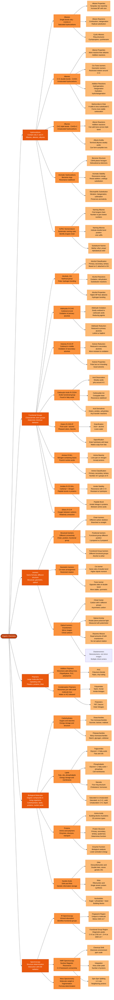

```mermaid
flowchart LR
    Start([Organic Chemistry]):::orange
    Start --> Hydrocarbons["Hydrocarbons<br/>Contain only C and H<br/>Alkanes, alkenes, alkynes"]:::lightorange
    Start --> FunctionalGroups["Functional Groups<br/>Characteristic atom groups<br/>Determine chemical behavior"]:::lightorange
    Start --> Isomers["Isomers<br/>Same formula, different structure<br/>Structural, geometric, optical"]:::lightorange
    Start --> Polymers["Polymers<br/>Large molecules from repeating units<br/>Plastics, proteins, DNA"]:::lightorange
    Start --> BiologicalMolecules["Biological Molecules<br/>Organic compounds in living organisms<br/>Carbohydrates, lipids, proteins, nucleic acids"]:::lightorange
    Start --> Spectroscopy["Spectroscopy<br/>Structure determination<br/>Interaction with EM radiation"]:::lightorange
    
    Polymers --> AdditionPolymers["Addition Polymers<br/>Monomers add without loss<br/>Polyethylene, PVC, polystyrene"]:::paleorange
    Polymers --> CondensationPolymers["Condensation Polymers<br/>Monomers join with small molecule loss<br/>Water or HCl released"]:::paleorange
    Hydrocarbons --> Alkanes["Alkanes<br/>Single bonds only - CnH2n+2<br/>Saturated hydrocarbons"]:::paleorange
    Hydrocarbons --> Alkenes["Alkenes<br/>C=C double bonds - CnH2n<br/>Unsaturated hydrocarbons"]:::paleorange
    Hydrocarbons --> Alkynes["Alkynes<br/>C≡C triple bonds - CnH2n-2<br/>Unsaturated hydrocarbons"]:::paleorange
    Hydrocarbons --> AromaticHC["Aromatic Hydrocarbons<br/>Benzene rings<br/>Resonance stabilized"]:::paleorange
    Hydrocarbons --> Nomenclature["IUPAC Nomenclature<br/>Systematic naming rules<br/>Identify longest chain"]:::paleorange
    
    Alkanes --> AlkaneProperties["Alkane Properties<br/>Nonpolar, low reactivity<br/>Increase BP with size"]:::peach
    Alkanes --> AlkaneReactions["Alkane Reactions<br/>Combustion, halogenation<br/>Radical substitution"]:::peach
    Alkanes --> CyclicAlkanes["Cyclic Alkanes<br/>Ring structures<br/>Cyclopropane, cyclohexane"]:::peach
    
    Alkenes --> AlkeneProperties["Alkene Properties<br/>More reactive than alkanes<br/>Addition reactions"]:::peach
    Alkenes --> CisTransIsomers["Cis-Trans Isomers<br/>Geometric isomers<br/>Restricted rotation around C=C"]:::peach
    Alkenes --> AdditionReactions["Addition Reactions<br/>Hydrogenation, halogenation<br/>Hydration, hydrohalogenation"]:::peach
    Alkenes --> MarkovnikovRule["Markovnikov's Rule<br/>H adds to less substituted C<br/>Forms more stable carbocation"]:::peach
    
    Alkynes --> AlkyneReactions["Alkyne Reactions<br/>Addition reactions<br/>Can add twice across triple bond"]:::peach
    Alkynes --> AcidityAlkynes["Alkyne Acidity<br/>Terminal alkynes weakly acidic<br/>Can form acetylide ions"]:::peach
    
    AromaticHC --> BenzeneStructure["Benzene Structure<br/>C6H6 planar hexagon<br/>Delocalized pi electrons"]:::peach
    AromaticHC --> AromaticStability["Aromatic Stability<br/>Resonance energy<br/>Resist addition, undergo substitution"]:::peach
    AromaticHC --> ElectrophilicSubstitution["Electrophilic Substitution<br/>Nitration, halogenation, sulfonation<br/>Preserves aromaticity"]:::peach
    
    Nomenclature --> NamingAlkanes["Naming Alkanes<br/>Find longest chain<br/>Number to give lowest numbers"]:::peach
    Nomenclature --> NamingAlkenes["Naming Alkenes<br/>Indicate double bond position<br/>-ene suffix"]:::peach
    Nomenclature --> SubstituentNames["Substituent Names<br/>Methyl, ethyl, propyl<br/>Alphabetical order"]:::peach
    
    AdditionPolymers --> PVC["PVC<br/>Polyvinyl chloride<br/>Pipes, vinyl siding"]:::peach
    
    CondensationPolymers --> Polyamides["Polyamides<br/>Nylon, Kevlar<br/>Amide linkages"]:::peach
    CondensationPolymers --> Polyesters["Polyesters<br/>PET, Dacron<br/>Ester linkages"]:::peach

    Spectroscopy --> IRSpectroscopy["IR Spectroscopy<br/>Infrared absorption<br/>Identifies functional groups"]:::paleorange
    Spectroscopy --> NMRSpectroscopy["NMR Spectroscopy<br/>Nuclear Magnetic Resonance<br/>C-H framework connectivity"]:::paleorange
    Spectroscopy --> MassSpecOrganic["Mass Spectrometry<br/>Molecular weight & fragmentation<br/>Formula determination"]:::paleorange

    IRSpectroscopy --> FingerprintRegion["Fingerprint Region<br/>Unique to molecule<br/>Below 1500 cm⁻¹"]:::peach
    IRSpectroscopy --> FunctionalGroupRegion["Functional Group Region<br/>Diagnostic peaks<br/>C=O at 1700 cm⁻¹, O-H at 3300 cm⁻¹"]:::peach

    NMRSpectroscopy --> ChemicalShift["Chemical Shift<br/>Electronic environment<br/>ppm scale"]:::peach
    NMRSpectroscopy --> Integration["Integration<br/>Area under peak<br/>Number of protons"]:::peach
    NMRSpectroscopy --> Splitting["Spin-Spin Splitting<br/>n+1 rule<br/>Neighboring protons"]:::peach

    FunctionalGroups --> Alcohols["Alcohols -OH<br/>Hydroxyl group<br/>Polar, hydrogen bonding"]:::paleorange
    FunctionalGroups --> Aldehydes["Aldehydes R-CHO<br/>Carbonyl at end<br/>Oxidation of primary alcohols"]:::paleorange
    FunctionalGroups --> Ketones["Ketones R-CO-R'<br/>Carbonyl in middle<br/>Oxidation of secondary alcohols"]:::paleorange
    FunctionalGroups --> CarboxylicAcids["Carboxylic Acids R-COOH<br/>Acidic functional group<br/>Found in fatty acids"]:::paleorange
    FunctionalGroups --> Esters["Esters R-COO-R'<br/>From acid + alcohol<br/>Pleasant odors, fats/oils"]:::paleorange
    FunctionalGroups --> Amines["Amines R-NH₂<br/>Nitrogen-containing bases<br/>Found in amino acids"]:::paleorange
    FunctionalGroups --> Amides["Amides R-CO-NH₂<br/>Carbonyl + nitrogen<br/>Peptide bonds in proteins"]:::paleorange
    FunctionalGroups --> Ethers["Ethers R-O-R'<br/>Oxygen between carbons<br/>Relatively unreactive"]:::paleorange
    
    Alcohols --> AlcoholClassification["Alcohol Classification<br/>Primary, secondary, tertiary<br/>Based on C attached to OH"]:::peach
    Alcohols --> AlcoholReactions["Alcohol Reactions<br/>Oxidation, dehydration<br/>Substitution reactions"]:::peach
    Alcohols --> AlcoholProperties["Alcohol Properties<br/>Higher BP than alkanes<br/>Hydrogen bonding"]:::peach
    
    Aldehydes --> AldehydeOxidation["Aldehyde Oxidation<br/>Easily oxidized to carboxylic acids<br/>Reducing agents"]:::peach
    Aldehydes --> AldehydeReduction["Aldehyde Reduction<br/>Reduced to primary alcohols<br/>LiAlH4 or NaBH4"]:::peach
    
    Ketones --> KetoneReduction["Ketone Reduction<br/>Reduced to secondary alcohols<br/>More resistant to oxidation"]:::peach
    Ketones --> KetoneProperties["Ketone Properties<br/>Polar but no H-bonding<br/>Good solvents"]:::peach
    
    CarboxylicAcids --> AcidDissociation["Acid Dissociation<br/>Weakly acidic<br/>pKa around 4-5"]:::peach
    CarboxylicAcids --> CarboxylateIon["Carboxylate Ion<br/>Conjugate base<br/>Resonance stabilized"]:::peach
    CarboxylicAcids --> AcidDerivatives["Acid Derivatives<br/>Esters, amides, anhydrides<br/>Acyl transfer reactions"]:::peach
    
    Esters --> Esterification["Esterification<br/>Acid + alcohol<br/>Loses water"]:::peach
    Esters --> Saponification["Saponification<br/>Ester hydrolysis with base<br/>Makes soap from fats"]:::peach
    
    Amines --> AmineBasicity["Amine Basicity<br/>Lone pair on nitrogen<br/>Accept protons"]:::peach
    Amines --> AmineClassification["Amine Classification<br/>Primary, secondary, tertiary<br/>Number of C groups on N"]:::peach
    
    Amides --> AmideStability["Amide Stability<br/>Resonance with C=O<br/>Resistant to hydrolysis"]:::peach
    Amides --> PeptideBond["Peptide Bond<br/>Amide linkage in proteins<br/>Between amino acids"]:::peach
    
    BiologicalMolecules --> Carbohydrates["Carbohydrates<br/>Sugars and starches<br/>Energy storage and structure"]:::paleorange
    BiologicalMolecules --> Lipids["Lipids<br/>Fats, oils, phospholipids<br/>Energy storage and membranes"]:::paleorange
    BiologicalMolecules --> Proteins["Proteins<br/>Amino acid polymers<br/>Enzymes, structure, transport"]:::paleorange
    BiologicalMolecules --> NucleicAcids["Nucleic Acids<br/>DNA and RNA<br/>Genetic information storage"]:::paleorange
    
    Isomers --> StructuralIsomers["Structural Isomers<br/>Different connectivity<br/>Chain, position, functional group"]:::paleorange
    Isomers --> GeometricIsomers["Geometric Isomers<br/>Cis-trans arrangement<br/>Restricted rotation"]:::paleorange
    Isomers --> OpticalIsomers["Optical Isomers - Enantiomers<br/>Mirror images<br/>Chiral carbons"]:::paleorange
    
    StructuralIsomers --> ChainIsomers["Chain Isomers<br/>Different carbon skeleton<br/>Branched vs straight"]:::peach
    StructuralIsomers --> PositionalIsomers["Positional Isomers<br/>Functional group different position<br/>1-propanol vs 2-propanol"]:::peach
    StructuralIsomers --> FunctionalIsomers["Functional Group Isomers<br/>Different functional groups<br/>Alcohol vs ether"]:::peach
    
    GeometricIsomers --> CisIsomer["Cis Isomer<br/>Same side of double bond<br/>Higher dipole moment"]:::peach
    GeometricIsomers --> TransIsomer["Trans Isomer<br/>Opposite sides of double bond<br/>More stable, symmetric"]:::peach
    
    OpticalIsomers --> ChiralCenter["Chiral Center<br/>Carbon with 4 different groups<br/>Asymmetric carbon"]:::peach
    OpticalIsomers --> OpticalActivity["Optical Activity<br/>Rotate plane-polarized light<br/>Measured with polarimeter"]:::peach
    OpticalIsomers --> Racemic["Racemic Mixture<br/>Equal amounts of both enantiomers<br/>No net optical rotation"]:::peach
    OpticalIsomers --> Diastereomers["Diastereomers<br/>Stereoisomers, not mirror images<br/>Multiple chiral centers"]:::peachch
    Carbohydrates --> Disaccharides["Disaccharides<br/>Two monosaccharides<br/>Sucrose, lactose, maltose"]:::peach
    Carbohydrates --> Polysaccharides["Polysaccharides<br/>Many monosaccharides<br/>Starch, glycogen, cellulose"]:::peach
    
    Lipids --> Triglycerides["Triglycerides<br/>Glycerol + 3 fatty acids<br/>Fats and oils"]:::peach
    Lipids --> Phospholipids["Phospholipids<br/>Glycerol + 2 fatty acids + phosphate<br/>Cell membranes"]:::peach
    Lipids --> Steroids["Steroids<br/>Four-ring structure<br/>Cholesterol, hormones"]:::peach
    Lipids --> SaturatedFats["Saturated vs Unsaturated<br/>Saturated: no C=C, solid<br/>Unsaturated: C=C, liquid"]:::peach
    
    Proteins --> AminoAcids["Amino Acids<br/>Building blocks of proteins<br/>20 common types"]:::peach
    Proteins --> ProteinStructure["Protein Structure<br/>Primary, secondary, tertiary, quaternary<br/>Determines function"]:::peach
    Proteins --> EnzymeFunction["Enzyme Function<br/>Biological catalysts<br/>Lower activation energy"]:::peach
    
    NucleicAcids --> DNA["DNA<br/>Deoxyribonucleic acid<br/>Double helix, stores genetic info"]:::peach
    NucleicAcids --> RNA["RNA<br/>Ribonucleic acid<br/>Single strand, protein synthesis"]:::peach
    NucleicAcids --> Nucleotides["Nucleotides<br/>Sugar + phosphate + base<br/>Building blocks"]:::peach
    
    classDef orange fill:#c2410c,stroke:#7c2d12,stroke-width:3px,color:#fff
    classDef lightorange fill:#ea580c,stroke:#c2410c,stroke-width:2px,color:#fff
    classDef paleorange fill:#fb923c,stroke:#f97316,stroke-width:2px,color:#000
    classDef peach fill:#fdba74,stroke:#fb923c,stroke-width:1px,color:#000
```