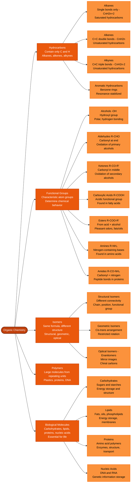

```mermaid
flowchart LR
    Start([Organic Chemistry]):::orange
    Start --> Hydrocarbons[Hydrocarbons<br/>Contain only C and H<br/>Alkanes, alkenes, alkynes]:::lightorange
    Start --> FunctionalGroups[Functional Groups<br/>Characteristic atom groups<br/>Determine chemical behavior]:::lightorange
    Start --> Isomers[Isomers<br/>Same formula, different structure<br/>Structural, geometric, optical]:::lightorange
    Start --> Polymers[Polymers<br/>Large molecules from repeating units<br/>Plastics, proteins, DNA]:::lightorange
    Start --> BiologicalMolecules[Biological Molecules<br/>Carbohydrates, lipids, proteins, nucleic acids<br/>Essential for life]:::lightorange
    
    Hydrocarbons --> Alkanes[Alkanes<br/>Single bonds only - CnH2n+2<br/>Saturated hydrocarbons]:::paleorange
    Hydrocarbons --> Alkenes[Alkenes<br/>C=C double bonds - CnH2n<br/>Unsaturated hydrocarbons]:::paleorange
    Hydrocarbons --> Alkynes[Alkynes<br/>C≡C triple bonds - CnH2n-2<br/>Unsaturated hydrocarbons]:::paleorange
    Hydrocarbons --> AromaticHC[Aromatic Hydrocarbons<br/>Benzene rings<br/>Resonance stabilized]:::paleorange
    
    FunctionalGroups --> Alcohols[Alcohols -OH<br/>Hydroxyl group<br/>Polar, hydrogen bonding]:::paleorange
    FunctionalGroups --> Aldehydes[Aldehydes R-CHO<br/>Carbonyl at end<br/>Oxidation of primary alcohols]:::paleorange
    FunctionalGroups --> Ketones[Ketones R-CO-R'<br/>Carbonyl in middle<br/>Oxidation of secondary alcohols]:::paleorange
    FunctionalGroups --> CarboxylicAcids[Carboxylic Acids R-COOH<br/>Acidic functional group<br/>Found in fatty acids]:::paleorange
    FunctionalGroups --> Esters[Esters R-COO-R'<br/>From acid + alcohol<br/>Pleasant odors, fats/oils]:::paleorange
    FunctionalGroups --> Amines[Amines R-NH₂<br/>Nitrogen-containing bases<br/>Found in amino acids]:::paleorange
    FunctionalGroups --> Amides[Amides R-CO-NH₂<br/>Carbonyl + nitrogen<br/>Peptide bonds in proteins]:::paleorange
    
    Isomers --> StructuralIsomers[Structural Isomers<br/>Different connectivity<br/>Chain, position, functional group]:::paleorange
    Isomers --> GeometricIsomers[Geometric Isomers<br/>Cis-trans arrangement<br/>Restricted rotation]:::paleorange
    Isomers --> OpticalIsomers[Optical Isomers - Enantiomers<br/>Mirror images<br/>Chiral carbons]:::paleorange
    
    BiologicalMolecules --> Carbohydrates[Carbohydrates<br/>Sugars and starches<br/>Energy storage and structure]:::paleorange
    BiologicalMolecules --> Lipids[Lipids<br/>Fats, oils, phospholipids<br/>Energy storage, membranes]:::paleorange
    BiologicalMolecules --> Proteins[Proteins<br/>Amino acid polymers<br/>Enzymes, structure, transport]:::paleorange
    BiologicalMolecules --> NucleicAcids[Nucleic Acids<br/>DNA and RNA<br/>Genetic information storage]:::paleorange
    
    classDef orange fill:#c2410c,stroke:#7c2d12,stroke-width:3px,color:#fff
    classDef lightorange fill:#ea580c,stroke:#c2410c,stroke-width:2px,color:#fff
    classDef paleorange fill:#fb923c,stroke:#f97316,stroke-width:2px,color:#000
    classDef peach fill:#fdba74,stroke:#fb923c,stroke-width:1px,color:#000
```