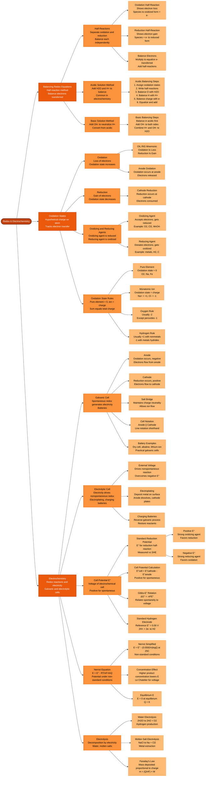

```mermaid
flowchart LR
    Start([Redox & Electrochemistry]):::orange
    Start --> OxidationStates["Oxidation States<br/>Hypothetical charge on atom<br/>Tracks electron transfer"]:::lightorange
    Start --> BalancingRedox["Balancing Redox Equations<br/>Half-reaction method<br/>Balance electrons transferred"]:::lightorange
    
    BalancingRedox --> HalfReactions["Half-Reactions<br/>Separate oxidation and reduction<br/>Balance each independently"]:::paleorange
    BalancingRedox --> AcidicSolution["Acidic Solution Method<br/>Add H2O and H+ to balance<br/>Common in electrochemistry"]:::paleorange
    BalancingRedox --> BasicSolution["Basic Solution Method<br/>Add OH- to neutralize H+<br/>Convert from acidic"]:::paleorange
    
    HalfReactions --> OxidationHalf["Oxidation Half-Reaction<br/>Shows electron loss<br/>Species to oxidized form + e-"]:::peach
    HalfReactions --> ReductionHalf["Reduction Half-Reaction<br/>Shows electron gain<br/>Species + e- to reduced form"]:::peach
    HalfReactions --> BalanceElectrons["Balance Electrons<br/>Multiply to equalize e- transferred<br/>Add half-reactions"]:::peach
    
    AcidicSolution --> AcidicSteps["Acidic Balancing Steps<br/>1. Assign oxidation states<br/>2. Write half-reactions<br/>3. Balance O with H2O<br/>4. Balance H with H+<br/>5. Balance charge with e-<br/>6. Equalize and add"]:::peach
    
    BasicSolution --> BasicSteps["Basic Balancing Steps<br/>Balance in acidic first<br/>Add OH- to both sides<br/>Combine H+ and OH- to H2O"]:::peach
    Start --> Electrochemistry["Electrochemistry<br/>Redox reactions and electricity<br/>Galvanic and electrolytic cells"]:::lightorange
    
    OxidationStates --> OxidationDef["Oxidation<br/>Loss of electrons<br/>Oxidation state increases"]:::paleorange
    OxidationStates --> ReductionDef["Reduction<br/>Gain of electrons<br/>Oxidation state decreases"]:::paleorange
    OxidationStates --> RedoxAgent["Oxidizing and Reducing Agents<br/>Oxidizing agent is reduced<br/>Reducing agent is oxidized"]:::paleorange
    OxidationStates --> OxidationRules["Oxidation State Rules<br/>Pure element = 0, ion = charge<br/>Sum equals total charge"]:::paleorange
    
    OxidationDef --> OILRIGMnemonic["OIL RIG Mnemonic<br/>Oxidation Is Loss<br/>Reduction Is Gain"]:::peach
    OxidationDef --> AnodeOxidation["Anode Oxidation<br/>Oxidation occurs at anode<br/>Electrons released"]:::peach
    
    ReductionDef --> CathodeReduction["Cathode Reduction<br/>Reduction occurs at cathode<br/>Electrons consumed"]:::peach
    
    RedoxAgent --> OxidizingAgent["Oxidizing Agent<br/>Accepts electrons, gets reduced<br/>Example: O2, Cl2, MnO4-"]:::peach
    RedoxAgent --> ReducingAgent["Reducing Agent<br/>Donates electrons, gets oxidized<br/>Example: metals, H2, C"]:::peach
    
    OxidationRules --> ElementZero["Pure Element<br/>Oxidation state = 0<br/>O2, Na, Fe"]:::peach
    OxidationRules --> MonatomicIon["Monatomic Ion<br/>Oxidation state = charge<br/>Na+ = +1, Cl- = -1"]:::peach
    OxidationRules --> OxygenRule["Oxygen Rule<br/>Usually -2<br/>Except peroxides -1"]:::peach
    OxidationRules --> HydrogenRule["Hydrogen Rule<br/>Usually +1 with nonmetals<br/>-1 with metals hydrides"]:::peach
    
    Electrochemistry --> GalvanicCell["Galvanic Cell<br/>Spontaneous redox generates electricity<br/>Batteries"]:::paleorange
    Electrochemistry --> ElectrolyticCell["Electrolytic Cell<br/>Electricity drives nonspontaneous redox<br/>Electroplating, charging batteries"]:::paleorange
    Electrochemistry --> CellPotential["Cell Potential E°<br/>Voltage of electrochemical cell<br/>Positive for spontaneous"]:::paleorange
    Electrochemistry --> NernstEquation["Nernst Equation<br/>E = E° - RT/nF×lnQ<br/>Potential under non-standard conditions"]:::paleorange
    Electrochemistry --> Electrolysis["Electrolysis<br/>Decomposition by electricity<br/>Water, molten salts"]:::paleorange
    
    GalvanicCell --> Anode["Anode<br/>Oxidation occurs, negative<br/>Electrons flow from anode"]:::peach
    GalvanicCell --> Cathode["Cathode<br/>Reduction occurs, positive<br/>Electrons flow to cathode"]:::peach
    GalvanicCell --> SaltBridge["Salt Bridge<br/>Maintains charge neutrality<br/>Allows ion flow"]:::peach
    GalvanicCell --> CellNotation["Cell Notation<br/>Anode || Cathode<br/>Line notation shorthand"]:::peach
    GalvanicCell --> BatteryExamples["Battery Examples<br/>Dry cell, alkaline, lithium-ion<br/>Practical galvanic cells"]:::peach
    
    ElectrolyticCell --> ExternalVoltage["External Voltage<br/>Drives nonspontaneous reaction<br/>Overcomes negative E°"]:::peach
    ElectrolyticCell --> Electroplating["Electroplating<br/>Deposit metal on surface<br/>Anode dissolves, cathode plates"]:::peach
    ElectrolyticCell --> ChargingBatteries["Charging Batteries<br/>Reverse galvanic process<br/>Restore reactants"]:::peach
    
    CellPotential --> StandardReductionPotential["Standard Reduction Potential<br/>E° for reduction half-reaction<br/>Measured vs SHE"]:::peach
    CellPotential --> CellPotentialCalc["Cell Potential Calculation<br/>E°cell = E°cathode - E°anode<br/>Positive for spontaneous"]:::peach
    CellPotential --> GibbsERelation["Gibbs-E° Relation<br/>ΔG° = -nFE°<br/>Relates spontaneity to voltage"]:::peach
    CellPotential --> SHE["Standard Hydrogen Electrode<br/>Reference E° = 0.00 V<br/>2H+ + 2e- to H2"]:::peach
    
    StandardReductionPotential --> PositiveE["Positive E°<br/>Strong oxidizing agent<br/>Favors reduction"]:::peach
    StandardReductionPotential --> NegativeE["Negative E°<br/>Strong reducing agent<br/>Favors oxidation"]:::peach
    
    NernstEquation --> NernstSimplified["Nernst Simplified<br/>E = E° - (0.0592/n)logQ at 25C<br/>Non-standard conditions"]:::peach
    NernstEquation --> ConcentrationEffect["Concentration Effect<br/>Higher product concentration lowers E<br/>Le Chatelier for voltage"]:::peach
    NernstEquation --> EquilibriumE["Equilibrium E<br/>E = 0 at equilibrium<br/>Q = K"]:::peach
    
    Electrolysis --> WaterElectrolysis["Water Electrolysis<br/>2H2O to 2H2 + O2<br/>Hydrogen production"]:::peach
    Electrolysis --> MoltenSaltElectrolysis["Molten Salt Electrolysis<br/>NaCl to Na + Cl2<br/>Metal extraction"]:::peach
    Electrolysis --> FaradaysLaw["Faraday's Law<br/>Mass deposited proportional to charge<br/>m = (Q/nF) × M"]:::peach
    
    classDef orange fill:#c2410c,stroke:#7c2d12,stroke-width:3px,color:#fff
    classDef lightorange fill:#ea580c,stroke:#c2410c,stroke-width:2px,color:#fff
    classDef paleorange fill:#fb923c,stroke:#f97316,stroke-width:2px,color:#000
    classDef peach fill:#fdba74,stroke:#fb923c,stroke-width:1px,color:#000
```