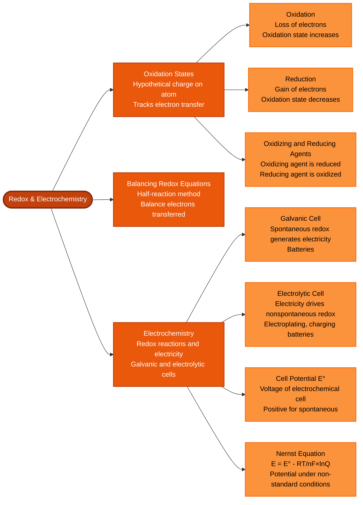

```mermaid
flowchart LR
    Start([Redox & Electrochemistry]):::orange
    Start --> OxidationStates[Oxidation States<br/>Hypothetical charge on atom<br/>Tracks electron transfer]:::lightorange
    Start --> BalancingRedox[Balancing Redox Equations<br/>Half-reaction method<br/>Balance electrons transferred]:::lightorange
    Start --> Electrochemistry[Electrochemistry<br/>Redox reactions and electricity<br/>Galvanic and electrolytic cells]:::lightorange
    
    OxidationStates --> OxidationDef[Oxidation<br/>Loss of electrons<br/>Oxidation state increases]:::paleorange
    OxidationStates --> ReductionDef[Reduction<br/>Gain of electrons<br/>Oxidation state decreases]:::paleorange
    OxidationStates --> RedoxAgent[Oxidizing and Reducing Agents<br/>Oxidizing agent is reduced<br/>Reducing agent is oxidized]:::paleorange
    
    Electrochemistry --> GalvanicCell[Galvanic Cell<br/>Spontaneous redox generates electricity<br/>Batteries]:::paleorange
    Electrochemistry --> ElectrolyticCell[Electrolytic Cell<br/>Electricity drives nonspontaneous redox<br/>Electroplating, charging batteries]:::paleorange
    Electrochemistry --> CellPotential[Cell Potential E°<br/>Voltage of electrochemical cell<br/>Positive for spontaneous]:::paleorange
    Electrochemistry --> NernstEquation[Nernst Equation<br/>E = E° - RT/nF×lnQ<br/>Potential under non-standard conditions]:::paleorange
    
    classDef orange fill:#c2410c,stroke:#7c2d12,stroke-width:3px,color:#fff
    classDef lightorange fill:#ea580c,stroke:#c2410c,stroke-width:2px,color:#fff
    classDef paleorange fill:#fb923c,stroke:#f97316,stroke-width:2px,color:#000
    classDef peach fill:#fdba74,stroke:#fb923c,stroke-width:1px,color:#000
```