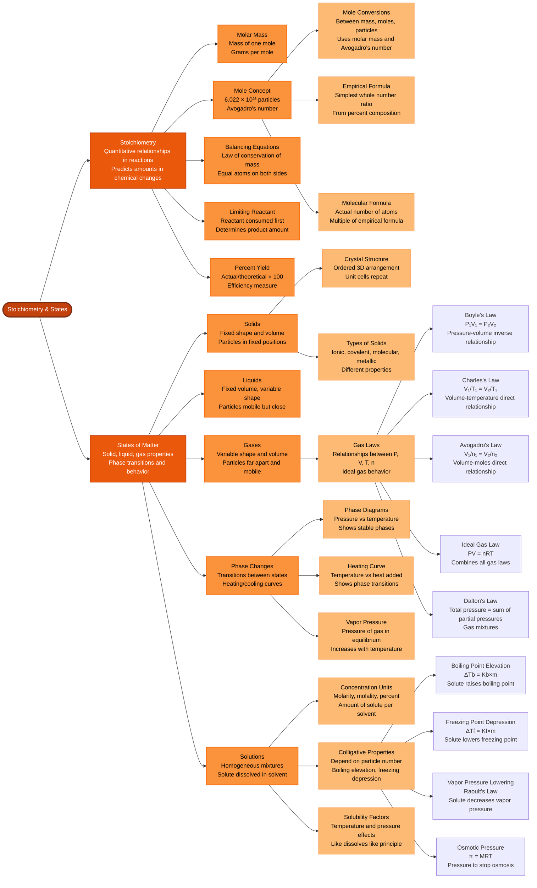

```mermaid
flowchart LR
    Start([Stoichiometry & States]):::orange
    Start --> Stoichiometry[Stoichiometry<br/>Quantitative relationships in reactions<br/>Predicts amounts in chemical changes]:::lightorange
    Start --> States[States of Matter<br/>Solid, liquid, gas properties<br/>Phase transitions and behavior]:::lightorange
    
    Stoichiometry --> MolarMass[Molar Mass<br/>Mass of one mole<br/>Grams per mole]:::paleorange
    Stoichiometry --> Mole[Mole Concept<br/>6.022 × 10²³ particles<br/>Avogadro's number]:::paleorange
    Stoichiometry --> BalancingEq[Balancing Equations<br/>Law of conservation of mass<br/>Equal atoms on both sides]:::paleorange
    Stoichiometry --> LimitingReactant[Limiting Reactant<br/>Reactant consumed first<br/>Determines product amount]:::paleorange
    Stoichiometry --> PercentYield[Percent Yield<br/>Actual/theoretical × 100<br/>Efficiency measure]:::paleorange
    
    Mole --> MoleConversions[Mole Conversions<br/>Between mass, moles, particles<br/>Uses molar mass and Avogadro's number]:::peach
    Mole --> EmpiricalFormula[Empirical Formula<br/>Simplest whole number ratio<br/>From percent composition]:::peach
    Mole --> MolecularFormula[Molecular Formula<br/>Actual number of atoms<br/>Multiple of empirical formula]:::peach
    
    States --> SolidState[Solids<br/>Fixed shape and volume<br/>Particles in fixed positions]:::paleorange
    States --> LiquidState[Liquids<br/>Fixed volume, variable shape<br/>Particles mobile but close]:::paleorange
    States --> GasState[Gases<br/>Variable shape and volume<br/>Particles far apart and mobile]:::paleorange
    States --> PhaseChanges[Phase Changes<br/>Transitions between states<br/>Heating/cooling curves]:::paleorange
    States --> Solutions[Solutions<br/>Homogeneous mixtures<br/>Solute dissolved in solvent]:::paleorange
    
    SolidState --> CrystalStructure[Crystal Structure<br/>Ordered 3D arrangement<br/>Unit cells repeat]:::peach
    SolidState --> TypesSolids[Types of Solids<br/>Ionic, covalent, molecular, metallic<br/>Different properties]:::peach
    
    GasState --> GasLaws[Gas Laws<br/>Relationships between P, V, T, n<br/>Ideal gas behavior]:::peach
    
    GasLaws --> BoyleLaw[Boyle's Law<br/>P₁V₁ = P₂V₂<br/>Pressure-volume inverse relationship]
    GasLaws --> CharlesLaw[Charles's Law<br/>V₁/T₁ = V₂/T₂<br/>Volume-temperature direct relationship]
    GasLaws --> AvogadroLaw[Avogadro's Law<br/>V₁/n₁ = V₂/n₂<br/>Volume-moles direct relationship]
    GasLaws --> IdealGasLaw[Ideal Gas Law<br/>PV = nRT<br/>Combines all gas laws]
    GasLaws --> DaltonLaw[Dalton's Law<br/>Total pressure = sum of partial pressures<br/>Gas mixtures]
    
    PhaseChanges --> PhaseDiagram[Phase Diagrams<br/>Pressure vs temperature<br/>Shows stable phases]:::peach
    PhaseChanges --> HeatingCurve[Heating Curve<br/>Temperature vs heat added<br/>Shows phase transitions]:::peach
    PhaseChanges --> VaporPressure[Vapor Pressure<br/>Pressure of gas in equilibrium<br/>Increases with temperature]:::peach
    
    Solutions --> Concentration[Concentration Units<br/>Molarity, molality, percent<br/>Amount of solute per solvent]:::peach
    Solutions --> ColligativeProps[Colligative Properties<br/>Depend on particle number<br/>Boiling elevation, freezing depression]:::peach
    Solutions --> SolubilityFactors[Solubility Factors<br/>Temperature and pressure effects<br/>Like dissolves like principle]:::peach
    
    ColligativeProps --> BoilingElevation[Boiling Point Elevation<br/>ΔTb = Kb×m<br/>Solute raises boiling point]
    ColligativeProps --> FreezingDepression[Freezing Point Depression<br/>ΔTf = Kf×m<br/>Solute lowers freezing point]
    ColligativeProps --> VaporPressureLowering[Vapor Pressure Lowering<br/>Raoult's Law<br/>Solute decreases vapor pressure]
    ColligativeProps --> OsmoticPressure[Osmotic Pressure<br/>π = MRT<br/>Pressure to stop osmosis]
    
    classDef orange fill:#c2410c,stroke:#7c2d12,stroke-width:3px,color:#fff
    classDef lightorange fill:#ea580c,stroke:#c2410c,stroke-width:2px,color:#fff
    classDef paleorange fill:#fb923c,stroke:#f97316,stroke-width:2px,color:#000
    classDef peach fill:#fdba74,stroke:#fb923c,stroke-width:1px,color:#000
```