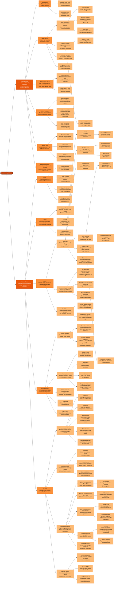

```mermaid
flowchart LR
    Start([Stoichiometry & States]):::orange
    Start --> Stoichiometry["Stoichiometry<br/>Quantitative relationships in reactions<br/>Predicts amounts in chemical changes"]:::lightorange
    Start --> States["States of Matter<br/>Solid, liquid, gas properties<br/>Phase transitions and behavior"]:::lightorange
    
    Stoichiometry --> MolarMass["Molar Mass<br/>Mass of one mole<br/>Grams per mole"]:::paleorange
    Stoichiometry --> Mole["Mole Concept<br/>6.022 × 10²³ particles<br/>Avogadro's number"]:::paleorange
    Stoichiometry --> BalancingEq["Balancing Equations<br/>Law of conservation of mass<br/>Equal atoms on both sides"]:::paleorange
    Stoichiometry --> LimitingReactant["Limiting Reactant<br/>Reactant consumed first<br/>Determines product amount"]:::paleorange
    Stoichiometry --> PercentYield["Percent Yield<br/>Actual/theoretical × 100<br/>Efficiency measure"]:::paleorange
    Stoichiometry --> MassRelationships["Mass Relationships<br/>Mole ratios from balanced equation<br/>Convert between reactants and products"]:::paleorange
    
    MolarMass --> CalculateMolarMass["Calculate Molar Mass<br/>Sum atomic masses<br/>From periodic table"]:::peach
    MolarMass --> MolarMassUnits["Molar Mass Units<br/>g/mol or amu<br/>Numerically equal"]:::peach
    
    Mole --> MoleConversions["Mole Conversions<br/>Between mass, moles, particles<br/>Uses molar mass and Avogadro's number"]:::peach
    Mole --> EmpiricalFormula["Empirical Formula<br/>Simplest whole number ratio<br/>From percent composition"]:::peach
    Mole --> MolecularFormula["Molecular Formula<br/>Actual number of atoms<br/>Multiple of empirical formula"]:::peach
    Mole --> AvogadroConstant["Avogadro's Constant<br/>6.022 × 10²³ per mole<br/>Fundamental constant"]:::peach
    
    MoleConversions --> MassToMoles["Mass to Moles<br/>Divide by molar mass<br/>n = m/M"]:::peach
    MoleConversions --> MolesToParticles["Moles to Particles<br/>Multiply by Avogadro's number<br/>N = n × NA"]:::peach
    MoleConversions --> MoleRatio["Mole Ratio<br/>From balanced equation<br/>Stoichiometric coefficients"]:::peach
    
    EmpiricalFormula --> PercentToMass["Percent to Mass<br/>Assume 100g sample<br/>Convert percent to grams"]:::peach
    EmpiricalFormula --> MassToMoleRatio["Mass to Mole Ratio<br/>Divide by molar mass<br/>Find simplest ratio"]:::peach
    
    BalancingEq --> BalancingSteps["Balancing Steps<br/>Balance one element at a time<br/>Adjust coefficients, not subscripts"]:::peach
    BalancingEq --> ConservationMass["Conservation of Mass<br/>Total mass constant<br/>Lavoisier's principle"]:::peach
    
    LimitingReactant --> ExcessReactant["Excess Reactant<br/>Reactant left over<br/>Amount remaining after reaction"]:::peach
    LimitingReactant --> LimitingCalc["Limiting Calculation<br/>Calculate product from each reactant<br/>Smallest amount determines"]:::peach
    LimitingReactant --> MoleComparison["Mole Comparison<br/>Compare actual to stoichiometric ratio<br/>Determines limiting"]:::peach
    
    PercentYield --> TheoreticalYield["Theoretical Yield<br/>Maximum possible product<br/>From stoichiometry"]:::peach
    PercentYield --> ActualYield["Actual Yield<br/>Amount actually obtained<br/>From experiment"]:::peach
    PercentYield --> YieldLoss["Yield Loss<br/>Side reactions, incomplete reactions<br/>Purification losses"]:::peach
    
    States --> SolidState["Solids<br/>Fixed shape and volume<br/>Particles in fixed positions"]:::paleorange
    States --> LiquidState["Liquids<br/>Fixed volume, variable shape<br/>Particles mobile but close"]:::paleorange
    States --> GasState["Gases<br/>Variable shape and volume<br/>Particles far apart and mobile"]:::paleorange
    States --> PhaseChanges["Phase Changes<br/>Transitions between states<br/>Heating/cooling curves"]:::paleorange
    States --> Solutions["Solutions<br/>Homogeneous mixtures<br/>Solute dissolved in solvent"]:::paleorange
    
    SolidState --> CrystalStructure["Crystal Structure<br/>Ordered 3D arrangement<br/>Unit cells repeat"]:::peach
    SolidState --> TypesSolids["Types of Solids<br/>Ionic, covalent, molecular, metallic<br/>Different properties"]:::peach
    SolidState --> Crystalline["Crystalline Solids<br/>Ordered repeating pattern<br/>Sharp melting point"]:::peach
    SolidState --> Amorphous["Amorphous Solids<br/>Disordered structure<br/>Gradual softening"]:::peach
    
    LiquidState --> SurfaceTension["Surface Tension<br/>Molecules at surface pulled inward<br/>Minimizes surface area"]:::peach
    LiquidState --> Viscosity["Viscosity<br/>Resistance to flow<br/>Depends on IMF and temperature"]:::peach
    LiquidState --> CapillaryAction["Capillary Action<br/>Liquid rises in narrow tube<br/>Adhesion vs cohesion"]:::peach
    
    GasState --> GasLaws["Gas Laws<br/>Relationships between P, V, T, n<br/>Ideal gas behavior"]:::peach
    GasState --> KineticMolecularTheory["Kinetic Molecular Theory<br/>Explains gas behavior<br/>Particles in constant motion"]:::peach
    GasState --> RealGases["Real Gases<br/>Deviate from ideal at high P, low T<br/>Van der Waals equation"]:::peach
    
    GasLaws --> BoyleLaw["Boyle's Law<br/>P₁V₁ = P₂V₂<br/>Pressure-volume inverse relationship"]:::peach
    GasLaws --> CharlesLaw["Charles's Law<br/>V₁/T₁ = V₂/T₂<br/>Volume-temperature direct relationship"]:::peach
    GasLaws --> AvogadroLaw["Avogadro's Law<br/>V₁/n₁ = V₂/n₂<br/>Volume-moles direct relationship"]:::peach
    GasLaws --> IdealGasLaw["Ideal Gas Law<br/>PV = nRT<br/>Combines all gas laws"]:::peach
    GasLaws --> DaltonLaw["Dalton's Law<br/>Total pressure = sum of partial pressures<br/>Gas mixtures"]:::peach
    GasLaws --> GrahamLaw["Graham's Law<br/>Effusion rate inversely proportional sqrt(M)<br/>Lighter gases effuse faster"]:::peach
    
    BoyleLaw --> BoyleConstantT["Constant Temperature<br/>Isothermal process<br/>Inverse relationship"]:::peach
    
    CharlesLaw --> CharlesConstantP["Constant Pressure<br/>Isobaric process<br/>Direct relationship"]:::peach
    CharlesLaw --> AbsoluteZero["Absolute Zero<br/>-273.15 Celsius<br/>Zero Kelvin"]:::peach
    
    IdealGasLaw --> GasConstantR["Gas Constant R<br/>8.314 J/(mol·K)<br/>0.0821 L·atm/(mol·K)"]:::peach
    IdealGasLaw --> STP["Standard Temperature Pressure<br/>0 Celsius, 1 atm<br/>22.4 L per mole"]:::peach
    IdealGasLaw --> IdealGasAssumptions["Ideal Gas Assumptions<br/>No volume, no interactions<br/>Elastic collisions"]:::peach
    
    KineticMolecularTheory --> KMTPostulates["KMT Postulates<br/>Particles in constant random motion<br/>Average KE proportional to T"]:::peach
    KineticMolecularTheory --> RootMeanSquare["Root Mean Square Speed<br/>sqrt(3RT/M)<br/>Average molecular speed"]:::peach
    KineticMolecularTheory --> MaxwellBoltzmann["Maxwell-Boltzmann Distribution<br/>Speed distribution<br/>Temperature dependent"]:::peach
    
    RealGases --> VanDerWaals["Van der Waals Equation<br/>(P + a/V²)(V - b) = RT<br/>Corrects for real behavior"]:::peach
    RealGases --> CompressionFactor["Compression Factor Z<br/>Z = PV/nRT<br/>Z = 1 for ideal, deviates for real"]:::peach
    
    PhaseChanges --> PhaseDiagram["Phase Diagrams<br/>Pressure vs temperature<br/>Shows stable phases"]:::peach
    PhaseChanges --> HeatingCurve["Heating Curve<br/>Temperature vs heat added<br/>Shows phase transitions"]:::peach
    PhaseChanges --> VaporPressure["Vapor Pressure<br/>Pressure of gas in equilibrium<br/>Increases with temperature"]:::peach
    PhaseChanges --> TriplePoint["Triple Point<br/>All three phases coexist<br/>Unique P and T"]:::peach
    PhaseChanges --> CriticalPoint["Critical Point<br/>Above this, no liquid phase<br/>Supercritical fluid"]:::peach
    
    PhaseDiagram --> PhaseBoundaries["Phase Boundaries<br/>Lines between phases<br/>Solid-liquid, liquid-gas, solid-gas"]:::peach
    PhaseDiagram --> ClausiusClapeyron["Clausius-Clapeyron Equation<br/>ln(P2/P1) = -ΔHvap/R(1/T2 - 1/T1)<br/>Vapor pressure temperature dependence"]:::peach
    
    HeatingCurve --> Melting["Melting - Fusion<br/>Solid to liquid<br/>Requires heat of fusion"]:::peach
    HeatingCurve --> Vaporization["Vaporization<br/>Liquid to gas<br/>Requires heat of vaporization"]:::peach
    HeatingCurve --> Sublimation["Sublimation<br/>Solid to gas directly<br/>No liquid phase"]:::peach
    HeatingCurve --> Plateaus["Temperature Plateaus<br/>During phase change<br/>Energy breaks IMF, not increases KE"]:::peach
    
    Solutions --> Concentration["Concentration Units<br/>Molarity, molality, percent<br/>Amount of solute per solvent"]:::peach
    Solutions --> ColligativeProps["Colligative Properties<br/>Depend on particle number<br/>Boiling elevation, freezing depression"]:::peach
    Solutions --> SolubilityFactors["Solubility Factors<br/>Temperature and pressure effects<br/>Like dissolves like principle"]:::peach
    Solutions --> SolutionProcess["Solution Process<br/>Dissolution involves energy changes<br/>Solute-solvent interactions"]:::peach
    
    Concentration --> Molarity["Molarity M<br/>Moles per liter solution<br/>Temperature dependent"]:::peach
    Concentration --> Molality["Molality m<br/>Moles per kg solvent<br/>Temperature independent"]:::peach
    Concentration --> MassPct["Mass Percent<br/>(Mass solute / mass solution) × 100<br/>Common for solids in liquids"]:::peach
    Concentration --> MoleFraction["Mole Fraction<br/>Moles component / total moles<br/>Unitless"]:::peach
    Concentration --> ppm["Parts Per Million ppm<br/>mg solute per kg solution<br/>Dilute solutions"]:::peach
    
    SolutionProcess --> Solvation["Solvation<br/>Solute surrounded by solvent<br/>Hydration in water"]:::peach
    SolutionProcess --> HeatOfSolution["Heat of Solution<br/>Energy change dissolving<br/>Can be endo or exothermic"]:::peach
    SolutionProcess --> SaturatedSolution["Saturated Solution<br/>Maximum solute dissolved<br/>Dynamic equilibrium"]:::peach
    
    ColligativeProps --> BoilingElevation["Boiling Point Elevation<br/>ΔTb = Kb×m<br/>Solute raises boiling point"]:::peach
    ColligativeProps --> FreezingDepression["Freezing Point Depression<br/>ΔTf = Kf×m<br/>Solute lowers freezing point"]:::peach
    ColligativeProps --> VaporPressureLowering["Vapor Pressure Lowering<br/>Raoult's Law<br/>Solute decreases vapor pressure"]:::peach
    ColligativeProps --> OsmoticPressure["Osmotic Pressure<br/>π = MRT<br/>Pressure to stop osmosis"]:::peach
    ColligativeProps --> VantHoffFactor["Van't Hoff Factor i<br/>Number of particles per formula unit<br/>Accounts for dissociation"]:::peach
    
    BoilingElevation --> KbConstant["Kb Constant<br/>Boiling point elevation constant<br/>Solvent specific"]:::peach
    
    FreezingDepression --> KfConstant["Kf Constant<br/>Freezing point depression constant<br/>Solvent specific"]:::peach
    
    VaporPressureLowering --> RaoultsLaw["Raoult's Law<br/>P = X(solvent) × P°<br/>Ideal solution behavior"]:::peach
    VaporPressureLowering --> NonvolatileSolute["Nonvolatile Solute<br/>Does not evaporate<br/>Reduces surface area for evaporation"]:::peach
    
    OsmoticPressure --> Osmosis["Osmosis<br/>Solvent flow through semipermeable membrane<br/>From low to high concentration"]:::peach
    OsmoticPressure --> IsotonicSolution["Isotonic Solution<br/>Equal osmotic pressure<br/>No net water flow"]:::peach
    
    SolubilityFactors --> TemperatureEffect["Temperature Effect<br/>Usually increases solubility for solids<br/>Decreases for gases"]:::peach
    SolubilityFactors --> PressureEffect["Pressure Effect<br/>Henry's Law for gases<br/>C = kH × P"]:::peach
    SolubilityFactors --> LikeDissolvesLike["Like Dissolves Like<br/>Polar solutes in polar solvents<br/>Nonpolar in nonpolar"]:::peach
    
    classDef orange fill:#c2410c,stroke:#7c2d12,stroke-width:3px,color:#fff
    classDef lightorange fill:#ea580c,stroke:#c2410c,stroke-width:2px,color:#fff
    classDef paleorange fill:#fb923c,stroke:#f97316,stroke-width:2px,color:#000
    classDef peach fill:#fdba74,stroke:#fb923c,stroke-width:1px,color:#000
```