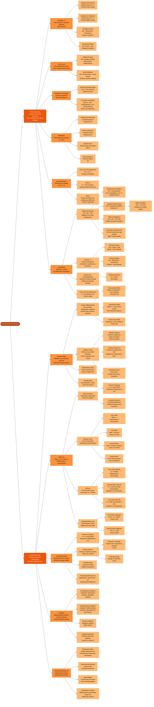

```mermaid
flowchart LR
    Start([Thermochemistry & Kinetics]):::orange
    Start --> Thermochem["Thermochemistry<br/>Energy in chemical reactions<br/>Heat, enthalpy, and energy changes"]:::lightorange
    Start --> Kinetics["Chemical Kinetics<br/>Reaction rates and mechanisms<br/>How fast reactions occur"]:::lightorange
    
    Thermochem --> Enthalpy["Enthalpy - H<br/>Heat content at constant pressure<br/>State function"]:::paleorange
    Thermochem --> HessLaw["Hess's Law<br/>ΔH independent of path<br/>Sum of steps equals overall"]:::paleorange
    Thermochem --> EnthalpyFormation["Enthalpy of Formation<br/>ΔH°f from elements<br/>Standard reference"]:::paleorange
    Thermochem --> Calorimetry["Calorimetry<br/>Measuring heat changes<br/>q = mcΔT"]:::paleorange
    Thermochem --> Spontaneity["Spontaneity<br/>Gibbs free energy<br/>ΔG determines spontaneity"]:::paleorange
    Thermochem --> InternalEnergy["Internal Energy U<br/>Total energy of system<br/>ΔU = q + w"]:::paleorange
    
    Enthalpy --> Exothermic["Exothermic Reactions<br/>Release heat, ΔH < 0<br/>Products lower energy"]:::peach
    Enthalpy --> Endothermic["Endothermic Reactions<br/>Absorb heat, ΔH > 0<br/>Products higher energy"]:::peach
    Enthalpy --> EnthalpyChange["Enthalpy Change<br/>ΔH = H(products) - H(reactants)<br/>Heat at constant P"]:::peach
    Enthalpy --> StandardEnthalpy["Standard Enthalpy<br/>ΔH° at 25C, 1 atm<br/>Standard conditions"]:::peach
    
    HessLaw --> AdditiveProperty["Additive Property<br/>Sum enthalpy changes<br/>State function independence"]:::peach
    HessLaw --> BondEnthalpies["Bond Enthalpies<br/>ΔH = bonds broken - bonds formed<br/>Estimate reaction enthalpy"]:::peach
    
    EnthalpyFormation --> ElementsStandard["Elements Standard State<br/>ΔH°f = 0 for elements<br/>Reference point"]:::peach
    EnthalpyFormation --> FormationCalculation["Formation Calculation<br/>ΔH°rxn = sum ΔH°f(products) - sum ΔH°f(reactants)<br/>Hess's Law application"]:::peach
    
    Calorimetry --> CoffeeCalorimeter["Coffee Cup Calorimeter<br/>Constant pressure<br/>Measures ΔH"]:::peach
    Calorimetry --> BombCalorimeter["Bomb Calorimeter<br/>Constant volume<br/>Measures ΔU"]:::peach
    Calorimetry --> SpecificHeat["Specific Heat c<br/>Heat per gram per degree<br/>J/(g·K)"]:::peach
    Calorimetry --> HeatCapacity["Heat Capacity C<br/>Heat per degree<br/>J/K"]:::peach
    
    InternalEnergy --> FirstLawThermo["First Law Thermodynamics<br/>ΔU = q + w<br/>Energy conservation"]:::peach
    InternalEnergy --> Work["Work w<br/>w = -PΔV for gases<br/>Energy transferred by force"]:::peach
    InternalEnergy --> Heat["Heat q<br/>Energy transferred by temperature difference<br/>Positive if absorbed"]:::peach
    
    Spontaneity --> GibbsEnergy["Gibbs Free Energy<br/>ΔG = ΔH - TΔS<br/>Negative ΔG means spontaneous"]:::peach
    Spontaneity --> Entropy["Entropy - S<br/>Measure of disorder<br/>Increases in spontaneous processes"]:::peach
    Spontaneity --> SecondLawThermo["Second Law Thermodynamics<br/>Universe entropy increases<br/>Defines spontaneity direction"]:::peach
    Spontaneity --> ThirdLawThermo["Third Law Thermodynamics<br/>S = 0 at absolute zero<br/>Perfect crystal"]:::peach
    
    GibbsEnergy --> SpontaneousConditions["Spontaneous Conditions<br/>ΔG < 0 spontaneous<br/>ΔG = 0 equilibrium, ΔG > 0 nonspontaneous"]:::peach
    GibbsEnergy --> StandardGibbs["Standard Gibbs Energy<br/>ΔG° at standard conditions<br/>Related to K"]:::peach
    GibbsEnergy --> GibbsEquilibrium["Gibbs at Equilibrium<br/>ΔG = ΔG° + RT ln(Q)<br/>Relates to reaction quotient"]:::peach
    GibbsEnergy --> TemperatureDependence["Temperature Dependence<br/>TΔS term determines sign change<br/>High T favors entropy"]:::peach
    
    StandardGibbs --> GibbsKRelation["Gibbs-K Relation<br/>ΔG° = -RT ln(K)<br/>Equilibrium constant relation"]:::peach
    
    Entropy --> EntropyIncrease["Entropy Increase<br/>Gas > liquid > solid<br/>Higher T, more disorder"]:::peach
    Entropy --> EntropyChange["Entropy Change<br/>ΔS = S(products) - S(reactants)<br/>Positive = more disorder"]:::peach
    Entropy --> StatisticalEntropy["Statistical Entropy<br/>S = k ln(W)<br/>Microstates"]:::peach
    
    Kinetics --> ReactionRate["Reaction Rate<br/>Change in concentration per time<br/>Measures reaction speed"]:::paleorange
    Kinetics --> RateLaw["Rate Law<br/>Rate = k·A to n·B to m<br/>Relates rate to concentrations"]:::paleorange
    Kinetics --> ActivationEnergy["Activation Energy<br/>Energy barrier for reaction<br/>Minimum energy needed"]:::paleorange
    Kinetics --> Catalysis["Catalysis<br/>Speeds reaction without being consumed<br/>Lowers activation energy"]:::paleorange
    Kinetics --> ReactionMechanisms["Reaction Mechanisms<br/>Step-by-step process<br/>Elementary reactions"]:::paleorange
    
    ReactionRate --> FactorsAffectingRate["Factors Affecting Rate<br/>Concentration, temperature, catalysts<br/>Surface area, nature of reactants"]:::peach
    ReactionRate --> CollisionTheory["Collision Theory<br/>Particles must collide effectively<br/>Proper orientation and energy"]:::peach
    ReactionRate --> InstantaneousRate["Instantaneous Rate<br/>Rate at specific time<br/>Slope of tangent line"]:::peach
    ReactionRate --> AverageRate["Average Rate<br/>Δconcentration / Δtime<br/>Over time interval"]:::peach
    
    FactorsAffectingRate --> ConcentrationEffect["Concentration Effect<br/>Higher concentration = more collisions<br/>Increases rate"]:::peach
    FactorsAffectingRate --> TemperatureEffect["Temperature Effect<br/>Higher T = more kinetic energy<br/>More effective collisions"]:::peach
    FactorsAffectingRate --> SurfaceAreaEffect["Surface Area Effect<br/>More area = more collisions<br/>Faster rate"]:::peach
    
    CollisionTheory --> EffectiveCollision["Effective Collision<br/>Sufficient energy and proper orientation<br/>Leads to reaction"]:::peach
    CollisionTheory --> CollisionFrequency["Collision Frequency<br/>Number of collisions per time<br/>Depends on concentration and T"]:::peach
    CollisionTheory --> OrientationFactor["Orientation Factor<br/>Steric factor<br/>Fraction with correct orientation"]:::peach
    
    RateLaw --> RateConstant["Rate Constant k<br/>Temperature dependent<br/>Arrhenius equation"]:::peach
    RateLaw --> ReactionOrder["Reaction Order<br/>Sum of exponents<br/>Determined experimentally"]:::peach
    RateLaw --> HalfLife["Half-Life<br/>Time for half to react<br/>First order: t½ = 0.693/k"]:::peach
    RateLaw --> IntegratedRateLaws["Integrated Rate Laws<br/>Concentration vs time<br/>Different for each order"]:::peach
    
    RateConstant --> ArrheniusEq["Arrhenius Equation<br/>k = A × exp(-Ea/RT)<br/>Temperature dependence of k"]:::peach
    RateConstant --> FrequencyFactor["Frequency Factor A<br/>Pre-exponential factor<br/>Collision frequency and orientation"]:::peach
    
    ReactionOrder --> ZeroOrder["Zero Order<br/>Rate = k<br/>Independent of concentration"]:::peach
    ReactionOrder --> FirstOrder["First Order<br/>Rate = k times A<br/>Linear ln vs time"]:::peach
    ReactionOrder --> SecondOrder["Second Order<br/>Rate = k times A squared<br/>Linear 1/A vs time"]:::peach
    ReactionOrder --> OverallOrder["Overall Order<br/>Sum of all exponents<br/>Can be fractional"]:::peach
    
    HalfLife --> FirstOrderHalfLife["First Order Half-Life<br/>t½ = 0.693/k<br/>Independent of concentration"]:::peach
    HalfLife --> SecondOrderHalfLife["Second Order Half-Life<br/>t½ = 1/(k times initial concentration)<br/>Depends on concentration"]:::peach
    HalfLife --> ZeroOrderHalfLife["Zero Order Half-Life<br/>t½ = initial concentration / (2k)<br/>Depends on concentration"]:::peach
    
    IntegratedRateLaws --> FirstOrderIntegrated["First Order Integrated<br/>ln(A) = -kt + ln(A0)<br/>Linear ln plot"]:::peach
    IntegratedRateLaws --> SecondOrderIntegrated["Second Order Integrated<br/>1/A = kt + 1/A0<br/>Linear 1/A plot"]:::peach
    
    ActivationEnergy --> ArrheniusEq2["Arrhenius Equation<br/>k = A × exp(-Ea/RT)<br/>Temperature dependence of k"]:::peach
    ActivationEnergy --> EnergyDiagram["Energy Diagram<br/>Energy vs reaction progress<br/>Shows Ea and ΔH"]:::peach
    ActivationEnergy --> TransitionState["Transition State<br/>Activated complex<br/>Highest energy point"]:::peach
    ActivationEnergy --> ForwardReverseEa["Forward and Reverse Ea<br/>Ea(forward) - Ea(reverse) = ΔH<br/>Energy barrier difference"]:::peach
    
    EnergyDiagram --> ReactionCoordinate["Reaction Coordinate<br/>Progress from reactants to products<br/>X-axis"]:::peach
    EnergyDiagram --> PotentialEnergy["Potential Energy<br/>Energy of molecules<br/>Y-axis"]:::peach
    
    Catalysis --> HomogeneousCatalysis["Homogeneous Catalysis<br/>Catalyst in same phase<br/>Example: acid-base catalysis"]:::peach
    Catalysis --> HeterogeneousCatalysis["Heterogeneous Catalysis<br/>Catalyst in different phase<br/>Example: solid catalyst for gas reaction"]:::peach
    Catalysis --> EnzymeCatalysis["Enzyme Catalysis<br/>Biological catalysts<br/>Highly specific"]:::peach
    Catalysis --> CatalystMechanism["Catalyst Mechanism<br/>Provides alternative pathway<br/>Lower Ea, same ΔH"]:::peach
    
    ReactionMechanisms --> ElementarySteps["Elementary Steps<br/>Single molecular event<br/>Unimolecular, bimolecular, termolecular"]:::peach
    ReactionMechanisms --> RateDeterminingStep["Rate-Determining Step<br/>Slowest step<br/>Controls overall rate"]:::peach
    ReactionMechanisms --> Intermediates["Intermediates<br/>Formed and consumed<br/>Not in overall equation"]:::peach
    ReactionMechanisms --> MolecularityOrder["Molecularity vs Order<br/>Molecularity for elementary steps only<br/>Order from rate law"]:::peach
    
    classDef orange fill:#c2410c,stroke:#7c2d12,stroke-width:3px,color:#fff
    classDef lightorange fill:#ea580c,stroke:#c2410c,stroke-width:2px,color:#fff
    classDef paleorange fill:#fb923c,stroke:#f97316,stroke-width:2px,color:#000
    classDef peach fill:#fdba74,stroke:#fb923c,stroke-width:1px,color:#000
```