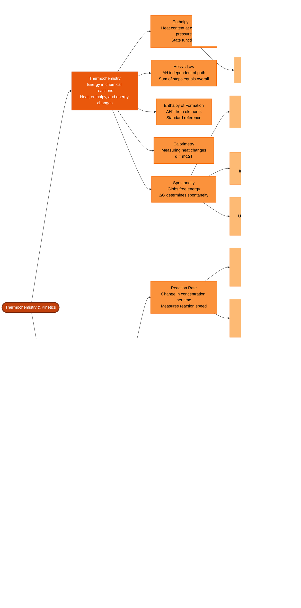

```mermaid
flowchart LR
    Start([Thermochemistry & Kinetics]):::orange
    Start --> Thermochem[Thermochemistry<br/>Energy in chemical reactions<br/>Heat, enthalpy, and energy changes]:::lightorange
    Start --> Kinetics[Chemical Kinetics<br/>Reaction rates and mechanisms<br/>How fast reactions occur]:::lightorange
    
    Thermochem --> Enthalpy[Enthalpy - H<br/>Heat content at constant pressure<br/>State function]:::paleorange
    Thermochem --> HessLaw[Hess's Law<br/>ΔH independent of path<br/>Sum of steps equals overall]:::paleorange
    Thermochem --> EnthalpyFormation[Enthalpy of Formation<br/>ΔH°f from elements<br/>Standard reference]:::paleorange
    Thermochem --> Calorimetry[Calorimetry<br/>Measuring heat changes<br/>q = mcΔT]:::paleorange
    Thermochem --> Spontaneity[Spontaneity<br/>Gibbs free energy<br/>ΔG determines spontaneity]:::paleorange
    
    Enthalpy --> Exothermic[Exothermic Reactions<br/>Release heat, ΔH < 0<br/>Products lower energy]:::peach
    Enthalpy --> Endothermic[Endothermic Reactions<br/>Absorb heat, ΔH > 0<br/>Products higher energy]:::peach
    
    Spontaneity --> GibbsEnergy[Gibbs Free Energy<br/>ΔG = ΔH - TΔS<br/>Negative ΔG means spontaneous]:::peach
    Spontaneity --> Entropy[Entropy - S<br/>Measure of disorder<br/>Increases in spontaneous processes]:::peach
    Spontaneity --> SecondLawThermo[Second Law Thermodynamics<br/>Universe entropy increases<br/>Defines spontaneity direction]:::peach
    
    Kinetics --> ReactionRate[Reaction Rate<br/>Change in concentration per time<br/>Measures reaction speed]:::paleorange
    Kinetics --> RateLaw[Rate Law<br/>Rate = k·Aⁿ·Bᵐ<br/>Relates rate to concentrations]:::paleorange
    Kinetics --> ActivationEnergy[Activation Energy<br/>Energy barrier for reaction<br/>Minimum energy needed]:::paleorange
    Kinetics --> Catalysis[Catalysis<br/>Speeds reaction without being consumed<br/>Lowers activation energy]:::paleorange
    Kinetics --> ReactionMechanisms[Reaction Mechanisms<br/>Step-by-step process<br/>Elementary reactions]:::paleorange
    
    ReactionRate --> FactorsAffectingRate[Factors Affecting Rate<br/>Concentration, temperature, catalysts<br/>Surface area, nature of reactants]:::peach
    ReactionRate --> CollisionTheory[Collision Theory<br/>Particles must collide effectively<br/>Proper orientation and energy]:::peach
    
    RateLaw --> RateConstant[Rate Constant k<br/>Temperature dependent<br/>Arrhenius equation]:::peach
    RateLaw --> ReactionOrder[Reaction Order<br/>Sum of exponents<br/>Determined experimentally]:::peach
    RateLaw --> HalfLife[Half-Life<br/>Time for half to react<br/>First order: t½ = 0.693/k]:::peach
    
    ActivationEnergy --> ArrheniusEq[Arrhenius Equation<br/>k = A × exp of -Ea/RT<br/>Temperature dependence of k]:::peach
    ActivationEnergy --> EnergyDiagram[Energy Diagram<br/>Energy vs reaction progress<br/>Shows Ea and ΔH]:::peach
    
    classDef orange fill:#c2410c,stroke:#7c2d12,stroke-width:3px,color:#fff
    classDef lightorange fill:#ea580c,stroke:#c2410c,stroke-width:2px,color:#fff
    classDef paleorange fill:#fb923c,stroke:#f97316,stroke-width:2px,color:#000
    classDef peach fill:#fdba74,stroke:#fb923c,stroke-width:1px,color:#000
```