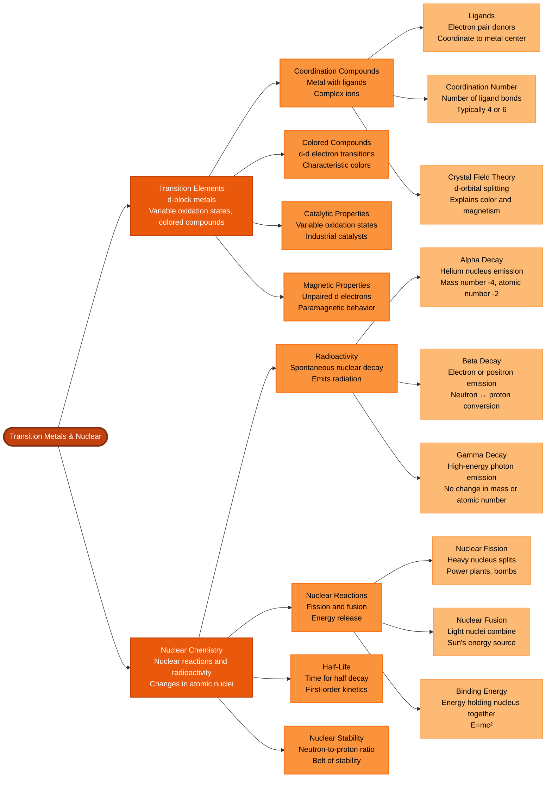

```mermaid
flowchart LR
    Start([Transition Metals & Nuclear]):::orange
    Start --> TransitionMetals[Transition Elements<br/>d-block metals<br/>Variable oxidation states, colored compounds]:::lightorange
    Start --> NuclearChem[Nuclear Chemistry<br/>Nuclear reactions and radioactivity<br/>Changes in atomic nuclei]:::lightorange
    
    TransitionMetals --> CoordinationCompounds[Coordination Compounds<br/>Metal with ligands<br/>Complex ions]:::paleorange
    TransitionMetals --> ColoredCompounds[Colored Compounds<br/>d-d electron transitions<br/>Characteristic colors]:::paleorange
    TransitionMetals --> CatalysisTransition[Catalytic Properties<br/>Variable oxidation states<br/>Industrial catalysts]:::paleorange
    TransitionMetals --> MagneticProps[Magnetic Properties<br/>Unpaired d electrons<br/>Paramagnetic behavior]:::paleorange
    
    CoordinationCompounds --> Ligands[Ligands<br/>Electron pair donors<br/>Coordinate to metal center]:::peach
    CoordinationCompounds --> CoordinationNumber[Coordination Number<br/>Number of ligand bonds<br/>Typically 4 or 6]:::peach
    CoordinationCompounds --> CrystalFieldTheory[Crystal Field Theory<br/>d-orbital splitting<br/>Explains color and magnetism]:::peach
    
    NuclearChem --> Radioactivity[Radioactivity<br/>Spontaneous nuclear decay<br/>Emits radiation]:::paleorange
    NuclearChem --> NuclearReactions[Nuclear Reactions<br/>Fission and fusion<br/>Energy release]:::paleorange
    NuclearChem --> HalfLifeNuclear[Half-Life<br/>Time for half decay<br/>First-order kinetics]:::paleorange
    NuclearChem --> NuclearStability[Nuclear Stability<br/>Neutron-to-proton ratio<br/>Belt of stability]:::paleorange
    
    Radioactivity --> AlphaDecay[Alpha Decay<br/>Helium nucleus emission<br/>Mass number -4, atomic number -2]:::peach
    Radioactivity --> BetaDecay[Beta Decay<br/>Electron or positron emission<br/>Neutron ↔ proton conversion]:::peach
    Radioactivity --> GammaDecay[Gamma Decay<br/>High-energy photon emission<br/>No change in mass or atomic number]:::peach
    
    NuclearReactions --> Fission[Nuclear Fission<br/>Heavy nucleus splits<br/>Power plants, bombs]:::peach
    NuclearReactions --> Fusion[Nuclear Fusion<br/>Light nuclei combine<br/>Sun's energy source]:::peach
    NuclearReactions --> BindingEnergy[Binding Energy<br/>Energy holding nucleus together<br/>E=mc²]:::peach
    
    classDef orange fill:#c2410c,stroke:#7c2d12,stroke-width:3px,color:#fff
    classDef lightorange fill:#ea580c,stroke:#c2410c,stroke-width:2px,color:#fff
    classDef paleorange fill:#fb923c,stroke:#f97316,stroke-width:2px,color:#000
    classDef peach fill:#fdba74,stroke:#fb923c,stroke-width:1px,color:#000
```