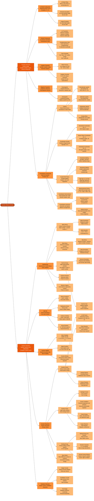

```mermaid
flowchart LR
    Start([Transition Metals & Nuclear]):::orange
    Start --> TransitionMetals["Transition Elements<br/>d-block metals<br/>Variable oxidation states, colored compounds"]:::lightorange
    Start --> NuclearChem["Nuclear Chemistry<br/>Nuclear reactions and radioactivity<br/>Changes in atomic nuclei"]:::lightorange
    
    TransitionMetals --> CoordinationCompounds["Coordination Compounds<br/>Metal with ligands<br/>Complex ions"]:::paleorange
    TransitionMetals --> ColoredCompounds["Colored Compounds<br/>d-d electron transitions<br/>Characteristic colors"]:::paleorange
    TransitionMetals --> CatalysisTransition["Catalytic Properties<br/>Variable oxidation states<br/>Industrial catalysts"]:::paleorange
    TransitionMetals --> MagneticProps["Magnetic Properties<br/>Unpaired d electrons<br/>Paramagnetic behavior"]:::paleorange
    TransitionMetals --> ElectronConfig["d-Orbital Configuration<br/>Electrons fill 3d, 4d, 5d<br/>Exception: Cr, Cu"]:::paleorange
    
    ElectronConfig --> dOrbitalFilling["d-Orbital Filling<br/>After (n-1)d comes ns<br/>4s fills before 3d"]:::peach
    ElectronConfig --> ChromiumException["Chromium Exception<br/>4s1 3d5 half-filled stable<br/>Not 4s2 3d4"]:::peach
    ElectronConfig --> CopperException["Copper Exception<br/>4s1 3d10 filled stable<br/>Not 4s2 3d9"]:::peach
    
    ColoredCompounds --> dTransitions["d-d Transitions<br/>Electron excitation between d orbitals<br/>Absorbs visible light"]:::peach
    ColoredCompounds --> ComplementaryColor["Complementary Color<br/>Color observed is complementary<br/>To absorbed wavelength"]:::peach
    ColoredCompounds --> ColorExamples["Color Examples<br/>Cu2+ blue, Fe3+ yellow-orange<br/>Mn2+ pale pink"]:::peach
    
    CatalysisTransition --> HaberProcess["Haber Process<br/>Iron catalyst for NH3<br/>N2 + 3H2 to 2NH3"]:::peach
    CatalysisTransition --> CatalyticConverter["Catalytic Converter<br/>Pt, Pd, Rh reduce emissions<br/>Oxidize CO and hydrocarbons"]:::peach
    
    MagneticProps --> Paramagnetic["Paramagnetic<br/>Unpaired electrons<br/>Attracted to magnetic field"]:::peach
    MagneticProps --> Diamagnetic["Diamagnetic<br/>All electrons paired<br/>Slightly repelled by field"]:::peach
    
    CoordinationCompounds --> Ligands["Ligands<br/>Electron pair donors<br/>Coordinate to metal center"]:::peach
    CoordinationCompounds --> CoordinationNumber["Coordination Number<br/>Number of ligand bonds<br/>Typically 4 or 6"]:::peach
    CoordinationCompounds --> CrystalFieldTheory["Crystal Field Theory<br/>d-orbital splitting<br/>Explains color and magnetism"]:::peach
    CoordinationCompounds --> Nomenclature["Coordination Nomenclature<br/>Name ligands then metal<br/>Indicate oxidation state"]:::peach
    CoordinationCompounds --> Isomerism["Coordination Isomerism<br/>Geometric and optical<br/>Different arrangements"]:::peach
    
    Ligands --> MonodentateLigands["Monodentate Ligands<br/>One binding site<br/>H2O, NH3, Cl-, CN-"]:::peach
    Ligands --> BidentateLigands["Bidentate Ligands<br/>Two binding sites<br/>Ethylenediamine, oxalate"]:::peach
    Ligands --> PolydentateLigands["Polydentate Ligands<br/>Multiple binding sites<br/>EDTA hexadentate"]:::peach
    Ligands --> ChelateEffect["Chelate Effect<br/>Multidentate more stable<br/>Entropy favored"]:::peach
    
    CoordinationNumber --> Tetrahedral["Tetrahedral Coordination<br/>CN = 4<br/>109.5 degree angles"]:::peach
    CoordinationNumber --> SquarePlanarCoord["Square Planar Coordination<br/>CN = 4<br/>90 degree angles, d8 metals"]:::peach
    CoordinationNumber --> OctahedralCoord["Octahedral Coordination<br/>CN = 6<br/>90 degree angles, most common"]:::peach
    
    CrystalFieldTheory --> OctahedralSplitting["Octahedral Splitting<br/>eg higher, t2g lower<br/>Delta-o splitting energy"]:::peach
    CrystalFieldTheory --> TetrahedralSplitting["Tetrahedral Splitting<br/>Smaller splitting than octahedral<br/>Inverted order"]:::peach
    CrystalFieldTheory --> HighLowSpin["High Spin vs Low Spin<br/>Weak field: high spin<br/>Strong field: low spin"]:::peach
    CrystalFieldTheory --> SpectroSeries["Spectrochemical Series<br/>Ligand field strength order<br/>I- < Cl- < H2O < NH3 < CN-"]:::peach
    
    Isomerism --> GeometricIsomerCoord["Geometric Isomers<br/>Cis and trans<br/>Different spatial arrangements"]:::peach
    Isomerism --> OpticalIsomerCoord["Optical Isomers<br/>Non-superimposable mirror images<br/>Chiral complexes"]:::peach
    
    NuclearChem --> Radioactivity["Radioactivity<br/>Spontaneous nuclear decay<br/>Emits radiation"]:::paleorange
    NuclearChem --> NuclearReactions["Nuclear Reactions<br/>Fission and fusion<br/>Energy release"]:::paleorange
    NuclearChem --> HalfLifeNuclear["Half-Life<br/>Time for half decay<br/>First-order kinetics"]:::paleorange
    NuclearChem --> NuclearStability["Nuclear Stability<br/>Neutron-to-proton ratio<br/>Belt of stability"]:::paleorange
    NuclearChem --> RadiationDetection["Radiation Detection<br/>Geiger counter, scintillation<br/>Dosimetry"]:::paleorange
    
    Radioactivity --> AlphaDecay["Alpha Decay<br/>Helium nucleus emission<br/>Mass number -4, atomic number -2"]:::peach
    Radioactivity --> BetaDecay["Beta Decay<br/>Electron or positron emission<br/>Neutron to proton conversion"]:::peach
    Radioactivity --> GammaDecay["Gamma Decay<br/>High-energy photon emission<br/>No change in mass or atomic number"]:::peach
    Radioactivity --> PositronEmission["Positron Emission<br/>Beta-plus decay<br/>Proton to neutron"]:::peach
    Radioactivity --> ElectronCapture["Electron Capture<br/>Inner electron captured by nucleus<br/>Proton to neutron"]:::peach
    
    AlphaDecay --> AlphaPenetration["Alpha Penetration<br/>Stopped by paper<br/>Highly ionizing"]:::peach
    AlphaDecay --> AlphaEquation["Alpha Equation<br/>X to Y + He-4<br/>Z decreases by 2"]:::peach
    
    BetaDecay --> BetaMinus["Beta Minus<br/>Neutron to proton + electron<br/>Atomic number increases"]:::peach
    BetaDecay --> BetaPenetration["Beta Penetration<br/>Stopped by aluminum<br/>Moderate ionizing"]:::peach
    
    GammaDecay --> GammaPenetration["Gamma Penetration<br/>Requires lead shielding<br/>Low ionizing, high energy"]:::peach
    GammaDecay --> GammaUse["Gamma Uses<br/>Medical imaging, sterilization<br/>Cancer treatment"]:::peach
    
    HalfLifeNuclear --> DecayConstant["Decay Constant k<br/>t-half = 0.693/k<br/>First-order kinetics"]:::peach
    HalfLifeNuclear --> RadioactiveSeries["Radioactive Series<br/>Decay chain<br/>Ends at stable isotope"]:::peach
    HalfLifeNuclear --> CarbonDating["Carbon-14 Dating<br/>t-half = 5730 years<br/>Dates organic materials"]:::peach
    HalfLifeNuclear --> DecayEquation["Decay Equation<br/>N = N0 times exp(-kt)<br/>Exponential decay"]:::peach
    
    NuclearStability --> BeltOfStability["Belt of Stability<br/>Stable n/p ratio<br/>Z < 20: n/p = 1, Z > 20: n/p > 1"]:::peach
    NuclearStability --> MagicNumbers["Magic Numbers<br/>Extra stable nuclei<br/>2, 8, 20, 28, 50, 82, 126"]:::peach
    NuclearStability --> NuclearBinding["Nuclear Binding<br/>Strong force holds nucleus<br/>Overcomes proton repulsion"]:::peach
    
    NuclearReactions --> Fission["Nuclear Fission<br/>Heavy nucleus splits<br/>Power plants, bombs"]:::peach
    NuclearReactions --> Fusion["Nuclear Fusion<br/>Light nuclei combine<br/>Sun's energy source"]:::peach
    NuclearReactions --> BindingEnergy["Binding Energy<br/>Energy holding nucleus together<br/>E=mc squared"]:::peach
    NuclearReactions --> MassDefect["Mass Defect<br/>Mass difference nucleus vs nucleons<br/>Converted to binding energy"]:::peach
    
    Fission --> U235Fission["U-235 Fission<br/>Induced by neutron<br/>Produces Kr-92, Ba-141 + 3n"]:::peach
    Fission --> ChainReaction["Chain Reaction<br/>Each fission produces more neutrons<br/>Critical mass required"]:::peach
    Fission --> NuclearReactor["Nuclear Reactor<br/>Controlled fission<br/>Moderator slows neutrons"]:::peach
    Fission --> FissionProducts["Fission Products<br/>Radioactive waste<br/>Long half-lives"]:::peach
    
    Fusion --> HydrogenFusion["Hydrogen Fusion<br/>4 H-1 to He-4<br/>Sun's energy"]:::peach
    Fusion --> FusionConditions["Fusion Conditions<br/>Extreme temperature and pressure<br/>Overcome electrostatic repulsion"]:::peach
    Fusion --> FusionEnergy["Fusion Energy<br/>Clean, abundant fuel<br/>No radioactive waste"]:::peach
    Fusion --> ITER["Fusion Reactors<br/>ITER tokamak<br/>Magnetic confinement"]:::peach
    
    BindingEnergy --> BindingPerNucleon["Binding Energy Per Nucleon<br/>Peak at Fe-56<br/>Most stable nucleus"]:::peach
    BindingEnergy --> EinsteinEquation["Einstein's Equation<br/>E = mc squared<br/>Mass-energy equivalence"]:::peach
    BindingEnergy --> NuclearEnergyRelease["Nuclear Energy Release<br/>Fission: heavy to medium<br/>Fusion: light to medium"]:::peach
    
    RadiationDetection --> GeigerCounter["Geiger Counter<br/>Detects ionizing radiation<br/>Clicks per second"]:::peach
    RadiationDetection --> ScintillationCounter["Scintillation Counter<br/>Light emission from radiation<br/>More sensitive"]:::peach
    RadiationDetection --> FilmBadge["Film Badge<br/>Radiation exposure monitoring<br/>Personnel dosimetry"]:::peach
    
    classDef orange fill:#c2410c,stroke:#7c2d12,stroke-width:3px,color:#fff
    classDef lightorange fill:#ea580c,stroke:#c2410c,stroke-width:2px,color:#fff
    classDef paleorange fill:#fb923c,stroke:#f97316,stroke-width:2px,color:#000
    classDef peach fill:#fdba74,stroke:#fb923c,stroke-width:1px,color:#000
```