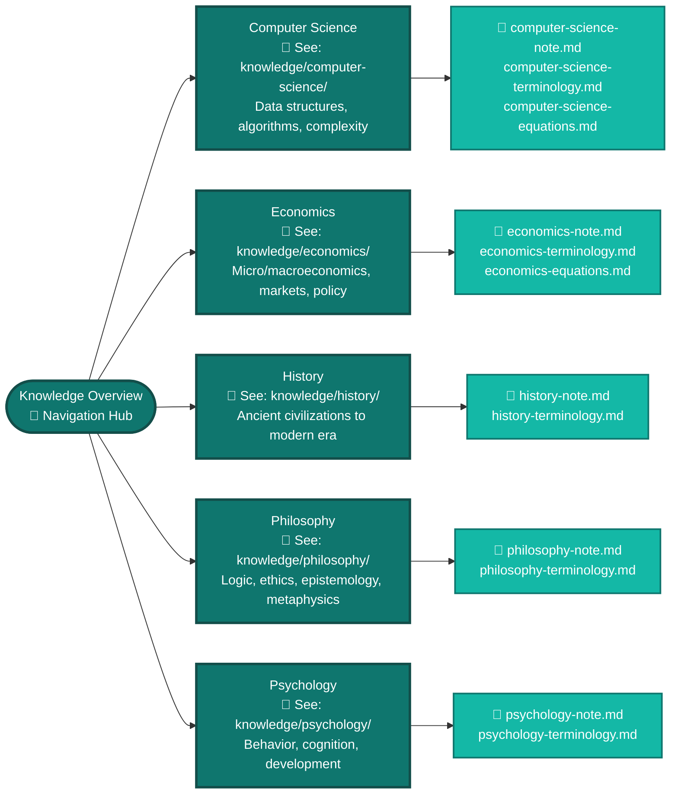

```mermaid
flowchart LR
    Start([Knowledge Overview<br/>🧭 Navigation Hub]):::teal
    Start --> CS["Computer Science<br/>📂 See: knowledge/computer-science/<br/>Data structures, algorithms, complexity"]:::teal
    Start --> Econ["Economics<br/>📂 See: knowledge/economics/<br/>Micro/macroeconomics, markets, policy"]:::teal
    Start --> Hist["History<br/>📂 See: knowledge/history/<br/>Ancient civilizations to modern era"]:::teal
    Start --> Phil["Philosophy<br/>📂 See: knowledge/philosophy/<br/>Logic, ethics, epistemology, metaphysics"]:::teal
    Start --> Psych["Psychology<br/>📂 See: knowledge/psychology/<br/>Behavior, cognition, development"]:::teal

    CS --> CSDetails["📄 computer-science-note.md<br/>computer-science-terminology.md<br/>computer-science-equations.md"]:::lightteal

    Econ --> EconDetails["📄 economics-note.md<br/>economics-terminology.md<br/>economics-equations.md"]:::lightteal

    Hist --> HistDetails["📄 history-note.md<br/>history-terminology.md"]:::lightteal

    Phil --> PhilDetails["📄 philosophy-note.md<br/>philosophy-terminology.md"]:::lightteal

    Psych --> PsychDetails["📄 psychology-note.md<br/>psychology-terminology.md"]:::lightteal

    classDef teal fill:#0f766e,stroke:#134e4a,stroke-width:3px,color:#fff
    classDef lightteal fill:#14b8a6,stroke:#0f766e,stroke-width:2px,color:#fff
    classDef paleteal fill:#2dd4bf,stroke:#14b8a6,stroke-width:2px,color:#000
    classDef mintteal fill:#99f6e4,stroke:#2dd4bf,stroke-width:1px,color:#000
```
