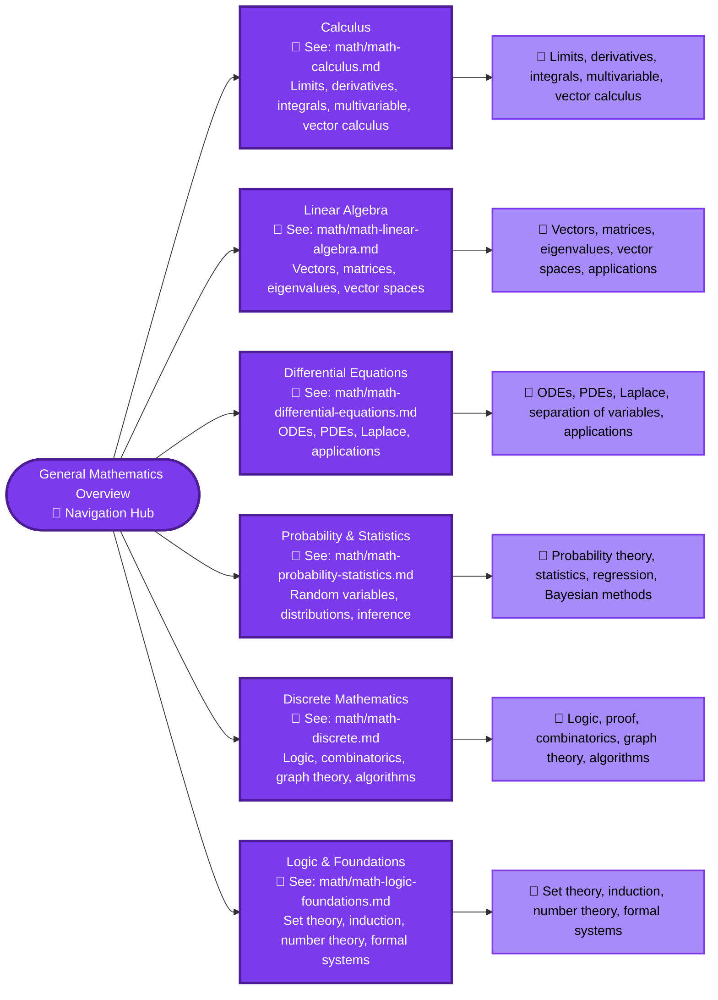

```mermaid
flowchart LR
    Start([General Mathematics Overview<br/>🧭 Navigation Hub]):::purple
    Start --> Calculus["Calculus<br/>📂 See: math/math-calculus.md<br/>Limits, derivatives, integrals, multivariable, vector calculus"]:::purple
    Start --> LinearAlgebra["Linear Algebra<br/>📂 See: math/math-linear-algebra.md<br/>Vectors, matrices, eigenvalues, vector spaces"]:::purple
    Start --> DiffEq["Differential Equations<br/>📂 See: math/math-differential-equations.md<br/>ODEs, PDEs, Laplace, applications"]:::purple
    Start --> Probability["Probability & Statistics<br/>📂 See: math/math-probability-statistics.md<br/>Random variables, distributions, inference"]:::purple
    Start --> DiscreteMath["Discrete Mathematics<br/>📂 See: math/math-discrete.md<br/>Logic, combinatorics, graph theory, algorithms"]:::purple
    Start --> LogicFoundations["Logic & Foundations<br/>📂 See: math/math-logic-foundations.md<br/>Set theory, induction, number theory, formal systems"]:::purple

    Calculus --> CalculusDetails[📄 Limits, derivatives, integrals, multivariable, vector calculus]:::lightpurple
    LinearAlgebra --> LinearAlgebraDetails[📄 Vectors, matrices, eigenvalues, vector spaces, applications]:::lightpurple
    DiffEq --> DiffEqDetails[📄 ODEs, PDEs, Laplace, separation of variables, applications]:::lightpurple
    Probability --> ProbabilityDetails[📄 Probability theory, statistics, regression, Bayesian methods]:::lightpurple
    DiscreteMath --> DiscreteMathDetails[📄 Logic, proof, combinatorics, graph theory, algorithms]:::lightpurple
    LogicFoundations --> LogicFoundationsDetails[📄 Set theory, induction, number theory, formal systems]:::lightpurple

    classDef purple fill:#7c3aed,stroke:#4c1d95,stroke-width:3px,color:#fff
    classDef lightpurple fill:#a78bfa,stroke:#7c3aed,stroke-width:2px,color:#000
```
