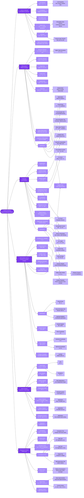

```mermaid
flowchart LR
    Start([Calculus Overview<br/>Study of continuous change]):::purple
    
    Start --> Limits["Limits & Continuity<br/>Foundation of calculus"]:::purple
    Start --> Derivatives["Differentiation<br/>Rates of change"]:::purple
    Start --> Integrals["Integration<br/>Accumulation"]:::purple
    Start --> Multivariable["Multivariable Calculus<br/>Functions of several variables"]:::purple
    Start --> VectorCalc["Vector Calculus<br/>Calculus in vector fields"]:::purple
    Start --> Series["Sequences & Series<br/>Infinite sums"]:::purple
    
    %% Limits & Continuity
    Limits --> LimitDef["Limit Definition<br/>lim x→a f-x- = L"]:::lightpurple
    Limits --> EpsilonDelta["ε-δ Definition<br/>Rigorous formulation"]:::lightpurple
    Limits --> OneSided["One-Sided Limits<br/>Left and right limits"]:::lightpurple
    Limits --> Infinite["Infinite Limits<br/>lim x→∞, vertical asymptotes"]:::lightpurple
    Limits --> Continuity["Continuity<br/>f-a- = lim x→a f-x-"]:::lightpurple
    Limits --> Discontinuities["Types of Discontinuities<br/>Removable, jump, infinite"]:::lightpurple
    
    LimitDef --> LimitProps["Limit Properties<br/>Sum, product, quotient rules"]:::palepurple
    Continuity --> IVT["Intermediate Value Theorem<br/>Continuous on closed interval"]:::palepurple
    Continuity --> EVT["Extreme Value Theorem<br/>Max and min exist"]:::palepurple
    
    %% Differentiation
    Derivatives --> DerivativeDef["Derivative Definition<br/>f'-x- = lim h→0 (f-x+h- - f-x-)/h"]:::lightpurple
    Derivatives --> GeometricMeaning["Geometric Meaning<br/>Slope of tangent line"]:::lightpurple
    Derivatives --> PowerRule["Power Rule<br/>d/dx x^n = nx^-n-1-"]:::lightpurple
    Derivatives --> ProductRule["Product Rule<br/>-uv-' = u'v + uv'"]:::lightpurple
    Derivatives --> QuotientRule["Quotient Rule<br/>-u/v-' = -u'v - uv'-/v²"]:::lightpurple
    Derivatives --> ChainRule["Chain Rule<br/>d/dx f-g-x-- = f'-g-x--g'-x-"]:::lightpurple
    Derivatives --> ImplicitDiff["Implicit Differentiation<br/>Differentiate both sides"]:::lightpurple
    Derivatives --> Logarithmic["Logarithmic Differentiation<br/>Use ln to simplify"]:::lightpurple
    
    DerivativeDef --> HigherOrder["Higher Order Derivatives<br/>f'', f''', f^-n-"]:::palepurple
    ChainRule --> RelatedRates["Related Rates<br/>Rates of change relationships"]:::palepurple
    ImplicitDiff --> Tangent["Tangent Lines<br/>y - y₀ = m-x - x₀-"]:::palepurple
    
    Derivatives --> Applications[Applications]:::lightpurple
    Applications --> Optimization["Optimization<br/>Max/min problems"]:::palepurple
    Applications --> CriticalPoints["Critical Points<br/>f'-x- = 0 or undefined"]:::palepurple
    Applications --> FirstDeriv["First Derivative Test<br/>Increasing/decreasing"]:::palepurple
    Applications --> SecondDeriv["Second Derivative Test<br/>Concavity, inflection points"]:::palepurple
    Applications --> MVT["Mean Value Theorem<br/>f'-c- = (f-b- - f-a-)/(b-a)"]:::palepurple
    Applications --> LHopital["L'Hôpital's Rule<br/>Indeterminate forms"]:::palepurple
    
    %% Integration
    Integrals --> Antiderivative["Antiderivative<br/>F'-x- = f-x-"]:::lightpurple
    Integrals --> IndefiniteInt["Indefinite Integral<br/>∫f-x-dx = F-x- + C"]:::lightpurple
    Integrals --> DefiniteInt["Definite Integral<br/>∫ₐᵇ f-x-dx"]:::lightpurple
    Integrals --> FTC["Fundamental Theorem<br/>∫ₐᵇ f-x-dx = F-b- - F-a-"]:::lightpurple
    Integrals --> Substitution["u-Substitution<br/>∫f-g-x--g'-x-dx"]:::lightpurple
    Integrals --> ByParts["Integration by Parts<br/>∫udv = uv - ∫vdu"]:::lightpurple
    Integrals --> PartialFrac["Partial Fractions<br/>Decompose rational functions"]:::lightpurple
    Integrals --> TrigSub["Trigonometric Substitution<br/>Handle radicals"]:::lightpurple
    
    DefiniteInt --> GeometricArea["Geometric Interpretation<br/>Area under curve"]:::palepurple
    DefiniteInt --> Accumulation["Accumulation Function<br/>A-x- = ∫ₐˣ f-t-dt"]:::palepurple
    FTC --> FTC1["FTC Part 1<br/>d/dx ∫ₐˣ f-t-dt = f-x-"]:::palepurple
    FTC --> FTC2["FTC Part 2<br/>Evaluation theorem"]:::palepurple
    
    Integrals --> IntApplications[Applications]:::lightpurple
    IntApplications --> AreaBetween["Area Between Curves<br/>∫[f-x- - g-x--dx"]:::palepurple
    IntApplications --> Volume["Volume of Revolution<br/>Disk, washer, shell methods"]:::palepurple
    IntApplications --> ArcLength["Arc Length<br/>∫√-1 + -f'-x--²-dx"]:::palepurple
    IntApplications --> SurfaceArea["Surface Area<br/>Revolution surfaces"]:::palepurple
    IntApplications --> Work["Work & Energy<br/>W = ∫F-x-dx"]:::palepurple
    IntApplications --> Improper["Improper Integrals<br/>Infinite limits/discontinuities"]:::palepurple
    
    %% Sequences & Series
    Series --> Sequences["Sequences<br/>Ordered list: aₙ"]:::lightpurple
    Series --> Convergence["Convergence<br/>lim n→∞ aₙ exists"]:::lightpurple
    Series --> InfiniteSeries["Infinite Series<br/>∑ₙ₌₁^∞ aₙ"]:::lightpurple
    Series --> GeometricSeries["Geometric Series<br/>∑arⁿ = a/(1-r) if magnitude-r- < 1"]:::lightpurple
    Series --> ConvergenceTests[Convergence Tests]:::lightpurple
    
    ConvergenceTests --> ComparisonTest["Comparison Test<br/>Compare with known series"]:::palepurple
    ConvergenceTests --> RatioTest["Ratio Test<br/>lim magnitude-aₙ₊₁/aₙ-"]:::palepurple
    ConvergenceTests --> RootTest["Root Test<br/>lim magnitude-aₙ-^(1/n)"]:::palepurple
    ConvergenceTests --> IntegralTest["Integral Test<br/>Compare to integral"]:::palepurple
    ConvergenceTests --> AlternatingTest["Alternating Series Test<br/>Leibniz criterion"]:::palepurple
    
    Series --> PowerSeries["Power Series<br/>∑cₙ-x-a-ⁿ"]:::lightpurple
    Series --> TaylorSeries["Taylor Series<br/>f-x- = ∑f^-n--a-/n!-x-a-ⁿ"]:::lightpurple
    Series --> MaclaurinSeries["Maclaurin Series<br/>Taylor series at a=0"]:::lightpurple
    
    PowerSeries --> RadiusConv["Radius of Convergence<br/>Interval where series converges"]:::palepurple
    TaylorSeries --> TaylorApprox["Taylor Approximations<br/>Polynomial approximations"]:::palepurple
    TaylorSeries --> CommonSeries["Common Series<br/>eˣ, sin-x-, cos-x-, ln-1+x-"]:::palepurple
    
    %% Multivariable Calculus
    Multivariable --> Functions2Var["Functions of 2+ Variables<br/>f-x,y,z-"]:::lightpurple
    Multivariable --> PartialDeriv["Partial Derivatives<br/>∂f/∂x, ∂f/∂y"]:::lightpurple
    Multivariable --> Gradient["Gradient Vector<br/>∇f = ⟨∂f/∂x, ∂f/∂y⟩"]:::lightpurple
    Multivariable --> DirectionalDeriv["Directional Derivative<br/>Dᵤf = ∇f · u"]:::lightpurple
    Multivariable --> ChainRuleMulti["Chain Rule<br/>Multivariable version"]:::lightpurple
    Multivariable --> Tangent["Tangent Plane<br/>Linear approximation"]:::lightpurple
    
    PartialDeriv --> HigherPartial["Higher Order Partials<br/>fₓₓ, fₓᵧ, fᵧᵧ"]:::palepurple
    HigherPartial --> Clairaut["Clairaut's Theorem<br/>fₓᵧ = fᵧₓ if continuous"]:::palepurple
    Gradient --> GradientProps["Gradient Properties<br/>Points in direction of max increase"]:::palepurple
    
    Multivariable --> OptimizationMulti[Optimization]:::lightpurple
    OptimizationMulti --> CriticalPtsMulti["Critical Points<br/>∇f = 0"]:::palepurple
    OptimizationMulti --> SecondDerivTest["Second Derivative Test<br/>Hessian matrix D"]:::palepurple
    OptimizationMulti --> Lagrange["Lagrange Multipliers<br/>Constrained optimization"]:::palepurple
    
    Multivariable --> DoubleInt["Double Integrals<br/>∬f-x,y-dA"]:::lightpurple
    Multivariable --> TripleInt["Triple Integrals<br/>∭f-x,y,z-dV"]:::lightpurple
    Multivariable --> ChangeVar["Change of Variables<br/>Jacobian determinant"]:::lightpurple
    
    DoubleInt --> IteratedInt["Iterated Integrals<br/>∫∫f-x,y-dxdy"]:::palepurple
    DoubleInt --> PolarCoord["Polar Coordinates<br/>r, θ"]:::palepurple
    TripleInt --> Cylindrical["Cylindrical Coordinates<br/>r, θ, z"]:::palepurple
    TripleInt --> Spherical["Spherical Coordinates<br/>ρ, θ, φ"]:::palepurple
    ChangeVar --> Jacobian["Jacobian<br/>det(∂(x,y)/∂(u,v))"]:::palepurple
    
    %% Vector Calculus
    VectorCalc --> VectorFields["Vector Fields<br/>F-x,y,z- = ⟨P,Q,R⟩"]:::lightpurple
    VectorCalc --> LineIntegrals["Line Integrals<br/>∫ᴄF·dr"]:::lightpurple
    VectorCalc --> SurfaceIntegrals["Surface Integrals<br/>∬ₛF·dS"]:::lightpurple
    VectorCalc --> Conservative["Conservative Fields<br/>∇f = F"]:::lightpurple
    
    VectorFields --> Curl["Curl<br/>∇ × F"]:::palepurple
    VectorFields --> Divergence["Divergence<br/>∇ · F"]:::palepurple
    Conservative --> PathIndep["Path Independence<br/>∫F·dr independent of path"]:::palepurple
    Conservative --> PotentialFunc["Potential Function<br/>f such that ∇f = F"]:::palepurple
    
    VectorCalc --> Greens["Green's Theorem<br/>∮ᴄF·dr = ∬ᴅ-∂Q/∂x - ∂P/∂y-dA"]:::lightpurple
    VectorCalc --> Stokes["Stokes' Theorem<br/>∮ᴄF·dr = ∬ₛ-∇×F-·dS"]:::lightpurple
    VectorCalc --> Divergence2["Divergence Theorem<br/>∬ₛF·dS = ∭ᴇ-∇·F-dV"]:::lightpurple
    
    Greens --> GreensApp["Applications<br/>Area, circulation, flux"]:::palepurple
    Stokes --> StokesApp["Applications<br/>Circulation and curl"]:::palepurple
    Divergence2 --> DivApp["Applications<br/>Flux through closed surface"]:::palepurple
    
    classDef purple fill:#7c3aed,stroke:#4c1d95,stroke-width:3px,color:#fff
    classDef lightpurple fill:#a78bfa,stroke:#7c3aed,stroke-width:2px,color:#fff
    classDef palepurple fill:#c4b5fd,stroke:#a78bfa,stroke-width:1px,color:#000
```
