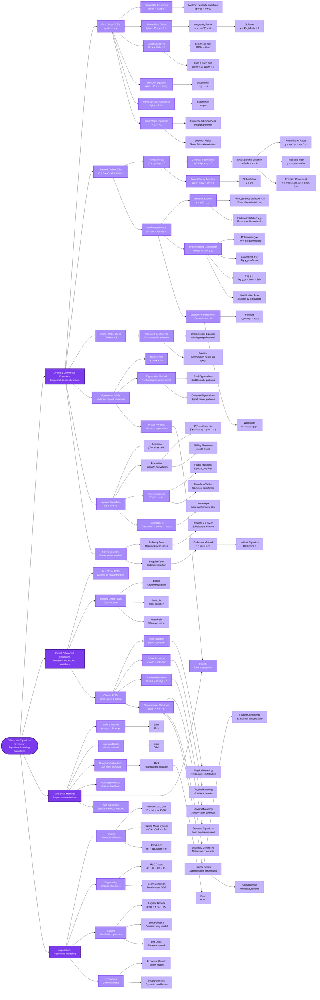

```mermaid
flowchart LR
    Start([Differential Equations Overview<br/>Equations involving derivatives]):::purple
    
    Start --> ODEs["Ordinary Differential Equations<br/>Single independent variable"]:::purple
    Start --> PDEs["Partial Differential Equations<br/>Multiple independent variables"]:::purple
    Start --> NumericalMethods["Numerical Methods<br/>Approximate solutions"]:::purple
    Start --> Applications["Applications<br/>Real-world modeling"]:::purple
    
    %% ODEs
    ODEs --> FirstOrder["First Order ODEs<br/>dy/dx = f-x,y-"]:::lightpurple
    ODEs --> SecondOrder["Second Order ODEs<br/>y'' + p-x-y' + q-x-y = g-x-"]:::lightpurple
    ODEs --> HigherOrder["Higher Order ODEs<br/>Order n ≥ 3"]:::lightpurple
    ODEs --> Systems["Systems of ODEs<br/>Multiple coupled equations"]:::lightpurple
    
    %% First Order ODEs
    FirstOrder --> Separable["Separable Equations<br/>dy/dx = f-x-g-y-"]:::lightpurple
    FirstOrder --> Linear1st["Linear First Order<br/>dy/dx + P-x-y = Q-x-"]:::lightpurple
    FirstOrder --> Exact["Exact Equations<br/>M dx + N dy = 0"]:::lightpurple
    FirstOrder --> Bernoulli["Bernoulli Equation<br/>dy/dx + P-x-y = Q-x-yⁿ"]:::lightpurple
    FirstOrder --> Homogeneous["Homogeneous Equations<br/>dy/dx = f-y/x-"]:::lightpurple
    
    Separable --> SeparableMethod["Method: Separate variables<br/>∫g-y-dy = ∫f-x-dx"]:::palepurple
    Linear1st --> IntegratingFactor["Integrating Factor<br/>μ-x- = e^∫P-x-dx"]:::palepurple
    IntegratingFactor --> LinearSolution["Solution<br/>y = 1/μ ∫μQ dx + C"]:::palepurple
    Exact --> ExactTest["Exactness Test<br/>∂M/∂y = ∂N/∂x"]:::palepurple
    Exact --> ExactSolution["Find ψ such that<br/>∂ψ/∂x = M, ∂ψ/∂y = N"]:::palepurple
    Bernoulli --> BernoulliSub["Substitution<br/>v = y^-1-n-"]:::palepurple
    Homogeneous --> HomogSub["Substitution<br/>v = y/x"]:::palepurple
    
    FirstOrder --> IVP["Initial Value Problems<br/>y-x₀- = y₀"]:::lightpurple
    IVP --> ExistenceUniqueness["Existence & Uniqueness<br/>Picard's theorem"]:::palepurple
    IVP --> DirectionFields["Direction Fields<br/>Slope fields visualization"]:::palepurple
    
    %% Second Order ODEs
    SecondOrder --> Homogeneous2nd["Homogeneous<br/>y'' + py' + qy = 0"]:::lightpurple
    SecondOrder --> Nonhomogeneous["Nonhomogeneous<br/>y'' + py' + qy = g-x-"]:::lightpurple
    
    Homogeneous2nd --> ConstantCoeff["Constant Coefficients<br/>ay'' + by' + cy = 0"]:::lightpurple
    ConstantCoeff --> CharEq["Characteristic Equation<br/>ar² + br + c = 0"]:::palepurple
    CharEq --> RealDistinct["Real Distinct Roots<br/>y = c₁e^r₁x + c₂e^r₂x"]:::palepurple
    CharEq --> RepeatedRoot["Repeated Root<br/>y = -c₁ + c₂x-e^rx"]:::palepurple
    CharEq --> ComplexRoots["Complex Roots α±iβ<br/>y = e^αx-c₁cos-βx- + c₂sin-βx--"]:::palepurple
    
    Homogeneous2nd --> EulerCauchy["Euler-Cauchy Equation<br/>ax²y'' + bxy' + cy = 0"]:::lightpurple
    EulerCauchy --> EulerSub["Substitution<br/>y = x^r"]:::palepurple
    
    Nonhomogeneous --> GeneralSolution["General Solution<br/>y = y_h + y_p"]:::lightpurple
    GeneralSolution --> HomogeneousSol["Homogeneous Solution y_h<br/>From characteristic eq"]:::palepurple
    GeneralSolution --> ParticularSol["Particular Solution y_p<br/>From specific methods"]:::palepurple
    
    Nonhomogeneous --> UndeterminedCoeff["Undetermined Coefficients<br/>Guess form of y_p"]:::lightpurple
    UndeterminedCoeff --> UCPolynomial["Polynomial g-x-<br/>Try y_p = polynomial"]:::palepurple
    UndeterminedCoeff --> UCExponential["Exponential g-x-<br/>Try y_p = Ae^ax"]:::palepurple
    UndeterminedCoeff --> UCTrig["Trig g-x-<br/>Try y_p = Acos + Bsin"]:::palepurple
    UndeterminedCoeff --> Modification["Modification Rule<br/>Multiply by x if overlap"]:::palepurple
    
    Nonhomogeneous --> VariationParams["Variation of Parameters<br/>General method"]:::lightpurple
    VariationParams --> VarParamFormula["Formula<br/>y_p = u₁y₁ + u₂y₂"]:::palepurple
    VariationParams --> Wronskian["Wronskian<br/>W = y₁y₂' - y₂y₁'"]:::palepurple
    
    %% Higher Order and Systems
    HigherOrder --> HigherConstant["Constant Coefficients<br/>Characteristic equation"]:::lightpurple
    HigherConstant --> HigherChar["Characteristic Equation<br/>nth degree polynomial"]:::palepurple
    HigherConstant --> HigherSolution["Solution<br/>Combination based on roots"]:::palepurple
    
    Systems --> MatrixForm["Matrix Form<br/>x' = Ax + f-t-"]:::lightpurple
    Systems --> Eigenvalue["Eigenvalue Method<br/>For homogeneous systems"]:::lightpurple
    Systems --> PhasePortrait["Phase Portraits<br/>Visualize trajectories"]:::lightpurple
    
    Eigenvalue --> RealEigen["Real Eigenvalues<br/>Saddle, node patterns"]:::palepurple
    Eigenvalue --> ComplexEigen["Complex Eigenvalues<br/>Spiral, center patterns"]:::palepurple
    PhasePortrait --> Stability["Stability Analysis<br/>Stable, unstable, center"]:::palepurple
    
    %% Laplace Transform
    ODEs --> Laplace["Laplace Transform<br/>ℒ(f-t-) = F-s-"]:::lightpurple
    Laplace --> LaplaceDef["Definition<br/>∫₀^∞ e^-st f-t-dt"]:::palepurple
    Laplace --> LaplaceProps["Properties<br/>Linearity, derivatives"]:::palepurple
    
    LaplaceProps --> LaplaceDerivative["ℒ(f') = sF-s- - f-0-<br/>ℒ(f'') = s²F-s- - sf-0- - f'-0-"]:::palepurple
    LaplaceProps --> LaplaceShift["Shifting Theorems<br/>s-shift, t-shift"]:::palepurple
    
    Laplace --> InverseLaplace["Inverse Laplace<br/>ℒ⁻¹(F-s-) = f-t-"]:::lightpurple
    InverseLaplace --> PartialFractions["Partial Fractions<br/>Decompose F-s-"]:::palepurple
    InverseLaplace --> LaplaceTable["Transform Tables<br/>Common transforms"]:::palepurple
    
    Laplace --> LaplaceIVP["Solving IVPs<br/>Transform → solve → invert"]:::lightpurple
    LaplaceIVP --> LaplaceAdvantage["Advantage<br/>Initial conditions built in"]:::palepurple
    
    %% Series Solutions
    ODEs --> SeriesSolutions["Series Solutions<br/>Power series method"]:::lightpurple
    SeriesSolutions --> OrdinaryPoint["Ordinary Point<br/>Regular power series"]:::palepurple
    SeriesSolutions --> SingularPoint["Singular Point<br/>Frobenius method"]:::palepurple
    
    OrdinaryPoint --> PowerSeries["Assume y = Σaₙxⁿ<br/>Substitute and solve"]:::palepurple
    SingularPoint --> Frobenius["Frobenius Method<br/>y = Σaₙx^-n+r-"]:::palepurple
    Frobenius --> IndicalEq["Indicial Equation<br/>Determine r"]:::palepurple
    
    %% PDEs
    PDEs --> FirstOrderPDE["First Order PDEs<br/>Method of characteristics"]:::lightpurple
    PDEs --> SecondOrderPDE["Second Order PDEs<br/>Classification"]:::lightpurple
    PDEs --> ClassicPDEs["Classic PDEs<br/>Heat, wave, Laplace"]:::lightpurple
    
    SecondOrderPDE --> Elliptic["Elliptic<br/>Laplace equation"]:::palepurple
    SecondOrderPDE --> Parabolic["Parabolic<br/>Heat equation"]:::palepurple
    SecondOrderPDE --> Hyperbolic["Hyperbolic<br/>Wave equation"]:::palepurple
    
    ClassicPDEs --> HeatEq["Heat Equation<br/>∂u/∂t = α∂²u/∂x²"]:::lightpurple
    ClassicPDEs --> WaveEq["Wave Equation<br/>∂²u/∂t² = c²∂²u/∂x²"]:::lightpurple
    ClassicPDEs --> LaplaceEq["Laplace Equation<br/>∂²u/∂x² + ∂²u/∂y² = 0"]:::lightpurple
    
    HeatEq --> HeatPhysical["Physical Meaning<br/>Temperature distribution"]:::palepurple
    WaveEq --> WavePhysical["Physical Meaning<br/>Vibrations, waves"]:::palepurple
    LaplaceEq --> LaplacePhysical["Physical Meaning<br/>Steady-state, potential"]:::palepurple
    
    %% Separation of Variables
    ClassicPDEs --> SeparationVar["Separation of Variables<br/>u-x,t- = X-x-T-t-"]:::lightpurple
    SeparationVar --> SeparateEq["Separate Equations<br/>Each equals constant"]:::palepurple
    SeparationVar --> BoundaryConditions["Boundary Conditions<br/>Determine constants"]:::palepurple
    SeparationVar --> FourierSeries["Fourier Series<br/>Superposition of solutions"]:::palepurple
    
    FourierSeries --> FourierCoeff["Fourier Coefficients<br/>aₙ, bₙ from orthogonality"]:::palepurple
    FourierSeries --> Convergence["Convergence<br/>Pointwise, uniform"]:::palepurple
    
    %% Numerical Methods
    NumericalMethods --> Euler["Euler's Method<br/>yₙ₊₁ = yₙ + hf-xₙ,yₙ-"]:::lightpurple
    NumericalMethods --> ImprovedEuler["Improved Euler<br/>Heun's method"]:::lightpurple
    NumericalMethods --> RungeKutta["Runge-Kutta Methods<br/>RK4 most common"]:::lightpurple
    NumericalMethods --> Multistep["Multistep Methods<br/>Adams-Bashforth"]:::lightpurple
    
    Euler --> EulerError["Error<br/>O-h-"]:::palepurple
    ImprovedEuler --> ImprovedError["Error<br/>O-h²-"]:::palepurple
    RungeKutta --> RK4["RK4<br/>Fourth order accuracy"]:::palepurple
    RK4 --> RK4Error["Error<br/>O-h⁴-"]:::palepurple
    
    NumericalMethods --> Stability["Stability<br/>Error propagation"]:::lightpurple
    NumericalMethods --> StiffEquations["Stiff Equations<br/>Special methods needed"]:::lightpurple
    
    %% Applications
    Applications --> Physics["Physics<br/>Motion, oscillations"]:::lightpurple
    Applications --> Engineering["Engineering<br/>Circuits, structures"]:::lightpurple
    Applications --> Biology["Biology<br/>Population dynamics"]:::lightpurple
    Applications --> Economics["Economics<br/>Growth models"]:::lightpurple
    
    Physics --> NewtonLaw["Newton's 2nd Law<br/>F = ma = m d²x/dt²"]:::palepurple
    Physics --> SpringMass["Spring-Mass System<br/>my'' + cy' + ky = F-t-"]:::palepurple
    Physics --> Pendulum["Pendulum<br/>θ'' + -g/L-sin-θ- = 0"]:::palepurple
    
    Engineering --> RLC["RLC Circuit<br/>LI'' + RI' + I/C = E'-t-"]:::palepurple
    Engineering --> Beam["Beam Deflection<br/>Fourth order ODE"]:::palepurple
    
    Biology --> Logistic["Logistic Growth<br/>dP/dt = rP-1 - P/K-"]:::palepurple
    Biology --> LotkaVolterra["Lotka-Volterra<br/>Predator-prey model"]:::palepurple
    Biology --> Epidemics["SIR Model<br/>Disease spread"]:::palepurple
    
    Economics --> GrowthModels["Economic Growth<br/>Solow model"]:::palepurple
    Economics --> SupplyDemand["Supply-Demand<br/>Dynamic equilibrium"]:::palepurple
    
    classDef purple fill:#7c3aed,stroke:#4c1d95,stroke-width:3px,color:#fff
    classDef lightpurple fill:#a78bfa,stroke:#7c3aed,stroke-width:2px,color:#fff
    classDef palepurple fill:#c4b5fd,stroke:#a78bfa,stroke-width:1px,color:#000
```
