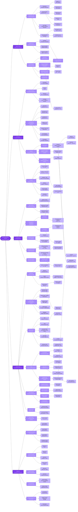

```mermaid
flowchart LR
    Start([Discrete Mathematics Overview<br/>Structures and counting]):::purple
    
    Start --> Logic["Logic & Proofs<br/>Mathematical reasoning"]:::purple
    Start --> Sets["Set Theory<br/>Collections and relations"]:::purple
    Start --> Combinatorics["Combinatorics<br/>Counting principles"]:::purple
    Start --> GraphTheory["Graph Theory<br/>Networks and connections"]:::purple
    Start --> Algorithms["Algorithms<br/>Computational procedures"]:::purple
    
    %% Logic & Proofs
    Logic --> PropositionalLogic["Propositional Logic<br/>True/false statements"]:::lightpurple
    Logic --> PredicateLogic["Predicate Logic<br/>Quantified statements"]:::lightpurple
    Logic --> ProofTechniques["Proof Techniques<br/>Methods of proving"]:::lightpurple
    
    PropositionalLogic --> Propositions["Propositions<br/>Declarative statements"]:::palepurple
    PropositionalLogic --> LogicalOps["Logical Operators<br/>AND, OR, NOT, →, ↔"]:::palepurple
    PropositionalLogic --> TruthTables["Truth Tables<br/>Evaluate compound statements"]:::palepurple
    PropositionalLogic --> LogicalEquiv["Logical Equivalence<br/>Tautologies"]:::palepurple
    
    LogicalOps --> Negation["Negation ¬p<br/>NOT operator"]:::palepurple
    LogicalOps --> Conjunction["Conjunction p∧q<br/>AND operator"]:::palepurple
    LogicalOps --> Disjunction["Disjunction p∨q<br/>OR operator"]:::palepurple
    LogicalOps --> Implication["Implication p→q<br/>If-then"]:::palepurple
    LogicalOps --> Biconditional["Biconditional p↔q<br/>If and only if"]:::palepurple
    
    LogicalEquiv --> DeMorgan["De Morgan's Laws<br/>¬-p∧q- ≡ ¬p∨¬q"]:::palepurple
    LogicalEquiv --> Distributive["Distributive Laws<br/>p∧-q∨r- ≡ -p∧q-∨-p∧r-"]:::palepurple
    LogicalEquiv --> Contrapositive["Contrapositive<br/>p→q ≡ ¬q→¬p"]:::palepurple
    
    PredicateLogic --> Quantifiers["Quantifiers<br/>∀ universal, ∃ existential"]:::palepurple
    PredicateLogic --> NestedQuantifiers["Nested Quantifiers<br/>Multiple quantifiers"]:::palepurple
    PredicateLogic --> NegatingQuantifiers["Negating Quantifiers<br/>¬∀x P-x- ≡ ∃x ¬P-x-"]:::palepurple
    
    ProofTechniques --> DirectProof["Direct Proof<br/>Assume P, show Q"]:::lightpurple
    ProofTechniques --> Contrapositive["Proof by Contrapositive<br/>Show ¬Q → ¬P"]:::lightpurple
    ProofTechniques --> Contradiction["Proof by Contradiction<br/>Assume ¬Q, derive contradiction"]:::lightpurple
    ProofTechniques --> Induction["Mathematical Induction<br/>Base + inductive step"]:::lightpurple
    ProofTechniques --> Cases["Proof by Cases<br/>Exhaustive cases"]:::lightpurple
    
    Induction --> BaseCase["Base Case<br/>Verify P-1-"]:::palepurple
    Induction --> InductiveStep["Inductive Step<br/>P-k- → P-k+1-"]:::palepurple
    Induction --> StrongInduction["Strong Induction<br/>Assume P-1-,...,P-k-"]:::palepurple
    
    %% Set Theory
    Sets --> BasicSets["Basic Set Theory<br/>Elements and membership"]:::lightpurple
    Sets --> SetOps["Set Operations<br/>Union, intersection, complement"]:::lightpurple
    Sets --> Relations["Relations<br/>Connections between sets"]:::lightpurple
    Sets --> Functions["Functions<br/>Mappings between sets"]:::lightpurple
    
    BasicSets --> SetNotation["Set Notation<br/>A = (x pipe condition)"]:::palepurple
    BasicSets --> Subsets["Subsets<br/>A ⊆ B"]:::palepurple
    BasicSets --> PowerSet["Power Set<br/>P-A- = all subsets of A"]:::palepurple
    BasicSets --> Cardinality["Cardinality<br/>size-A- = number of elements"]:::palepurple
    
    SetOps --> UnionOp["Union A∪B<br/>Elements in A or B"]:::palepurple
    SetOps --> IntersectionOp["Intersection A∩B<br/>Elements in both"]:::palepurple
    SetOps --> ComplementOp["Complement Ā<br/>Elements not in A"]:::palepurple
    SetOps --> Difference["Difference A-B<br/>In A but not B"]:::palepurple
    SetOps --> CartesianProduct["Cartesian Product A×B<br/>Ordered pairs"]:::palepurple
    
    SetOps --> VennDiagrams["Venn Diagrams<br/>Visual representation"]:::palepurple
    SetOps --> SetIdentities["Set Identities<br/>De Morgan, distributive"]:::palepurple
    
    Relations --> BinaryRelation["Binary Relation<br/>R ⊆ A×B"]:::lightpurple
    BinaryRelation --> RelationProps["Properties<br/>Reflexive, symmetric, transitive"]:::palepurple
    
    RelationProps --> Reflexive["Reflexive<br/>-a,a- ∈ R for all a"]:::palepurple
    RelationProps --> Symmetric["Symmetric<br/>-a,b- ∈ R → -b,a- ∈ R"]:::palepurple
    RelationProps --> Transitive["Transitive<br/>-a,b-,-b,c- ∈ R → -a,c- ∈ R"]:::palepurple
    RelationProps --> Antisymmetric["Antisymmetric<br/>-a,b-,-b,a- ∈ R → a=b"]:::palepurple
    
    Relations --> EquivRelation["Equivalence Relation<br/>Reflexive, symmetric, transitive"]:::lightpurple
    EquivRelation --> EquivClasses["Equivalence Classes<br/>Partition of set"]:::palepurple
    
    Relations --> PartialOrder["Partial Order<br/>Reflexive, antisymmetric, transitive"]:::lightpurple
    PartialOrder --> Poset["Poset<br/>Partially ordered set"]:::palepurple
    PartialOrder --> HasseDiagram["Hasse Diagram<br/>Visual representation"]:::palepurple
    
    Functions --> FunctionDef["Function Definition<br/>f: A → B"]:::palepurple
    Functions --> Injective["Injective - One-to-one<br/>f-x₁- = f-x₂- → x₁ = x₂"]:::palepurple
    Functions --> Surjective["Surjective - Onto<br/>Every b ∈ B has preimage"]:::palepurple
    Functions --> Bijective["Bijective<br/>Injective + Surjective"]:::palepurple
    Functions --> Inverse["Inverse Function<br/>f⁻¹ exists if bijective"]:::palepurple
    Functions --> Composition["Composition<br/>-g∘f--x- = g-f-x--"]:::palepurple
    
    %% Combinatorics
    Combinatorics --> BasicCounting["Basic Counting<br/>Fundamental principles"]:::lightpurple
    Combinatorics --> PermComb["Permutations & Combinations<br/>Arrangements"]:::lightpurple
    Combinatorics --> BinomialTheorem["Binomial Theorem<br/>-x+y-ⁿ expansion"]:::lightpurple
    Combinatorics --> GeneratingFunctions["Generating Functions<br/>Encode sequences"]:::lightpurple
    Combinatorics --> RecurrenceRelations["Recurrence Relations<br/>Recursive sequences"]:::lightpurple
    
    BasicCounting --> AdditionPrinciple["Addition Principle<br/>Mutually exclusive choices"]:::palepurple
    BasicCounting --> MultiplicationPrinc["Multiplication Principle<br/>Sequential choices"]:::palepurple
    BasicCounting --> PigeonholePrinciple["Pigeonhole Principle<br/>n+1 pigeons, n holes"]:::palepurple
    
    PermComb --> PermutationsCount["Permutations<br/>P-n,r- = n!/-n-r-!"]:::lightpurple
    PermComb --> CombinationsCount["Combinations<br/>C(n,r) = n!/(r!(n-r)!)"]:::lightpurple
    
    PermutationsCount --> CircularPerm["Circular Permutations<br/>-n-1-!"]:::palepurple
    PermutationsCount --> PermWithRep["Permutations with Repetition<br/>n!/-n₁!n₂!...nₖ!-"]:::palepurple
    
    CombinationsCount --> CombWithRep["Combinations with Repetition<br/>C-n+r-1,r-"]:::palepurple
    CombinationsCount --> PascalsTriangle["Pascal's Triangle<br/>C-n,r- pattern"]:::palepurple
    
    BinomialTheorem --> BinomialExpansion["Expansion<br/>-x+y-ⁿ = Σ C-n,k- xᵏyⁿ⁻ᵏ"]:::palepurple
    BinomialTheorem --> BinomialCoeff["Binomial Coefficients<br/>C-n,k- properties"]:::palepurple
    
    GeneratingFunctions --> OrdinaryGF["Ordinary Generating Function<br/>G-x- = Σ aₙxⁿ"]:::palepurple
    GeneratingFunctions --> ExponentialGF["Exponential Generating Function<br/>E-x- = Σ aₙxⁿ/n!"]:::palepurple
    
    RecurrenceRelations --> LinearRecurrence["Linear Recurrence<br/>aₙ = c₁aₙ₋₁ + c₂aₙ₋₂ + ..."]:::lightpurple
    LinearRecurrence --> CharacteristicEq["Characteristic Equation<br/>Solve for closed form"]:::palepurple
    LinearRecurrence --> Fibonacci["Fibonacci Sequence<br/>Fₙ = Fₙ₋₁ + Fₙ₋₂"]:::palepurple
    
    %% Graph Theory
    GraphTheory --> GraphBasics["Graph Basics<br/>Vertices and edges"]:::lightpurple
    GraphTheory --> GraphTypes["Graph Types<br/>Directed, undirected, weighted"]:::lightpurple
    GraphTheory --> GraphPaths["Paths & Cycles<br/>Connectivity"]:::lightpurple
    GraphTheory --> Trees["Trees<br/>Acyclic connected graphs"]:::lightpurple
    GraphTheory --> GraphAlgorithms["Graph Algorithms<br/>Traversal and optimization"]:::lightpurple
    
    GraphBasics --> VerticesEdges["Vertices V and Edges E<br/>G = -V,E-"]:::palepurple
    GraphBasics --> Adjacency["Adjacency<br/>Connected vertices"]:::palepurple
    GraphBasics --> Degree["Degree<br/>Number of edges at vertex"]:::palepurple
    GraphBasics --> GraphRepresentation["Representation<br/>Matrix, list"]:::palepurple
    
    Degree --> DegreeSum["Handshaking Lemma<br/>Σdeg(v) = 2 times size-E-"]:::palepurple
    
    GraphRepresentation --> AdjacencyMatrix["Adjacency Matrix<br/>n×n matrix"]:::palepurple
    GraphRepresentation --> AdjacencyList["Adjacency List<br/>List per vertex"]:::palepurple
    
    GraphTypes --> UndirectedGraph["Undirected Graph<br/>Symmetric edges"]:::palepurple
    GraphTypes --> DirectedGraph["Directed Graph - Digraph<br/>Ordered pairs"]:::palepurple
    GraphTypes --> WeightedGraph["Weighted Graph<br/>Edge weights"]:::palepurple
    GraphTypes --> SimpleGraph["Simple Graph<br/>No loops, no multiple edges"]:::palepurple
    GraphTypes --> Multigraph["Multigraph<br/>Multiple edges allowed"]:::palepurple
    
    GraphPaths --> Path["Path<br/>Sequence of vertices"]:::palepurple
    GraphPaths --> Cycle["Cycle<br/>Path returning to start"]:::palepurple
    GraphPaths --> Connected["Connected Graph<br/>Path between any two vertices"]:::palepurple
    GraphPaths --> EulerPath["Euler Path<br/>Visit each edge once"]:::palepurple
    GraphPaths --> HamiltonPath["Hamiltonian Path<br/>Visit each vertex once"]:::palepurple
    
    EulerPath --> EulerCircuit["Euler Circuit<br/>Euler path + cycle"]:::palepurple
    EulerPath --> EulerCondition["Condition<br/>All vertices even degree"]:::palepurple
    
    HamiltonPath --> HamiltonCycle["Hamiltonian Cycle<br/>Hamilton path + cycle"]:::palepurple
    
    Trees --> TreeDef["Tree Definition<br/>Connected acyclic graph"]:::lightpurple
    TreeDef --> TreeProps["Properties<br/>size-E- = size-V- - 1"]:::palepurple
    TreeDef --> RootedTree["Rooted Tree<br/>Designated root vertex"]:::palepurple
    
    Trees --> BinaryTree["Binary Tree<br/>≤2 children per node"]:::lightpurple
    BinaryTree --> FullBinaryTree["Full Binary Tree<br/>0 or 2 children"]:::palepurple
    BinaryTree --> CompleteBinaryTree["Complete Binary Tree<br/>Filled left to right"]:::palepurple
    BinaryTree --> TreeTraversal["Tree Traversal<br/>Preorder, inorder, postorder"]:::palepurple
    
    Trees --> SpanningTree["Spanning Tree<br/>Minimal connected subgraph"]:::lightpurple
    SpanningTree --> MinSpanningTree["Minimum Spanning Tree<br/>Minimum weight"]:::palepurple
    MinSpanningTree --> Kruskal["Kruskal's Algorithm<br/>Sort edges, add if no cycle"]:::palepurple
    MinSpanningTree --> Prim["Prim's Algorithm<br/>Grow tree from vertex"]:::palepurple
    
    GraphAlgorithms --> BFS["Breadth-First Search<br/>Level-by-level exploration"]:::lightpurple
    GraphAlgorithms --> DFS["Depth-First Search<br/>Explore deeply first"]:::lightpurple
    GraphAlgorithms --> Dijkstra["Dijkstra's Algorithm<br/>Shortest path"]:::lightpurple
    GraphAlgorithms --> FloydWarshall["Floyd-Warshall<br/>All pairs shortest paths"]:::lightpurple
    
    BFS --> BFSQueue["Implementation<br/>Use queue"]:::palepurple
    DFS --> DFSStack["Implementation<br/>Use stack or recursion"]:::palepurple
    Dijkstra --> DijkstraGreedy["Greedy approach<br/>Priority queue"]:::palepurple
    
    GraphTheory --> GraphColoring["Graph Coloring<br/>Vertex colors"]:::lightpurple
    GraphColoring --> ChromaticNumber["Chromatic Number<br/>Minimum colors needed"]:::palepurple
    GraphColoring --> FourColorTheorem["Four Color Theorem<br/>Planar graphs ≤ 4 colors"]:::palepurple
    
    GraphTheory --> PlanarGraphs["Planar Graphs<br/>Draw without edge crossings"]:::lightpurple
    PlanarGraphs --> EulerFormula["Euler's Formula<br/>v - e + f = 2"]:::palepurple
    
    %% Algorithms
    Algorithms --> Complexity["Computational Complexity<br/>Time and space"]:::lightpurple
    Algorithms --> SortingSearching["Sorting & Searching<br/>Organize and find data"]:::lightpurple
    Algorithms --> DivideConquer["Divide & Conquer<br/>Break into subproblems"]:::lightpurple
    Algorithms --> GreedyAlgorithms["Greedy Algorithms<br/>Local optimal choices"]:::lightpurple
    Algorithms --> DynamicProgramming["Dynamic Programming<br/>Memoization"]:::lightpurple
    
    Complexity --> BigO["Big O Notation<br/>Upper bound O-n-"]:::palepurple
    Complexity --> BigOmega["Big Ω Notation<br/>Lower bound Ω-n-"]:::palepurple
    Complexity --> BigTheta["Big Θ Notation<br/>Tight bound Θ-n-"]:::palepurple
    Complexity --> ComplexityClasses["Complexity Classes<br/>P, NP, NP-complete"]:::palepurple
    
    SortingSearching --> BubbleSort["Bubble Sort<br/>O-n²-"]:::palepurple
    SortingSearching --> MergeSort["Merge Sort<br/>O-n log n-"]:::palepurple
    SortingSearching --> QuickSort["Quick Sort<br/>Average O-n log n-"]:::palepurple
    SortingSearching --> BinarySearch["Binary Search<br/>O-log n-"]:::palepurple
    
    DivideConquer --> MergeSortDC["Merge Sort<br/>Divide, sort, merge"]:::palepurple
    DivideConquer --> QuickSortDC["Quick Sort<br/>Partition around pivot"]:::palepurple
    
    GreedyAlgorithms --> ActivitySelection["Activity Selection<br/>Max non-overlapping activities"]:::palepurple
    GreedyAlgorithms --> HuffmanCoding["Huffman Coding<br/>Optimal prefix codes"]:::palepurple
    
    DynamicProgramming --> Knapsack["0/1 Knapsack<br/>Maximize value"]:::palepurple
    DynamicProgramming --> LongestCommonSubseq["Longest Common Subsequence<br/>DP table"]:::palepurple
    DynamicProgramming --> Memoization["Memoization<br/>Store computed results"]:::palepurple
    
    classDef purple fill:#7c3aed,stroke:#4c1d95,stroke-width:3px,color:#fff
    classDef lightpurple fill:#a78bfa,stroke:#7c3aed,stroke-width:2px,color:#fff
    classDef palepurple fill:#c4b5fd,stroke:#a78bfa,stroke-width:1px,color:#000
```
