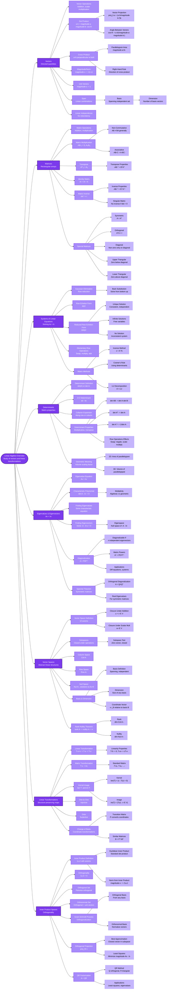

```mermaid
flowchart LR
    Start([Linear Algebra Overview<br/>Study of vectors and linear transformations]):::purple
    
    Start --> Vectors["Vectors<br/>Directed quantities"]:::purple
    Start --> Matrices["Matrices<br/>Rectangular arrays"]:::purple
    Start --> Systems["Systems of Linear Equations<br/>Solving Ax = b"]:::purple
    Start --> Determinants["Determinants<br/>Matrix properties"]:::purple
    Start --> Eigen["Eigenvalues & Eigenvectors<br/>Av = λv"]:::purple
    Start --> VectorSpaces["Vector Spaces<br/>Abstract linear structures"]:::purple
    Start --> LinearTrans["Linear Transformations<br/>Structure-preserving maps"]:::purple
    Start --> InnerProduct["Inner Product Spaces<br/>Orthogonality"]:::purple
    
    %% Vectors
    Vectors --> VectorOps["Vector Operations<br/>Addition, scalar multiplication"]:::lightpurple
    Vectors --> DotProduct["Dot Product<br/>a·b = magnitude-a- magnitude-b- cos-θ-"]:::lightpurple
    Vectors --> CrossProduct["Cross Product<br/>a×b perpendicular to both"]:::lightpurple
    Vectors --> Magnitude["Magnitude/Norm<br/>magnitude-v- = √(v·v)"]:::lightpurple
    Vectors --> UnitVector["Unit Vectors<br/>magnitude-u- = 1"]:::lightpurple
    
    DotProduct --> Projection["Vector Projection<br/>proj_b a = (a·b/magnitude-b-²)b"]:::palepurple
    DotProduct --> Angle["Angle Between Vectors<br/>cos-θ- = a·b/(magnitude-a- magnitude-b-)"]:::palepurple
    CrossProduct --> Area["Parallelogram Area<br/>magnitude-a×b-"]:::palepurple
    CrossProduct --> RightHand["Right-Hand Rule<br/>Direction of cross product"]:::palepurple
    
    Vectors --> VectorSpan["Span<br/>Linear combinations"]:::lightpurple
    Vectors --> LinearIndep["Linear Independence<br/>No redundancy"]:::lightpurple
    VectorSpan --> Basis["Basis<br/>Spanning independent set"]:::palepurple
    Basis --> Dimension["Dimension<br/>Number of basis vectors"]:::palepurple
    
    %% Matrices
    Matrices --> MatrixOps["Matrix Operations<br/>Addition, multiplication"]:::lightpurple
    Matrices --> MatrixMult["Matrix Multiplication<br/>-AB-ᵢⱼ = Σₖ AᵢₖBₖⱼ"]:::lightpurple
    Matrices --> Transpose["Transpose<br/>-Aᵀ-ᵢⱼ = Aⱼᵢ"]:::lightpurple
    Matrices --> Identity["Identity Matrix<br/>AI = IA = A"]:::lightpurple
    Matrices --> Inverse["Matrix Inverse<br/>AA⁻¹ = I"]:::lightpurple
    
    MatrixMult --> NonCommutative["Non-Commutative<br/>AB ≠ BA generally"]:::palepurple
    MatrixMult --> Associative["Associative<br/>-AB-C = A-BC-"]:::palepurple
    Transpose --> TransposeProps["Transpose Properties<br/>-AB-ᵀ = BᵀAᵀ"]:::palepurple
    Inverse --> InverseProps["Inverse Properties<br/>-AB-⁻¹ = B⁻¹A⁻¹"]:::palepurple
    Inverse --> SingularMatrix["Singular Matrix<br/>No inverse if det = 0"]:::palepurple
    
    Matrices --> SpecialMatrices[Special Matrices]:::lightpurple
    SpecialMatrices --> Symmetric["Symmetric<br/>A = Aᵀ"]:::palepurple
    SpecialMatrices --> Orthogonal["Orthogonal<br/>AᵀA = I"]:::palepurple
    SpecialMatrices --> Diagonal["Diagonal<br/>Non-zero only on diagonal"]:::palepurple
    SpecialMatrices --> UpperTriangular["Upper Triangular<br/>Zero below diagonal"]:::palepurple
    SpecialMatrices --> LowerTriangular["Lower Triangular<br/>Zero above diagonal"]:::palepurple
    
    %% Systems of Equations
    Systems --> GaussElim["Gaussian Elimination<br/>Row reduction"]:::lightpurple
    Systems --> RowEchelon["Row Echelon Form<br/>REF"]:::lightpurple
    Systems --> RREF["Reduced Row Echelon Form<br/>RREF"]:::lightpurple
    Systems --> ElementaryOps["Elementary Row Operations<br/>Swap, multiply, add"]:::lightpurple
    
    GaussElim --> BackSub["Back Substitution<br/>Solve from bottom up"]:::palepurple
    RREF --> UniqueSol["Unique Solution<br/>Consistent, independent"]:::palepurple
    RREF --> InfiniteSol["Infinite Solutions<br/>Free variables"]:::palepurple
    RREF --> NoSol["No Solution<br/>Inconsistent system"]:::palepurple
    
    Systems --> MatrixMethods[Matrix Methods]:::lightpurple
    MatrixMethods --> InverseMethod["Inverse Method<br/>x = A⁻¹b"]:::palepurple
    MatrixMethods --> Cramers["Cramer's Rule<br/>Using determinants"]:::palepurple
    MatrixMethods --> LUDecomp["LU Decomposition<br/>A = LU"]:::palepurple
    
    %% Determinants
    Determinants --> DetDef["Determinant Definition<br/>det(A) or det-A-"]:::lightpurple
    Determinants --> Det2x2["2×2 Determinant<br/>ad - bc"]:::lightpurple
    Determinants --> CofactorExp["Cofactor Expansion<br/>Along row or column"]:::lightpurple
    Determinants --> DetProps["Determinant Properties<br/>Multiplicative, transpose"]:::lightpurple
    
    DetProps --> DetProduct[det-AB- = det-A-det-B-]:::palepurple
    DetProps --> DetTranspose[det-Aᵀ- = det-A-]:::palepurple
    DetProps --> DetInverse[det-A⁻¹- = 1/det-A-]:::palepurple
    DetProps --> RowOps["Row Operations Effects<br/>Swap: negate, scale: multiply"]:::palepurple
    
    Determinants --> GeometricMeaning["Geometric Meaning<br/>Volume scaling factor"]:::lightpurple
    GeometricMeaning --> Area2D[2D: Area of parallelogram]:::palepurple
    GeometricMeaning --> Volume3D[3D: Volume of parallelepiped]:::palepurple
    
    %% Eigenvalues & Eigenvectors
    Eigen --> EigenDef["Eigenvalue Equation<br/>Av = λv"]:::lightpurple
    Eigen --> CharPoly["Characteristic Polynomial<br/>det-A - λI- = 0"]:::lightpurple
    Eigen --> FindEigen["Finding Eigenvalues<br/>Solve characteristic equation"]:::lightpurple
    Eigen --> FindEigenvec["Finding Eigenvectors<br/>Solve -A - λI-v = 0"]:::lightpurple
    
    CharPoly --> EigenMultiplicity["Multiplicity<br/>Algebraic vs geometric"]:::palepurple
    FindEigenvec --> Eigenspace["Eigenspace<br/>Null space of -A - λI-"]:::palepurple
    
    Eigen --> Diagonalization["Diagonalization<br/>A = PDP⁻¹"]:::lightpurple
    Diagonalization --> DiagCondition["Diagonalizable If<br/>n independent eigenvectors"]:::palepurple
    Diagonalization --> PowersMatrix["Matrix Powers<br/>Aⁿ = PDⁿP⁻¹"]:::palepurple
    Diagonalization --> DiagApps["Applications<br/>Diff equations, systems"]:::palepurple
    
    Eigen --> SpectralTheorem["Spectral Theorem<br/>Symmetric matrices"]:::lightpurple
    SpectralTheorem --> Orthogonal2["Orthogonal Diagonalization<br/>A = QΛQᵀ"]:::palepurple
    SpectralTheorem --> RealEigenvalues["Real Eigenvalues<br/>For symmetric matrices"]:::palepurple
    
    %% Vector Spaces
    VectorSpaces --> VecSpaceDef["Vector Space Definition<br/>10 axioms"]:::lightpurple
    VectorSpaces --> Subspaces["Subspaces<br/>Closed under operations"]:::lightpurple
    VectorSpaces --> ColumnSpace["Column Space<br/>Col-A-"]:::lightpurple
    VectorSpaces --> RowSpace["Row Space<br/>Row-A-"]:::lightpurple
    VectorSpaces --> NullSpace["Null Space<br/>Nul-A-, solutions to Ax=0"]:::lightpurple
    
    VecSpaceDef --> ClosureAdd["Closure Under Addition<br/>u + v ∈ V"]:::palepurple
    VecSpaceDef --> ClosureScalar["Closure Under Scalar Mult<br/>cv ∈ V"]:::palepurple
    Subspaces --> SubspaceTest["Subspace Test<br/>Zero vector, closed"]:::palepurple
    
    VectorSpaces --> BasisDim[Basis & Dimension]:::lightpurple
    BasisDim --> BasisDef["Basis Definition<br/>Spanning, independent"]:::palepurple
    BasisDim --> DimDef["Dimension<br/>Size of any basis"]:::palepurple
    BasisDim --> Coordinates["Coordinate Vector<br/>-x-_B relative to basis B"]:::palepurple
    
    VectorSpaces --> RankNullity["Rank-Nullity Theorem<br/>rank-A- + nullity-A- = n"]:::lightpurple
    RankNullity --> Rank["Rank<br/>dim-Col-A--"]:::palepurple
    RankNullity --> Nullity["Nullity<br/>dim-Nul-A--"]:::palepurple
    
    %% Linear Transformations
    LinearTrans --> LinTransDef["Linear Transformation<br/>T-u+v- = T-u- + T-v-"]:::lightpurple
    LinearTrans --> MatrixTrans["Matrix Transformation<br/>T-x- = Ax"]:::lightpurple
    LinearTrans --> Kernel["Kernel-Image<br/>ker-T- and im-T-"]:::lightpurple
    LinearTrans --> OneToOne["One-to-One<br/>Injective"]:::lightpurple
    LinearTrans --> Onto["Onto<br/>Surjective"]:::lightpurple
    
    LinTransDef --> LinProps["Linearity Properties<br/>T-0- = 0, T-cv- = cT-v-"]:::palepurple
    MatrixTrans --> StandardMatrix["Standard Matrix<br/>-T-e₁- T-e₂- ...-"]:::palepurple
    Kernel --> KernelDef["Kernel<br/>ker(T) = (v : T(v) = 0)"]:::palepurple
    Kernel --> ImageDef["Image<br/>im(T) = (T(v) : v ∈ V)"]:::palepurple
    
    LinearTrans --> ChangeOfBasis["Change of Basis<br/>Coordinate transformations"]:::lightpurple
    ChangeOfBasis --> TransitionMatrix["Transition Matrix<br/>P converts coordinates"]:::palepurple
    ChangeOfBasis --> SimilarMatrices["Similar Matrices<br/>B = P⁻¹AP"]:::palepurple
    
    %% Inner Product Spaces
    InnerProduct --> InnerProdDef["Inner Product Definition<br/>⟨u,v⟩ with axioms"]:::lightpurple
    InnerProduct --> Orthogonality["Orthogonality<br/>⟨u,v⟩ = 0"]:::lightpurple
    InnerProduct --> OrthogonalSet["Orthogonal Set<br/>Pairwise orthogonal"]:::lightpurple
    InnerProduct --> OrthonormalSet["Orthonormal Set<br/>Orthogonal + unit vectors"]:::lightpurple
    
    InnerProdDef --> EuclideanInner["Euclidean Inner Product<br/>Standard dot product"]:::palepurple
    InnerProdDef --> NormFromInner["Norm from Inner Product<br/>magnitude-v- = √⟨v,v⟩"]:::palepurple
    
    InnerProduct --> GramSchmidt["Gram-Schmidt Process<br/>Orthogonalization"]:::lightpurple
    GramSchmidt --> OrthogonalBasis["Orthogonal Basis<br/>From any basis"]:::palepurple
    GramSchmidt --> OrthonormalBasis["Orthonormal Basis<br/>Normalize vectors"]:::palepurple
    
    InnerProduct --> OrthogonalProj["Orthogonal Projection<br/>proj_W v"]:::lightpurple
    OrthogonalProj --> BestApprox["Best Approximation<br/>Closest vector in subspace"]:::palepurple
    OrthogonalProj --> LeastSquares["Least Squares<br/>Minimize magnitude-Ax - b-"]:::palepurple
    
    InnerProduct --> QRFactorization["QR Factorization<br/>A = QR"]:::lightpurple
    QRFactorization --> QRMethod["QR Method<br/>Q orthogonal, R triangular"]:::palepurple
    QRFactorization --> QRApps["Applications<br/>Least squares, eigenvalues"]:::palepurple
    
    classDef purple fill:#7c3aed,stroke:#4c1d95,stroke-width:3px,color:#fff
    classDef lightpurple fill:#a78bfa,stroke:#7c3aed,stroke-width:2px,color:#fff
    classDef palepurple fill:#c4b5fd,stroke:#a78bfa,stroke-width:1px,color:#000
```
