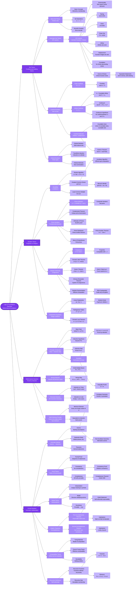

```mermaid
flowchart LR
    Start([Logic & Foundations Overview<br/>Mathematical foundations]):::purple
    
    Start --> SetTheory["Set Theory<br/>Fundamental building blocks"]:::purple
    Start --> NumberTheory["Number Theory<br/>Properties of integers"]:::purple
    Start --> Induction["Mathematical Induction<br/>Proof by induction"]:::purple
    Start --> FormalSystems["Formal Systems<br/>Axiomatic mathematics"]:::purple
    
    %% Set Theory
    SetTheory --> NaiveSetTheory["Naive Set Theory<br/>Intuitive sets"]:::lightpurple
    SetTheory --> AxiomaticSets["Axiomatic Set Theory<br/>ZFC axioms"]:::lightpurple
    SetTheory --> CardinalNumbers["Cardinal Numbers<br/>Size of sets"]:::lightpurple
    SetTheory --> OrdinalNumbers["Ordinal Numbers<br/>Order types"]:::lightpurple
    
    NaiveSetTheory --> SetBasics["Basic Concepts<br/>Elements, membership"]:::palepurple
    NaiveSetTheory --> SetOps["Set Operations<br/>∪, ∩, -, ×"]:::palepurple
    NaiveSetTheory --> RussellParadox["Russell's Paradox<br/>Set of all sets"]:::palepurple
    
    AxiomaticSets --> ZFCAxioms["ZFC Axioms<br/>Zermelo-Fraenkel + Choice"]:::lightpurple
    ZFCAxioms --> Extensionality["Extensionality<br/>Sets equal if same elements"]:::palepurple
    ZFCAxioms --> Pairing["Pairing<br/>(a,b) exists"]:::palepurple
    ZFCAxioms --> Union["Union<br/>∪A exists"]:::palepurple
    ZFCAxioms --> PowerSet["Power Set<br/>P-A- exists"]:::palepurple
    ZFCAxioms --> Infinity["Infinity<br/>Infinite sets exist"]:::palepurple
    ZFCAxioms --> Replacement["Replacement<br/>Function images are sets"]:::palepurple
    ZFCAxioms --> Foundation["Foundation<br/>No infinite descending chains"]:::palepurple
    ZFCAxioms --> Choice["Axiom of Choice<br/>Choice function exists"]:::palepurple
    
    Choice --> ChoiceEquivalents["Equivalent Statements<br/>Zorn's lemma, well-ordering"]:::palepurple
    
    CardinalNumbers --> FiniteCardinals["Finite Cardinals<br/>0, 1, 2, ..."]:::lightpurple
    CardinalNumbers --> InfiniteCardinals["Infinite Cardinals<br/>ℵ₀, ℵ₁, ..."]:::lightpurple
    CardinalNumbers --> CardinalArithmetic["Cardinal Arithmetic<br/>Addition, multiplication"]:::lightpurple
    
    FiniteCardinals --> Counting["Counting<br/>size-A- = n"]:::palepurple
    InfiniteCardinals --> Aleph0["ℵ₀ - Countable infinity<br/>size-ℕ- = ℵ₀"]:::palepurple
    InfiniteCardinals --> Continuum["Continuum<br/>size-ℝ- = 2^ℵ₀ = ℵ₁?"]:::palepurple
    InfiniteCardinals --> ContinuumHypothesis["Continuum Hypothesis<br/>No cardinal between ℵ₀ and 2^ℵ₀"]:::palepurple
    
    CardinalArithmetic --> CountableUnion["Countable Union<br/>Union of countably many countable sets"]:::palepurple
    CardinalArithmetic --> CantorTheorem["Cantor's Theorem<br/>size-A- < size-P(A)-"]:::palepurple
    
    OrdinalNumbers --> OrdinalDef["Ordinal Definition<br/>Well-ordered sets"]:::palepurple
    OrdinalNumbers --> TransfiniteInduction["Transfinite Induction<br/>Induction on ordinals"]:::palepurple
    OrdinalNumbers --> OrdinalArithmetic["Ordinal Arithmetic<br/>Non-commutative"]:::palepurple
    
    %% Number Theory
    NumberTheory --> Divisibility["Divisibility<br/>a divides b"]:::lightpurple
    NumberTheory --> Primes["Prime Numbers<br/>Fundamental theorem"]:::lightpurple
    NumberTheory --> ModularArithmetic["Modular Arithmetic<br/>Congruence"]:::lightpurple
    NumberTheory --> DiophantineEq["Diophantine Equations<br/>Integer solutions"]:::lightpurple
    
    Divisibility --> DivisionAlgorithm["Division Algorithm<br/>a = bq + r, 0 ≤ r < b"]:::palepurple
    Divisibility --> GCD["Greatest Common Divisor<br/>gcd-a,b-"]:::palepurple
    Divisibility --> LCM["Least Common Multiple<br/>lcm-a,b-"]:::palepurple
    
    GCD --> EuclideanAlgorithm["Euclidean Algorithm<br/>Efficient gcd computation"]:::palepurple
    GCD --> BezoutIdentity["Bézout's Identity<br/>gcd-a,b- = ax + by"]:::palepurple
    
    Primes --> PrimeDefinition["Prime Definition<br/>p > 1, divisible by 1 and p"]:::lightpurple
    PrimeDefinition --> Composite["Composite Numbers<br/>Not prime"]:::palepurple
    
    Primes --> FundamentalTheorem["Fundamental Theorem<br/>Unique prime factorization"]:::palepurple
    Primes --> InfinitudeOfPrimes["Infinitude of Primes<br/>Euclid's proof"]:::palepurple
    Primes --> PrimeDistribution["Prime Distribution<br/>Prime number theorem"]:::palepurple
    
    PrimeDistribution --> PNT["Prime Number Theorem<br/>π-x- ~ x/ln-x-"]:::palepurple
    
    Primes --> Sieve["Sieve of Eratosthenes<br/>Find primes"]:::palepurple
    
    ModularArithmetic --> Congruence["Congruence<br/>a ≡ b -mod n-"]:::lightpurple
    Congruence --> CongruenceProps["Properties<br/>Compatible with +, ×"]:::palepurple
    
    ModularArithmetic --> FermatsLittleTheorem["Fermat's Little Theorem<br/>a^-p-1- ≡ 1 -mod p-"]:::palepurple
    ModularArithmetic --> EulersTheorem["Euler's Theorem<br/>a^φ-n- ≡ 1 -mod n-"]:::palepurple
    ModularArithmetic --> ChineseRemainder["Chinese Remainder Theorem<br/>System of congruences"]:::palepurple
    
    EulersTheorem --> EulerPhi["Euler's Totient φ-n-<br/>Count coprime to n"]:::palepurple
    
    ModularArithmetic --> ModularExponentiation["Modular Exponentiation<br/>Efficient computation"]:::palepurple
    ModularExponentiation --> RSACryptography["RSA Cryptography<br/>Public-key encryption"]:::palepurple
    
    DiophantineEq --> LinearDiophantine["Linear Diophantine<br/>ax + by = c"]:::palepurple
    DiophantineEq --> PythagoreanTriples["Pythagorean Triples<br/>x² + y² = z²"]:::palepurple
    DiophantineEq --> FermatsLastTheorem["Fermat's Last Theorem<br/>xⁿ + yⁿ ≠ zⁿ for n > 2"]:::palepurple
    
    LinearDiophantine --> DiophantineSolution["Solution Exists<br/>If gcd-a,b- divides c"]:::palepurple
    
    %% Mathematical Induction
    Induction --> PrincipleOfInduction["Principle of Induction<br/>Base + inductive step"]:::lightpurple
    Induction --> StrongInduction["Strong Induction<br/>Assume all previous cases"]:::lightpurple
    Induction --> StructuralInduction["Structural Induction<br/>On recursive structures"]:::lightpurple
    Induction --> WellOrdering["Well-Ordering Principle<br/>Every non-empty subset has minimum"]:::lightpurple
    
    PrincipleOfInduction --> BaseCase["Base Case<br/>Verify P-1- or P-0-"]:::palepurple
    PrincipleOfInduction --> InductiveHypothesis["Inductive Hypothesis<br/>Assume P-k-"]:::palepurple
    PrincipleOfInduction --> InductiveStep["Inductive Step<br/>Prove P-k+1-"]:::palepurple
    
    PrincipleOfInduction --> InductionExamples["Examples<br/>Summation formulas"]:::lightpurple
    InductionExamples --> SumFormula["Σi=1 to n i = n-n+1-/2<br/>Prove by induction"]:::palepurple
    InductionExamples --> InequalityProof["Inequality Proofs<br/>2ⁿ > n²"]:::palepurple
    
    StrongInduction --> StrongBase["Verify Multiple Bases<br/>P-1-, P-2-, ..."]:::palepurple
    StrongInduction --> StrongStep["Strong Step<br/>P-1-∧...∧P-k- → P-k+1-"]:::palepurple
    
    StructuralInduction --> TreeInduction["Induction on Trees<br/>Leaf + branch cases"]:::palepurple
    StructuralInduction --> ListInduction["Induction on Lists<br/>Empty + cons cases"]:::palepurple
    
    WellOrdering --> MinElement["Minimum Element<br/>Every non-empty subset of ℕ"]:::palepurple
    WellOrdering --> WellOrderingEquiv["Equivalent to Induction<br/>Same power"]:::palepurple
    
    %% Formal Systems
    FormalSystems --> AxiomaticMethod["Axiomatic Method<br/>Axioms → theorems"]:::lightpurple
    FormalSystems --> ProofTheory["Proof Theory<br/>Study of formal proofs"]:::lightpurple
    FormalSystems --> ModelTheory["Model Theory<br/>Interpretations"]:::lightpurple
    FormalSystems --> GodelTheorems["Gödel's Theorems<br/>Incompleteness"]:::lightpurple
    
    AxiomaticMethod --> Axioms["Axioms<br/>Starting assumptions"]:::palepurple
    AxiomaticMethod --> DeductionRules["Deduction Rules<br/>Modus ponens, etc."]:::palepurple
    AxiomaticMethod --> Theorems["Theorems<br/>Derived statements"]:::palepurple
    
    Axioms --> EuclideanGeometry["Euclidean Geometry<br/>Euclid's 5 postulates"]:::palepurple
    Axioms --> NonEuclideanGeometry["Non-Euclidean Geometry<br/>Alternative axioms"]:::palepurple
    
    ProofTheory --> FormalProof["Formal Proof<br/>Sequence of statements"]:::palepurple
    ProofTheory --> Consistency["Consistency<br/>No contradictions"]:::palepurple
    ProofTheory --> Completeness["Completeness<br/>All truths provable"]:::palepurple
    
    Consistency --> ConsistencyProof["Consistency Proof<br/>Relative consistency"]:::palepurple
    Completeness --> CompletenessTheorem["Completeness Theorem<br/>Gödel 1930"]:::palepurple
    
    ModelTheory --> Interpretation["Interpretation<br/>Assign meaning to symbols"]:::palepurple
    ModelTheory --> Model["Model<br/>Structure satisfying axioms"]:::palepurple
    ModelTheory --> Soundness["Soundness<br/>Provable → true"]:::palepurple
    
    GodelTheorems --> FirstIncompleteness["First Incompleteness Theorem<br/>Unprovable truths exist"]:::lightpurple
    GodelTheorems --> SecondIncompleteness["Second Incompleteness Theorem<br/>Can't prove own consistency"]:::lightpurple
    
    FirstIncompleteness --> GodelStatement["Gödel Statement<br/>Self-referential unprovability"]:::palepurple
    FirstIncompleteness --> ImplicationsFI["Implications<br/>Math not fully formalizable"]:::palepurple
    
    SecondIncompleteness --> ImplicationsSI["Implications<br/>Limits of proof"]:::palepurple
    
    FormalSystems --> ComputabilityTheory["Computability Theory<br/>What can be computed"]:::lightpurple
    ComputabilityTheory --> TuringMachine["Turing Machine<br/>Model of computation"]:::palepurple
    ComputabilityTheory --> ChurchTuringThesis["Church-Turing Thesis<br/>Effective computability"]:::palepurple
    ComputabilityTheory --> Decidability["Decidability<br/>Halting problem"]:::palepurple
    
    %% Recursive Functions
    FormalSystems --> RecursiveDefinitions["Recursive Definitions<br/>Self-referential"]:::lightpurple
    RecursiveDefinitions --> RecursiveFunctions["Recursive Functions<br/>Functions defined recursively"]:::palepurple
    RecursiveDefinitions --> RecursiveSets["Recursive Sets<br/>Decidable membership"]:::palepurple
    
    RecursiveFunctions --> Factorial["Factorial<br/>n! = n · -n-1-!"]:::palepurple
    RecursiveFunctions --> FibonacciRec["Fibonacci<br/>F-n- = F-n-1- + F-n-2-"]:::palepurple
    
    classDef purple fill:#7c3aed,stroke:#4c1d95,stroke-width:3px,color:#fff
    classDef lightpurple fill:#a78bfa,stroke:#7c3aed,stroke-width:2px,color:#fff
    classDef palepurple fill:#c4b5fd,stroke:#a78bfa,stroke-width:1px,color:#000
```
