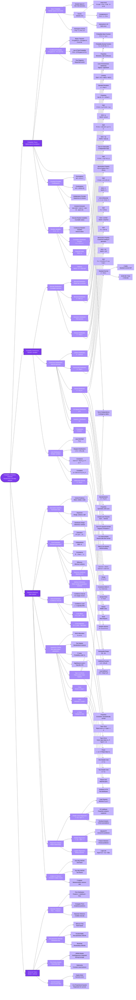

```mermaid
flowchart LR
    Start([Probability & Statistics Overview<br/>Randomness and data analysis]):::purple
    
    Start --> Probability["Probability Theory<br/>Mathematical foundations"]:::purple
    Start --> Distributions["Probability Distributions<br/>Random variables"]:::purple
    Start --> Statistics["Statistical Inference<br/>Data analysis"]:::purple
    Start --> Advanced["Advanced Topics<br/>Modern methods"]:::purple
    
    %% Probability Theory
    Probability --> BasicProbability["Basic Probability<br/>Sample spaces and events"]:::lightpurple
    Probability --> ConditionalProb["Conditional Probability<br/>P-A given B- = P-A∩B-/P-B-"]:::lightpurple
    Probability --> Independence["Independence<br/>P-A∩B- = P-A-P-B-"]:::lightpurple
    Probability --> CountingPrinciples["Counting Principles<br/>Combinatorics"]:::lightpurple
    
    BasicProbability --> SampleSpace["Sample Space Ω<br/>Set of all outcomes"]:::palepurple
    BasicProbability --> Events["Events<br/>Subsets of Ω"]:::palepurple
    BasicProbability --> Axioms["Kolmogorov Axioms<br/>P-Ω- = 1, P-A- ≥ 0"]:::palepurple
    
    Events --> Union["Union A∪B<br/>P-A∪B- = P-A- + P-B- - P-A∩B-"]:::palepurple
    Events --> Complement["Complement Aᶜ<br/>P-Aᶜ- = 1 - P-A-"]:::palepurple
    Events --> Intersection["Intersection A∩B<br/>Both occur"]:::palepurple
    
    ConditionalProb --> BayesTheorem["Bayes' Theorem<br/>P-A given B- = P-B given A-P-A-/P-B-"]:::palepurple
    ConditionalProb --> LawTotalProb["Law of Total Probability<br/>P-B- = ΣP-B given Aᵢ-P-Aᵢ-"]:::palepurple
    ConditionalProb --> TreeDiagrams["Tree Diagrams<br/>Sequential events"]:::palepurple
    
    CountingPrinciples --> Permutations["Permutations<br/>nPr = n!/-n-r-!"]:::palepurple
    CountingPrinciples --> Combinations["Combinations<br/>nCr = n!/(r!(n-r)!)"]:::palepurple
    CountingPrinciples --> MultiplicationPrinciple["Multiplication Principle<br/>Sequences of choices"]:::palepurple
    CountingPrinciples --> InclusionExclusion["Inclusion-Exclusion<br/>size-A∪B- = size-A- + size-B- - size-A∩B-"]:::palepurple
    
    %% Random Variables
    Probability --> RandomVariables["Random Variables<br/>X: Ω → ℝ"]:::lightpurple
    RandomVariables --> DiscreteRV["Discrete Random Variables<br/>Countable values"]:::palepurple
    RandomVariables --> ContinuousRV["Continuous Random Variables<br/>Interval values"]:::palepurple
    
    DiscreteRV --> PMF["Probability Mass Function<br/>P-X = x- = p-x-"]:::palepurple
    ContinuousRV --> PDF["Probability Density Function<br/>f-x- ≥ 0, ∫f-x-dx = 1"]:::palepurple
    
    RandomVariables --> CDF["Cumulative Distribution Function<br/>F-x- = P-X ≤ x-"]:::lightpurple
    CDF --> CDFProperties["Properties<br/>Monotone, right-continuous"]:::palepurple
    
    RandomVariables --> ExpectedValue["Expected Value<br/>E(X) = μ"]:::lightpurple
    RandomVariables --> Variance["Variance<br/>Var(X) = σ² = E((X-μ)²)"]:::lightpurple
    
    ExpectedValue --> LOTUS["Law of Unconscious Statistician<br/>E(g(X)) = ∫g(x)f(x)dx"]:::palepurple
    ExpectedValue --> Linearity["Linearity<br/>E(aX + bY) = aE(X) + bE(Y)"]:::palepurple
    
    Variance --> StdDev["Standard Deviation<br/>σ = √Var-X-"]:::palepurple
    Variance --> VarProperties["Properties<br/>Var-aX + b- = a²Var-X-"]:::palepurple
    
    %% Distributions - Discrete
    Distributions --> DiscreteDistrib["Discrete Distributions<br/>Countable outcomes"]:::lightpurple
    
    DiscreteDistrib --> Bernoulli["Bernoulli Distribution<br/>Single trial, p success"]:::lightpurple
    Bernoulli --> BernoulliPMF["PMF<br/>P-X=1- = p, P-X=0- = 1-p"]:::palepurple
    Bernoulli --> BernoulliMoments["E(X) = p<br/>Var(X) = p(1-p)"]:::palepurple
    
    DiscreteDistrib --> Binomial["Binomial Distribution<br/>X ~ Bin-n,p-"]:::lightpurple
    Binomial --> BinomialPMF["PMF<br/>P-X=k- = nCk p^k -1-p-^-n-k-"]:::palepurple
    Binomial --> BinomialMoments["E(X) = np<br/>Var(X) = np(1-p)"]:::palepurple
    Binomial --> BinomialSum["Sum of n Bernoullis<br/>n independent trials"]:::palepurple
    
    DiscreteDistrib --> Geometric["Geometric Distribution<br/>First success"]:::lightpurple
    Geometric --> GeometricPMF["PMF<br/>P-X=k- = -1-p-^-k-1- p"]:::palepurple
    Geometric --> GeometricMemoryless["Memoryless Property<br/>P(X>s+t given X>s) = P(X>t)"]:::palepurple
    
    DiscreteDistrib --> Poisson["Poisson Distribution<br/>X ~ Pois-λ-"]:::lightpurple
    Poisson --> PoissonPMF["PMF<br/>P-X=k- = e^-λ λ^k / k!"]:::palepurple
    Poisson --> PoissonMoments["E(X) = λ<br/>Var(X) = λ"]:::palepurple
    Poisson --> PoissonLimit["Limit of Binomial<br/>n→∞, p→0, np→λ"]:::palepurple
    
    %% Distributions - Continuous
    Distributions --> ContinuousDistrib["Continuous Distributions<br/>Interval outcomes"]:::lightpurple
    
    ContinuousDistrib --> Uniform["Uniform Distribution<br/>X ~ Unif-a,b-"]:::lightpurple
    Uniform --> UniformPDF["PDF<br/>f-x- = 1/-b-a-"]:::palepurple
    Uniform --> UniformMoments["E(X) = (a+b)/2<br/>Var(X) = (b-a)²/12"]:::palepurple
    
    ContinuousDistrib --> Exponential["Exponential Distribution<br/>X ~ Exp-λ-"]:::lightpurple
    Exponential --> ExponentialPDF["PDF<br/>f-x- = λe^-λx"]:::palepurple
    Exponential --> ExponentialMemoryless["Memoryless Property<br/>Continuous analog of geometric"]:::palepurple
    Exponential --> ExponentialMoments["E(X) = 1/λ<br/>Var(X) = 1/λ²"]:::palepurple
    
    ContinuousDistrib --> Normal["Normal Distribution<br/>X ~ N-μ,σ²-"]:::lightpurple
    Normal --> NormalPDF["PDF<br/>f-x- = 1/-σ√2π- e^--x-μ-²/-2σ²--"]:::palepurple
    Normal --> StandardNormal["Standard Normal<br/>Z ~ N-0,1-"]:::palepurple
    Normal --> Standardize["Standardization<br/>Z = -X-μ-/σ"]:::palepurple
    Normal --> NormalProperties["Properties<br/>Symmetric, bell curve"]:::palepurple
    Normal --> CLT["Central Limit Theorem<br/>Sum → Normal"]:::palepurple
    
    StandardNormal --> ZTable["Z-table<br/>Standard normal CDF"]:::palepurple
    StandardNormal --> EmpiricalRule["68-95-99.7 Rule<br/>σ intervals"]:::palepurple
    
    ContinuousDistrib --> ChiSquare["Chi-Square Distribution<br/>χ²-k-"]:::lightpurple
    ChiSquare --> ChiSquareDef["Sum of k squared normals<br/>Degrees of freedom k"]:::palepurple
    
    ContinuousDistrib --> StudentT["Student's t Distribution<br/>t-k-"]:::lightpurple
    StudentT --> TDef["For small samples<br/>Heavier tails than normal"]:::palepurple
    
    ContinuousDistrib --> FDistribution["F Distribution<br/>F-d1,d2-"]:::lightpurple
    FDistribution --> FDef["Ratio of chi-squares<br/>ANOVA testing"]:::palepurple
    
    %% Multivariate
    Distributions --> JointDistrib["Joint Distributions<br/>Multiple variables"]:::lightpurple
    JointDistrib --> JointPDF["Joint PDF/PMF<br/>f-x,y-"]:::palepurple
    JointDistrib --> Marginal["Marginal Distributions<br/>f_X-x- = ∫f-x,y-dy"]:::palepurple
    JointDistrib --> Covariance["Covariance<br/>Cov-X,Y- = E[-X-μ_X--Y-μ_Y--"]:::palepurple
    JointDistrib --> Correlation["Correlation<br/>ρ = Cov-X,Y-/-σ_X σ_Y-"]:::palepurple
    
    Covariance --> CovProperties["Cov-X,X- = Var-X-<br/>Cov-X,Y- = Cov-Y,X-"]:::palepurple
    Correlation --> CorrRange["Range<br/>-1 ≤ ρ ≤ 1"]:::palepurple
    
    JointDistrib --> MultivariateNormal["Multivariate Normal<br/>X ~ N-μ,Σ-"]:::lightpurple
    MultivariateNormal --> CovarianceMatrix["Covariance Matrix Σ<br/>Σᵢⱼ = Cov-Xᵢ,Xⱼ-"]:::palepurple
    
    %% Statistics - Descriptive
    Statistics --> Descriptive["Descriptive Statistics<br/>Summarize data"]:::lightpurple
    Descriptive --> CentralTendency["Central Tendency<br/>Mean, median, mode"]:::palepurple
    Descriptive --> Dispersion["Dispersion<br/>Range, variance, IQR"]:::palepurple
    Descriptive --> Shape["Distribution Shape<br/>Skewness, kurtosis"]:::palepurple
    
    CentralTendency --> SampleMean["Sample Mean<br/>x̄ = Σxᵢ/n"]:::palepurple
    CentralTendency --> Median["Median<br/>Middle value"]:::palepurple
    CentralTendency --> Mode["Mode<br/>Most frequent"]:::palepurple
    
    Dispersion --> SampleVariance["Sample Variance<br/>s² = Σ-xᵢ-x̄-²/-n-1-"]:::palepurple
    Dispersion --> IQR["Interquartile Range<br/>Q3 - Q1"]:::palepurple
    
    %% Statistics - Estimation
    Statistics --> PointEstimation["Point Estimation<br/>Estimate parameters"]:::lightpurple
    PointEstimation --> Estimators["Estimators<br/>θ̂ = g-X₁,...,Xₙ-"]:::palepurple
    PointEstimation --> Unbiased["Unbiasedness<br/>E(θ̂) = θ"]:::palepurple
    PointEstimation --> Consistency["Consistency<br/>θ̂ → θ as n → ∞"]:::palepurple
    PointEstimation --> Efficiency["Efficiency<br/>Minimum variance"]:::palepurple
    
    PointEstimation --> MLE["Maximum Likelihood<br/>Maximize L-θ-"]:::lightpurple
    MLE --> Likelihood["Likelihood Function<br/>L-θ- = ∏f-xᵢ;θ-"]:::palepurple
    MLE --> LogLikelihood["Log-Likelihood<br/>ℓ-θ- = Σlog f-xᵢ;θ-"]:::palepurple
    MLE --> MLEProperties["Properties<br/>Consistent, asymptotically normal"]:::palepurple
    
    PointEstimation --> MethodOfMoments["Method of Moments<br/>Match sample & population moments"]:::lightpurple
    
    Statistics --> IntervalEstimation["Interval Estimation<br/>Confidence intervals"]:::lightpurple
    IntervalEstimation --> CI["Confidence Interval<br/>θ̂ ± margin of error"]:::palepurple
    IntervalEstimation --> ConfidenceLevel["Confidence Level<br/>1 - α typically 95%"]:::palepurple
    
    IntervalEstimation --> MeanCI["CI for Mean<br/>x̄ ± t_-α/2- · s/√n"]:::lightpurple
    IntervalEstimation --> ProportionCI["CI for Proportion<br/>p̂ ± z_(α/2) · √(p̂(1-p̂)/n)"]:::lightpurple
    
    %% Hypothesis Testing
    Statistics --> HypothesisTesting["Hypothesis Testing<br/>Test claims about parameters"]:::lightpurple
    HypothesisTesting --> Hypotheses["Null & Alternative<br/>H₀ vs H₁"]:::palepurple
    HypothesisTesting --> TestStatistic["Test Statistic<br/>Standardized measure"]:::palepurple
    HypothesisTesting --> PValue["P-value<br/>Probability under H₀"]:::palepurple
    HypothesisTesting --> SignificanceLevel["Significance Level α<br/>Typically 0.05"]:::palepurple
    
    HypothesisTesting --> Errors["Type I & II Errors<br/>False positive, false negative"]:::lightpurple
    Errors --> TypeI["Type I Error<br/>Reject true H₀, P-Type I- = α"]:::palepurple
    Errors --> TypeII["Type II Error<br/>Fail to reject false H₀, P-Type II- = β"]:::palepurple
    Errors --> Power["Power<br/>1 - β = P-Reject false H₀-"]:::palepurple
    
    HypothesisTesting --> ZTest["Z-test<br/>Known σ, large n"]:::lightpurple
    HypothesisTesting --> TTest["t-test<br/>Unknown σ, small n"]:::lightpurple
    HypothesisTesting --> ChiSquareTest["χ² Tests<br/>Categorical data"]:::lightpurple
    
    TTest --> OneSampleT["One Sample t-test<br/>μ = μ₀"]:::palepurple
    TTest --> TwoSampleT["Two Sample t-test<br/>μ₁ = μ₂"]:::palepurple
    TTest --> PairedT["Paired t-test<br/>Matched pairs"]:::palepurple
    
    ChiSquareTest --> GoodnessOfFit["Goodness of Fit<br/>Test distribution"]:::palepurple
    ChiSquareTest --> Independence["Test of Independence<br/>Contingency tables"]:::palepurple
    
    %% Regression
    Statistics --> Regression["Regression Analysis<br/>Model relationships"]:::lightpurple
    Regression --> SimpleLinear["Simple Linear Regression<br/>Y = β₀ + β₁X + ε"]:::lightpurple
    Regression --> MultipleRegression["Multiple Regression<br/>Y = β₀ + ΣβᵢXᵢ + ε"]:::lightpurple
    
    SimpleLinear --> LeastSquares["Least Squares<br/>Minimize Σ-yᵢ-ŷᵢ-²"]:::palepurple
    SimpleLinear --> RSquared["R² Coefficient<br/>Proportion variance explained"]:::palepurple
    SimpleLinear --> ResidualAnalysis["Residual Analysis<br/>Check assumptions"]:::palepurple
    
    MultipleRegression --> AdjustedR2["Adjusted R²<br/>Account for predictors"]:::palepurple
    MultipleRegression --> FeatureSelection["Feature Selection<br/>Choose predictors"]:::palepurple
    
    Regression --> LogisticRegression["Logistic Regression<br/>Binary outcome"]:::lightpurple
    LogisticRegression --> LogitLink["Logit Link<br/>log-p/-1-p-- = β₀ + Σβᵢxᵢ"]:::palepurple
    
    %% ANOVA
    Statistics --> ANOVA["Analysis of Variance<br/>Compare multiple means"]:::lightpurple
    ANOVA --> OneWayANOVA["One-Way ANOVA<br/>One factor"]:::palepurple
    ANOVA --> TwoWayANOVA["Two-Way ANOVA<br/>Two factors"]:::palepurple
    ANOVA --> FStatistic["F-statistic<br/>Between/within variance ratio"]:::palepurple
    
    %% Advanced Topics
    Advanced --> Bayesian["Bayesian Statistics<br/>Prior → Posterior"]:::lightpurple
    Bayesian --> PriorPosterior["Prior Distribution<br/>Posterior ∝ Likelihood × Prior"]:::palepurple
    Bayesian --> ConjugatePriors["Conjugate Priors<br/>Analytical posteriors"]:::palepurple
    Bayesian --> BayesianInference["Bayesian Inference<br/>Credible intervals"]:::palepurple
    
    Advanced --> NonParametric["Non-parametric Methods<br/>Distribution-free"]:::lightpurple
    NonParametric --> WilcoxonTest["Wilcoxon Test<br/>Rank-based"]:::palepurple
    NonParametric --> KruskalWallis["Kruskal-Wallis<br/>Non-parametric ANOVA"]:::palepurple
    NonParametric --> BootstrapResampling["Bootstrap<br/>Resampling methods"]:::palepurple
    
    Advanced --> TimeSeries["Time Series Analysis<br/>Sequential data"]:::lightpurple
    TimeSeries --> ARIMA["ARIMA Models<br/>AutoRegressive Integrated Moving Average"]:::palepurple
    TimeSeries --> Stationarity["Stationarity<br/>Constant mean/variance"]:::palepurple
    
    Advanced --> SurvivalAnalysis["Survival Analysis<br/>Time-to-event data"]:::lightpurple
    SurvivalAnalysis --> KaplanMeier["Kaplan-Meier<br/>Survival curves"]:::palepurple
    SurvivalAnalysis --> CoxRegression["Cox Proportional Hazards<br/>Regression for survival"]:::palepurple
    
    classDef purple fill:#7c3aed,stroke:#4c1d95,stroke-width:3px,color:#fff
    classDef lightpurple fill:#a78bfa,stroke:#7c3aed,stroke-width:2px,color:#fff
    classDef palepurple fill:#c4b5fd,stroke:#a78bfa,stroke-width:1px,color:#000
```
