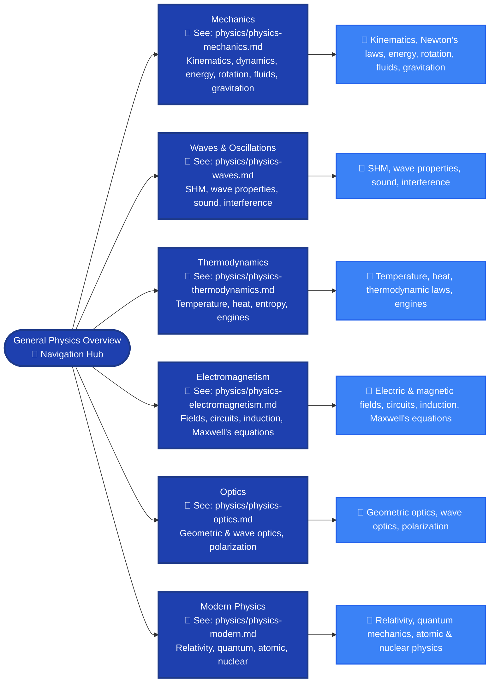

```mermaid
flowchart LR
    Start([General Physics Overview<br/>🧭 Navigation Hub]):::blue
    Start --> Mechanics["Mechanics<br/>📂 See: physics/physics-mechanics.md<br/>Kinematics, dynamics, energy, rotation, fluids, gravitation"]:::blue
    Start --> Waves["Waves & Oscillations<br/>📂 See: physics/physics-waves.md<br/>SHM, wave properties, sound, interference"]:::blue
    Start --> Thermo["Thermodynamics<br/>📂 See: physics/physics-thermodynamics.md<br/>Temperature, heat, entropy, engines"]:::blue
    Start --> EM["Electromagnetism<br/>📂 See: physics/physics-electromagnetism.md<br/>Fields, circuits, induction, Maxwell's equations"]:::blue
    Start --> Optics["Optics<br/>📂 See: physics/physics-optics.md<br/>Geometric & wave optics, polarization"]:::blue
    Start --> Modern["Modern Physics<br/>📂 See: physics/physics-modern.md<br/>Relativity, quantum, atomic, nuclear"]:::blue

    Mechanics --> MechanicsDetails[📄 Kinematics, Newton's laws, energy, rotation, fluids, gravitation]:::lightblue
    Waves --> WavesDetails[📄 SHM, wave properties, sound, interference]:::lightblue
    Thermo --> ThermoDetails[📄 Temperature, heat, thermodynamic laws, engines]:::lightblue
    EM --> EMDetails[📄 Electric & magnetic fields, circuits, induction, Maxwell's equations]:::lightblue
    Optics --> OpticsDetails[📄 Geometric optics, wave optics, polarization]:::lightblue
    Modern --> ModernDetails[📄 Relativity, quantum mechanics, atomic & nuclear physics]:::lightblue

    classDef blue fill:#1e40af,stroke:#1e3a8a,stroke-width:3px,color:#fff
    classDef lightblue fill:#3b82f6,stroke:#2563eb,stroke-width:2px,color:#fff
    classDef paleblue fill:#60a5fa,stroke:#3b82f6,stroke-width:2px,color:#000
```