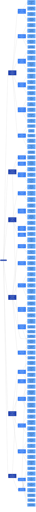

```mermaid
flowchart LR
    Start([General Physics Overview]):::blue
    Start --> Mechanics[Mechanics<br/>Study of motion and forces<br/>Foundation for understanding physical phenomena]:::blue
    Start --> Waves[Waves & Oscillations<br/>Periodic motion and wave phenomena<br/>Essential for understanding sound, light, and vibrations]:::blue
    Start --> Thermo[Thermodynamics<br/>Study of heat and energy transfer<br/>Explains energy conservation and entropy]:::blue
    Start --> EM[Electromagnetism<br/>Electric and magnetic phenomena<br/>Basis for electricity, magnetism, and light]:::blue
    Start --> Modern[Modern Physics<br/>Quantum mechanics and relativity<br/>Describes atomic and subatomic behavior]:::blue
    Start --> Optics[Optics<br/>Study of light behavior<br/>Reflection, refraction, and wave phenomena]:::blue
    
    Mechanics --> Kinematics[Kinematics<br/>Motion description without forces<br/>Position, velocity, acceleration relationships]:::lightblue
    Mechanics --> Dynamics[Dynamics<br/>Motion analysis with forces<br/>Newton's laws and force applications]:::lightblue
    Mechanics --> Energy[Energy & Work<br/>Energy conservation and transfer<br/>Fundamental for all physical processes]:::lightblue
    Mechanics --> Rotation[Rotational Motion<br/>Angular kinematics and dynamics<br/>Explains spinning and rotating objects]:::lightblue
    Mechanics --> Fluids[Fluid Mechanics<br/>Behavior of liquids and gases<br/>Pressure, buoyancy, and flow]:::lightblue
    Mechanics --> Gravitation[Gravitation<br/>Universal attractive force<br/>Newton's law and orbital mechanics]:::lightblue
    
    Kinematics --> Position[Position & Displacement<br/>Location in space and change<br/>Starting point for motion analysis]:::paleblue
    Kinematics --> Velocity[Velocity & Speed<br/>Rate of position change<br/>Describes how fast objects move]:::paleblue
    Kinematics --> Acceleration[Acceleration<br/>Rate of velocity change<br/>Explains speeding up or slowing down]:::paleblue
    Kinematics --> ProjectileMotion[Projectile Motion<br/>2D motion under gravity<br/>Used in ballistics and sports physics]:::paleblue
    
    Dynamics --> NewtonFirst[Newton's First Law<br/>Inertia principle<br/>Objects maintain motion state without force]:::paleblue
    Dynamics --> NewtonSecond[Newton's Second Law<br/>F = ma relationship<br/>Quantifies force-acceleration connection]:::paleblue
    Dynamics --> NewtonThird[Newton's Third Law<br/>Action-reaction pairs<br/>Forces always occur in pairs]:::paleblue
    Dynamics --> Friction[Friction Forces<br/>Resistance to motion<br/>Critical for real-world applications]:::paleblue
    Dynamics --> CircularMotion[Circular Motion<br/>Motion in curved paths<br/>Requires centripetal force]:::paleblue
    
    Energy --> KineticEnergy[Kinetic Energy<br/>Energy of motion ½mv²<br/>Depends on mass and velocity]:::paleblue
    Energy --> PotentialEnergy[Potential Energy<br/>Stored energy due to position<br/>Gravitational and elastic forms]:::paleblue
    Energy --> Conservation[Conservation of Energy<br/>Energy cannot be created/destroyed<br/>Fundamental universal principle]:::paleblue
    Energy --> Power[Power<br/>Rate of energy transfer<br/>Measures how quickly work is done]:::paleblue
    
    Rotation --> AngularKinematics[Angular Kinematics<br/>Rotational motion description<br/>Angular velocity and acceleration]:::paleblue
    Rotation --> Torque[Torque<br/>Rotational force effect<br/>Causes angular acceleration]:::paleblue
    Rotation --> AngularMomentum[Angular Momentum<br/>Rotational inertia in motion<br/>Conserved in closed systems]:::paleblue
    Rotation --> MomentInertia[Moment of Inertia<br/>Rotational mass analog<br/>Resistance to angular acceleration]:::paleblue
    
    Fluids --> Pressure[Pressure<br/>Force per unit area<br/>P = F/A, acts in all directions]:::paleblue
    Fluids --> Buoyancy[Buoyancy<br/>Upward force on submerged objects<br/>Archimedes' principle]:::paleblue
    Fluids --> Continuity[Continuity Equation<br/>Mass flow rate conservation<br/>A₁v₁ = A₂v₂ for incompressible fluids]:::paleblue
    Fluids --> Bernoulli[Bernoulli's Equation<br/>Energy conservation in fluids<br/>P + ½ρv² + ρgh = constant]:::paleblue
    Fluids --> Viscosity[Viscosity<br/>Fluid resistance to flow<br/>Causes drag and energy loss]:::paleblue
    
    Gravitation --> NewtonGravity[Newton's Law of Gravitation<br/>F = Gm₁m₂/r²<br/>Universal attractive force]:::paleblue
    Gravitation --> GravitationalField[Gravitational Field<br/>g = GM/r²<br/>Force per unit mass]:::paleblue
    Gravitation --> OrbitalMotion[Orbital Motion<br/>Circular and elliptical orbits<br/>Satellites and planets]:::paleblue
    Gravitation --> Kepler[Kepler's Laws<br/>Planetary motion laws<br/>Elliptical orbits, equal areas, period relation]:::paleblue
    Gravitation --> GravPotential[Gravitational Potential Energy<br/>U = -GMm/r<br/>Energy due to position in field]:::paleblue
    
    Waves --> SimpleHarmonic[Simple Harmonic Motion<br/>Sinusoidal oscillations<br/>Spring-mass and pendulum systems]:::lightblue
    Waves --> WaveProperties[Wave Properties<br/>Amplitude, frequency, wavelength<br/>Characterize wave behavior]:::lightblue
    Waves --> Sound[Sound Waves<br/>Mechanical longitudinal waves<br/>Requires medium for propagation]:::lightblue
    Waves --> Interference[Wave Interference<br/>Superposition of waves<br/>Creates constructive/destructive patterns]:::lightblue
    
    SimpleHarmonic --> SpringSystem[Spring-Mass System<br/>Hooke's law application<br/>Models oscillatory motion]:::paleblue
    SimpleHarmonic --> Pendulum[Pendulum Motion<br/>Gravitational restoring force<br/>Period independent of amplitude for small angles]:::paleblue
    SimpleHarmonic --> Resonance[Resonance<br/>Maximum amplitude at natural frequency<br/>Important in engineering and music]:::paleblue
    
    Sound --> SpeedSound[Speed of Sound<br/>Depends on medium properties<br/>Faster in denser solids]:::paleblue
    Sound --> DopplerEffect[Doppler Effect<br/>Frequency shift with motion<br/>Used in radar and astronomy]:::paleblue
    Sound --> Intensity[Sound Intensity<br/>Energy per unit area per time<br/>Relates to loudness perception]:::paleblue
    
    Thermo --> Temperature[Temperature & Heat<br/>Thermal energy and transfer<br/>Distinguishes hot from cold]:::lightblue
    Thermo --> FirstLaw[First Law of Thermodynamics<br/>Energy conservation for thermal systems<br/>ΔU = Q - W relationship]:::lightblue
    Thermo --> SecondLaw[Second Law of Thermodynamics<br/>Entropy always increases<br/>Defines direction of processes]:::lightblue
    Thermo --> HeatEngines[Heat Engines<br/>Convert thermal to mechanical energy<br/>Limited by Carnot efficiency]:::lightblue
    
    Temperature --> KineticTheory[Kinetic Theory<br/>Temperature from molecular motion<br/>Links macro and micro properties]:::paleblue
    Temperature --> HeatTransfer[Heat Transfer<br/>Conduction, convection, radiation<br/>Three modes of thermal energy flow]:::paleblue
    Temperature --> ThermalExpansion[Thermal Expansion<br/>Size changes with temperature<br/>Important in engineering design]:::paleblue
    
    FirstLaw --> InternalEnergy[Internal Energy<br/>Total microscopic energy<br/>Sum of kinetic and potential energies]:::paleblue
    FirstLaw --> Work[Thermodynamic Work<br/>Energy transfer by volume change<br/>W = PΔV for gases]:::paleblue
    FirstLaw --> Heat[Heat Transfer<br/>Energy flow due to temperature difference<br/>Measured in joules or calories]:::paleblue
    
    SecondLaw --> Entropy[Entropy<br/>Measure of disorder<br/>Increases in spontaneous processes]:::paleblue
    SecondLaw --> Irreversibility[Irreversibility<br/>Real processes cannot be reversed<br/>Due to entropy increase]:::paleblue
    SecondLaw --> Carnot[Carnot Cycle<br/>Ideal reversible cycle<br/>Maximum theoretical efficiency]:::paleblue
    
    EM --> ElectricField[Electric Fields<br/>Force field around charges<br/>Describes electric force distribution]:::lightblue
    EM --> ElectricPotential[Electric Potential<br/>Electrical potential energy per charge<br/>Voltage concept foundation]:::lightblue
    EM --> Circuits[Electric Circuits<br/>Closed paths for current flow<br/>Basis for all electronics]:::lightblue
    EM --> MagneticField[Magnetic Fields<br/>Force field around moving charges<br/>Describes magnetic force distribution]:::lightblue
    EM --> EMInduction[Electromagnetic Induction<br/>Changing magnetic field creates voltage<br/>Principle of generators and transformers]:::lightblue
    EM --> Maxwell[Maxwell's Equations<br/>Unified theory of E&M<br/>Predicts electromagnetic waves]:::lightblue
    
    ElectricField --> Coulomb[Coulomb's Law<br/>Force between point charges<br/>Inverse square law for electricity]:::paleblue
    ElectricField --> FieldLines[Electric Field Lines<br/>Visual representation of fields<br/>Point from positive to negative]:::paleblue
    ElectricField --> Gauss[Gauss's Law<br/>Relates field to enclosed charge<br/>Powerful symmetry tool]:::paleblue
    
    ElectricPotential --> Voltage[Voltage - Potential Difference<br/>Energy per unit charge<br/>Drives current in circuits]:::paleblue
    ElectricPotential --> Capacitance[Capacitance<br/>Charge storage ability<br/>Used in energy storage and filtering]:::paleblue
    ElectricPotential --> Dielectrics[Dielectric Materials<br/>Insulating materials in capacitors<br/>Increase capacitance]:::paleblue
    
    Circuits --> OhmsLaw[Ohm's Law<br/>V = IR relationship<br/>Fundamental circuit equation]:::paleblue
    Circuits --> SeriesCircuits[Series Circuits<br/>Single current path<br/>Voltage divides across components]:::paleblue
    Circuits --> ParallelCircuits[Parallel Circuits<br/>Multiple current paths<br/>Voltage same across branches]:::paleblue
    Circuits --> Kirchhoff[Kirchhoff's Laws<br/>Current and voltage conservation<br/>Used for complex circuit analysis]:::paleblue
    Circuits --> RCAC[RC & AC Circuits<br/>Time-dependent and alternating current<br/>Used in filters and power systems]:::paleblue
    
    MagneticField --> BiotSavart[Biot-Savart Law<br/>Magnetic field from current<br/>Calculates B field for any geometry]:::paleblue
    MagneticField --> LorentzForce[Lorentz Force<br/>Force on moving charge in B field<br/>Basis for motors and particle accelerators]:::paleblue
    MagneticField --> Ampere[Ampère's Law<br/>Relates B field to current<br/>Symmetry tool for magnetic fields]:::paleblue
    
    EMInduction --> Faraday[Faraday's Law<br/>Induced EMF from changing flux<br/>Quantifies electromagnetic induction]:::paleblue
    EMInduction --> Lenz[Lenz's Law<br/>Direction of induced current<br/>Opposes change in flux]:::paleblue
    EMInduction --> Inductance[Inductance<br/>Magnetic flux storage ability<br/>Opposes current changes]:::paleblue
    EMInduction --> Transformers[Transformers<br/>Voltage conversion devices<br/>Based on mutual inductance]:::paleblue
    
    Maxwell --> EMWaves[Electromagnetic Waves<br/>Self-propagating E&M disturbances<br/>Includes light, radio, X-rays]:::paleblue
    Maxwell --> LightSpeed[Speed of Light<br/>c = 3×10⁸ m/s<br/>Universal constant in vacuum]:::paleblue
    Maxwell --> EMSpectrum[EM Spectrum<br/>Range of all EM radiation<br/>From radio to gamma rays]:::paleblue
    
    Optics --> GeometricOptics[Geometric Optics<br/>Ray model of light<br/>Reflection and refraction]:::lightblue
    Optics --> WaveOptics[Wave Optics<br/>Wave model of light<br/>Interference and diffraction]:::lightblue
    Optics --> Polarization[Polarization<br/>Orientation of light oscillations<br/>Transverse wave property]:::lightblue
    
    GeometricOptics --> Reflection[Reflection<br/>Light bouncing off surfaces<br/>Angle in equals angle out]:::paleblue
    GeometricOptics --> Refraction[Refraction<br/>Bending at boundary<br/>Snell's law: n₁sinθ₁ = n₂sinθ₂]:::paleblue
    GeometricOptics --> Mirrors[Mirrors<br/>Plane, concave, convex<br/>Image formation by reflection]:::paleblue
    GeometricOptics --> Lenses[Lenses<br/>Converging and diverging<br/>Image formation by refraction]:::paleblue
    GeometricOptics --> LensEquation[Lens/Mirror Equation<br/>1/f = 1/do + 1/di<br/>Relates object, image, focal distances]:::paleblue
    
    WaveOptics --> Interference[Interference<br/>Superposition of light waves<br/>Bright and dark fringes]:::paleblue
    WaveOptics --> DoubleSlit[Double-Slit Experiment<br/>dsinθ = mλ for bright fringes<br/>Demonstrates wave nature]:::paleblue
    WaveOptics --> Diffraction[Diffraction<br/>Bending around obstacles<br/>Single-slit and gratings]:::paleblue
    WaveOptics --> ThinFilms[Thin-Film Interference<br/>Reflections from boundaries<br/>Soap bubbles, coatings]:::paleblue
    
    Modern --> Relativity[Special Relativity<br/>Physics at high speeds<br/>Time dilation and length contraction]:::lightblue
    Modern --> Quantum[Quantum Mechanics<br/>Physics at atomic scale<br/>Wave-particle duality and uncertainty]:::lightblue
    Modern --> Atomic[Atomic Physics<br/>Structure and behavior of atoms<br/>Electron shells and spectra]:::lightblue
    Modern --> Nuclear[Nuclear Physics<br/>Atomic nuclei properties<br/>Radioactivity and nuclear reactions]:::lightblue
    
    Relativity --> TimeDilation[Time Dilation<br/>Time slows at high speeds<br/>Confirmed by particle experiments]:::paleblue
    Relativity --> LengthContraction[Length Contraction<br/>Objects shorten in motion direction<br/>Consequence of spacetime structure]:::paleblue
    Relativity --> MassEnergy[Mass-Energy Equivalence<br/>E = mc² relationship<br/>Mass and energy are interconvertible]:::paleblue
    Relativity --> Lorentz[Lorentz Transformations<br/>Coordinate conversions between frames<br/>Replaces Galilean transformations]:::paleblue
    
    Quantum --> PhotoelectricEffect[Photoelectric Effect<br/>Light ejects electrons from metal<br/>Evidence for photons]:::paleblue
    Quantum --> WaveParticle[Wave-Particle Duality<br/>Matter exhibits wave and particle properties<br/>Fundamental quantum concept]:::paleblue
    Quantum --> Uncertainty[Heisenberg Uncertainty<br/>Cannot know position and momentum precisely<br/>Fundamental limit on measurement]:::paleblue
    Quantum --> Schrodinger[Schrödinger Equation<br/>Wave function evolution equation<br/>Fundamental equation of quantum mechanics]:::paleblue
    Quantum --> Tunneling[Quantum Tunneling<br/>Particles penetrate barriers<br/>Used in transistors and radioactivity]:::paleblue
    
    Atomic --> BohrModel[Bohr Model<br/>Quantized electron orbits<br/>Explains hydrogen spectrum]:::paleblue
    Atomic --> ElectronConfig[Electron Configuration<br/>Arrangement of electrons in shells<br/>Determines chemical properties]:::paleblue
    Atomic --> AtomicSpectra[Atomic Spectra<br/>Characteristic light emission/absorption<br/>Fingerprint for elements]:::paleblue
    Atomic --> PauliExclusion[Pauli Exclusion Principle<br/>No two electrons in same quantum state<br/>Explains electron shell structure]:::paleblue
    
    Nuclear --> Radioactivity[Radioactivity<br/>Spontaneous nuclear decay<br/>Alpha, beta, gamma emissions]:::paleblue
    Nuclear --> HalfLife[Half-Life<br/>Time for half of sample to decay<br/>Characterizes decay rate]:::paleblue
    Nuclear --> Fission[Nuclear Fission<br/>Heavy nuclei split into lighter ones<br/>Releases energy in reactors]:::paleblue
    Nuclear --> Fusion[Nuclear Fusion<br/>Light nuclei combine into heavier ones<br/>Powers the sun and stars]:::paleblue
    Nuclear --> BindingEnergy[Nuclear Binding Energy<br/>Energy holding nucleus together<br/>Explains stability and reactions]:::paleblue
    
    classDef blue fill:#1e40af,stroke:#1e3a8a,stroke-width:3px,color:#fff
    classDef lightblue fill:#3b82f6,stroke:#2563eb,stroke-width:2px,color:#fff
    classDef paleblue fill:#60a5fa,stroke:#3b82f6,stroke-width:2px,color:#000
```