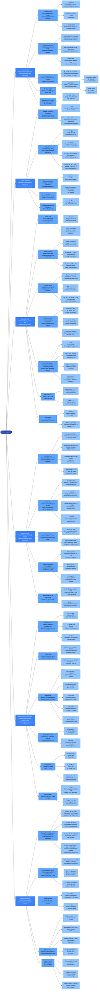

```mermaid
flowchart LR
    Start([Electromagnetism]):::blue
    Start --> ElectricField["Electric Fields<br/>Force field around charges<br/>Describes electric force distribution"]:::lightblue
    Start --> ElectricPotential["Electric Potential<br/>Electrical potential energy per charge<br/>Voltage concept foundation"]:::lightblue
    Start --> Circuits["Electric Circuits<br/>Closed paths for current flow<br/>Basis for all electronics"]:::lightblue
    Start --> MagneticField["Magnetic Fields<br/>Force field around moving charges<br/>Describes magnetic force distribution"]:::lightblue
    Start --> EMInduction["Electromagnetic Induction<br/>Changing magnetic field creates voltage<br/>Principle of generators and transformers"]:::lightblue
    Start --> Maxwell["Maxwell's Equations<br/>Unified theory of E&M<br/>Predicts electromagnetic waves"]:::lightblue
    
    ElectricField --> Coulomb["Coulomb's Law<br/>Force between point charges<br/>Inverse square law for electricity"]:::paleblue
    ElectricField --> FieldLines["Electric Field Lines<br/>Visual representation of fields<br/>Point from positive to negative"]:::paleblue
    ElectricField --> Gauss["Gauss's Law<br/>Relates field to enclosed charge<br/>Powerful symmetry tool"]:::paleblue
    ElectricField --> FieldDefinition["E = F/q = kQ/r²<br/>Force per unit charge<br/>Vector field"]:::paleblue
    ElectricField --> Superposition["Superposition principle<br/>Fields add vectorially<br/>E_total = ΣE_i"]:::paleblue
    
    Coulomb --> CoulombEq["F = kq₁q₂/r²<br/>k = 8.99×10⁹ Nm²/C²<br/>Attractive if opposite signs"]:::skyblue
    Coulomb --> InverseSquare["Inverse square law<br/>F ∝ 1/r²<br/>Like gravity"]:::skyblue
    Coulomb --> ElementaryCharge["e = 1.60×10⁻¹⁹ C<br/>Fundamental charge unit<br/>Quantized charge"]:::skyblue
    
    FieldLines --> FieldDensity["Line density ∝ field strength<br/>Closer lines = stronger field<br/>Visual intensity indicator"]:::skyblue
    FieldLines --> FieldRules["Start on + charge, end on -<br/>Never cross<br/>Perpendicular to conductors"]:::skyblue
    FieldLines --> UniformField["Uniform field<br/>Parallel, evenly spaced lines<br/>Between parallel plates"]:::skyblue
    
    Gauss --> GaussLaw["Φ_E = ∮E·dA = Q_enc/ε₀<br/>Flux through closed surface<br/>ε₀ = 8.85×10⁻¹² C²/(Nm²)"]:::skyblue
    Gauss --> GaussApplications["Applications<br/>Spheres, cylinders, planes<br/>High symmetry cases"]:::skyblue
    
    GaussApplications --> GaussSphere["Conducting sphere<br/>E = 0 inside<br/>E = kQ/r² outside"]:::skyblue
    GaussApplications --> GaussPlane["Infinite plane<br/>E = σ/(2ε₀)<br/>Uniform field"]:::skyblue
    
    ElectricPotential --> Voltage["Voltage - Potential Difference<br/>Energy per unit charge<br/>Drives current in circuits"]:::paleblue
    ElectricPotential --> Capacitance["Capacitance<br/>Charge storage ability<br/>Used in energy storage and filtering"]:::paleblue
    ElectricPotential --> Dielectrics["Dielectric Materials<br/>Insulating materials in capacitors<br/>Increase capacitance"]:::paleblue
    ElectricPotential --> PotentialEnergy["U = qV<br/>Electric potential energy<br/>Work to move charge"]:::paleblue
    ElectricPotential --> EquipotentialSurfaces["Equipotential surfaces<br/>Constant V<br/>Perpendicular to E"]:::paleblue
    
    Voltage --> VoltageDefEq["V = U/q = W/q<br/>Energy per unit charge<br/>Unit: volt (J/C)"]:::skyblue
    Voltage --> VoltagePointCharge["V = kQ/r<br/>Potential from point charge<br/>Scalar quantity"]:::skyblue
    Voltage --> VoltageFieldRelation["E = -dV/dr<br/>Field is negative gradient of potential<br/>Points toward decreasing V"]:::skyblue
    
    Capacitance --> CapacitanceDef["C = Q/V<br/>Charge per volt<br/>Unit: farad (F) = C/V"]:::skyblue
    Capacitance --> ParallelPlate["C = ε₀A/d<br/>Parallel plate formula<br/>A = area, d = separation"]:::skyblue
    Capacitance --> CapEnergy["U = (1/2)CV² = (1/2)Q²/C<br/>Energy stored<br/>Electric field energy"]:::skyblue
    Capacitance --> CapSeriesPar["Series: 1/C_eq = Σ1/C_i<br/>Parallel: C_eq = ΣC_i<br/>Combining capacitors"]:::skyblue
    
    Dielectrics --> DielectricConstant["κ (kappa)<br/>C = κC₀<br/>κ > 1, reduces E field"]:::skyblue
    Dielectrics --> DielectricBreakdown["Dielectric breakdown<br/>Max E field before conducting<br/>Arc or spark"]:::skyblue
    
    Circuits --> OhmsLaw["Ohm's Law<br/>V = IR relationship<br/>Fundamental circuit equation"]:::paleblue
    Circuits --> SeriesCircuits["Series Circuits<br/>Single current path<br/>Voltage divides across components"]:::paleblue
    Circuits --> ParallelCircuits["Parallel Circuits<br/>Multiple current paths<br/>Voltage same across branches"]:::paleblue
    Circuits --> Kirchhoff["Kirchhoff's Laws<br/>Current and voltage conservation<br/>Used for complex circuit analysis"]:::paleblue
    Circuits --> RCAC["RC & AC Circuits<br/>Time-dependent and alternating current<br/>Used in filters and power systems"]:::paleblue
    Circuits --> Power["Electric Power<br/>P = IV = I²R = V²/R<br/>Energy per time"]:::paleblue
    Circuits --> Resistance["Resistance<br/>R = ρL/A<br/>Opposition to current flow"]:::paleblue
    
    OhmsLaw --> CurrentDef["I = Q/t<br/>Charge flow rate<br/>Unit: ampere (A) = C/s"]:::skyblue
    OhmsLaw --> ResistanceDef["R = V/I<br/>Voltage per current<br/>Unit: ohm (Ω) = V/A"]:::skyblue
    OhmsLaw --> OhmicVsNonohmic["Ohmic: R constant<br/>Nonohmic: R varies<br/>Diodes, transistors nonohmic"]:::skyblue
    
    SeriesCircuits --> SeriesCurrent["Same I through all<br/>I_total = I₁ = I₂ = I₃<br/>Charge conservation"]:::skyblue
    SeriesCircuits --> SeriesVoltage["V_total = V₁ + V₂ + V₃<br/>Voltage divides<br/>Energy conservation"]:::skyblue
    SeriesCircuits --> SeriesR["R_eq = R₁ + R₂ + R₃<br/>Resistances add<br/>Higher total resistance"]:::skyblue
    
    ParallelCircuits --> ParallelVoltage["Same V across all<br/>V_total = V₁ = V₂ = V₃<br/>Connected to same points"]:::skyblue
    ParallelCircuits --> ParallelCurrent["I_total = I₁ + I₂ + I₃<br/>Current divides<br/>Charge conservation"]:::skyblue
    ParallelCircuits --> ParallelR["1/R_eq = 1/R₁ + 1/R₂ + 1/R₃<br/>Reciprocals add<br/>Lower total resistance"]:::skyblue
    
    Kirchhoff --> KirchhoffCurrent["Junction rule (KCL)<br/>ΣI_in = ΣI_out<br/>Charge conservation"]:::skyblue
    Kirchhoff --> KirchhoffVoltage["Loop rule (KVL)<br/>ΣV = 0 around loop<br/>Energy conservation"]:::skyblue
    Kirchhoff --> NodeAnalysis["Node/mesh analysis<br/>Systematic circuit solving<br/>Multiple loops"]:::skyblue
    
    RCAC --> RCTimeConstant["τ = RC<br/>Time constant<br/>Charging/discharging rate"]:::skyblue
    RCAC --> RCCharging["Q(t) = Q₀(1 - e^(-t/τ))<br/>Exponential growth<br/>Approaches Q₀"]:::skyblue
    RCAC --> ACCircuits["AC: V = V₀sin(ωt)<br/>Alternating current<br/>f = ω/(2π)"]:::skyblue
    RCAC --> Impedance["Impedance Z<br/>AC resistance<br/>R, capacitive, inductive reactance"]:::skyblue
    
    Power --> PowerJoule["Joule heating P = I²R<br/>Heat in resistors<br/>Energy dissipation"]:::skyblue
    Power --> PowerCost["Energy = Pt<br/>kWh for billing<br/>Cost = energy × rate"]:::skyblue
    
    Resistance --> Resistivity["ρ (rho)<br/>Material property<br/>R = ρL/A"]:::skyblue
    Resistance --> TempDependence["R(T) = R₀(1 + αΔT)<br/>Temperature coefficient α<br/>Metals: α > 0"]:::skyblue
    
    MagneticField --> BiotSavart["Biot-Savart Law<br/>Magnetic field from current<br/>Calculates B field for any geometry"]:::paleblue
    MagneticField --> LorentzForce["Lorentz Force<br/>Force on moving charge in B field<br/>Basis for motors and particle accelerators"]:::paleblue
    MagneticField --> Ampere["Ampère's Law<br/>Relates B field to current<br/>Symmetry tool for magnetic fields"]:::paleblue
    MagneticField --> MagneticMaterials["Magnetic materials<br/>Ferromagnetic, paramagnetic, diamagnetic<br/>Response to B field"]:::paleblue
    MagneticField --> MagneticFlux["Magnetic flux Φ_B<br/>Φ_B = ∫B·dA<br/>Measure of field through area"]:::paleblue
    
    BiotSavart --> BiotSavartEq["dB = (μ₀/4π)(Idl×r̂)/r²<br/>Field from current element<br/>μ₀ = 4π×10⁻⁷ Tm/A"]:::skyblue
    BiotSavart --> BWire["Straight wire: B = μ₀I/(2πr)<br/>Circular field lines<br/>Right-hand rule"]:::skyblue
    BiotSavart --> BLoop["Circular loop: B = μ₀I/(2R) (center)<br/>Along axis<br/>Solenoid basis"]:::skyblue
    BiotSavart --> BSolenoid["Solenoid: B = μ₀nI<br/>n = turns per length<br/>Uniform field inside"]:::skyblue
    
    LorentzForce --> LorentzEq["F = q(E + v×B)<br/>Electric + magnetic force<br/>Combined EM force"]:::skyblue
    LorentzForce --> MagneticForceOnly["F = qvBsinθ<br/>Magnetic component<br/>Perpendicular to v and B"]:::skyblue
    LorentzForce --> CircularMotion["Circular path in uniform B<br/>r = mv/(qB)<br/>Centripetal force = magnetic force"]:::skyblue
    LorentzForce --> ForceOnWire["F = ILBsinθ<br/>Force on current-carrying wire<br/>Motor principle"]:::skyblue
    
    Ampere --> AmpereLaw["∮B·dl = μ₀I_enc<br/>Line integral around loop<br/>Enclosed current"]:::skyblue
    Ampere --> AmpereApplications["High symmetry cases<br/>Wires, solenoids, toroids<br/>Complement to Biot-Savart"]:::skyblue
    
    MagneticMaterials --> Ferromagnetic["Ferromagnetic<br/>Strong attraction (Fe, Ni, Co)<br/>Permanent magnets"]:::skyblue
    MagneticMaterials --> Paramagnetic["Paramagnetic<br/>Weak attraction<br/>Aluminum, platinum"]:::skyblue
    MagneticMaterials --> Diamagnetic["Diamagnetic<br/>Weak repulsion<br/>All materials, usually masked"]:::skyblue
    
    MagneticFlux --> FluxDef["Φ_B = BA cosθ (uniform field)<br/>Unit: weber (Wb) = Tm²<br/>θ = angle to normal"]:::skyblue
    MagneticFlux --> GaussMagnet["∮B·dA = 0<br/>Gauss's law for magnetism<br/>No magnetic monopoles"]:::skyblue
    
    EMInduction --> Faraday["Faraday's Law<br/>Induced EMF from changing flux<br/>Quantifies electromagnetic induction"]:::paleblue
    EMInduction --> Lenz["Lenz's Law<br/>Direction of induced current<br/>Opposes change in flux"]:::paleblue
    EMInduction --> Inductance["Inductance<br/>Magnetic flux storage ability<br/>Opposes current changes"]:::paleblue
    EMInduction --> Generators["Electric Generators<br/>Mechanical → electrical energy<br/>Rotating coil in B field"]:::paleblue
    EMInduction --> Transformers["Transformers<br/>Change AC voltage<br/>N₁/N₂ = V₁/V₂"]:::paleblue
    EMInduction --> MotionalEMF["Motional EMF<br/>Moving conductor in B field<br/>ε = Blv"]:::paleblue
    
    Faraday --> FaradayEq["ε = -dΦ_B/dt<br/>Induced EMF<br/>Rate of flux change"]:::skyblue
    Faraday --> FaradayLoop["ε = -N dΦ_B/dt<br/>N turns<br/>Coil with multiple loops"]:::skyblue
    Faraday --> InducedCurrent["I = ε/R<br/>Current from induced EMF<br/>If circuit closed"]:::skyblue
    
    Lenz --> LenzOpposition["Induced current opposes change<br/>Conservation of energy<br/>Magnetic braking"]:::skyblue
    Lenz --> RightHandRule["Right-hand rule for direction<br/>Thumb: v or I<br/>Fingers: B, palm: F"]:::skyblue
    
    Inductance --> SelfInductance["Self-inductance L<br/>ε = -L dI/dt<br/>Opposes own current change"]:::skyblue
    Inductance --> MutualInductance["Mutual inductance M<br/>ε₂ = -M dI₁/dt<br/>Between coils"]:::skyblue
    Inductance --> InductanceEnergy["U = (1/2)LI²<br/>Energy in inductor<br/>Magnetic field energy"]:::skyblue
    Inductance --> InductorSolenoid["L = μ₀n²Al<br/>Solenoid inductance<br/>A = area, l = length"]:::skyblue
    Inductance --> LRTimeConstant["τ = L/R<br/>Time constant<br/>Current rise/decay rate"]:::skyblue
    
    Generators --> ACGenerator["AC generator<br/>ε = NABω sin(ωt)<br/>Rotating coil"]:::skyblue
    Generators --> SlipRings["Slip rings<br/>Continuous electrical contact<br/>Alternating output"]:::skyblue
    
    Transformers --> TransformerEq["V₂/V₁ = N₂/N₁<br/>Voltage ratio<br/>Turns ratio"]:::skyblue
    Transformers --> IdealTransformer["P_in = P_out<br/>I₁V₁ = I₂V₂<br/>No energy loss"]:::skyblue
    Transformers --> StepUpDown["Step-up: V₂ > V₁<br/>Step-down: V₂ < V₁<br/>Power transmission"]:::skyblue
    
    MotionalEMF --> EMFMovingRod["ε = Blv<br/>Rod moving perpendicular to B<br/>Lorentz force separation"]:::skyblue
    MotionalEMF --> EMFDerivation["F = qvB → ε = Blv<br/>From magnetic force<br/>Charge separation"]:::skyblue
    
    Maxwell --> Maxwell4Eq["Maxwell's Four Equations<br/>Complete EM theory<br/>Unifies electricity and magnetism"]:::paleblue
    Maxwell --> EMWaves["Electromagnetic Waves<br/>Self-propagating E&M disturbances<br/>Includes light, radio, X-rays"]:::paleblue
    Maxwell --> LightSpeed["Speed of Light<br/>c = 3×10⁸ m/s<br/>Universal constant in vacuum"]:::paleblue
    Maxwell --> EMSpectrum["EM Spectrum<br/>Range of all EM radiation<br/>From radio to gamma rays"]:::paleblue
    Maxwell --> PoyntingVector["Poynting Vector<br/>EM energy flow<br/>S = (1/μ₀)E×B"]:::paleblue
    
    Maxwell4Eq --> MaxwellGaussE["Gauss E: ∮E·dA = Q/ε₀<br/>Electric field from charges<br/>Coulomb's law integral form"]:::skyblue
    Maxwell4Eq --> MaxwellGaussB["Gauss B: ∮B·dA = 0<br/>No magnetic monopoles<br/>Field lines closed loops"]:::skyblue
    Maxwell4Eq --> MaxwellFaraday["Faraday: ∮E·dl = -dΦ_B/dt<br/>Changing B creates E<br/>EM induction"]:::skyblue
    Maxwell4Eq --> MaxwellAmpere["Ampère-Maxwell: ∮B·dl = μ₀(I + ε₀dΦ_E/dt)<br/>Current and changing E create B<br/>Displacement current term"]:::skyblue
    
    EMWaves --> WaveEq["Wave equation for E and B<br/>∂²E/∂t² = c²∂²E/∂x²<br/>From Maxwell's equations"]:::skyblue
    EMWaves --> EMWaveProperties["E ⊥ B ⊥ direction<br/>Transverse waves<br/>E and B in phase"]:::skyblue
    EMWaves --> EMEnergy["u = (ε₀/2)E² + (1/2μ₀)B²<br/>Energy density<br/>Equal in E and B"]:::skyblue
    
    LightSpeed --> SpeedDerivation["c = 1/√(ε₀μ₀)<br/>Derived from Maxwell<br/>Predicted light is EM wave"]:::skyblue
    LightSpeed --> InMedium["v = c/n<br/>Slower in materials<br/>n = refractive index"]:::skyblue
    
    EMSpectrum --> Radio["Radio waves (> 1 m)<br/>Communication<br/>AM, FM"]:::skyblue
    EMSpectrum --> Microwave["Microwaves (1 mm - 1 m)<br/>Radar, heating<br/>WiFi"]:::skyblue
    EMSpectrum --> Infrared["Infrared (700 nm - 1 mm)<br/>Heat radiation<br/>Night vision"]:::skyblue
    EMSpectrum --> Visible["Visible (400-700 nm)<br/>Human vision<br/>ROYGBIV"]:::skyblue
    EMSpectrum --> UV["Ultraviolet (10-400 nm)<br/>Sunburn<br/>Fluorescence"]:::skyblue
    EMSpectrum --> Xray["X-rays (0.01-10 nm)<br/>Medical imaging<br/>Penetrating"]:::skyblue
    EMSpectrum --> Gamma["Gamma rays (< 0.01 nm)<br/>Nuclear radiation<br/>Most energetic"]:::skyblue
    
    classDef blue fill:#1e40af,stroke:#1e3a8a,stroke-width:3px,color:#fff
    classDef lightblue fill:#3b82f6,stroke:#2563eb,stroke-width:2px,color:#fff
    classDef paleblue fill:#60a5fa,stroke:#3b82f6,stroke-width:2px,color:#000
    classDef skyblue fill:#93c5fd,stroke:#60a5fa,stroke-width:1px,color:#000
```