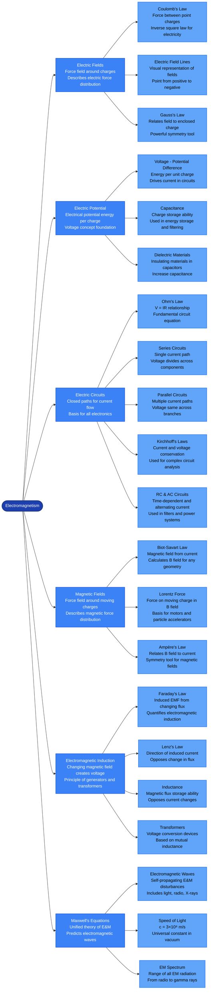

```mermaid
flowchart LR
    Start([Electromagnetism]):::blue
    Start --> ElectricField[Electric Fields<br/>Force field around charges<br/>Describes electric force distribution]:::lightblue
    Start --> ElectricPotential[Electric Potential<br/>Electrical potential energy per charge<br/>Voltage concept foundation]:::lightblue
    Start --> Circuits[Electric Circuits<br/>Closed paths for current flow<br/>Basis for all electronics]:::lightblue
    Start --> MagneticField[Magnetic Fields<br/>Force field around moving charges<br/>Describes magnetic force distribution]:::lightblue
    Start --> EMInduction[Electromagnetic Induction<br/>Changing magnetic field creates voltage<br/>Principle of generators and transformers]:::lightblue
    Start --> Maxwell[Maxwell's Equations<br/>Unified theory of E&M<br/>Predicts electromagnetic waves]:::lightblue
    
    ElectricField --> Coulomb[Coulomb's Law<br/>Force between point charges<br/>Inverse square law for electricity]:::paleblue
    ElectricField --> FieldLines[Electric Field Lines<br/>Visual representation of fields<br/>Point from positive to negative]:::paleblue
    ElectricField --> Gauss[Gauss's Law<br/>Relates field to enclosed charge<br/>Powerful symmetry tool]:::paleblue
    
    ElectricPotential --> Voltage[Voltage - Potential Difference<br/>Energy per unit charge<br/>Drives current in circuits]:::paleblue
    ElectricPotential --> Capacitance[Capacitance<br/>Charge storage ability<br/>Used in energy storage and filtering]:::paleblue
    ElectricPotential --> Dielectrics[Dielectric Materials<br/>Insulating materials in capacitors<br/>Increase capacitance]:::paleblue
    
    Circuits --> OhmsLaw[Ohm's Law<br/>V = IR relationship<br/>Fundamental circuit equation]:::paleblue
    Circuits --> SeriesCircuits[Series Circuits<br/>Single current path<br/>Voltage divides across components]:::paleblue
    Circuits --> ParallelCircuits[Parallel Circuits<br/>Multiple current paths<br/>Voltage same across branches]:::paleblue
    Circuits --> Kirchhoff[Kirchhoff's Laws<br/>Current and voltage conservation<br/>Used for complex circuit analysis]:::paleblue
    Circuits --> RCAC[RC & AC Circuits<br/>Time-dependent and alternating current<br/>Used in filters and power systems]:::paleblue
    
    MagneticField --> BiotSavart[Biot-Savart Law<br/>Magnetic field from current<br/>Calculates B field for any geometry]:::paleblue
    MagneticField --> LorentzForce[Lorentz Force<br/>Force on moving charge in B field<br/>Basis for motors and particle accelerators]:::paleblue
    MagneticField --> Ampere[Ampère's Law<br/>Relates B field to current<br/>Symmetry tool for magnetic fields]:::paleblue
    
    EMInduction --> Faraday[Faraday's Law<br/>Induced EMF from changing flux<br/>Quantifies electromagnetic induction]:::paleblue
    EMInduction --> Lenz[Lenz's Law<br/>Direction of induced current<br/>Opposes change in flux]:::paleblue
    EMInduction --> Inductance[Inductance<br/>Magnetic flux storage ability<br/>Opposes current changes]:::paleblue
    EMInduction --> Transformers[Transformers<br/>Voltage conversion devices<br/>Based on mutual inductance]:::paleblue
    
    Maxwell --> EMWaves[Electromagnetic Waves<br/>Self-propagating E&M disturbances<br/>Includes light, radio, X-rays]:::paleblue
    Maxwell --> LightSpeed[Speed of Light<br/>c = 3×10⁸ m/s<br/>Universal constant in vacuum]:::paleblue
    Maxwell --> EMSpectrum[EM Spectrum<br/>Range of all EM radiation<br/>From radio to gamma rays]:::paleblue
    
    classDef blue fill:#1e40af,stroke:#1e3a8a,stroke-width:3px,color:#fff
    classDef lightblue fill:#3b82f6,stroke:#2563eb,stroke-width:2px,color:#fff
    classDef paleblue fill:#60a5fa,stroke:#3b82f6,stroke-width:2px,color:#000
```