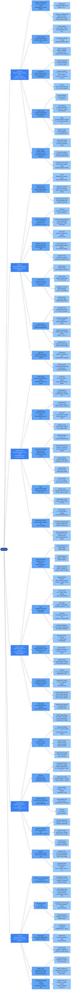

```mermaid
flowchart LR
    Start([Mechanics]):::blue
    Start --> Kinematics["Kinematics<br/>Motion description without forces<br/>Position, velocity, acceleration relationships"]:::lightblue
    Start --> Dynamics["Dynamics<br/>Motion analysis with forces<br/>Newton's laws and force applications"]:::lightblue
    Start --> Energy["Energy & Work<br/>Energy conservation and transfer<br/>Fundamental for all physical processes"]:::lightblue
    Start --> Rotation["Rotational Motion<br/>Angular kinematics and dynamics<br/>Explains spinning and rotating objects"]:::lightblue
    Start --> Fluids["Fluid Mechanics<br/>Behavior of liquids and gases<br/>Pressure, buoyancy, and flow"]:::lightblue
    Start --> Gravitation["Gravitation<br/>Universal attractive force<br/>Newton's law and orbital mechanics"]:::lightblue
    
    Kinematics --> Position["Position & Displacement<br/>Location in space and change<br/>Starting point for motion analysis"]:::paleblue
    Kinematics --> Velocity["Velocity & Speed<br/>Rate of position change<br/>Describes how fast objects move"]:::paleblue
    Kinematics --> Acceleration["Acceleration<br/>Rate of velocity change<br/>Explains speeding up or slowing down"]:::paleblue
    Kinematics --> ProjectileMotion["Projectile Motion<br/>2D motion under gravity<br/>Used in ballistics and sports physics"]:::paleblue
    Kinematics --> MotionGraphs["Motion Graphs<br/>Position, velocity, acceleration vs time<br/>Visual representation of kinematics"]:::paleblue
    
    Position --> Displacement["Displacement<br/>Change in position vector<br/>Delta x = xf - xi"]:::skyblue
    Position --> DistanceVsDisplacement["Distance vs Displacement<br/>Distance is scalar, displacement is vector<br/>Distance always positive"]:::skyblue
    
    Velocity --> AverageVelocity["Average Velocity<br/>v-avg = Delta x / Delta t<br/>Total displacement over time"]:::skyblue
    Velocity --> InstantaneousVelocity["Instantaneous Velocity<br/>v = dx/dt<br/>Velocity at specific instant"]:::skyblue
    Velocity --> SpeedVsVelocity["Speed vs Velocity<br/>Speed is magnitude, velocity is vector<br/>Velocity includes direction"]:::skyblue
    
    Acceleration --> UniformAcceleration["Uniform Acceleration<br/>Constant acceleration<br/>a = Delta v / Delta t"]:::skyblue
    Acceleration --> KinematicEquations["Kinematic Equations<br/>v = v0 + at, x = x0 + v0t + half-at-squared<br/>v squared = v0 squared + 2a Delta x"]:::skyblue
    Acceleration --> FreeFall["Free Fall<br/>Motion under gravity only<br/>a = g = 9.8 m/s squared"]:::skyblue
    
    ProjectileMotion --> HorizontalMotion["Horizontal Motion<br/>Constant velocity<br/>x = v0x times t"]:::skyblue
    ProjectileMotion --> VerticalMotion["Vertical Motion<br/>Constant acceleration<br/>y = v0y times t - half-g times t squared"]:::skyblue
    ProjectileMotion --> Range["Range<br/>Horizontal distance traveled<br/>R = v0 squared sin(2 theta) / g"]:::skyblue
    ProjectileMotion --> MaxHeight["Maximum Height<br/>Peak of trajectory<br/>H = v0y squared / (2g)"]:::skyblue
    
    MotionGraphs --> PositionTimeGraph["Position-Time Graph<br/>Slope gives velocity<br/>Curved for accelerated motion"]:::skyblue
    MotionGraphs --> VelocityTimeGraph["Velocity-Time Graph<br/>Slope gives acceleration<br/>Area gives displacement"]:::skyblue
    MotionGraphs --> AccelerationTimeGraph["Acceleration-Time Graph<br/>Shows rate of velocity change<br/>Area gives velocity change"]:::skyblue
    
    Dynamics --> NewtonFirst["Newton's First Law<br/>Inertia principle<br/>Objects maintain motion state without force"]:::paleblue
    Dynamics --> NewtonSecond["Newton's Second Law<br/>F = ma relationship<br/>Quantifies force-acceleration connection"]:::paleblue
    Dynamics --> NewtonThird["Newton's Third Law<br/>Action-reaction pairs<br/>Forces always occur in pairs"]:::paleblue
    Dynamics --> Friction["Friction Forces<br/>Resistance to motion<br/>Critical for real-world applications"]:::paleblue
    Dynamics --> CircularMotion["Circular Motion<br/>Motion in curved paths<br/>Requires centripetal force"]:::paleblue
    Dynamics --> DragForce["Drag Force<br/>Air and fluid resistance<br/>Opposes motion through medium"]:::paleblue
    
    NewtonFirst --> Inertia["Inertia<br/>Resistance to change in motion<br/>Mass measures inertia"]:::skyblue
    NewtonFirst --> EquilibriumCond["Equilibrium Condition<br/>Net force equals zero<br/>Object at rest or constant velocity"]:::skyblue
    NewtonFirst --> InertialFrame["Inertial Reference Frame<br/>Non-accelerating frame<br/>Newton's laws valid"]:::skyblue
    
    NewtonSecond --> NetForce["Net Force<br/>Vector sum of all forces<br/>F-net = m times a"]:::skyblue
    NewtonSecond --> MassAccelRelation["Mass-Acceleration Relation<br/>Inverse relationship<br/>Larger mass, smaller acceleration"]:::skyblue
    NewtonSecond --> ForceUnits["Force Units<br/>Newton = kg times m/s squared<br/>SI unit of force"]:::skyblue
    
    NewtonThird --> ActionReaction["Action-Reaction Pairs<br/>Equal magnitude, opposite direction<br/>Act on different objects"]:::skyblue
    NewtonThird --> ReactionForces["Reaction Forces<br/>Normal force, tension<br/>Response to applied forces"]:::skyblue
    
    Friction --> StaticFriction["Static Friction<br/>Prevents motion<br/>fs less-equal mu-s times N"]:::skyblue
    Friction --> KineticFriction["Kinetic Friction<br/>Opposes sliding motion<br/>fk = mu-k times N"]:::skyblue
    Friction --> CoefficientFriction["Coefficient of Friction<br/>Material property<br/>mu-s > mu-k always"]:::skyblue
    Friction --> RollingFriction["Rolling Friction<br/>Lower than sliding<br/>Wheels reduce friction"]:::skyblue
    
    CircularMotion --> CentripetalForce["Centripetal Force<br/>Directed toward center<br/>Fc = m times v squared / r"]:::skyblue
    CircularMotion --> CentripetalAccel["Centripetal Acceleration<br/>ac = v squared / r<br/>Always perpendicular to velocity"]:::skyblue
    CircularMotion --> UniformCircular["Uniform Circular Motion<br/>Constant speed, changing velocity<br/>Period T = 2 pi r / v"]:::skyblue
    CircularMotion --> BankedCurves["Banked Curves<br/>Tilted for circular motion<br/>Reduces friction needed"]:::skyblue
    
    DragForce --> AirResistance["Air Resistance<br/>Depends on speed and area<br/>Fd proportional v squared"]:::skyblue
    DragForce --> TerminalVelocity["Terminal Velocity<br/>Constant speed when drag equals weight<br/>No more acceleration"]:::skyblue
    
    Energy --> KineticEnergy["Kinetic Energy<br/>Energy of motion half-m-v squared<br/>Depends on mass and velocity"]:::paleblue
    Energy --> PotentialEnergy["Potential Energy<br/>Stored energy due to position<br/>Gravitational and elastic forms"]:::paleblue
    Energy --> Conservation["Conservation of Energy<br/>Energy cannot be created/destroyed<br/>Fundamental universal principle"]:::paleblue
    Energy --> Power["Power<br/>Rate of energy transfer<br/>Measures how quickly work is done"]:::paleblue
    Energy --> WorkEnergyTheorem["Work-Energy Theorem<br/>Net work equals change in KE<br/>W-net = Delta KE"]:::paleblue
    
    KineticEnergy --> KEFormula["KE Formula<br/>KE = half-m times v squared<br/>Scalar quantity, always positive"]:::skyblue
    KineticEnergy --> KEDependence["KE Dependence<br/>Quadratic in velocity<br/>Doubling speed quadruples KE"]:::skyblue
    
    PotentialEnergy --> GravitationalPE["Gravitational PE<br/>U = m times g times h<br/>Height relative to reference"]:::skyblue
    PotentialEnergy --> ElasticPE["Elastic PE<br/>U = half-k times x squared<br/>Spring compression or stretch"]:::skyblue
    PotentialEnergy --> ReferenceLevelPE["Reference Level<br/>Zero PE point is arbitrary<br/>Only changes matter"]:::skyblue
    
    Conservation --> MechanicalEnergy["Mechanical Energy<br/>E = KE + PE<br/>Conserved without friction"]:::skyblue
    Conservation --> NonconservativeForces["Nonconservative Forces<br/>Friction, air resistance<br/>Convert mechanical to thermal"]:::skyblue
    Conservation --> EnergyDiagrams["Energy Diagrams<br/>PE curves show force<br/>Equilibrium at PE minima"]:::skyblue
    Conservation --> IsolatedSystem["Isolated System<br/>No external forces<br/>Total energy constant"]:::skyblue
    
    Power --> PowerFormula["Power Formula<br/>P = W / t = F times v<br/>Watt = joule per second"]:::skyblue
    Power --> AveragePower["Average Power<br/>Total work over time interval<br/>P-avg = Delta E / Delta t"]:::skyblue
    Power --> InstantaneousPower["Instantaneous Power<br/>Power at specific instant<br/>P = F dot v"]:::skyblue
    
    WorkEnergyTheorem --> WorkDefinition["Work Definition<br/>W = F times d times cos(theta)<br/>Force times displacement"]:::skyblue
    WorkEnergyTheorem --> PositiveNegativeWork["Positive and Negative Work<br/>Positive increases KE<br/>Negative decreases KE"]:::skyblue
    WorkEnergyTheorem --> WorkByMultipleForces["Work by Multiple Forces<br/>Total work = sum of individual works<br/>Net work determines KE change"]:::skyblue
    
    Rotation --> AngularKinematics["Angular Kinematics<br/>Rotational motion description<br/>Angular velocity and acceleration"]:::paleblue
    Rotation --> Torque["Torque<br/>Rotational force effect<br/>Causes angular acceleration"]:::paleblue
    Rotation --> AngularMomentum["Angular Momentum<br/>Rotational inertia in motion<br/>Conserved in closed systems"]:::paleblue
    Rotation --> MomentInertia["Moment of Inertia<br/>Rotational mass analog<br/>Resistance to angular acceleration"]:::paleblue
    Rotation --> RollingMotion["Rolling Motion<br/>Combined rotation and translation<br/>Without slipping condition"]:::paleblue
    
    AngularKinematics --> AngularDisplacement["Angular Displacement<br/>Angle rotated<br/>Theta in radians"]:::skyblue
    AngularKinematics --> AngularVelocity["Angular Velocity<br/>omega = d-theta / dt<br/>Rate of rotation"]:::skyblue
    AngularKinematics --> AngularAcceleration["Angular Acceleration<br/>alpha = d-omega / dt<br/>Rate of change of omega"]:::skyblue
    AngularKinematics --> AngularKinematicEq["Angular Kinematic Equations<br/>Similar to linear equations<br/>omega = omega0 + alpha times t"]:::skyblue
    
    Torque --> TorqueFormula["Torque Formula<br/>tau = r times F times sin(theta)<br/>r times F perpendicular"]:::skyblue
    Torque --> NetTorque["Net Torque<br/>tau-net = I times alpha<br/>Rotational analog of F = ma"]:::skyblue
    Torque --> LeverArm["Lever Arm<br/>Perpendicular distance to axis<br/>Longer arm, greater torque"]:::skyblue
    Torque --> EquilibriumTorque["Rotational Equilibrium<br/>Sum of torques equals zero<br/>No angular acceleration"]:::skyblue
    
    AngularMomentum --> AngMomentumFormula["Angular Momentum Formula<br/>L = I times omega<br/>For rigid body"]:::skyblue
    AngularMomentum --> AngMomentumConservation["Conservation of L<br/>L constant if net torque = 0<br/>Explains spinning ice skaters"]:::skyblue
    AngularMomentum --> AngularImpulse["Angular Impulse<br/>tau times Delta t = Delta L<br/>Torque-impulse theorem"]:::skyblue
    
    MomentInertia --> MomentInertiaFormula["I Formula<br/>I = sum m times r squared<br/>Distribution of mass"]:::skyblue
    MomentInertia --> ParallelAxis["Parallel Axis Theorem<br/>I = I-cm + M times d squared<br/>Shift rotation axis"]:::skyblue
    MomentInertia --> CommonShapes["Common Shape Formulas<br/>Disk: half-M-R squared<br/>Sphere: 2/5 M R squared, Rod: 1/12 M L squared"]:::skyblue
    
    RollingMotion --> RollingCondition["Rolling Without Slipping<br/>v = omega times r<br/>No sliding at contact"]:::skyblue
    RollingMotion --> RollingKE["Rolling Kinetic Energy<br/>KE = half-m-v squared + half-I-omega squared<br/>Translation plus rotation"]:::skyblue
    
    Fluids --> Pressure["Pressure<br/>Force per unit area<br/>P = F/A, acts in all directions"]:::paleblue
    Fluids --> Buoyancy["Buoyancy<br/>Upward force on submerged objects<br/>Archimedes' principle"]:::paleblue
    Fluids --> Continuity["Continuity Equation<br/>Mass flow rate conservation<br/>A₁v₁ = A₂v₂ for incompressible fluids"]:::paleblue
    Fluids --> Bernoulli["Bernoulli's Equation<br/>Energy conservation in fluids<br/>P + ½ρv² + ρgh = constant"]:::paleblue
    Fluids --> Viscosity["Viscosity<br/>Fluid resistance to flow<br/>Causes drag and energy loss"]:::paleblue
    
    Pressure --> PressureDepth["Pressure with Depth<br/>P = P0 + rho times g times h<br/>Increases linearly with depth"]:::skyblue
    Pressure --> PascalPrinciple["Pascal's Principle<br/>Pressure change transmitted equally<br/>Hydraulic systems"]:::skyblue
    Pressure --> AtmosphericPressure["Atmospheric Pressure<br/>P-atm = 101,325 Pa<br/>1 atm at sea level"]:::skyblue
    
    Buoyancy --> ArchimedesPrinciple["Archimedes' Principle<br/>Buoyant force equals weight of displaced fluid<br/>Fb = rho-fluid times V times g"]:::skyblue
    Buoyancy --> FloatingSinking["Floating and Sinking<br/>Float if rho-object < rho-fluid<br/>Sink if rho-object > rho-fluid"]:::skyblue
    Buoyancy --> ApparentWeight["Apparent Weight<br/>W-apparent = W - F-buoyant<br/>Feels lighter in fluid"]:::skyblue
    
    Continuity --> IncompressibleFlow["Incompressible Flow<br/>Density constant<br/>Volume flow rate conserved"]:::skyblue
    Continuity --> FlowRate["Flow Rate<br/>Q = A times v<br/>Volume per time"]:::skyblue
    
    Bernoulli --> BernoulliApps["Bernoulli Applications<br/>Airplane lift, venturi meter<br/>Atomizers, carburetors"]:::skyblue
    Bernoulli --> DynamicPressure["Dynamic Pressure<br/>half-rho times v squared<br/>Pressure due to motion"]:::skyblue
    Bernoulli --> StaticPressure["Static Pressure<br/>P term in Bernoulli<br/>Pressure in still fluid"]:::skyblue
    
    Viscosity --> PoiseuilleLaw["Poiseuille's Law<br/>Flow rate through pipe<br/>Q proportional Delta P times r to 4th / length"]:::skyblue
    Viscosity --> ReynoldsNumber["Reynolds Number<br/>Predicts laminar vs turbulent<br/>Re = rho times v times L / mu"]:::skyblue
    
    Gravitation --> NewtonGravity["Newton's Law of Gravitation<br/>F = Gm₁m₂/r²<br/>Universal attractive force"]:::paleblue
    Gravitation --> GravitationalField["Gravitational Field<br/>g = GM/r²<br/>Force per unit mass"]:::paleblue
    Gravitation --> OrbitalMotion["Orbital Motion<br/>Circular and elliptical orbits<br/>Satellites and planets"]:::paleblue
    Gravitation --> Kepler["Kepler's Laws<br/>Planetary motion laws<br/>Elliptical orbits, equal areas, period relation"]:::paleblue
    Gravitation --> GravPotential["Gravitational Potential Energy<br/>U = -GMm/r<br/>Energy due to position in field"]:::paleblue
    
    NewtonGravity --> UniversalGConstant["Gravitational Constant<br/>G = 6.67 times 10 to -11 N m squared / kg squared<br/>Universal constant"]:::skyblue
    NewtonGravity --> InverseSquare["Inverse Square Law<br/>Force decreases with distance squared<br/>Double distance, quarter force"]:::skyblue
    
    GravitationalField --> AccelerationDueGravity["Acceleration Due to Gravity<br/>g = 9.8 m/s squared at surface<br/>Varies with altitude"]:::skyblue
    GravitationalField --> FieldSuperposition["Field Superposition<br/>Total field = vector sum<br/>Multiple masses"]:::skyblue
    
    OrbitalMotion --> CircularOrbit["Circular Orbit<br/>v = sqrt(GM / r)<br/>Centripetal force = gravity"]:::skyblue
    OrbitalMotion --> OrbitalPeriod["Orbital Period<br/>T squared proportional r cubed<br/>Kepler's third law"]:::skyblue
    OrbitalMotion --> EscapeVelocity["Escape Velocity<br/>v-escape = sqrt(2GM / r)<br/>Minimum to escape gravity"]:::skyblue
    
    Kepler --> KeplerFirst["Kepler's First Law<br/>Planets orbit in ellipses<br/>Sun at one focus"]:::skyblue
    Kepler --> KeplerSecond["Kepler's Second Law<br/>Equal areas in equal times<br/>Angular momentum conservation"]:::skyblue
    Kepler --> KeplerThird["Kepler's Third Law<br/>T squared / r cubed = constant<br/>Same for all planets around Sun"]:::skyblue
    
    classDef blue fill:#1e40af,stroke:#1e3a8a,stroke-width:3px,color:#fff
    classDef lightblue fill:#3b82f6,stroke:#2563eb,stroke-width:2px,color:#fff
    classDef paleblue fill:#60a5fa,stroke:#3b82f6,stroke-width:2px,color:#000
    classDef skyblue fill:#93c5fd,stroke:#60a5fa,stroke-width:1px,color:#000
```