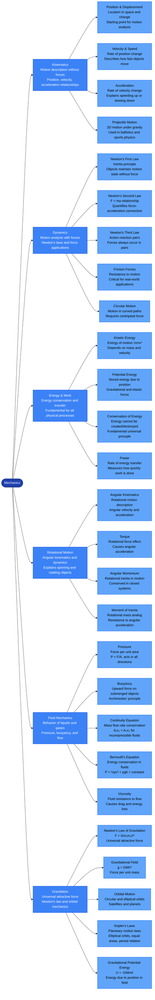

```mermaid
flowchart LR
    Start([Mechanics]):::blue
    Start --> Kinematics[Kinematics<br/>Motion description without forces<br/>Position, velocity, acceleration relationships]:::lightblue
    Start --> Dynamics[Dynamics<br/>Motion analysis with forces<br/>Newton's laws and force applications]:::lightblue
    Start --> Energy[Energy & Work<br/>Energy conservation and transfer<br/>Fundamental for all physical processes]:::lightblue
    Start --> Rotation[Rotational Motion<br/>Angular kinematics and dynamics<br/>Explains spinning and rotating objects]:::lightblue
    Start --> Fluids[Fluid Mechanics<br/>Behavior of liquids and gases<br/>Pressure, buoyancy, and flow]:::lightblue
    Start --> Gravitation[Gravitation<br/>Universal attractive force<br/>Newton's law and orbital mechanics]:::lightblue
    
    Kinematics --> Position[Position & Displacement<br/>Location in space and change<br/>Starting point for motion analysis]:::paleblue
    Kinematics --> Velocity[Velocity & Speed<br/>Rate of position change<br/>Describes how fast objects move]:::paleblue
    Kinematics --> Acceleration[Acceleration<br/>Rate of velocity change<br/>Explains speeding up or slowing down]:::paleblue
    Kinematics --> ProjectileMotion[Projectile Motion<br/>2D motion under gravity<br/>Used in ballistics and sports physics]:::paleblue
    
    Dynamics --> NewtonFirst[Newton's First Law<br/>Inertia principle<br/>Objects maintain motion state without force]:::paleblue
    Dynamics --> NewtonSecond[Newton's Second Law<br/>F = ma relationship<br/>Quantifies force-acceleration connection]:::paleblue
    Dynamics --> NewtonThird[Newton's Third Law<br/>Action-reaction pairs<br/>Forces always occur in pairs]:::paleblue
    Dynamics --> Friction[Friction Forces<br/>Resistance to motion<br/>Critical for real-world applications]:::paleblue
    Dynamics --> CircularMotion[Circular Motion<br/>Motion in curved paths<br/>Requires centripetal force]:::paleblue
    
    Energy --> KineticEnergy[Kinetic Energy<br/>Energy of motion ½mv²<br/>Depends on mass and velocity]:::paleblue
    Energy --> PotentialEnergy[Potential Energy<br/>Stored energy due to position<br/>Gravitational and elastic forms]:::paleblue
    Energy --> Conservation[Conservation of Energy<br/>Energy cannot be created/destroyed<br/>Fundamental universal principle]:::paleblue
    Energy --> Power[Power<br/>Rate of energy transfer<br/>Measures how quickly work is done]:::paleblue
    
    Rotation --> AngularKinematics[Angular Kinematics<br/>Rotational motion description<br/>Angular velocity and acceleration]:::paleblue
    Rotation --> Torque[Torque<br/>Rotational force effect<br/>Causes angular acceleration]:::paleblue
    Rotation --> AngularMomentum[Angular Momentum<br/>Rotational inertia in motion<br/>Conserved in closed systems]:::paleblue
    Rotation --> MomentInertia[Moment of Inertia<br/>Rotational mass analog<br/>Resistance to angular acceleration]:::paleblue
    
    Fluids --> Pressure[Pressure<br/>Force per unit area<br/>P = F/A, acts in all directions]:::paleblue
    Fluids --> Buoyancy[Buoyancy<br/>Upward force on submerged objects<br/>Archimedes' principle]:::paleblue
    Fluids --> Continuity[Continuity Equation<br/>Mass flow rate conservation<br/>A₁v₁ = A₂v₂ for incompressible fluids]:::paleblue
    Fluids --> Bernoulli[Bernoulli's Equation<br/>Energy conservation in fluids<br/>P + ½ρv² + ρgh = constant]:::paleblue
    Fluids --> Viscosity[Viscosity<br/>Fluid resistance to flow<br/>Causes drag and energy loss]:::paleblue
    
    Gravitation --> NewtonGravity[Newton's Law of Gravitation<br/>F = Gm₁m₂/r²<br/>Universal attractive force]:::paleblue
    Gravitation --> GravitationalField[Gravitational Field<br/>g = GM/r²<br/>Force per unit mass]:::paleblue
    Gravitation --> OrbitalMotion[Orbital Motion<br/>Circular and elliptical orbits<br/>Satellites and planets]:::paleblue
    Gravitation --> Kepler[Kepler's Laws<br/>Planetary motion laws<br/>Elliptical orbits, equal areas, period relation]:::paleblue
    Gravitation --> GravPotential[Gravitational Potential Energy<br/>U = -GMm/r<br/>Energy due to position in field]:::paleblue
    
    classDef blue fill:#1e40af,stroke:#1e3a8a,stroke-width:3px,color:#fff
    classDef lightblue fill:#3b82f6,stroke:#2563eb,stroke-width:2px,color:#fff
    classDef paleblue fill:#60a5fa,stroke:#3b82f6,stroke-width:2px,color:#000
```