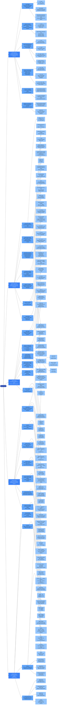

```mermaid
flowchart LR
    Start([Modern Physics]):::blue
    Start --> Relativity["Special Relativity<br/>Physics at high speeds<br/>Time dilation and length contraction"]:::lightblue
    Start --> Quantum["Quantum Mechanics<br/>Physics at atomic scale<br/>Wave-particle duality and uncertainty"]:::lightblue
    Start --> Atomic["Atomic Physics<br/>Structure and behavior of atoms<br/>Electron shells and spectra"]:::lightblue
    Start --> Nuclear["Nuclear Physics<br/>Atomic nuclei properties<br/>Radioactivity and nuclear reactions"]:::lightblue
    Start --> ParticlePhysics["Particle Physics<br/>Study of fundamental particles<br/>Standard Model"]:::lightblue
    
    Relativity --> TimeDilation["Time Dilation<br/>Time slows at high speeds<br/>Confirmed by particle experiments"]:::paleblue
    Relativity --> LengthContraction["Length Contraction<br/>Objects shorten in motion direction<br/>Consequence of spacetime structure"]:::paleblue
    Relativity --> MassEnergy["Mass-Energy Equivalence<br/>E = mc² relationship<br/>Mass and energy are interconvertible"]:::paleblue
    Relativity --> Lorentz["Lorentz Transformations<br/>Coordinate conversions between frames<br/>Replaces Galilean transformations"]:::paleblue
    Relativity --> Postulates["Einstein's Postulates<br/>1. Laws same all inertial frames<br/>2. c constant all frames"]:::paleblue
    Relativity --> Simultaneity["Relativity of Simultaneity<br/>Events simultaneous in one frame<br/>Not simultaneous in another"]:::paleblue
    
    TimeDilation --> TimeDilEq["Δt = γΔt₀<br/>γ = 1/√(1 - v²/c²)<br/>Δt₀ = proper time"]:::skyblue
    TimeDilation --> TwinParadox["Twin paradox<br/>Traveling twin ages slower<br/>Asymmetric acceleration"]:::skyblue
    TimeDilation --> MuonDecay["Muon decay experiments<br/>Cosmic ray muons reach Earth<br/>Lifetime extended by time dilation"]:::skyblue
    
    LengthContraction --> LengthEq["L = L₀/γ<br/>L₀ = proper length<br/>Contraction in motion direction only"]:::skyblue
    LengthContraction --> MeasuredRest["Proper length: measured at rest<br/>Contracted length: observed in motion<br/>Real physical effect"]:::skyblue
    
    MassEnergy --> EnergyEq["E = mc²<br/>Rest mass energy<br/>Huge conversion factor c²"]:::skyblue
    MassEnergy --> RelativisticEnergy["E = γmc²<br/>Total relativistic energy<br/>KE = (γ - 1)mc²"]:::skyblue
    MassEnergy --> MomentumEnergy["E² = (pc)² + (mc²)²<br/>Energy-momentum relation<br/>Massless: E = pc"]:::skyblue
    MassEnergy --> NuclearReactions["Nuclear reactions<br/>Mass defect → energy<br/>Binding energy"]:::skyblue
    
    Lorentz --> LorentzTime["t' = γ(t - vx/c²)<br/>Time transformation<br/>Mixing space and time"]:::skyblue
    Lorentz --> LorentzSpace["x' = γ(x - vt)<br/>Space transformation<br/>Length contraction embedded"]:::skyblue
    Lorentz --> VelocityAdd["u' = (u - v)/(1 - uv/c²)<br/>Relativistic velocity addition<br/>Never exceeds c"]:::skyblue
    
    Postulates --> Postulate1["Laws of physics invariant<br/>No preferred inertial frame<br/>Galilean relativity extended"]:::skyblue
    Postulates --> Postulate2["c = 3×10⁸ m/s all frames<br/>Independent of source motion<br/>Revolutionary assumption"]:::skyblue
    
    Simultaneity --> SpacelikeSeparated["Events spacelike separated<br/>Order depends on frame<br/>No causal connection"]:::skyblue
    Simultaneity --> LightCones["Light cones<br/>Past, future, elsewhere<br/>Causal structure of spacetime"]:::skyblue
    
    Quantum --> PhotoelectricEffect["Photoelectric Effect<br/>Light ejects electrons from metal<br/>Evidence for photons"]:::paleblue
    Quantum --> WaveParticle["Wave-Particle Duality<br/>Matter exhibits wave and particle properties<br/>Fundamental quantum concept"]:::paleblue
    Quantum --> Uncertainty["Heisenberg Uncertainty<br/>Cannot know position and momentum precisely<br/>Fundamental limit on measurement"]:::paleblue
    Quantum --> Schrodinger["Schrödinger Equation<br/>Wave function evolution equation<br/>Fundamental equation of quantum mechanics"]:::paleblue
    Quantum --> Tunneling["Quantum Tunneling<br/>Particles penetrate barriers<br/>Used in transistors and radioactivity"]:::paleblue
    Quantum --> QuantumNumbers["Quantum Numbers<br/>n, l, m_l, m_s<br/>Specify electron states"]:::paleblue
    Quantum --> Superposition["Superposition<br/>Particle in multiple states<br/>Collapses upon measurement"]:::paleblue
    
    PhotoelectricEffect --> EinsteinPhotoEq["KEmax = hf - φ<br/>h = 6.63×10⁻³⁴ Js<br/>φ = work function"]:::skyblue
    PhotoelectricEffect --> Photons["Photons E = hf<br/>Light quanta<br/>Particle nature of light"]:::skyblue
    PhotoelectricEffect --> ThresholdFreq["Threshold frequency f₀<br/>hf₀ = φ<br/>Below f₀: no emission"]:::skyblue
    PhotoelectricEffect --> Instantaneous["Instantaneous emission<br/>No delay<br/>Classical wave fails"]:::skyblue
    
    WaveParticle --> deBroglieWave["λ = h/p<br/>de Broglie wavelength<br/>Matter waves"]:::skyblue
    WaveParticle --> ElectronDiffraction["Electron diffraction<br/>Double-slit with electrons<br/>Interference pattern"]:::skyblue
    WaveParticle --> Complementarity["Complementarity principle<br/>Wave or particle, not both simultaneously<br/>Observation determines"]:::skyblue
    
    Uncertainty --> UncertaintyEq["ΔxΔp ≥ ħ/2<br/>ΔEΔt ≥ ħ/2<br/>ħ = h/(2π)"]:::skyblue
    Uncertainty --> NotMeasurement["Not measurement error<br/>Fundamental property of nature<br/>Intrinsic uncertainty"]:::skyblue
    Uncertainty --> ZeroPointEnergy["Zero-point energy<br/>E₀ = (1/2)ħω<br/>Cannot be exactly at rest"]:::skyblue
    
    Schrodinger --> WaveFunction["Ψ(x,t)<br/>Probability amplitude<br/>|Ψ|² = probability density"]:::skyblue
    Schrodinger --> TimeIndep["Time-independent: HΨ = EΨ<br/>Energy eigenstates<br/>Stationary states"]:::skyblue
    Schrodinger --> InfiniteWell["Particle in box<br/>E_n = n²h²/(8mL²)<br/>Quantized energies"]:::skyblue
    Schrodinger --> HarmonicOsc["Quantum harmonic oscillator<br/>E_n = (n + 1/2)ħω<br/>Evenly spaced levels"]:::skyblue
    
    Tunneling --> TunnelProb["T = e^(-2κL)<br/>Transmission probability<br/>κ depends on barrier"]:::skyblue
    Tunneling --> AlphaDecay["Alpha decay<br/>Nucleus tunnels through barrier<br/>Explains long half-lives"]:::skyblue
    Tunneling --> STM["Scanning tunneling microscope<br/>Images individual atoms<br/>Tunneling current sensitive to distance"]:::skyblue
    
    QuantumNumbers --> PrincipalN["n = 1, 2, 3...<br/>Principal quantum number<br/>Energy level (shell)"]:::skyblue
    QuantumNumbers --> OrbitalL["l = 0 to n-1<br/>Orbital angular momentum<br/>s, p, d, f (subshells)"]:::skyblue
    QuantumNumbers --> MagneticMl["m_l = -l to +l<br/>Magnetic quantum number<br/>Orbital orientation"]:::skyblue
    QuantumNumbers --> SpinMs["m_s = ±1/2<br/>Spin quantum number<br/>Intrinsic angular momentum"]:::skyblue
    
    Superposition --> SchrodingerCat["Schrödinger's cat<br/>Dead and alive simultaneously<br/>Thought experiment"]:::skyblue
    Superposition --> MeasurementCollapse["Wave function collapse<br/>Superposition → definite state<br/>Measurement problem"]:::skyblue
    
    Atomic --> BohrModel["Bohr Model<br/>Quantized electron orbits<br/>Explains hydrogen spectrum"]:::paleblue
    Atomic --> ElectronConfig["Electron Configuration<br/>Arrangement of electrons in shells<br/>Determines chemical properties"]:::paleblue
    Atomic --> AtomicSpectra["Atomic Spectra<br/>Characteristic light emission/absorption<br/>Fingerprint for elements"]:::paleblue
    Atomic --> PauliExclusion["Pauli Exclusion Principle<br/>No two electrons in same quantum state<br/>Explains electron shell structure"]:::paleblue
    Atomic --> HydrogenAtom["Hydrogen Atom<br/>Simplest atom (one electron)<br/>Exactly solvable"]:::paleblue
    Atomic --> Orbitals["Atomic Orbitals<br/>s, p, d, f<br/>Probability distributions"]:::paleblue
    
    BohrModel --> BohrPostulates["Bohr postulates<br/>Quantized angular momentum<br/>L = nħ"]:::skyblue
    BohrModel --> BohrRadius["r_n = n²a₀<br/>a₀ = 0.529 Å (Bohr radius)<br/>Quantized orbits"]:::skyblue
    BohrModel --> BohrEnergy["E_n = -13.6 eV / n²<br/>Negative (bound states)<br/>Ionization at E = 0"]:::skyblue
    BohrModel --> BohrTransitions["ΔE = hf<br/>Photon emission/absorption<br/>Explains line spectra"]:::skyblue
    
    ElectronConfig --> AufbauPrinciple["Aufbau principle<br/>Fill lowest energy first<br/>1s, 2s, 2p, 3s..."]:::skyblue
    ElectronConfig --> HundsRule["Hund's rule<br/>Max unpaired spins first<br/>Parallel spins in degenerate orbitals"]:::skyblue
    ElectronConfig --> NobleGasConfig["Noble gas configuration<br/>Filled shells<br/>Chemically inert"]:::skyblue
    ElectronConfig --> ValenceElectrons["Valence electrons<br/>Outermost shell<br/>Determine reactivity"]:::skyblue
    
    AtomicSpectra --> EmissionSpectra["Emission spectra<br/>Bright lines on dark<br/>Excited atoms emit photons"]:::skyblue
    AtomicSpectra --> AbsorptionSpectra["Absorption spectra<br/>Dark lines on continuous<br/>Atoms absorb specific frequencies"]:::skyblue
    AtomicSpectra --> HydrogenSeries["Hydrogen series<br/>Lyman, Balmer, Paschen<br/>Different n transitions"]:::skyblue
    
    HydrogenSeries --> Lyman["Lyman (UV)<br/>n → 1<br/>Highest energy"]:::skyblue
    HydrogenSeries --> Balmer["Balmer (visible)<br/>n → 2<br/>H-alpha 656 nm (red)"]:::skyblue
    HydrogenSeries --> Paschen["Paschen (IR)<br/>n → 3<br/>Lower energy"]:::skyblue
    
    PauliExclusion --> TwoPerOrbital["Max 2 electrons per orbital<br/>Opposite spins<br/>Explains periodic table"]:::skyblue
    PauliExclusion --> DegeneracyPressure["Degeneracy pressure<br/>White dwarfs, neutron stars<br/>Quantum mechanical pressure"]:::skyblue
    
    HydrogenAtom --> HSchrodinger["Schrödinger equation solution<br/>Spherical harmonics<br/>Exact analytical solution"]:::skyblue
    HydrogenAtom --> QuantumDefect["Quantum defect<br/>Multi-electron atoms<br/>Shielding and penetration"]:::skyblue
    
    Orbitals --> sOrbital["s orbital (l=0)<br/>Spherical<br/>1 per shell"]:::skyblue
    Orbitals --> pOrbital["p orbital (l=1)<br/>Dumbbell shape<br/>3 per shell (n≥2)"]:::skyblue
    Orbitals --> dOrbital["d orbital (l=2)<br/>Complex shapes<br/>5 per shell (n≥3)"]:::skyblue
    Orbitals --> fOrbital["f orbital (l=3)<br/>Even more complex<br/>7 per shell (n≥4)"]:::skyblue
    
    Nuclear --> Radioactivity["Radioactivity<br/>Spontaneous nuclear decay<br/>Alpha, beta, gamma emissions"]:::paleblue
    Nuclear --> HalfLife["Half-Life<br/>Time for half of sample to decay<br/>Characterizes decay rate"]:::paleblue
    Nuclear --> Fission["Nuclear Fission<br/>Heavy nuclei split into lighter ones<br/>Releases energy in reactors"]:::paleblue
    Nuclear --> Fusion["Nuclear Fusion<br/>Light nuclei combine into heavier ones<br/>Powers the sun and stars"]:::paleblue
    Nuclear --> BindingEnergy["Nuclear Binding Energy<br/>Energy holding nucleus together<br/>Explains stability and reactions"]:::paleblue
    Nuclear --> NuclearForce["Strong Nuclear Force<br/>Binds protons and neutrons<br/>Short range, strongest force"]:::paleblue
    Nuclear --> IsotopesStability["Isotopes and Stability<br/>N/Z ratio determines stability<br/>Valley of stability"]:::paleblue
    
    Radioactivity --> AlphaDecay["Alpha decay (α)<br/>Emits ⁴He nucleus<br/>Decreases A by 4, Z by 2"]:::skyblue
    Radioactivity --> BetaMinus["Beta-minus decay (β⁻)<br/>Neutron → proton + e⁻ + ν̄_e<br/>Increases Z by 1"]:::skyblue
    Radioactivity --> BetaPlus["Beta-plus decay (β⁺)<br/>Proton → neutron + e⁺ + ν_e<br/>Decreases Z by 1"]:::skyblue
    Radioactivity --> GammaDecay["Gamma decay (γ)<br/>Excited nucleus → ground state<br/>No change in A or Z"]:::skyblue
    Radioactivity --> DecaySeries["Decay series<br/>Successive decays<br/>U-238 → Pb-206"]:::skyblue
    
    HalfLife --> HalfLifeEq["N(t) = N₀(1/2)^(t/t_{1/2})<br/>Exponential decay<br/>t_{1/2} constant for each isotope"]:::skyblue
    HalfLife --> ActivityDef["Activity A = λN<br/>Decays per time<br/>Unit: becquerel (Bq) = 1/s"]:::skyblue
    HalfLife --> CarbonDating["Carbon-14 dating<br/>t_{1/2} = 5730 years<br/>Archaeological dating"]:::skyblue
    HalfLife --> DecayConstant["λ = ln(2)/t_{1/2}<br/>Decay constant<br/>N(t) = N₀e^(-λt)"]:::skyblue
    
    Fission --> FissionReaction["²³⁵U + n → fragments + neutrons<br/>Chain reaction possible<br/>3 MeV per fission"]:::skyblue
    Fission --> CriticalMass["Critical mass<br/>Minimum for chain reaction<br/>Depends on geometry"]:::skyblue
    Fission --> ModeratorControl["Moderator slows neutrons<br/>Control rods absorb neutrons<br/>Nuclear reactor control"]:::skyblue
    Fission --> WasteProducts["Radioactive waste<br/>Fission fragments<br/>Long-lived isotopes"]:::skyblue
    
    Fusion --> FusionReaction["²H + ³H → ⁴He + n<br/>Deuterium-tritium fusion<br/>17.6 MeV per reaction"]:::skyblue
    Fusion --> FusionSun["Solar fusion<br/>p-p chain<br/>4 ¹H → ⁴He + energy"]:::skyblue
    Fusion --> FusionConditions["Extreme conditions<br/>T ~ 10⁷ K, high pressure<br/>Overcome Coulomb repulsion"]:::skyblue
    Fusion --> FusionEnergy["Fusion energy research<br/>ITER, tokamak<br/>Clean, abundant fuel"]:::skyblue
    
    BindingEnergy --> BindingEnergyDef["BE = (Zm_p + Nm_n - m_nucleus)c²<br/>Mass defect<br/>Binding energy per nucleon"]:::skyblue
    BindingEnergy --> BECurve["BE/A vs A curve<br/>Peak at Fe-56<br/>Most stable nucleus"]:::skyblue
    BindingEnergy --> FissionVsFusion["Fission: heavy → medium (releases)<br/>Fusion: light → medium (releases)<br/>Both move toward Fe"]:::skyblue
    
    NuclearForce --> StrongForce["Strong force<br/>Quark-gluon interaction<br/>Residual: nuclear binding"]:::skyblue
    NuclearForce --> ShortRange["Range ~ 1 fm<br/>Attractive 1-3 fm<br/>Repulsive < 1 fm"]:::skyblue
    NuclearForce --> OvercomeEM["Overcomes EM repulsion<br/>Binds protons together<br/>Charge independent"]:::skyblue
    
    IsotopesStability --> StableIsotopes["Stable isotopes<br/>N ≈ Z (light)<br/>N > Z (heavy)"]:::skyblue
    IsotopesStability --> ValleyOfStability["Valley of stability<br/>Chart of nuclides<br/>Stable band"]:::skyblue
    IsotopesStability --> MagicNumbers["Magic numbers<br/>2, 8, 20, 28, 50, 82, 126<br/>Extra stable (closed shells)"]:::skyblue
    
    ParticlePhysics --> StandardModel["Standard Model<br/>Theory of fundamental particles<br/>Fermions and Bosons"]:::paleblue
    ParticlePhysics --> Fermions["Fermions<br/>Matter particles (spin 1/2)<br/>Quarks and Leptons"]:::paleblue
    ParticlePhysics --> Bosons["Bosons<br/>Force carriers (integer spin)<br/>Gauge bosons and Higgs"]:::paleblue
    ParticlePhysics --> FundamentalForces["Fundamental Forces<br/>Strong, Weak, EM, Gravity<br/>Mediated by bosons"]:::paleblue

    Fermions --> Quarks["Quarks<br/>Up, Down, Charm, Strange, Top, Bottom<br/>Form hadrons (protons, neutrons)"]:::skyblue
    Fermions --> Leptons["Leptons<br/>Electron, Muon, Tau, Neutrinos<br/>Do not feel strong force"]:::skyblue
    Fermions --> Antimatter["Antimatter<br/>Same mass, opposite charge<br/>Annihilates with matter"]:::skyblue

    Bosons --> Gluons["Gluons<br/>Strong force carrier<br/>Binds quarks"]:::skyblue
    Bosons --> Photons["Photons<br/>EM force carrier<br/>Massless"]:::skyblue
    Bosons --> WZBosons["W and Z Bosons<br/>Weak force carriers<br/>Radioactive decay"]:::skyblue
    Bosons --> HiggsBoson["Higgs Boson<br/>Gives mass to particles<br/>Higgs field excitation"]:::skyblue
    Bosons --> Graviton["Graviton (Hypothetical)<br/>Gravity carrier<br/>Not yet observed"]:::skyblue

    FundamentalForces --> StrongForcePart["Strong Force<br/>Strongest force<br/>Short range (nucleus)"]:::skyblue
    FundamentalForces --> EMForcePart["Electromagnetic Force<br/>Infinite range<br/>Between charged particles"]:::skyblue
    FundamentalForces --> WeakForcePart["Weak Force<br/>Short range<br/>Flavor change (decay)"]:::skyblue
    FundamentalForces --> GravityPart["Gravity<br/>Weakest force<br/>Infinite range, mass attraction"]:::skyblue

    classDef blue fill:#1e40af,stroke:#1e3a8a,stroke-width:3px,color:#fff
    classDef lightblue fill:#3b82f6,stroke:#2563eb,stroke-width:2px,color:#fff
    classDef paleblue fill:#60a5fa,stroke:#3b82f6,stroke-width:2px,color:#000
    classDef skyblue fill:#93c5fd,stroke:#60a5fa,stroke-width:1px,color:#000
```