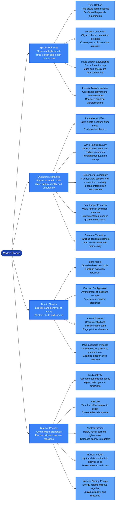

```mermaid
flowchart LR
    Start([Modern Physics]):::blue
    Start --> Relativity[Special Relativity<br/>Physics at high speeds<br/>Time dilation and length contraction]:::lightblue
    Start --> Quantum[Quantum Mechanics<br/>Physics at atomic scale<br/>Wave-particle duality and uncertainty]:::lightblue
    Start --> Atomic[Atomic Physics<br/>Structure and behavior of atoms<br/>Electron shells and spectra]:::lightblue
    Start --> Nuclear[Nuclear Physics<br/>Atomic nuclei properties<br/>Radioactivity and nuclear reactions]:::lightblue
    
    Relativity --> TimeDilation[Time Dilation<br/>Time slows at high speeds<br/>Confirmed by particle experiments]:::paleblue
    Relativity --> LengthContraction[Length Contraction<br/>Objects shorten in motion direction<br/>Consequence of spacetime structure]:::paleblue
    Relativity --> MassEnergy[Mass-Energy Equivalence<br/>E = mc² relationship<br/>Mass and energy are interconvertible]:::paleblue
    Relativity --> Lorentz[Lorentz Transformations<br/>Coordinate conversions between frames<br/>Replaces Galilean transformations]:::paleblue
    
    Quantum --> PhotoelectricEffect[Photoelectric Effect<br/>Light ejects electrons from metal<br/>Evidence for photons]:::paleblue
    Quantum --> WaveParticle[Wave-Particle Duality<br/>Matter exhibits wave and particle properties<br/>Fundamental quantum concept]:::paleblue
    Quantum --> Uncertainty[Heisenberg Uncertainty<br/>Cannot know position and momentum precisely<br/>Fundamental limit on measurement]:::paleblue
    Quantum --> Schrodinger[Schrödinger Equation<br/>Wave function evolution equation<br/>Fundamental equation of quantum mechanics]:::paleblue
    Quantum --> Tunneling[Quantum Tunneling<br/>Particles penetrate barriers<br/>Used in transistors and radioactivity]:::paleblue
    
    Atomic --> BohrModel[Bohr Model<br/>Quantized electron orbits<br/>Explains hydrogen spectrum]:::paleblue
    Atomic --> ElectronConfig[Electron Configuration<br/>Arrangement of electrons in shells<br/>Determines chemical properties]:::paleblue
    Atomic --> AtomicSpectra[Atomic Spectra<br/>Characteristic light emission/absorption<br/>Fingerprint for elements]:::paleblue
    Atomic --> PauliExclusion[Pauli Exclusion Principle<br/>No two electrons in same quantum state<br/>Explains electron shell structure]:::paleblue
    
    Nuclear --> Radioactivity[Radioactivity<br/>Spontaneous nuclear decay<br/>Alpha, beta, gamma emissions]:::paleblue
    Nuclear --> HalfLife[Half-Life<br/>Time for half of sample to decay<br/>Characterizes decay rate]:::paleblue
    Nuclear --> Fission[Nuclear Fission<br/>Heavy nuclei split into lighter ones<br/>Releases energy in reactors]:::paleblue
    Nuclear --> Fusion[Nuclear Fusion<br/>Light nuclei combine into heavier ones<br/>Powers the sun and stars]:::paleblue
    Nuclear --> BindingEnergy[Nuclear Binding Energy<br/>Energy holding nucleus together<br/>Explains stability and reactions]:::paleblue
    
    classDef blue fill:#1e40af,stroke:#1e3a8a,stroke-width:3px,color:#fff
    classDef lightblue fill:#3b82f6,stroke:#2563eb,stroke-width:2px,color:#fff
    classDef paleblue fill:#60a5fa,stroke:#3b82f6,stroke-width:2px,color:#000
```