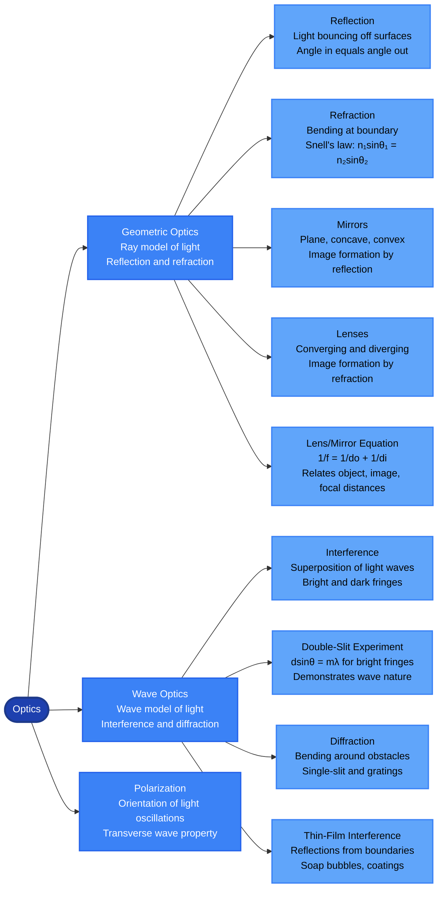

```mermaid
flowchart LR
    Start([Optics]):::blue
    Start --> GeometricOptics[Geometric Optics<br/>Ray model of light<br/>Reflection and refraction]:::lightblue
    Start --> WaveOptics[Wave Optics<br/>Wave model of light<br/>Interference and diffraction]:::lightblue
    Start --> Polarization[Polarization<br/>Orientation of light oscillations<br/>Transverse wave property]:::lightblue
    
    GeometricOptics --> Reflection[Reflection<br/>Light bouncing off surfaces<br/>Angle in equals angle out]:::paleblue
    GeometricOptics --> Refraction[Refraction<br/>Bending at boundary<br/>Snell's law: n₁sinθ₁ = n₂sinθ₂]:::paleblue
    GeometricOptics --> Mirrors[Mirrors<br/>Plane, concave, convex<br/>Image formation by reflection]:::paleblue
    GeometricOptics --> Lenses[Lenses<br/>Converging and diverging<br/>Image formation by refraction]:::paleblue
    GeometricOptics --> LensEquation[Lens/Mirror Equation<br/>1/f = 1/do + 1/di<br/>Relates object, image, focal distances]:::paleblue
    
    WaveOptics --> Interference[Interference<br/>Superposition of light waves<br/>Bright and dark fringes]:::paleblue
    WaveOptics --> DoubleSlit[Double-Slit Experiment<br/>dsinθ = mλ for bright fringes<br/>Demonstrates wave nature]:::paleblue
    WaveOptics --> Diffraction[Diffraction<br/>Bending around obstacles<br/>Single-slit and gratings]:::paleblue
    WaveOptics --> ThinFilms[Thin-Film Interference<br/>Reflections from boundaries<br/>Soap bubbles, coatings]:::paleblue
    
    classDef blue fill:#1e40af,stroke:#1e3a8a,stroke-width:3px,color:#fff
    classDef lightblue fill:#3b82f6,stroke:#2563eb,stroke-width:2px,color:#fff
    classDef paleblue fill:#60a5fa,stroke:#3b82f6,stroke-width:2px,color:#000
```