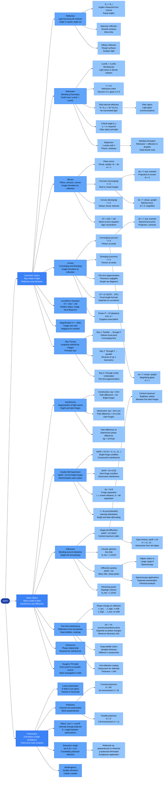

```mermaid
flowchart LR
    Start([Optics]):::blue
    Start --> GeometricOptics["Geometric Optics<br/>Ray model of light<br/>Reflection and refraction"]:::lightblue
    Start --> WaveOptics["Wave Optics<br/>Wave model of light<br/>Interference and diffraction"]:::lightblue
    Start --> Polarization["Polarization<br/>Orientation of light oscillations<br/>Transverse wave property"]:::lightblue
    
    GeometricOptics --> Reflection["Reflection<br/>Light bouncing off surfaces<br/>Angle in equals angle out"]:::paleblue
    GeometricOptics --> Refraction["Refraction<br/>Bending at boundary<br/>Snell's law: n₁sinθ₁ = n₂sinθ₂"]:::paleblue
    GeometricOptics --> Mirrors["Mirrors<br/>Plane, concave, convex<br/>Image formation by reflection"]:::paleblue
    GeometricOptics --> Lenses["Lenses<br/>Converging and diverging<br/>Image formation by refraction"]:::paleblue
    GeometricOptics --> LensEquation["Lens/Mirror Equation<br/>1/f = 1/do + 1/di<br/>Relates object, image, focal distances"]:::paleblue
    GeometricOptics --> Magnification["Magnification m = -di/do<br/>Image size ratio<br/>Negative for inverted"]:::paleblue
    GeometricOptics --> RayTracing["Ray Tracing<br/>Graphical method for images<br/>Principal rays"]:::paleblue
    
    Reflection --> LawReflection["θ_i = θ_r<br/>Angles measured from normal<br/>Equal angles"]:::skyblue
    Reflection --> SpecularRef["Specular reflection<br/>Smooth surfaces<br/>Mirror-like"]:::skyblue
    Reflection --> DiffuseRef["Diffuse reflection<br/>Rough surfaces<br/>Scatters light"]:::skyblue
    
    Refraction --> SnellsLaw["n₁sinθ₁ = n₂sinθ₂<br/>Bending law<br/>Light slows in denser medium"]:::skyblue
    Refraction --> IndexRefraction["n = c/v<br/>Refractive index<br/>Vacuum n=1, glass n≈1.5"]:::skyblue
    Refraction --> TotalInternal["Total internal reflection<br/>θ > θ_c = sin⁻¹(n₂/n₁)<br/>No transmitted light"]:::skyblue
    Refraction --> CriticalAngle["Critical angle θ_c<br/>n₁ > n₂ required<br/>Fiber optics principle"]:::skyblue
    Refraction --> Dispersion["Dispersion<br/>n varies with λ<br/>Prisms, rainbows"]:::skyblue
    
    TotalInternal --> FiberOptics["Fiber optics<br/>Light pipes<br/>Communications"]:::skyblue
    Dispersion --> RainbowForm["Rainbow formation<br/>Refraction + reflection in droplets<br/>Violet bends most"]:::skyblue
    
    Mirrors --> PlaneMirror["Plane mirror<br/>Virtual, upright, di = -do<br/>m = 1"]:::skyblue
    Mirrors --> ConcaveMirror["Concave (converging)<br/>f > 0<br/>Real or virtual images"]:::skyblue
    Mirrors --> ConvexMirror["Convex (diverging)<br/>f < 0<br/>Always virtual, reduced"]:::skyblue
    Mirrors --> MirrorEq["1/f = 1/do + 1/di<br/>Same as lens equation<br/>Sign conventions"]:::skyblue
    
    ConcaveMirror --> RealImageMirror["do > f: real, inverted<br/>Projected on screen<br/>di > 0"]:::skyblue
    ConcaveMirror --> VirtualImageMirror["do < f: virtual, upright<br/>Behind mirror<br/>di < 0, magnified"]:::skyblue
    
    Lenses --> ConvergingLens["Converging (convex)<br/>f > 0<br/>Thicker at center"]:::skyblue
    Lenses --> DivergingLens["Diverging (concave)<br/>f < 0<br/>Thinner at center"]:::skyblue
    Lenses --> ThinLensApprox["Thin lens approximation<br/>Thickness negligible<br/>Simple ray diagrams"]:::skyblue
    Lenses --> LensmakerEq["1/f = (n-1)(1/R₁ - 1/R₂)<br/>Focal length formula<br/>Depends on curvatures"]:::skyblue
    Lenses --> PowerLens["Power P = 1/f (diopters)<br/>Unit: m⁻¹<br/>Eyeglass prescription"]:::skyblue
    
    ConvergingLens --> RealImageLens["do > f: real, inverted<br/>Beyond focal point<br/>Projectors, cameras"]:::skyblue
    ConvergingLens --> VirtualImageLens["do < f: virtual, upright<br/>Magnifying glass<br/>m > 1"]:::skyblue
    
    RayTracing --> Ray1["Ray 1: Parallel → through F<br/>Defines focal point<br/>Converging lens"]:::skyblue
    RayTracing --> Ray2["Ray 2: Through F → parallel<br/>Reverse of ray 1<br/>Symmetric"]:::skyblue
    RayTracing --> Ray3["Ray 3: Through center<br/>Undeviated<br/>Thin lens approximation"]:::skyblue
    
    WaveOptics --> Interference["Interference<br/>Superposition of light waves<br/>Bright and dark fringes"]:::paleblue
    WaveOptics --> DoubleSlit["Double-Slit Experiment<br/>dsinθ = mλ for bright fringes<br/>Demonstrates wave nature"]:::paleblue
    WaveOptics --> Diffraction["Diffraction<br/>Bending around obstacles<br/>Single-slit and gratings"]:::paleblue
    WaveOptics --> ThinFilms["Thin-Film Interference<br/>Reflections from boundaries<br/>Soap bubbles, coatings"]:::paleblue
    WaveOptics --> Coherence["Coherence<br/>Phase relationship<br/>Required for interference"]:::paleblue
    WaveOptics --> Huygens["Huygens' Principle<br/>Every point is a wavelet source<br/>Wave propagation model"]:::paleblue
    
    Interference --> ConstructiveInt["Constructive: Δφ = 2πm<br/>Path difference = mλ<br/>Bright fringes"]:::skyblue
    Interference --> DestructiveInt["Destructive: Δφ = (2m+1)π<br/>Path difference = (m+1/2)λ<br/>Dark fringes"]:::skyblue
    Interference --> PathDiffInt["Path difference Δr<br/>Determines phase difference<br/>Δφ = (2π/λ)Δr"]:::skyblue
    
    DoubleSlit --> BrightFringes["dsinθ = mλ (m = 0, ±1, ±2...)<br/>Bright fringe condition<br/>Constructive interference"]:::skyblue
    DoubleSlit --> DarkFringes["dsinθ = (m+1/2)λ<br/>Dark fringe condition<br/>Destructive interference"]:::skyblue
    DoubleSlit --> FringeSpacing["Δy = λL/d<br/>Fringe separation<br/>L = screen distance, d = slit separation"]:::skyblue
    DoubleSlit --> IntensityPattern["I = 4I₀cos²(πdsinθ/λ)<br/>Intensity distribution<br/>Bright and dark alternating"]:::skyblue
    
    Diffraction --> SingleSlit["Single-slit diffraction<br/>asinθ = mλ (dark)<br/>Central maximum wider"]:::skyblue
    Diffraction --> CircularAperture["Circular aperture<br/>Airy disk<br/>θ_min = 1.22λ/D"]:::skyblue
    Diffraction --> DiffractionGrating["Diffraction grating<br/>dsinθ = mλ<br/>Many slits, sharp peaks"]:::skyblue
    Diffraction --> ResolvingPower["Resolving power<br/>Rayleigh criterion<br/>θ_min = 1.22λ/D"]:::skyblue
    
    SingleSlit --> CentralMax["Central maximum<br/>Brightest, widest<br/>Between first dark fringes"]:::skyblue
    SingleSlit --> DarkMinima["Dark minima: asinθ = mλ<br/>m = ±1, ±2...<br/>Destructive from slit edges"]:::skyblue
    
    DiffractionGrating --> HighOrders["Higher orders m<br/>Larger angle θ<br/>Spectroscopy"]:::skyblue
    DiffractionGrating --> Spectroscopy["Spectroscopy applications<br/>Separate wavelengths<br/>Chemical analysis"]:::skyblue
    
    ThinFilms --> PhaseChange["Phase change on reflection<br/>n_low → n_high: π shift<br/>n_high → n_low: no shift"]:::skyblue
    ThinFilms --> FilmThickness["2nt = mλ (constructive/destructive)<br/>Depends on phase changes<br/>Minimum thickness λ/4n"]:::skyblue
    ThinFilms --> SoapBubble["Soap bubble colors<br/>Variable thickness<br/>Different λ constructive"]:::skyblue
    ThinFilms --> AntiReflCoat["Anti-reflection coating<br/>Destructive for reflected<br/>Thickness = λ/4n"]:::skyblue
    
    Polarization --> LinearPolarization["Linear polarization<br/>E-field in one plane<br/>Vertical or horizontal"]:::paleblue
    Polarization --> Polarizers["Polarizers<br/>Transmit one polarization<br/>Block perpendicular"]:::paleblue
    Polarization --> MalusLaw["Malus' Law I = I₀cos²θ<br/>Intensity through polarizer<br/>θ = angle between polarizations"]:::paleblue
    Polarization --> Brewster["Brewster's angle<br/>tan θ_B = n₂/n₁<br/>Completely polarized reflection"]:::paleblue
    Polarization --> Birefringence["Birefringence<br/>Double refraction<br/>Calcite crystals"]:::paleblue
    
    Polarizers --> CrossedPolarizers["Crossed polarizers<br/>θ = 90°<br/>No transmission (I = 0)"]:::skyblue
    Polarizers --> ParallelPolarizers["Parallel polarizers<br/>θ = 0°<br/>Full transmission (I = I₀)"]:::skyblue
    
    Brewster --> BrewsterRefl["Reflected ray perpendicular to refracted<br/>p-polarized eliminated<br/>Sunglasses application"]:::skyblue
    
    classDef blue fill:#1e40af,stroke:#1e3a8a,stroke-width:3px,color:#fff
    classDef lightblue fill:#3b82f6,stroke:#2563eb,stroke-width:2px,color:#fff
    classDef paleblue fill:#60a5fa,stroke:#3b82f6,stroke-width:2px,color:#000
    classDef skyblue fill:#93c5fd,stroke:#60a5fa,stroke-width:1px,color:#000
```