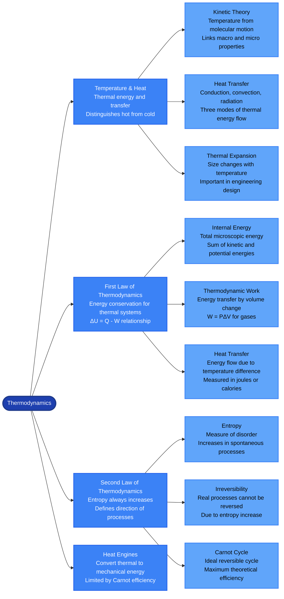

```mermaid
flowchart LR
    Start([Thermodynamics]):::blue
    Start --> Temperature[Temperature & Heat<br/>Thermal energy and transfer<br/>Distinguishes hot from cold]:::lightblue
    Start --> FirstLaw[First Law of Thermodynamics<br/>Energy conservation for thermal systems<br/>ΔU = Q - W relationship]:::lightblue
    Start --> SecondLaw[Second Law of Thermodynamics<br/>Entropy always increases<br/>Defines direction of processes]:::lightblue
    Start --> HeatEngines[Heat Engines<br/>Convert thermal to mechanical energy<br/>Limited by Carnot efficiency]:::lightblue
    
    Temperature --> KineticTheory[Kinetic Theory<br/>Temperature from molecular motion<br/>Links macro and micro properties]:::paleblue
    Temperature --> HeatTransfer[Heat Transfer<br/>Conduction, convection, radiation<br/>Three modes of thermal energy flow]:::paleblue
    Temperature --> ThermalExpansion[Thermal Expansion<br/>Size changes with temperature<br/>Important in engineering design]:::paleblue
    
    FirstLaw --> InternalEnergy[Internal Energy<br/>Total microscopic energy<br/>Sum of kinetic and potential energies]:::paleblue
    FirstLaw --> Work[Thermodynamic Work<br/>Energy transfer by volume change<br/>W = PΔV for gases]:::paleblue
    FirstLaw --> Heat[Heat Transfer<br/>Energy flow due to temperature difference<br/>Measured in joules or calories]:::paleblue
    
    SecondLaw --> Entropy[Entropy<br/>Measure of disorder<br/>Increases in spontaneous processes]:::paleblue
    SecondLaw --> Irreversibility[Irreversibility<br/>Real processes cannot be reversed<br/>Due to entropy increase]:::paleblue
    SecondLaw --> Carnot[Carnot Cycle<br/>Ideal reversible cycle<br/>Maximum theoretical efficiency]:::paleblue
    
    classDef blue fill:#1e40af,stroke:#1e3a8a,stroke-width:3px,color:#fff
    classDef lightblue fill:#3b82f6,stroke:#2563eb,stroke-width:2px,color:#fff
    classDef paleblue fill:#60a5fa,stroke:#3b82f6,stroke-width:2px,color:#000
```