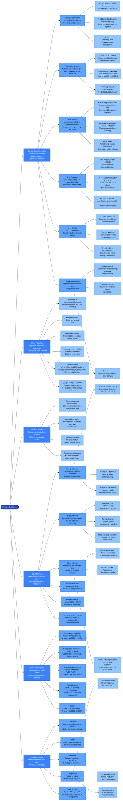

```mermaid
flowchart LR
    Start([Waves & Oscillations]):::blue
    Start --> SimpleHarmonic["Simple Harmonic Motion<br/>Sinusoidal oscillations<br/>Spring-mass and pendulum systems"]:::lightblue
    Start --> WaveProperties["Wave Properties<br/>Amplitude, frequency, wavelength<br/>Characterize wave behavior"]:::lightblue
    Start --> Sound["Sound Waves<br/>Mechanical longitudinal waves<br/>Requires medium for propagation"]:::lightblue
    Start --> Interference["Wave Interference<br/>Superposition of waves<br/>Creates constructive/destructive patterns"]:::lightblue
    Start --> WaveTypes["Types of Waves<br/>Transverse, longitudinal, surface<br/>Different propagation modes"]:::lightblue
    Start --> StandingWaves["Standing Waves<br/>Interference of traveling waves<br/>Nodes and antinodes"]:::lightblue
    
    SimpleHarmonic --> SpringSystem["Spring-Mass System<br/>Hooke's law application<br/>Models oscillatory motion"]:::paleblue
    SimpleHarmonic --> Pendulum["Pendulum Motion<br/>Gravitational restoring force<br/>Period independent of amplitude"]:::paleblue
    SimpleHarmonic --> Resonance["Resonance<br/>Maximum amplitude at natural frequency<br/>Important in engineering and music"]:::paleblue
    SimpleHarmonic --> SHMEquations["SHM Equations<br/>x = A cos(\u03c9t), a = -\u03c9\u00b2x<br/>Mathematical description"]:::paleblue
    SimpleHarmonic --> SHMEnergy["SHM Energy<br/>E = (1/2)kA\u00b2<br/>Constant total mechanical energy"]:::paleblue
    SimpleHarmonic --> Damping["Damped Oscillations<br/>Amplitude decreases with time<br/>Energy dissipation"]:::paleblue
    
    SpringSystem --> SpringPeriod["T = 2\u03c0\u221a(m/k)<br/>Period formula<br/>Independent of amplitude"]:::skyblue
    SpringSystem --> SpringFreq["f = (1/2\u03c0)\u221a(k/m)<br/>Natural frequency<br/>Higher k or lower m \u2192 higher f"]:::skyblue
    SpringSystem --> HookesLaw["F = -kx<br/>Restoring force<br/>Proportional to displacement"]:::skyblue
    
    Pendulum --> PendulumPeriod["T = 2\u03c0\u221a(L/g)<br/>Simple pendulum formula<br/>Independent of mass"]:::skyblue
    Pendulum --> SmallAngle["Small angle approximation<br/>sin\u03b8 \u2248 \u03b8<br/>Valid for \u03b8 < 15\u00b0"]:::skyblue
    Pendulum --> PhysicalPend["Physical pendulum<br/>Extended object<br/>T = 2\u03c0\u221a(I/mgd)"]:::skyblue
    
    Resonance --> NaturalFreq["Natural frequency f\u2080<br/>Characteristic oscillation rate<br/>Determined by system properties"]:::skyblue
    Resonance --> ResonanceCurve["Amplitude vs frequency<br/>Peak at f = f\u2080<br/>Sharpness depends on damping"]:::skyblue
    Resonance --> ResonanceApps["Applications<br/>Radio tuning, musical instruments<br/>Destructive: bridge collapse"]:::skyblue
    
    SHMEquations --> PosEq["x(t) = A cos(\u03c9t + \u03c6)<br/>Position vs time<br/>Sinusoidal motion"]:::skyblue
    SHMEquations --> VelEq["v(t) = -A\u03c9 sin(\u03c9t + \u03c6)<br/>Velocity \u03c0/2 out of phase<br/>Max at equilibrium"]:::skyblue
    SHMEquations --> AccelEq["a(t) = -\u03c9\u00b2x<br/>Acceleration proportional to -x<br/>Restoring acceleration"]:::skyblue
    
    SHMEnergy --> KineticSHM["KE = (1/2)mv\u00b2<br/>Maximum at equilibrium<br/>Oscillates with time"]:::skyblue
    SHMEnergy --> PotentialSHM["PE = (1/2)kx\u00b2<br/>Maximum at extremes<br/>Complementary to KE"]:::skyblue
    SHMEnergy --> TotalEnergySHM["E = KE + PE = (1/2)kA\u00b2<br/>Constant total energy<br/>Energy conservation"]:::skyblue
    
    Damping --> Underdamped["Underdamped<br/>Oscillates with decreasing amplitude<br/>Light damping"]:::skyblue
    Damping --> CriticallyDamped["Critically damped<br/>Returns to equilibrium fastest<br/>No oscillation"]:::skyblue
    Damping --> Overdamped["Overdamped<br/>Slow return, no oscillation<br/>Heavy damping"]:::skyblue
    
    WaveProperties --> Amplitude["Amplitude A<br/>Maximum displacement<br/>Related to energy (I \u221d A\u00b2)"]:::skyblue
    WaveProperties --> Frequency["Frequency f (Hz)<br/>Cycles per second<br/>f = 1/T"]:::skyblue
    WaveProperties --> Wavelength["Wavelength \u03bb<br/>Distance between crests<br/>Spatial period"]:::skyblue
    WaveProperties --> WaveSpeed["Wave speed v = f\u03bb<br/>Propagation velocity<br/>Depends on medium"]:::skyblue
    WaveProperties --> WaveEq["Wave equation<br/>\u2202\u00b2y/\u2202t\u00b2 = v\u00b2\u2202\u00b2y/\u2202x\u00b2<br/>Governs wave motion"]:::skyblue
    WaveProperties --> WaveFunction["y(x,t) = A sin(kx - \u03c9t)<br/>Traveling wave solution<br/>k = 2\u03c0/\u03bb, \u03c9 = 2\u03c0f"]:::skyblue
    
    WaveTypes --> Transverse["Transverse waves<br/>Displacement perpendicular to direction<br/>String waves, light"]:::skyblue
    WaveTypes --> Longitudinal["Longitudinal waves<br/>Displacement parallel to direction<br/>Sound waves"]:::skyblue
    WaveTypes --> Mechanical["Mechanical waves<br/>Require medium<br/>Sound, seismic, water"]:::skyblue
    WaveTypes --> EM["Electromagnetic waves<br/>No medium needed<br/>Light, radio, X-rays"]:::skyblue
    
    Sound --> SpeedSound["Speed of Sound<br/>Depends on medium properties<br/>Faster in denser solids"]:::paleblue
    Sound --> DopplerEffect["Doppler Effect<br/>Frequency shift with motion<br/>Used in radar and astronomy"]:::paleblue
    Sound --> Intensity["Sound Intensity<br/>Energy per unit area per time<br/>Relates to loudness perception"]:::paleblue
    Sound --> SoundLevel["Sound Level (dB)<br/>Logarithmic scale<br/>\u03b2 = 10 log(I/I\u2080)"]:::paleblue
    Sound --> SoundFreqRange["Frequency range<br/>Human: 20 Hz - 20 kHz<br/>Infrasound, ultrasound"]:::paleblue
    Sound --> Harmonics["Harmonics and Overtones<br/>Integer multiples of fundamental<br/>Determines timbre"]:::paleblue
    
    SpeedSound --> SoundAir["In air: v ≈ 343 m/s (20°C)<br/>Temperature dependent<br/>v = 331 + 0.6T (°C)"]:::skyblue
    SpeedSound --> SoundWater["In water: v ≈ 1500 m/s<br/>Faster in liquids<br/>Better coupling"]:::skyblue
    SpeedSound --> SoundSolid["In solids: v ≈ 5000 m/s<br/>Fastest in solids<br/>Strong molecular bonds"]:::skyblue
    
    DopplerEffect --> DopplerSource["Moving source<br/>f' = f(v/(v ± v_s))<br/>+ approaching, - receding"]:::skyblue
    DopplerEffect --> DopplerObserver["Moving observer<br/>f' = f((v ± v_o)/v)<br/>+ approaching, - receding"]:::skyblue
    DopplerEffect --> ShockWave["Shock waves (Mach cone)<br/>v_source > v_sound<br/>Sonic boom"]:::skyblue
    
    Intensity --> IntensityDef["I = P/A (W/m\u00b2)<br/>Power per unit area<br/>Decreases with distance"]:::skyblue
    Intensity --> InverseSquare["I \u221d 1/r\u00b2<br/>Point source<br/>Spreads spherically"]:::skyblue
    Intensity --> IntensityLevel["\u03b2 = 10 log(I/I\u2080)<br/>Decibel scale<br/>I\u2080 = 10\u207b\u00b9\u00b2 W/m\u00b2"]:::skyblue
    
    Interference --> Superposition["Superposition principle<br/>Waves add algebraically<br/>y_total = y\u2081 + y\u2082"]:::paleblue
    Interference --> Constructive["Constructive interference<br/>Waves in phase<br/>\u0394\u03c6 = 2n\u03c0, amplitude adds"]:::paleblue
    Interference --> Destructive["Destructive interference<br/>Waves out of phase<br/>\u0394\u03c6 = (2n+1)\u03c0, cancellation"]:::paleblue
    Interference --> PathDifference["Path difference<br/>\u0394L = m\u03bb (constructive)<br/>\u0394L = (m+1/2)\u03bb (destructive)"]:::paleblue
    Interference --> Beats["Beats<br/>Two close frequencies<br/>f_beat = |f\u2081 - f\u2082|"]:::paleblue
    
    StandingWaves --> StandingFormation["Formation<br/>Interference of opposing waves<br/>Nodes and antinodes fixed"]:::paleblue
    StandingWaves --> Nodes["Nodes<br/>Points of zero amplitude<br/>Destructive interference"]:::paleblue
    StandingWaves --> Antinodes["Antinodes<br/>Points of maximum amplitude<br/>Constructive interference"]:::paleblue
    StandingWaves --> StringModes["String modes<br/>\u03bb_n = 2L/n<br/>Harmonics: n = 1, 2, 3..."]:::paleblue
    StandingWaves --> PipeModes["Pipe modes<br/>Open: \u03bb_n = 2L/n<br/>Closed one end: \u03bb_n = 4L/n (odd n)"]:::paleblue
    
    StringModes --> Fundamental["Fundamental (n=1)<br/>Lowest frequency<br/>f\u2081 = v/2L"]:::skyblue
    StringModes --> Harmonics2["2nd harmonic (n=2)<br/>f\u2082 = 2f\u2081<br/>One node in middle"]:::skyblue
    StringModes --> HarmonicsSeries["Harmonic series<br/>f_n = nf\u2081<br/>Integer multiples"]:::skyblue
    
    classDef blue fill:#1e40af,stroke:#1e3a8a,stroke-width:3px,color:#fff
    classDef lightblue fill:#3b82f6,stroke:#2563eb,stroke-width:2px,color:#fff
    classDef paleblue fill:#60a5fa,stroke:#3b82f6,stroke-width:2px,color:#000
    classDef skyblue fill:#93c5fd,stroke:#60a5fa,stroke-width:1px,color:#000
```