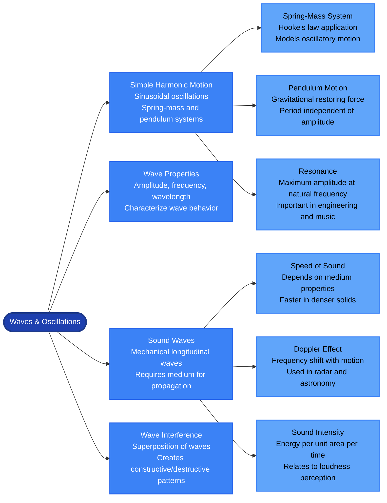

```mermaid
flowchart LR
    Start([Waves & Oscillations]):::blue
    Start --> SimpleHarmonic[Simple Harmonic Motion<br/>Sinusoidal oscillations<br/>Spring-mass and pendulum systems]:::lightblue
    Start --> WaveProperties[Wave Properties<br/>Amplitude, frequency, wavelength<br/>Characterize wave behavior]:::lightblue
    Start --> Sound[Sound Waves<br/>Mechanical longitudinal waves<br/>Requires medium for propagation]:::lightblue
    Start --> Interference[Wave Interference<br/>Superposition of waves<br/>Creates constructive/destructive patterns]:::lightblue
    
    SimpleHarmonic --> SpringSystem[Spring-Mass System<br/>Hooke's law application<br/>Models oscillatory motion]:::paleblue
    SimpleHarmonic --> Pendulum[Pendulum Motion<br/>Gravitational restoring force<br/>Period independent of amplitude]:::paleblue
    SimpleHarmonic --> Resonance[Resonance<br/>Maximum amplitude at natural frequency<br/>Important in engineering and music]:::paleblue
    
    Sound --> SpeedSound[Speed of Sound<br/>Depends on medium properties<br/>Faster in denser solids]:::paleblue
    Sound --> DopplerEffect[Doppler Effect<br/>Frequency shift with motion<br/>Used in radar and astronomy]:::paleblue
    Sound --> Intensity[Sound Intensity<br/>Energy per unit area per time<br/>Relates to loudness perception]:::paleblue
    
    classDef blue fill:#1e40af,stroke:#1e3a8a,stroke-width:3px,color:#fff
    classDef lightblue fill:#3b82f6,stroke:#2563eb,stroke-width:2px,color:#fff
    classDef paleblue fill:#60a5fa,stroke:#3b82f6,stroke-width:2px,color:#000
```